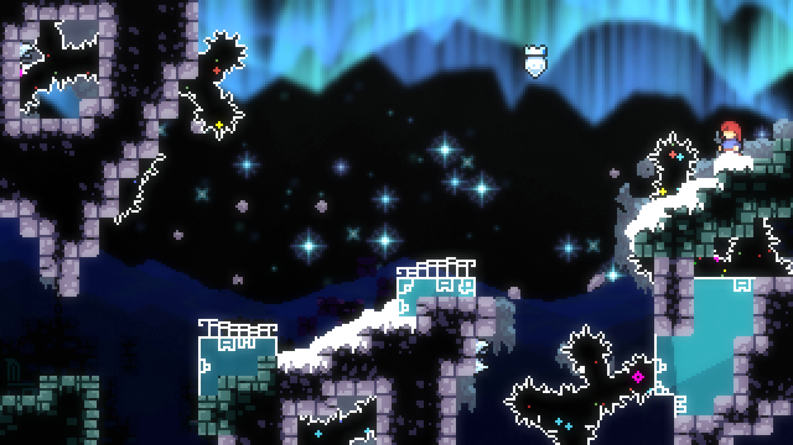
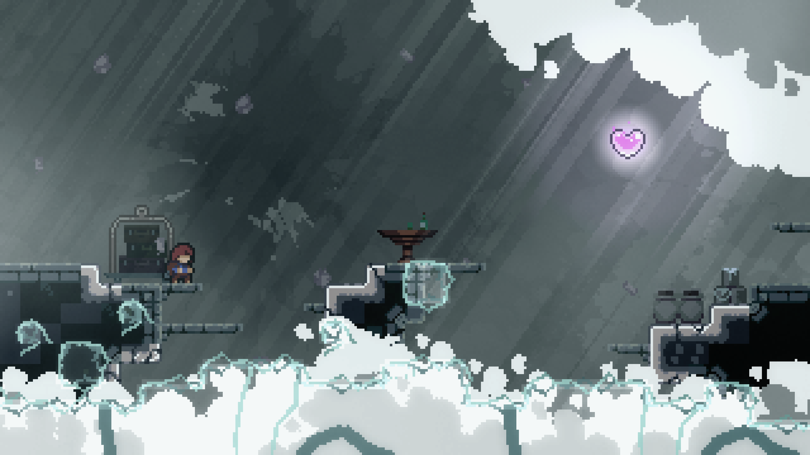
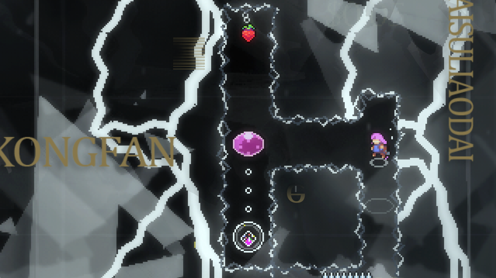
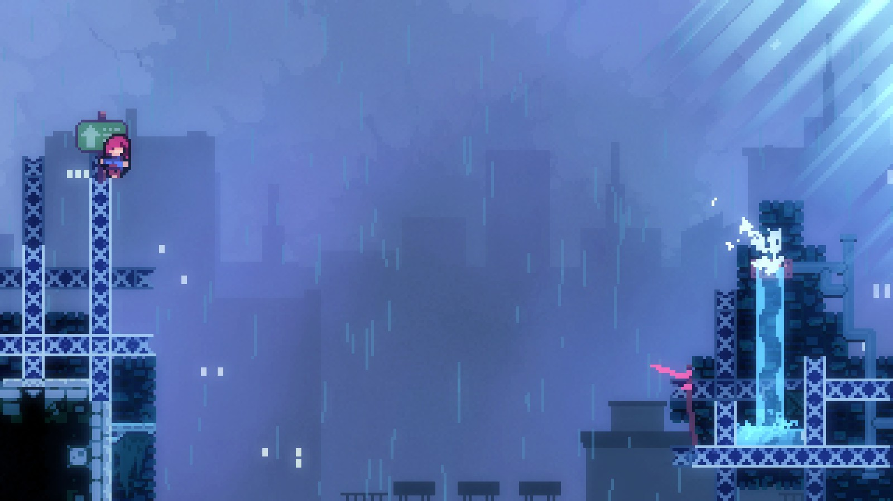
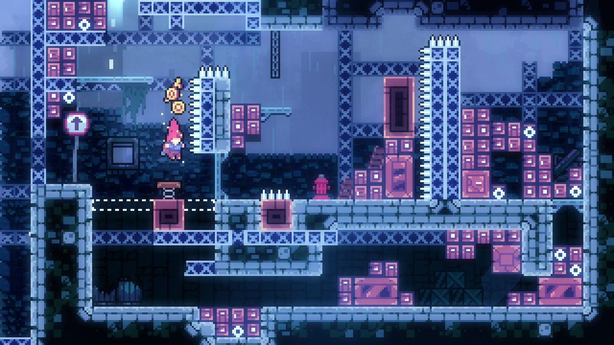
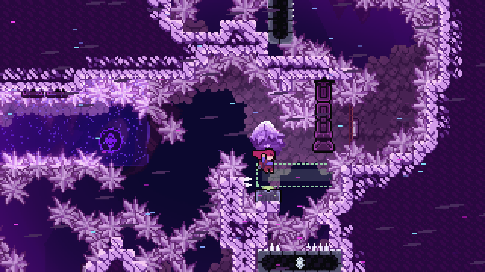
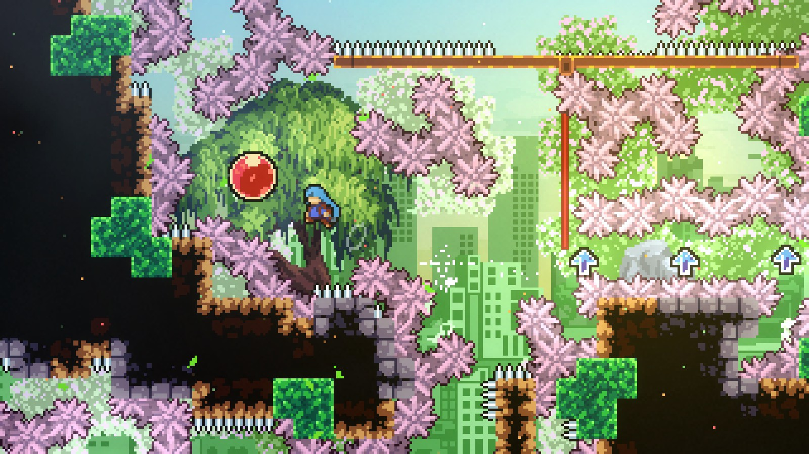
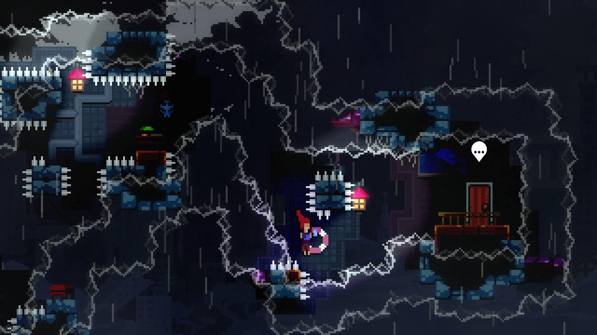
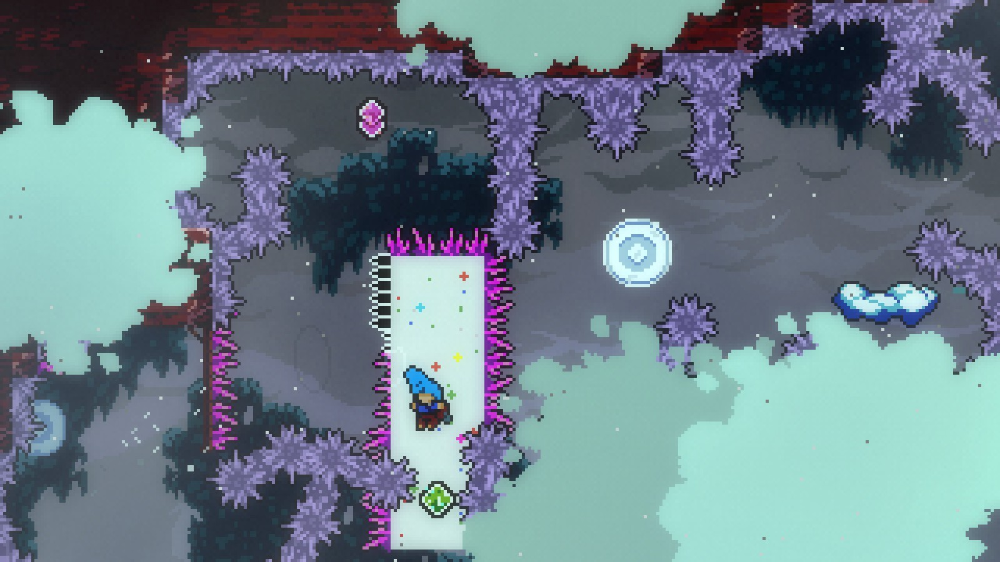
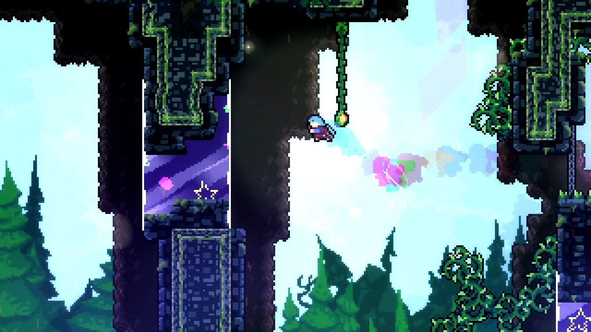

几个月前, 塞莱斯特山发生了神秘的异变, 山中环境变得凶险异常. 经过一段时间的探索, 现在被人们称为“糖山”的这座山, 已经开辟出一块安全地带, 于是:

为了给各位探险家一个歇脚处, 也为了更好地发布探险任务, 糖山咖啡厅和糖山糖果加工厂正在紧锣密鼓地筹备中!

在咖啡厅, 你可以品尝到各种各样的甜食, 以补充爬山所消耗的糖分；通过咖啡厅后门, 你可以前往糖果加工厂, 在那里接取任务、实地探险, 将糖山中的原料带回加工厂, 你将获得丰盛的奖励.

糖山欢迎每一位探险家的来访, 下面是探险家们带回来的一些照片, 仅作为参考. 

    
    
    
    
    
    
    
    
    
    

> Host有话说: 
> 
> 糖游是正经合集, 只是具有一定整活属性, 但总的方向还是认真地去打磨地图.
> 
> 很多组员因为现实繁忙而不太能顾得上制图, 组内生产力捉襟见肘, 距离发布还有不少时日, 请大家耐心等待......
> 
> 由于之前发生了一些不太愉快的事情, 现在不打算再招人, 如果你认识我, 可以私聊我要群号, 你可以在制图群找到我. 

<iframe src="//player.bilibili.com/player.html?isOutside=true&aid=116066508341940&bvid=BV1JEcWzHEX2&cid=36049650701&p=1"
width="960"
height="540"
scrolling="no"
border="0"
frameborder="no"
framespacing="0"
allowfullscreen="true">
</iframe>
