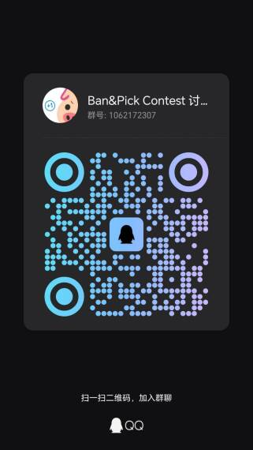

# Ban & Pick Contest

测图总是时不时缺依赖? 

entity 太多导致找不到合适的实体? 

想接受更有挑战性的玩法?!

想学习优秀 mapper 的制图思路?

经过进一步讨论后, 最新最热的蔚蓝制图小活动 —— Ban & Pick Contest 正式公布!

---

比赛规则: 

扫码进群之后会平均分为两组, 经过讨论之后, 将会开始对 helper 的 Ban & Pick 模式!

> 具体 bp 规则和评分标准请进群了解

bp 之后各组需要共同制作一张 `≥ 2*人数` 面的地图, 然后由评委 ShadowRo, Bot, -zhacai-UwU 进行打分, 
最后经过 Myn 的统一 deco 后发布!

如果暂时不确定是否要参赛也不要紧, 前来旁观也十分欢迎!

获得优胜的小组全员可以获得自定义群头衔的奖励, 希望大家积极参与, 良性竞争 OwO

具体规则: 

Ban & Pick 部分, 分为 AB 两组, 根据抽签决定 AB 组划分, 然后:

1. A 组先 ban 一个 helper
2. B 组后 ban 两个 helper
3. A 组再 ban 一个 helper
> ban 指的是双方都不允许使用该helper
4. B 组 force pick 一个 helper
5. A 组 force pick 一个 helper
> force pick 是指被选中的 helper 内容必须在 AB 两组的 gp 中均占重要地位
6. 最后, 两边同时 pick 一个 helper
> pick 的 helper 内容必须在一方的 gp 中占据重要地位

    
注意

    
gameplay 部分的制作必须以官图实体和所选 helper 的实体为主 (镜头不受限制)

