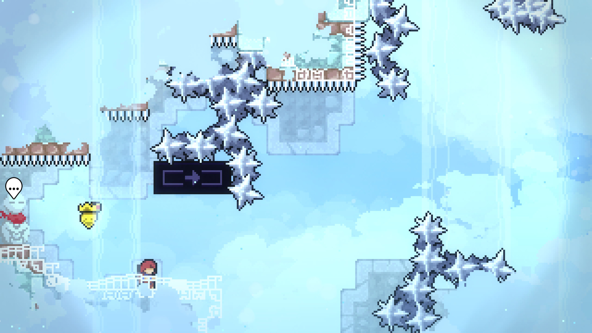
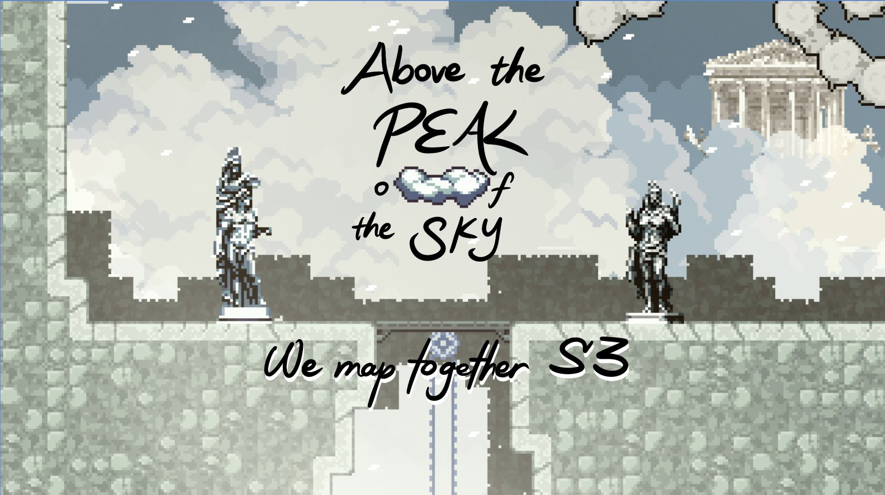
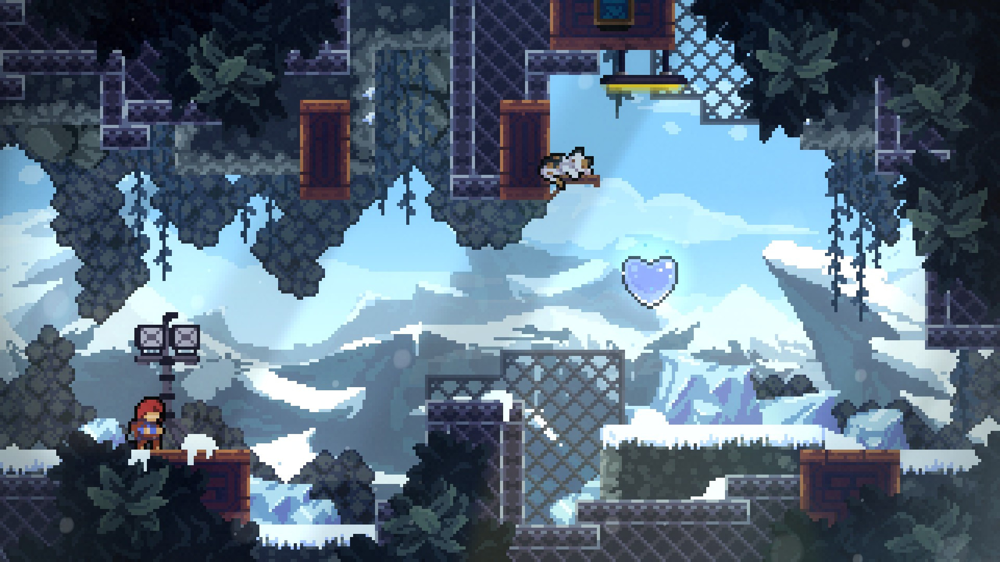
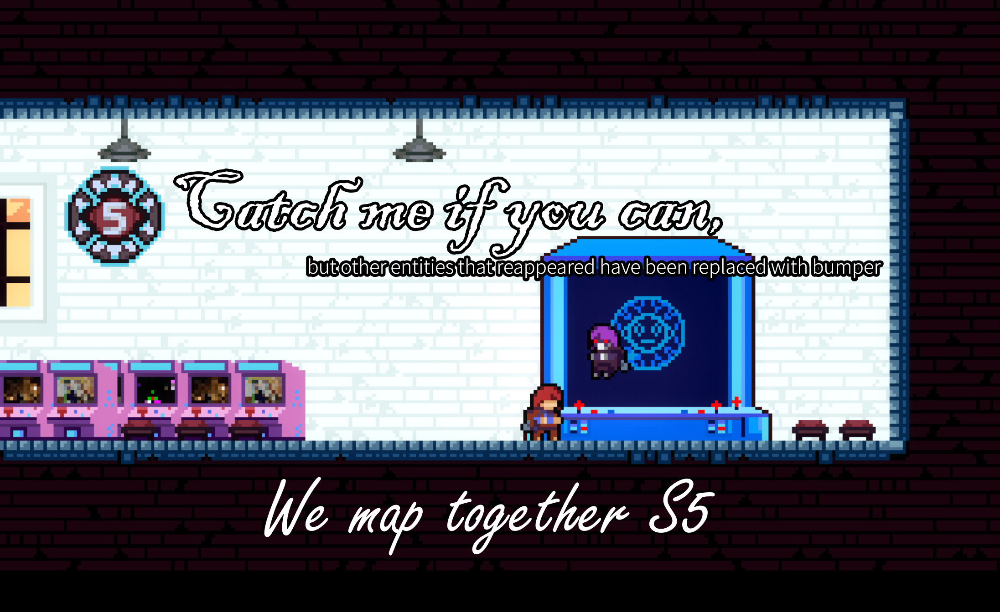
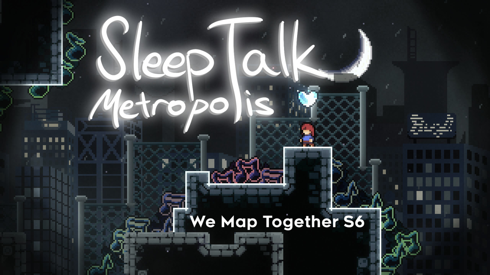

# 制图接力汇总

## 第一届制图接力 -- 遗诅山庄

* [视频流程](https://www.bilibili.com/video/BV14VB8YcETd/)
* 香蕉网

    
    

## 第二届制图接力 -- 云墟

* [视频流程](https://www.bilibili.com/video/BV1VmN36BE5R)
* [香蕉网](https://gamebanana.com/mods/561760)

### 主办方 Host

[Breaker-K](https://space.bilibili.com/454427319)

### 参赛人员

* wyqw
* q_is_sleeping
* SDBnkaf
* BluePari
* Breaker-K
* Nanami Chiaki
* UnderDragon
* Spriumn
* RikiUwU
* m!Stake
* Kurose_Karasu
* diandzer
* Equfix
* youzi
* shijiuwan

### 装饰

* m!Stake
* diandzer
* Myn_Gen

### 部分素材

* Bissy
* Spooooky
* limimimia
* Nerferd
* xolimono
* Flagpole1up

### 音乐

* Deadmau5

## 第三届制图接力 -- 云巅之上

* [视频流程](https://www.bilibili.com/video/BV1RYKNe7ES3/)
* [香蕉网](https://gamebanana.com/mods/575262)

### 主办方 Host

* [UnderDragon](https://space.bilibili.com/385549584)

### 参赛人员

* BluePari
* paperlock
* SDBnkaf
* Kurose_Karasu
* inker
* AfterDawn
* Breaker-K
* moshugu18
* hoshiya kimu
* 南冥
* senri
* Create_W
* diandzer
* foxpear

### 装饰

* RikiUwU
* DX3906

## 第四届制图接力 -- 雪眠之都

* [视频流程](https://www.bilibili.com/video/BV1cyJGz6ERA/)
* [香蕉网](https://gamebanana.com/mods/595127)

### 主办方 Host

[Breaker-K](https://space.bilibili.com/454427319)

### 参赛人员

* m!Stake
* wyqw
* AfterDawn_Cxwg
* Create_W
* Kurose_Karasu
* moshugu18
* Kirbyblaster
* 1h2y
* I2170l

### 装饰

* Myn_Gen
* Create_W

### 部分素材

* Fate
* cozy
* abi
* Crispybag
* BossSauce
* butcherberries_

### 音乐

* reidenshi×Øneheart

## 第五届制图接力 -- 坏德林追着玛德琳扣, 但是其他重复实体都被换成弹球

* [视频流程](https://www.bilibili.com/video/BV1jZgCzfEro/)
* [香蕉网](https://gamebanana.com/mods/603911)

### 主办方 Host

[Riki97](https://space.bilibili.com/172996486)

### 参赛人员

* x_asterisk_x
* Tao_Su
* Kirbyblaster
* foxpear
* madline
* I2170l
* Create_W
* azure__bluet
* Crylone
* paperlock
* PufLame
* RikiUwU
* Karasu_Karasu
* Runmo
* Breaker-K

* Musician
* Special Thanks

### 装饰

* RikiUwU

### 测试

* lilymoe
* chuanshu
* Huasheng
* Lanoly236
* 32yy
* hec

### 音乐

* DDRKirby

### 特别感谢

* AfterDawn_Cxwg
* Zbs
* Myn_Gen

## 第六届制图接力 -- 梦语都市

* [视频流程](https://www.bilibili.com/video/BV1cWGE6XEXn/)
* [香蕉网](https://gamebanana.com/mods/679759)

### 主办方 Host

[shadowRo](https://space.bilibili.com/1592245356)

### 参赛人员

* shadowRo
* AfterDawn_Cxwg
* NaCline
* DAWEWE
* Runmo
* I2170l
* Kurose_Karasu
* ShiroN_L
* azure__bluet
* RikiUwU
* Black Ice 233
* Kirbyblaster
* Tao_Su
* KrisChambers

### 装饰

* UnderDragon
* Myn_Gen

### 测试

* Forthgoer
* BadwayBear
* KGS_AL
* SesameSoup

### 部分素材

* Bissy
* Spooooky
* Crispybag
* Kilobit
* Starl1ght

## 第六点五届制图接力 -- 愿由星升

* [视频流程](https://www.bilibili.com/video/BV14VJn6XE4G/)
* [香蕉网](https://gamebanana.com/mods/685606)

    
    
    

### 主办方 Host

[岚汐LanXi](https://space.bilibili.com/1413291041)

### 参赛人员

* Tao_Su
* Bee_Gezi
* Yuyu0
* KGS_AL
* Runmo
* KrisChambers

### 装饰/帮助

* UnderDragon
* jpyx258

### 部分素材

* DanTKO
* Juno
* Worldwaker2

### 音乐

* Dennis Kuo

## 第七届制图接力

## 第八届制图接力 -- 余烬山脊

* [视频预告](https://www.bilibili.com/video/BV1vvab69EWY/)

