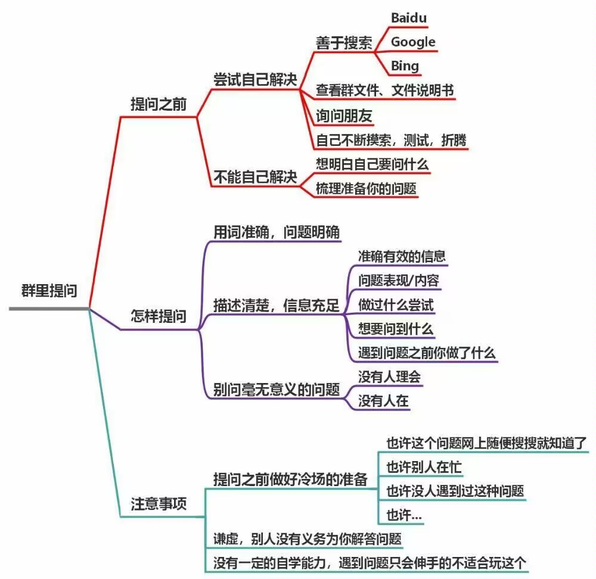
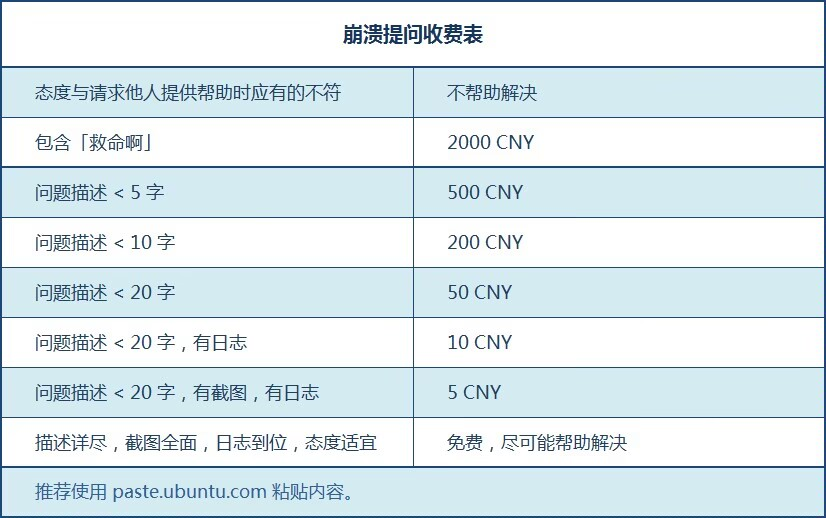

# Celeste Wiki

??? 提问的艺术-请先行展开阅读-求求你看一下吧
    
    

    你在询问前必须做足了功课（当然偶尔随便问问是没问题的），实在走投无路了，再**谦虚**的向他人询问并提供详细的信息（log日志，截图，录屏等），
    同时做好冷场的心理准备，在得到帮助后要表达自己的感激，就算是帮不上忙的建议，最好也回应例如“好像什么都没发生耶”，“报错了，上面说...”之类的*
    **（不然别人根本不知道你是没看到消息，还是没解决问题，又或是懒得理他，甚至是问题解决了都没个信儿的）**
    
    同时我的建议是你在问出这个问题后请**把qq的勿扰模式关了**(并不是所有人都有@的习惯的)，
    以便在第一时间得到消息并回复

> **打造好这个Wiki需要我们共同的努力, 如果大家有什么修改补充建议或者勘误之类的话可以加我QQ:
3079351998（本人也在学习中，只是在做自己能力范围内的事），或者github上提个issue？非常感谢:）😋**
>
> 如果我截的一些图冒犯到大家了，请一定找我，我会立即替换或者加上马赛克（留头像主要是为了尊重作者的劳动）
>
> **感谢**`Myn`, `Sap`, `SDBnkaf` `Black_Ice`对Wiki提供的帮助
> 
> **感谢**每个对Wiki做出了隐性贡献的人
>
> **感谢**`Sap`给Wiki提供了一个温暖的家😭

为了避免你制图真的找不到入口, 这里放个[传送门](mappings/start/start.md)

