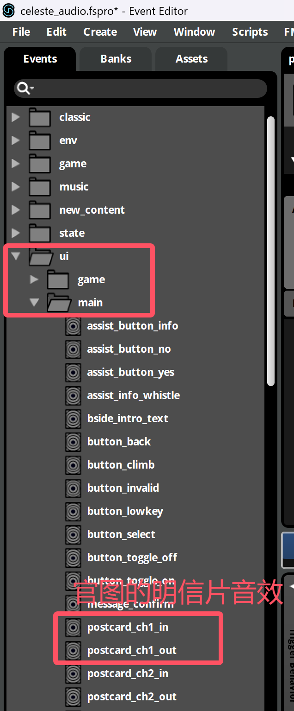
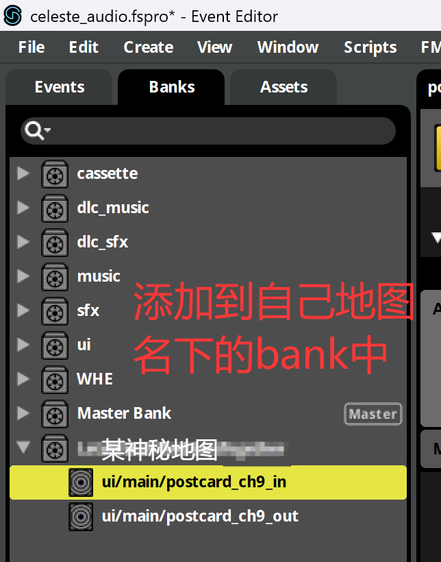
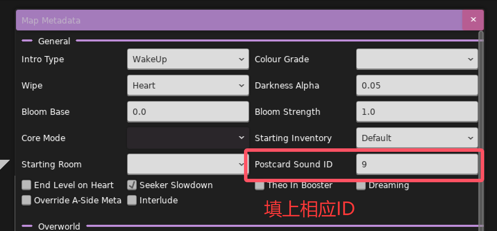

* [1分钟教你用最简单无脑的方式为蔚蓝Mod添加音乐](https://www.bilibili.com/video/BV1KoV6zCESd/){:target="_blank"}
* [春暮Q的Audio教程](https://wiki.biligame.com/celeste/%E9%9F%B3%E4%B9%90){:target="_blank"}
* [电箱的Audio教程](https://www.bilibili.com/video/BV19t4y1M7y4){:target="_blank"}
* 冬菜的Audio教程(群文件里)
* [Everest Wiki的Audio教程](https://github.com/EverestAPI/Resources/wiki/Adding-Custom-Audio){:target="_blank"}
    * [Everest Wiki的进阶Audio教程](https://github.com/EverestAPI/Resources/wiki/Advanced-Custom-Audio){:target="_blank"}
* [(Ahorn Tutorials) Custom Music and FMOD by iamdadbod](https://www.youtube.com/watch?v=FfTsBFaxz_M&list=PLBP5_qAilzbjr7DGxatTQbPfftY3LiVA4&index=16){:target="_blank"}
* [How to FMOD Celeste like a chad by Thegur90](https://www.youtube.com/watch?v=orPDzqDGlfE){:target="_blank"}

## 心得

* [A Little Bit About Celeste’s Synths (And Some Bonus Piano)](https://medium.com/@kuraine/a-little-bit-about-celestes-synths-and-some-bonus-piano-461f62605ea1){:target="_blank"}
* [A Bit About Percussion in Celeste, And Some Tangents Along the Way](https://medium.com/@kuraine/a-bit-about-percussion-in-celeste-and-some-tangents-along-the-way-e8d3f3fb2272){:target="_blank"}

## 常用工具

* [[音频类] Fmod Bank Tools(Mod 音乐解压工具)]()(群文件)
* [FMOD 下载](https://www.fmod.com/download){:target="_blank"}
* [FMOD/Celeste Documentation and EULA](https://www.fmod.com/docs/2.03/studio/appendix-a-celeste.html){:target="_blank"}

## FAQ

### 如何自定义明信片的音效

简单来说, 明信片的音效使用了

* event:/ui/main/postcard_ch{loenn 里设置的内容}_in
* event:/ui/main/postcard_ch{loenn 里设置的内容}_out

例如

* event:/ui/main/postcard_ch1_in
* event:/ui/main/postcard_ch2_in
* event:/ui/main/postcard_ch3_in
* event:/ui/main/postcard_csides_in

所以聪明的你已经猜到要怎么做了吧, 在 fmod 里创建一个类似格式的 event, 然后把数字改成对应的字符串, 比如像这样: event:/ui/main/postcard_ch{自己定义的字符串}_in, 之后再 loenn 里填上大括号里的内容就行了, 
当然为了防止跟别人撞名字名字还得取长一点, 手段跟套文件夹大同小异, ~~不过改明信片音效的人真的很少~~

当然为了丰富内容, 顺便填充点图片, 这里附上 NaCline 的研究成果

{style="width: 300px;"}
{style="width: 300px;"}
{style="width: 300px;"}
{style="width: 600px;"}
