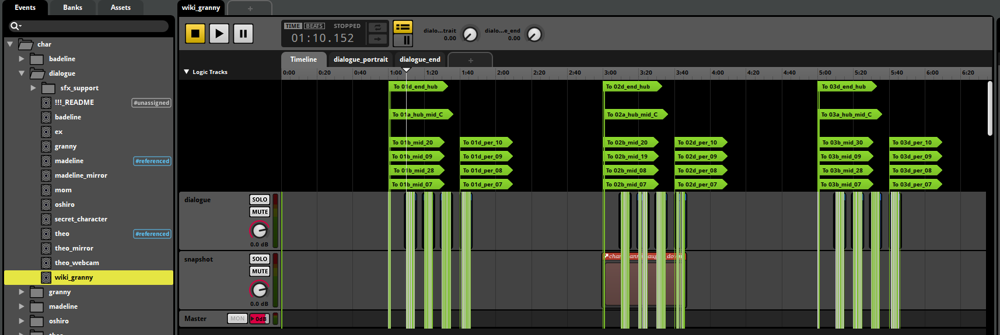
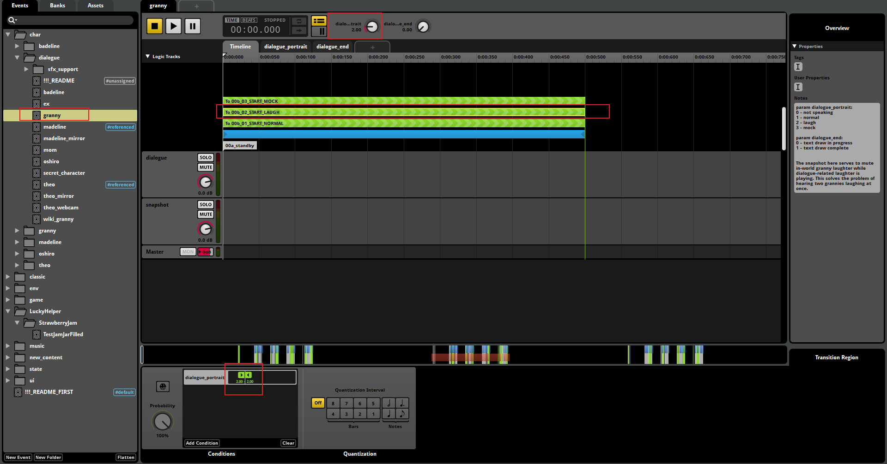

* [春暮Q的Audio教程](https://wiki.biligame.com/celeste/%E9%9F%B3%E4%B9%90){:target="_blank"}
* [1分钟教你用最简单无脑的方式为蔚蓝Mod添加音乐](https://www.bilibili.com/video/BV1KoV6zCESd/){:target="_blank"}
* [电箱的Audio教程](https://www.bilibili.com/video/BV19t4y1M7y4){:target="_blank"}
* 冬菜的Audio教程(群文件里)
* [使用参数控制场景过渡时的音频渐变 by DeepBlueBerry](https://www.bilibili.com/video/BV175hNzTENj){:target="_blank"}
* [使用 Transition 改善你的音乐循环效果 by 春姆Q](https://www.bilibili.com/video/BV1X94y1j7Kt){:target="_blank"}
* [Everest Wiki的Audio教程](https://github.com/EverestAPI/Resources/wiki/Adding-Custom-Audio){:target="_blank"}
    * [Everest Wiki的进阶Audio教程](https://github.com/EverestAPI/Resources/wiki/Advanced-Custom-Audio){:target="_blank"}
* [(Ahorn Tutorials) Custom Music and FMOD by iamdadbod](https://www.youtube.com/watch?v=FfTsBFaxz_M&list=PLBP5_qAilzbjr7DGxatTQbPfftY3LiVA4&index=16){:target="_blank"}
* [How to FMOD Celeste like a chad by Thegur90](https://www.youtube.com/watch?v=orPDzqDGlfE){:target="_blank"}

## 心得

<!-- @formatter:off -->
* [A Little Bit About Celeste's Synths (And Some Bonus Piano)](https://medium.com/@kuraine/a-little-bit-about-celestes-synths-and-some-bonus-piano-461f62605ea1){:target="_blank"}
* [A Bit About Percussion in Celeste, And Some Tangents Along the Way](https://medium.com/@kuraine/a-bit-about-percussion-in-celeste-and-some-tangents-along-the-way-e8d3f3fb2272){:target="_blank"}
<!-- @formatter:on -->

## 常用工具

* [[音频类] Fmod Bank Tools(Mod 音乐解压工具)]()(群文件)
* [FMOD 下载](https://www.fmod.com/download){:target="_blank"}
* [FMOD/Celeste Documentation and EULA](https://www.fmod.com/docs/2.03/studio/appendix-a-celeste.html){:target="_blank"}

## 常见参数

fmod 之所以叫中间件是因为制作者可以提前在 fmod 中做好一些预设/效果, 用各种参数控制各种效果的变化/切换, 这样之后在游戏里就可以通过简单的设置来达到比较好的效果,
而无需设计一个非常复杂的音频播放系统, 换句话说如果你只需要放个音效, 改改音量, 改改音高什么的则完全不需要 fmod, 如果你要做各种过渡,
各种细微的变化, 那么用 fmod 能省不少事

所以你可能意识到了下面要介绍的参数本质上都是一样的, 只是官方以不同的方式使用了他们, 或者说: 以不同的方式在 fmod 中作了配置

<a id="fade"></a>

### fade

表示背景音乐的音量(当然如果你没有给对应的 `event` 添加 `fade` 参数, 那么这个参数自然也影响不到音乐, 官方的音乐同理)

例如

```lua
local Audio = require("#Celeste.Audio")

function onBegin()
    disableMovement()

    playMusic("event:/music/lvl6/main")

    wait(3)
    setFade(0)
    wait(5)
    setFade(1)
    wait(3)

    enableMovement()
end

function setFade(fade)
    Audio.SetMusicParam("fade", fade)
end

```

<div class="admonition info">
    <p class="admonition-title">提示</p>
    <p>你可以模仿这个例子去设置任意的自定义参数, Lua Cutscenes 只是给你提供了<a href="https://github.com/Cruor/LuaCutscenes/blob/master/LuaCutscenes/Assets/LuaCutscenes/helper_functions.lua" target="_blank">常用的函数</a>, 但你能做的更多</p>
</div>


<a id="progress"></a>

### progress

主要用于 8a 高潮段中的递进效果

> 如果你感兴趣的话可以在 `fmod` 中搜索 `progress` 参数具体被哪些 `event` 使用了

例如

```lua
function onBegin()
    disableMovement()
    playMusic("event:/music/lvl9/main")
    wait(5)

    jump()
    setMusicProgression(2)
    wait(5)

    jump()
    setMusicProgression(3)
    wait(5)

    jump()
    setMusicProgression(4)
    enableMovement()
end

```

<a id="layer"></a>

### layer

官方会在有些 `event` 里放很多个音轨, 并用 `layer1`, `layer2`, `layer3`, `...` 等参数来分别控制他们的音量

例如

```lua
function onBegin()
    disableMovement()

    playMusic("event:/music/lvl6/main")

    -- 设置 layer1 参数为 0
    setMusicLayer(1, 0)
    setMusicLayer(2, 0)
    setMusicLayer(3, 0)
    wait(3)
    -- 设置 layer1 参数为 1
    setMusicLayer(1, 1)
    wait(3)
    setMusicLayer(2, 1)
    wait(3)
    setMusicLayer(3, 1)
    wait(3)

    enableMovement()
end
```

## FAQ

<a id="postcard"></a>

### 如何自定义明信片的音效

简单来说, 明信片的音效使用了

* event:/ui/main/postcard_ch{loenn 里设置的内容}_in
* event:/ui/main/postcard_ch{loenn 里设置的内容}_out

例如

* event:/ui/main/postcard_ch1_in
* event:/ui/main/postcard_ch2_in
* event:/ui/main/postcard_ch3_in
* event:/ui/main/postcard_csides_in

所以聪明的你已经猜到要怎么做了吧, 在 fmod 里创建一个类似格式的 event, 然后把数字改成对应的字符串, 比如像这样: `event:/ui/main/postcard_ch{自己定义的字符串}_in`, 之后在 loenn
里填上大括号里的内容就行了,
当然为了防止跟别人撞名字名字还得取长一点, 手段跟套文件夹大同小异, ~~不过改明信片音效的人真的很少~~

这里附上 NaCline 的研究成果

{style="width: 300px;"}
{style="width: 300px;"}
{style="width: 300px;"}
{style="width: 600px;"}

<a id="speak"></a>

### [如何修改人物对话音效](https://github.com/EverestAPI/Resources/wiki/Advanced-Custom-Audio#adding-portrait-custom-sounds)

如果你看过蔚蓝 fmod 工程文件中 `char/dialogue/` 目录下的 events,
你就会发现蔚蓝实现人物对话音效的方式是通过不断在各种短音效中跳转来跳转去, 所以我们要做的基本上就是修改音频, 之后在 `Portraits.xml` 里做好设置即可

比如这里就是把 granny 的音频粘出来降个调(~~至于为什么不选其他角色那是因为太卡了~~), 之后重复基本操作即可(把 event 加到 bank, build bank, export guids)

{style="width: 1000px;"}

现在游戏已经能加载到我们的音频了, 但是我们还得告诉游戏我们的音频路径, 这是通过设置 `Portraits.xml` 中的 `sfx` 属性来实现的

```xml hl_lines="3"
<?xml version="1.0" encoding="utf-8" ?>
<Sprites>
    <portrait_wiki_granny path="granny/" sfx="wiki_granny" textbox="granny">
        <Center/>

        <sfxs>
            <normal index="1"/>
            <laugh index="2"/>
            <mock index="3"/>
        </sfxs>

        <Anim id="idle_normal" path="normal" delay="0.1" frames="0*6" goto="idle_normal:10,idle_normal_blink1,idle_normal_blink2"/>
        <Anim id="idle_normal_blink1" path="normal" delay="0.08" frames="0-1,2*2,3" goto="idle_normal"/>
        <Anim id="idle_normal_blink2" path="normal" delay="0.08" frames="0,9,10,11,2*2,12,13,14" goto="idle_normal"/>
        <Loop id="talk_normal" path="normal" delay="0.1" frames="4,5*2,6*2,7,8*2,7,0*2"/>

        <Anim id="idle_mock" path="mock" delay="0.1" frames="0*10" goto="idle_mock:5,idle_mock_blink"/>
        <Anim id="idle_mock_blink" path="mock" delay="0.08" frames="0-1,2*2,1" goto="idle_mock"/>
        <Loop id="talk_mock" path="mock" delay="0.2" frames="3,5,4,0"/>

        <Loop id="idle_creepA" path="creepA" delay="0.1" frames="0*10"/>
        <Loop id="talk_creepA" path="creepA" delay="0.1" frames="4,5*2,6*2,7,8*2,7,0*2"/>

        <Loop id="idle_creepB" path="creepB" delay="0.1" frames="0*10"/>
        <Loop id="talk_creepB" path="creepB" delay="0.1" frames="4,5*2,6*2,7,8*2,7,0*2"/>

        <Loop id="idle_laugh" path="laugh" delay="0.1" frames="0-3"/>
        <Loop id="talk_laugh" path="laugh" delay="0.1" frames="0-3"/>
    </portrait_wiki_granny>
</Sprites>
```

如果你研究了一下 fmod 你可能已经发现了, 游戏通过设置 `dialogue_portrait` 参数为各种正数以达到使用不同音频的效果, 而这个数字则是由下面这几个设置决定的

```xml

<sfxs>
    <normal index="1"/>
    <laugh index="2"/>
    <mock index="3"/>
</sfxs>
```

换句话说, 我们在 dialog 里使用 `[granny normal]` 来访问到 granny 的音频 `event:/char/dialogue/granny`, 游戏通过 normal 找到其对应的索引 `1`,
并将 fmod 中的 `dialogue_portrait` 参数设置为 1, 这样 fmod 在播放的时候就会通过对应过渡自动跳到对应片段(顺带一提右边还有注释可以看)

{style="width: 1000px;"}
