参考/引用

* [春暮Q 的 Audio 教程](https://wiki.biligame.com/celeste/%E9%9F%B3%E4%B9%90)
* [1分钟教你用最简单无脑的方式为蔚蓝 Mod 添加音乐](https://www.bilibili.com/video/BV1KoV6zCESd/)
* [电箱的 Audio 教程](https://www.bilibili.com/video/BV19t4y1M7y4)
* 冬菜的Audio教程(群文件里)
* [使用参数控制场景过渡时的音频渐变 by DeepBlueBerry](https://www.bilibili.com/video/BV175hNzTENj)
* [使用 Transition 改善你的音乐循环效果 by 春姆Q](https://www.bilibili.com/video/BV1X94y1j7Kt)
* [Everest Wiki的Audio教程](https://github.com/EverestAPI/Resources/wiki/Adding-Custom-Audio)
    * [Everest Wiki的进阶Audio教程](https://github.com/EverestAPI/Resources/wiki/Advanced-Custom-Audio)
* [(Ahorn Tutorials) Custom Music and FMOD by iamdadbod](https://www.youtube.com/watch?v=FfTsBFaxz_M&list=PLBP5_qAilzbjr7DGxatTQbPfftY3LiVA4&index=16)
* [How to FMOD Celeste like a chad by Thegur90](https://www.youtube.com/watch?v=orPDzqDGlfE)

## 心得

<!-- @formatter:off -->
* [A Little Bit About Celeste's Synths (And Some Bonus Piano)](https://medium.com/@kuraine/a-little-bit-about-celestes-synths-and-some-bonus-piano-461f62605ea1)
* [A Bit About Percussion in Celeste, And Some Tangents Along the Way](https://medium.com/@kuraine/a-bit-about-percussion-in-celeste-and-some-tangents-along-the-way-e8d3f3fb2272)
<!-- @formatter:on -->

## 常用工具

* [[音频类] Fmod Bank Tools(Mod 音乐解压工具)]()(群文件)
* [FMOD 下载](https://www.FMOD.com/download)
* [FMOD/Celeste Documentation and EULA](https://www.FMOD.com/docs/2.03/studio/appendix-a-celeste.html)

## FMOD 基本概念

假设让你来设计蔚蓝的音效系统, 你想想有哪些细节需要考虑呢, 比如:

* 如果要给音效添加各种效果, 我需要学习各种算法以在代码中应用效果吗?
* 如果你要让一段音乐循环, 是不是只要播放完重新播放一次就行了, 但是如果想让音乐在中间某一部分循环, 然后在游戏的某个阶段跳过这个循环播放后续内容形成音乐递进的效果又该怎么做呢?
* 如果我想要切换两段 BGM, 即淡出当前 BGM 的同时, 使另一个 BGM 淡入, 有什么比较好的办法能调整音量的淡入/淡出曲线呢?

你会发现你要考虑的东西有点多, 于是为了将这些复杂的东西提取出来, 像 FMOD 这样的中间件就诞生了

> FMOD 之所以叫中间件, 是因为原本是蔚蓝控制游戏音频, 使用 FMOD 后就变成了 FMOD 控制音频, 蔚蓝控制 FMOD(或者说通过 FMOD 控制音频),

制作者可以提前在 FMOD 中做好一些预设的效果, 这样之后在游戏里就可以通过简单调整之前在 FMOD 里设置好的参数来控制各种效果的变化/切换,
而无需设计一个非常复杂的音频播放系统, 换句话说如果你只需要放个音效, 改改音量, 改改音高什么的则完全不需要 FMOD, 如果你要做各种过渡,
各种细微的变化, 那么用 FMOD 能省不少事

## FMOD 安装和配置

注册并登陆 FMOD 官网, 前往下载页面下载 `FMOD Studio 1.10.20`. 不要下载最新版 FMOD Studio. 在同页面下找到 `Learning Resources > Celeste FMOD Studio Project > Celeste Project (includes DLC content)` 并下载. 

将下载好的工程放在自己记得住的固定位置. 所有以 Celeste Modding 为目的的音频工作都将在你的 FMOD 工程中进行, 所以请妥善保管自己的工程文件. 官网只提供了 Windows 和 macOS 的软件版本. 如果你不在这两个平台上, 你可以尝试使用 WINE 运行软件. 

    
可忽略选项: 调整音频压缩选项以降低文件大小

    
Preferences > Build > Project platforms > Desktop > Quality 调整至 50（默认为 80）

## 创建你的第一个背景音乐

学习这一部分, 你可以为你的地图添加一个可正常循环的背景音乐. 

首先打开 Celeste FMOD Studio 工程(后缀名为 `.fspro`). 

### 添加 Asset

将你需要添加的音乐拖拽到左侧的 Assets 栏目下, 以便后续使用

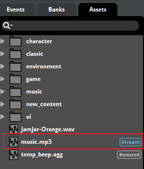

### 创建 Event

Event 是 FMOD 播放声音的最小单元, 它是音频的包装, 可以给音频添加各种效果的同时通过[参数](params.md)控制等手段调整音频的播放逻辑(跳转/开始/停止等)

**游戏中产生的每一个声音都会对应 FMOD 中的一个 Event** 

在左侧的 Events 标签页下, `右键 > New Event > New 2D Event` 即可添加一个 event, 
但是由于我们的 event 也会跟别人的 event 产生[路径冲突](../mod_structure.md#conflict), 所以这里我们也需要套文件夹,
`右键 > New Folder` (例子为了方便演示就不多套了)

> 命名建议: 你的名字/项目名字/.../具体 Event

这里的路径是 `Test/music_event`

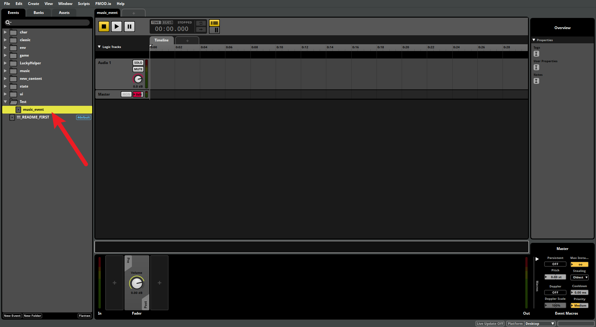

### 填充 Event

创建完 Event 后, 我们的 Event 内部还只是个空壳, 所以我们需要将自己的 `.mp3` 音乐拖拽进来

#### Event 编辑器界面的基本操作

* 细致缩放: Alt / Option + 鼠标滚轮
* 水平方向缩放: `[` / `]`
* 竖直方向缩放: Ctrl / Command + `[` / `]`

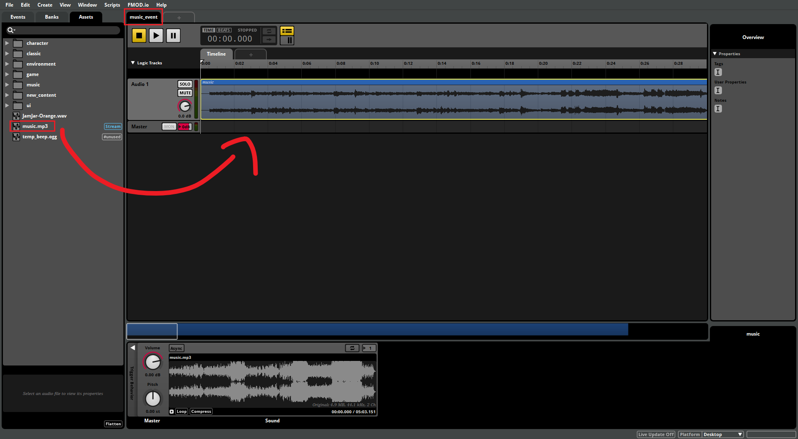

现在我们就有了一个无任何参数/过渡/调整的最朴素的可播放的 Event 了!

### 创建 Bank

Bank 是 Events 的集合, 经过格式化和压缩后可在游戏中使用(类似于文件之于文件夹的关系, 之后 build 出来相当于就是 `.zip` 了).

在左侧的 Events 标签页下, `右键 > New Bank` 添加一个新的 Bank, 随意取一个你喜欢的名字, 这里是 `TestBank`,
然后重新找到你的 event, `右键 > Assign to Bank > 你的 Bank(这里是 TestBank)`, 这样你就成功将你的 event 添加到 bank 里了!

> 或者从某种意义上来说应该是 bank 引用了 event, 因为 event 可以被 assigned to 多个 bank

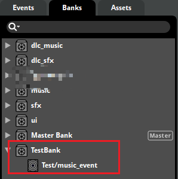

此时我们已经能导出 bank 并使用了!

### 导出 Bank 和 GUID

**导出 Bank**

现在选中你的 bank, `右键 > Build...`, FMOD 就会在 `项目根目录/Build/Desktop/` 文件夹生成你的 bank, 叫做 `你的 bank 名.bank`, 
里面存放着相关的 event 等数据

**导出 GUIDS**

点击上方导航栏 `File > Export GUIDS...`, FMOD 就会在 `项目根目录/Build/` 文件夹生成你的 GUIDs, 这个文件相当于是个对照表, 
有了它 FMOD 才能通过 event name 找到并正确使用 bank 数据

### 播放音频

将上述生成的文件放入你 Mod 下的 Audio 文件夹之中, 并将 GUIDs 改名为 `{bank 名字}.guids.txt`(其实只要同名就行, 不过为了防止搞混还是建议跟 bank 名一样)

- 📁 Mods
    - 📁 你的 Mod
        - 📁 Audio
            - 📄 {bank 名字}.bank
            - 📄 {bank 名字}.guids.txt

然后你就可以在 Loenn 里随意使用你制作的 event 了!

比如现在我们在元数据里添加全局音乐 `evet:/Test/music_evnet`(`event:/` + event 路径), 然后重新开始章节就可以听到我们添加的音乐了!

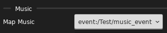

### 将音乐加入 Bus(总线)

虽然我们现在已经能正确播放音乐了, 但是你会发现我们按 `ESC` 暂停的时候, 音乐并没有像我们想象的那样变得低沉,
这是因为我们没有将我们的音乐添加到正确 Bus

所谓的 Bus, 其实就是混音器(Mixer)分组, 所以我们先来讲解一下混音器

#### 混音器 Mixer

想象一下, 如果你要播放 A 音乐的同时播放 B 音乐, 那么这个时候如果你想同时降低他们的音量该怎么做?

一般人可能会想: 降低 A 的音量然后再降低 B 的音量嘛, 但是音乐多起来这个操作就显得麻烦了, 所以混音器就是用来解决这个问题的, 我们可以将 A/B 音乐归到同一组里,
之后修改组的音量, 并跟原音量混合计算即可, 比如 A 音量为 0.5, B 音量为 0.8, 组音量为 0.4, 那么最终输出的 A 音量可能(这里用乘算)就是 0.2, B 音量可能就是 0.32

扩展一下你就会发现 event 能做的 Mixer 都能做, 比如暂停同一组里的所有 event, 给同一组的 event 统一添加效果等等等等

现在让我们打开 Mixer(顶部导航栏 `Window > Mixer`), 把我们的 event 放到正确的 Bus 分组(选择 Mixer 里我们的 event `右键 > Reroute into > music/tunes/mains`, 当然你直接把 event 拖拽到对应位置也行)

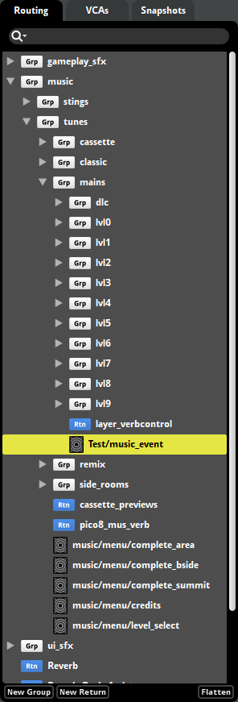

此时我们重新 Build bank 并将其放置到我们的 Audio 文件夹里(这里我们没有添加东西, 所以 GUIDs 不用重新导出), 你就会发现暂停的时候音乐变低沉了!

如果你好奇暂停时的 Mixer 做了什么, 可以点击 music bus group 查看, 你会发现蔚蓝制作组为其添加了 `Lowpass` 低通效果, 这就是低沉声的来源,
但是游戏是怎么设置 `Lowpass` 的数值的呢?, 这就靠 Mixer 里的 Snapshot(快照) 功能了, 游戏可以提前设置好一些旋钮的参数, 并将其保存为一个快照, 之后需要使用的时候直接调用,
这样之前设置好的旋钮配置就能很快的切过去了

如果你想在 FMOD 中体验这种感觉, 可以先播放我们的 `music_event`, 然后进入 Mixer 的 Snapshots 窗口选择 pause_menu 快照, 
然后点击播放(应用), 你就会发现我们的的音乐变低沉了

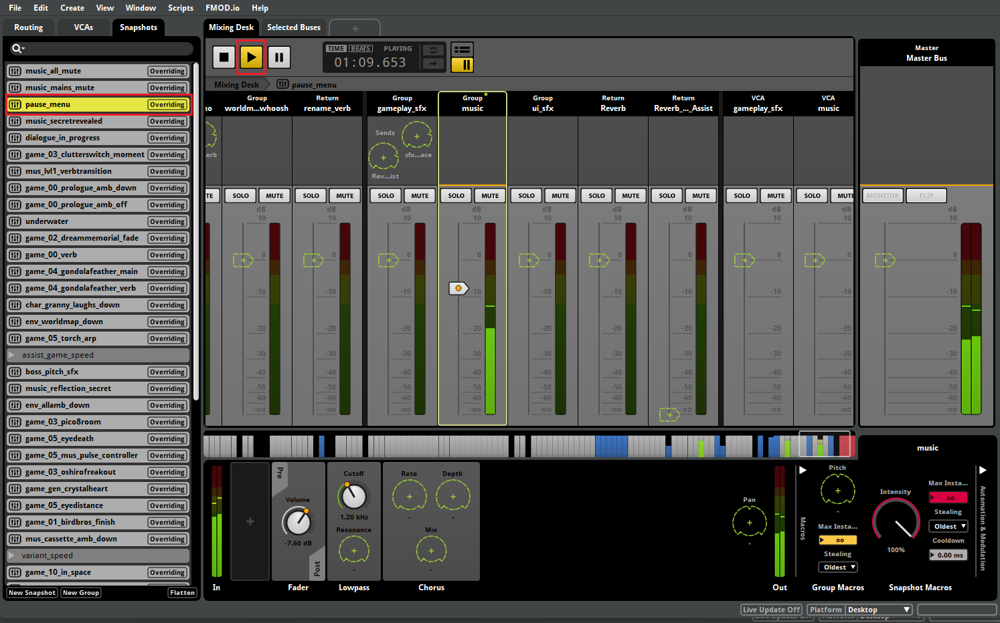

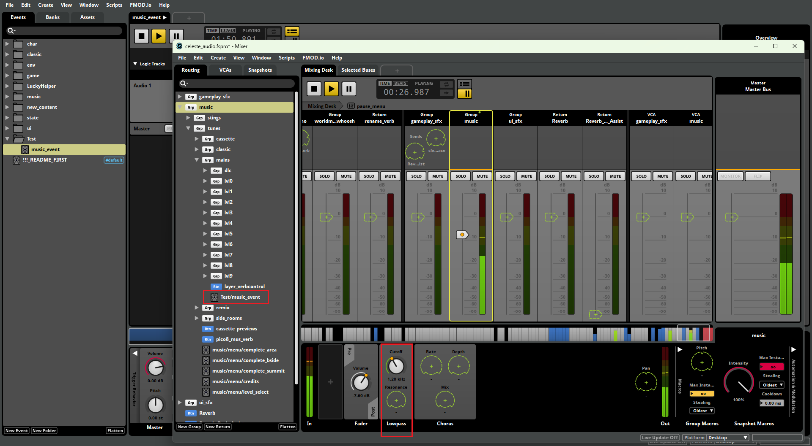

#### 其他 Bus Group

* 游戏音效: gameplay_sfx/game/general/yes_pause  # 游戏暂停的时候音效也会暂停
* 磁带音乐: music/tunes/cassette

你可以通过参考原版相似功能 Event 路径来确定你应当设置的路径, 也可以直接复制原版的 Event 然后改, 因为复制的 Event 会保留原有 Mixer 设置. 

### 添加并设置 fade 参数

现在新的问题出现了, 当我尝试在游戏中使用 `Music Fade Trigger` 淡出/淡入音乐的时候, 我的音乐压根没有任何变化, 这是怎么回事

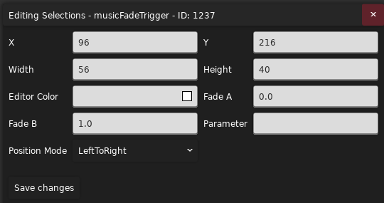

虽然不知道为什么, 但是不难注意到, 游戏似乎会在我们接触 `Music Fade Trigger` 的时候改变 Event 的 fade [参数](params.md)数值, 范围为 `0 ~ 1`,
欸🤓☝️, 如果我们将 Event 的音量跟 fade 参数的数值关联起来怎么样, 让 fade 0 对应无声, fade 1 对应有声, 说干就干

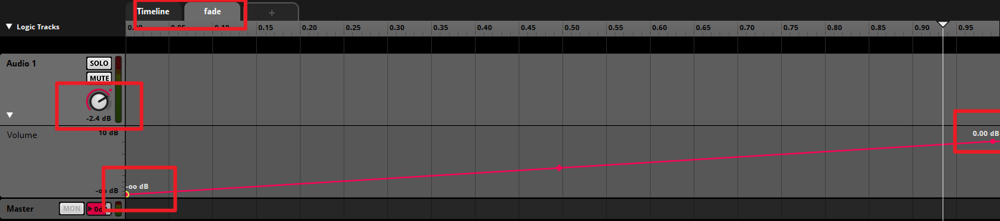

1. 点击 Timeline 右侧的加号, 添加 fade 参数(`New Parameter > 将 Name 修改为 fade > OK`)
2. 在 fade 标签页下, 右键调节音量的旋钮, 为 Master 轨道创建一个 Automation 自动化, 表示创建一条函数曲线, x 轴由 fade 参数控制, y 轴的输出对应音量
3. 在出现的红线上点击创建两个节点, 坐标分别调整为 `(0, -∞ dB)` 和 `(1, 0 dB)`(也可以右键节点编辑), 表示当 fade 为 0 时, Event 完全静音, 当 fade 为 1 时, 输出正常大小的声音(`0 dB` 不代表没声音)

此时我们重新 Build bank 并将其放置到我们的 Audio 文件夹里(这里我们没有添加东西, 所以 GUIDs 不用重新导出), 使用 `Music Fade Trigger` 的时候我们的 Event 音乐就可以正常淡入淡出了!

### 为音乐添加循环

现在还有个问题是当我们的音乐播放完后就停止了, 所以我们需要给音乐添加循环节, 这样当音乐播放到循环节内部后, 就会在循环节内部循环

#### 方法一: 使用 Loop Region

在 Event 编辑器的 Logic Tracks 中, `右键 > Add Loop Region`. 拖拽 Loop Region 的左/右侧来调整循环节的范围(按住 Alt / Option 键拖拽可以微调). 

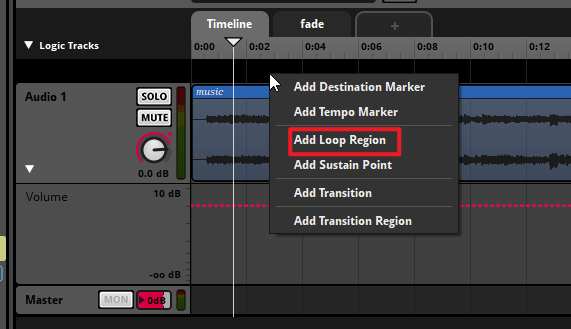

#### 方法二: 使用 Transition

> 冷知识, 蔚蓝[人物对话音效](faq.md#speak)也是通过 Transition 实现的, 本质上就是不断地跳转

可以创建淡入淡出效果, 相比于前一种方法更适合处理有混响延迟尾巴/没有流畅循环的音乐.

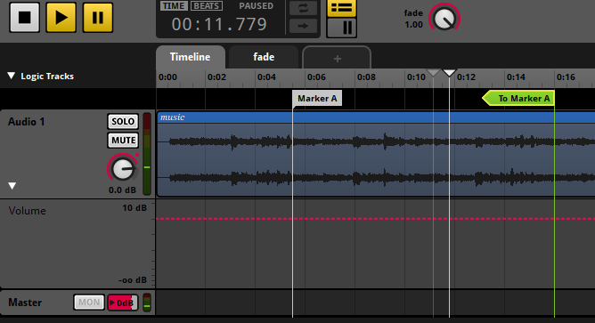

1. 在 Event 编辑器的 Logic Tracks 中, `右键 > Add Transition`, 表示添加一个过渡, 当音乐播放到这个位置时, 就会跳转到过渡对应的目的地(Destination)
2. `右键 > Add Destination Marker`, 添加跳转目的地(默认叫 Marker A)
3. `右键过渡 > Set Destination To 刚创建的 Marker`, 这样才算是把 Transition 和 Destination 关联起来了

**[创建淡入淡出效果](https://www.bilibili.com/video/BV1X94y1j7Kt/)**

1. 双击 Transition 以创建一个 Transition Timeline. 
2. 加长/缩短 Timeline 到合适的时长, 从左右拽入 Source 和 Destination, 即可淡出和淡入(你也可以选择只淡出不淡入等). 

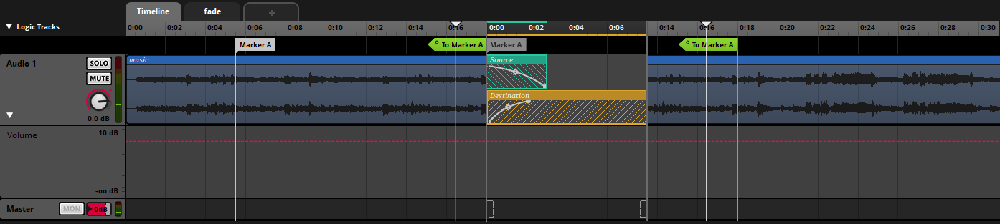

## Everest Sound Test

Everest Sound Test 是一个非常有用的功能, 可以试听 FMOD Events 在游戏中的效果

前两格灰色下标用来查找特定 Bank, 后面三格白色下标用来查找每个 Bank 里的 Events, 选择好后按 `C` 播放即可

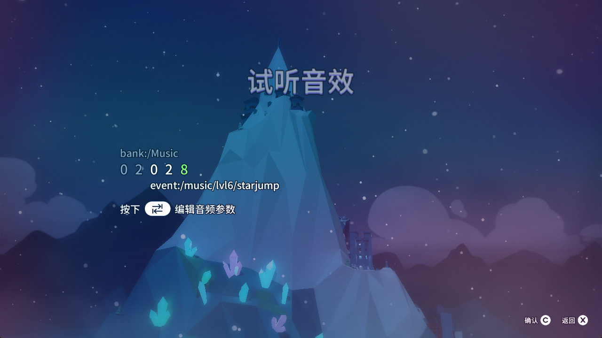

常用在

### [问题排查](troubleshooting.md)

看看 bank 是否被识别了, 里面的 event 能不能被读取到等等

### 工程逆向

可以用来偷窥别的复杂 Event 的参数设置(比如心门, 因为通常都会有 `progress` 和 `layer` 设置). 

因为人们无法轻易从 Bank 逆向出原有的 FMOD 工程, 所以这一功能就变得尤为可贵.

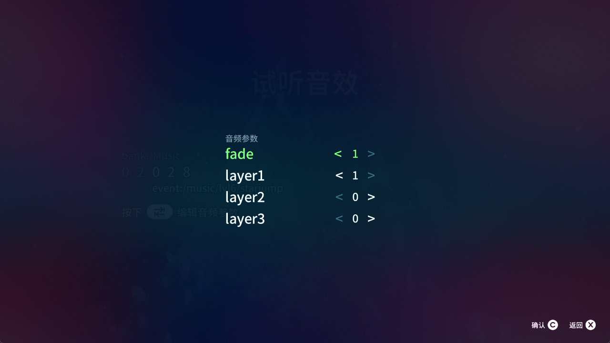

