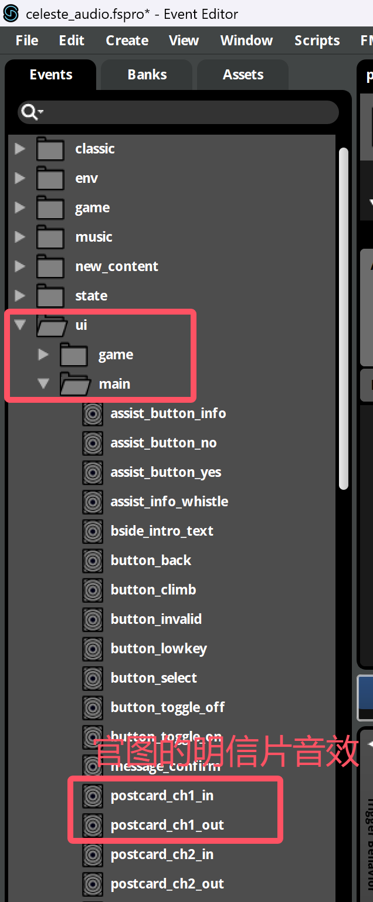
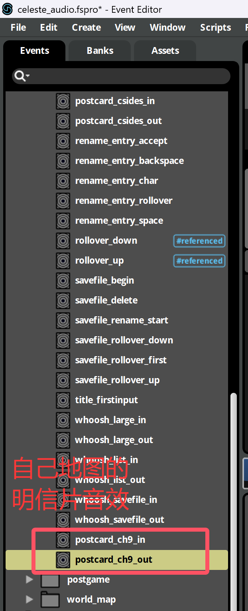
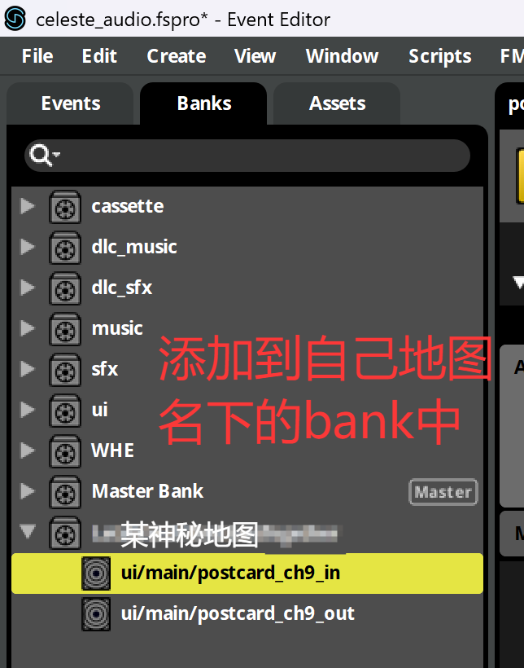
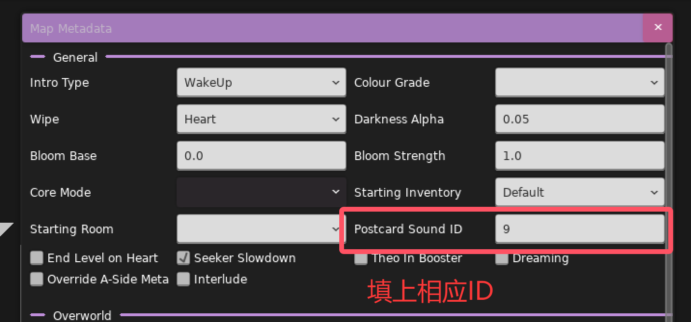
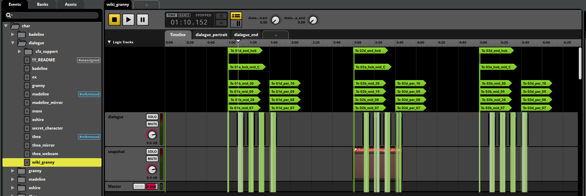
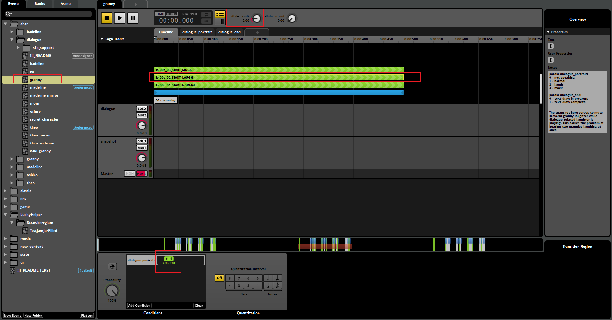

<a id="postcard"></a>

## 如何自定义明信片的音效

简单来说, 明信片的音效使用了

* event:/ui/main/postcard_ch{loenn 里设置的内容}_in
* event:/ui/main/postcard_ch{loenn 里设置的内容}_out

例如

* event:/ui/main/postcard_ch1_in
* event:/ui/main/postcard_ch2_in
* event:/ui/main/postcard_ch3_in
* event:/ui/main/postcard_csides_in

所以聪明的你已经猜到要怎么做了吧, 在 fmod 里创建一个类似格式的 event, 然后把数字改成对应的字符串, 比如像这样: `event:/ui/main/postcard_ch{自己定义的字符串}_in`, 之后在 loenn
里填上大括号里的内容就行了,
当然为了防止跟别人撞名字名字还得取长一点, 手段跟套文件夹大同小异, ~~不过改明信片音效的人真的很少~~

这里附上 NaCline 的研究成果

{style="width: 300px;"}
{style="width: 300px;"}
{style="width: 300px;"}
{style="width: 600px;"}

<a id="speak"></a>

## [如何修改人物对话音效](https://github.com/EverestAPI/Resources/wiki/Advanced-Custom-Audio#adding-portrait-custom-sounds)

如果你看过蔚蓝 fmod 工程文件中 `char/dialogue/` 目录下的 events,
你就会发现蔚蓝实现人物对话音效的方式是通过不断在各种短音效中跳转来跳转去, 所以我们要做的基本上就是修改音频, 之后在 `Portraits.xml` 里做好设置即可

比如这里就是把 granny 的音频粘出来降个调(~~至于为什么不选其他角色那是因为太卡了~~), 之后重复基本操作即可(把 event 加到 bank, build bank, export guids)

{style="width: 1000px;"}

现在游戏已经能加载到我们的音频了, 但是我们还得告诉游戏我们的音频路径, 这是通过设置 `Portraits.xml` 中的 `sfx` 属性来实现的

```xml hl_lines="3"
<?xml version="1.0" encoding="utf-8" ?>
<Sprites>
    <portrait_wiki_granny path="granny/" sfx="wiki_granny" textbox="granny">
        <Center/>

        <sfxs>
            <normal index="1"/>
            <laugh index="2"/>
            <mock index="3"/>
        </sfxs>

        <Anim id="idle_normal" path="normal" delay="0.1" frames="0*6" goto="idle_normal:10,idle_normal_blink1,idle_normal_blink2"/>
        <Anim id="idle_normal_blink1" path="normal" delay="0.08" frames="0-1,2*2,3" goto="idle_normal"/>
        <Anim id="idle_normal_blink2" path="normal" delay="0.08" frames="0,9,10,11,2*2,12,13,14" goto="idle_normal"/>
        <Loop id="talk_normal" path="normal" delay="0.1" frames="4,5*2,6*2,7,8*2,7,0*2"/>

        <Anim id="idle_mock" path="mock" delay="0.1" frames="0*10" goto="idle_mock:5,idle_mock_blink"/>
        <Anim id="idle_mock_blink" path="mock" delay="0.08" frames="0-1,2*2,1" goto="idle_mock"/>
        <Loop id="talk_mock" path="mock" delay="0.2" frames="3,5,4,0"/>

        <Loop id="idle_creepA" path="creepA" delay="0.1" frames="0*10"/>
        <Loop id="talk_creepA" path="creepA" delay="0.1" frames="4,5*2,6*2,7,8*2,7,0*2"/>

        <Loop id="idle_creepB" path="creepB" delay="0.1" frames="0*10"/>
        <Loop id="talk_creepB" path="creepB" delay="0.1" frames="4,5*2,6*2,7,8*2,7,0*2"/>

        <Loop id="idle_laugh" path="laugh" delay="0.1" frames="0-3"/>
        <Loop id="talk_laugh" path="laugh" delay="0.1" frames="0-3"/>
    </portrait_wiki_granny>
</Sprites>
```

如果你研究了一下 fmod 你可能已经发现了, 游戏通过设置 `dialogue_portrait` 参数为各种正数以达到使用不同音频的效果, 而这个数字则是由下面这几个设置决定的

```xml

<sfxs>
    <normal index="1"/>
    <laugh index="2"/>
    <mock index="3"/>
</sfxs>
```

换句话说, 我们在 dialog 里使用 `[granny normal]` 来访问到 granny 的音频 `event:/char/dialogue/granny`, 游戏通过 normal 找到其对应的索引 `1`,
并将 fmod 中的 `dialogue_portrait` 参数设置为 1, 这样 fmod 在播放的时候就会通过对应过渡自动跳到对应片段(顺带一提右边还有注释可以看)

{style="width: 1000px;"}
