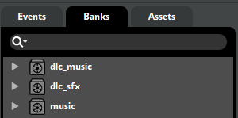

引用

* [Everest Wiki 更新的音乐文档](https://github.com/EverestAPI/Resources/wiki/Troubleshooting-Custom-Audio)

正常情况, 根据网上的音乐教程操作完成后, 我们就应该能在地图里面听到自己的地图音乐了, 但是如果真的操作完成之后发现自己的地图音乐并没有按照预期播放, 那么应该怎么办呢？

下面, 我们来进行分步讲解: 

## 常规检查

其实跟很多常见问题的处理方法类似, 你可以尝试下面几种方法: 

- 使用 Ctrl + F5 重启 Everest, 注意是 Ctrl + F5, 不是单纯的 F5, FMOD 只会在 Everest 启动以及重载时才会读取. 
- 重新开始章节, 即便你在编辑器的 metadata 选项中设置过音乐了, 地图只会在章节重启的时候才会对音乐设置进行更新. 
- 查看你的游戏是否静音了. 

除此之外进行一个额外的补充, 有 mapper 使用的音效或者音乐可能是来自素材包(比如 Femto Audio), 因此: 

- 查看你使用的素材包是否作为地图的依赖并且在 Mod 选项中启用. 

## Everest 音源检查选项

上述操作都尝试过了？仍然不太行？那好, Everest 为我们提供了现成的用于定位音乐问题的工具. 

在 Mod 选项中找到 Sound Test(声音检查)或者打开 Everest 控制台(使用波浪号 `~`)输入`soundtest`即可. 

打开后你就会看到上面这么个玩意. 不难看出一共有 5 个字符(图中是 00000)用于表示某一个具体的音乐. 

> 纠正一点, 在 Celeste 中实际上所谓的“音乐”的标准称呼应该叫做“事件”, 这也是为什么音乐文件的 guilds.txt 里面都是以 event 开头的, 但是这里为了方便理解, 我们直接称这些 event 为音乐. 

这五个字符中: 

更改前两个灰色字符可以遍历 Everest 已经加载的 bank. 

而更改后面的三个字符则可以遍历 bank 中存在的音乐. 

值得注意的是, 通常第一个灰色字符为 0 表示原版音乐 bank, 而 1 表示 mod 音乐 bank. 

因此在你按从左到右的顺序查找自己的音乐的时候, 应当从 **第二位灰色字符**开始更改来进行查找. 

根据上述操作我们便可以定位问题所在. 

## Everest 找不到你的 bank 文件

首先说明一个前提条件, 在你的 Mod 中, 你的音乐 bank 文件, 必须放置在 `Audio` 文件夹当中, 不可以放置在其他文件夹当中. 

如果你的 bank 文件位置是对的但是仍然找不到你的 bank, 那么就说明可能在设置音乐 bank 时你就出现了问题, 这个时候你需要重新创建你的 bank. 

1. 将你的 bank 从 FMOD 中 Banks 栏里面找出并删除. 
2. 创建一个新的 bank(注意, 不要直接复制一个已有的 bank, 这往往就是导致 bank 找不到的问题所在)
3. 将你的音乐(在 FMOD 中应当是一个 event)重新 `assign to bank` 至新创建的 bank 上. 

## Everest 找得到你的音乐, 但是它在 soundtest 中的显示并不是 event 形式

很好, 这说明至少你的 bank 已经被 Everest 加载了, 如果 soundtest 中显示你的音乐并不是 event 开头, 说明你在设置音乐时可能忘记将 `guids.txt` 文件也一并导出了. 

和 bank 文件一样, guids.txt 文件也需要放置在 `Audio` 文件夹里面, 不可以放置在其他位置, 且文件名需要和 bank 文件一一对应. 

举例, 我创建了一个 `MyMusic.bank`, 那么我导出音乐的时候应当一并导出一个 `MyMusic.guids.txt` 文件. 

> 温馨提醒: 在设置 Celeste Mod 的时候建议在系统文件管理器的工具栏找到“查看”, 并打开“显示文件尾缀名”这一选项, 上述的 `.bank` 和 `.guids.txt` 均是包含尾缀的完整文件名. 

## soundtest 里面 bank 存在, 音乐显示播放也正常

太棒了, 那说明你的地图中音乐没有正确播放并不是bank和音乐加载有误, 这个时候你就应该回到你的地图之中并且仔细检查你设置了这个音乐的地方, 检查触发条件或者音乐参数等是否设置有误. 

同时注意: 

1. 在使用音乐时, 你需要完整书写音乐的 event 路径, 这个可以在前文提到的 `guids.txt` 文件中找到: 例如 `event:/myCertainMap/main/area1music`
2. 房间本身是有 `Song` 这个设置的, 如果你的地图房间设置了音乐, 它会将地图本身 metadata 设置的音乐给覆盖掉. 因此如果你有某个房间内音乐播放不正常, 应当注意检查房间本身设置. 

## 什么？还是不行？

没招了, 问. 
