## 教程

* [NoahCrawfish: 平台跳跃游戏的镜头没你想的那么简单](https://www.bilibili.com/video/BV1mmha6EErZ/)
* [冰激凌的镜头教程](https://wiki.biligame.com/celeste/%E9%95%9C%E5%A4%B4)
* [bits-像素的镜头教程](../../assets/mappings/camera/镜头教程-bits.docx)
* [星夜祈梦的镜头教程(视频)](https://www.bilibili.com/video/av113689092953564)
* [Everest Wiki 的镜头教程](https://github.com/EverestAPI/Resources/wiki/Camera)
* [Celeste Camera in 3 Levels of Complexity by Gamation](https://medium.com/@crumpledmemes/celeste-camera-in-3-levels-of-complexity-243efd7872bc)

## [Camera Offset Trigger](https://github.com/EverestAPI/Resources/wiki/Camera#camera-offset-triggers)

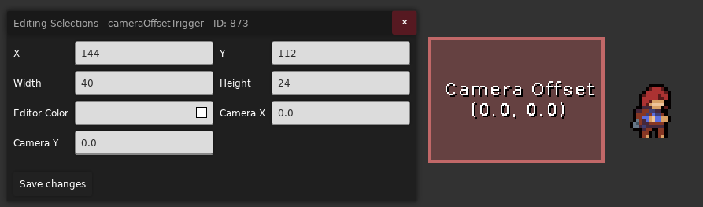

一般情况下, 镜头会始终以玩家为中心跟随, `Camera Offset` 则表示镜头以**偏离玩家多少方向为中心跟随**,
`Camera Offset Trigger` 就是用来设置这个 `Camera Offset` 的, 比如我们将 `Camera X` 设置为 `1`,
那么镜头中心就会向右偏移, 像下面这样

> 你可以启用 [Celeste TAS](https://gamebanana.com/tools/6715), 
> 按下 ++ctrl+b++ 打开碰撞箱显示, 按下 ++ctrl+n++ 打开简化图形, 
> 按下 ++ctrl+m++ 打开镜头居中显示并使用鼠标滚轮缩放镜头或是使用鼠标右键拖动镜头 (双击鼠标右键重置)
> 
> 此时你就能看到图中的效果了, 其中淡蓝色的框对应实际的镜头范围, 你可以通过这种方式观察镜头的运动

<figure style="display: flex; gap: 1rem;">
  

       
    <figcaption>进入 Trigger 前</figcaption>
  

  

       
    <figcaption>进入 Trigger 后</figcaption>
  

</figure>

### 注意事项

* 如果镜头范围超出房间外了, 游戏还是会把镜头锁在房间范围内的
* 进入房间时, `Camera Offset` 会重置为[房间对应的 `Camera Offset` 的值](../loenn/room.md#camera_offset)
* 蔚蓝的[坐标系](https://www.bilibili.com/video/BV1Mk4y1N76K/?t=158)与平时常见的平面直角坐标系相同, 
只不过 y 轴方向向下, 所以 `Camera Y` 设置的越大镜头越往下

## [Smooth Camera Offset Trigger](https://github.com/EverestAPI/Resources/wiki/Camera#smooth-camera-offset-triggers)

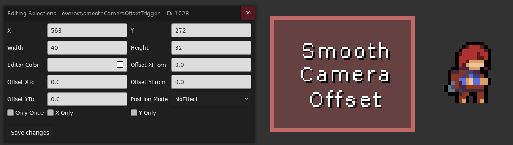

> 更丝滑的 `Camera Offset Trigger`

`Smooth Camera Offset Trigger` 会根据你在 Trigger 中的相对位置来设置 `Camera Offset`,
比如当你的 `Position Mode` 设置为 `LeftToRight` 时, 如果你在 Trigger 里偏左边的位置, 
那么 `Camera Offset` 就会被设置为偏向 `Offset XFrom` 的值, 如果你在 Trigger 里偏右边的位置,
那么 `Camera Offset` 就会被设置为偏向 `Offset XTo` 的值, 其他 `Position Mode` 同理

### 注意事项

* 如果你没有正确摆放你的 `Smooth Camera Offset Trigger` 可能会导致 `Camera Offset` 被[错误的设置](https://www.bilibili.com/video/BV1mmha6EErZ/?t=488)
* 如果在进入 `Smooth Camera Offset Trigger` 前玩家的 `Camera Offset` 不确定, 可能导致 `Smooth Camera Offset Trigger` [无法确定一个合适的起始 `Offset From`](https://www.bilibili.com/video/BV1mmha6EErZ/?t=503)

## Position Mode

在 [`Smooth Camera Offset Trigger`](#smooth-camera-offset-trigger) 部分我们已经浅浅体验过了 `Position Mode` 的作用, 这里我们再补充说明一下

游戏会根据玩家在 Trigger 内的相对位置和 `Position Mode` 的设置来计算出一个相对均匀变化的 `0 ~ 1` 的值,
这样在后续使用中通过这个值来改变镜头的某些参数时, 具体的表现相对就会更加温和丝滑

* `NoEffect`: 默认为 `1`
* `LeftToRight`: 从左到右 `0 ~ 1`
* `RightToLeft`: 从右到左 `0 ~ 1`
* `TopToBottom`: 从上到下 `0 ~ 1`
* `BottomToTop`: 从下到上 `0 ~ 1`
* `HorizontalCenter`: 从左到中间 `0 ~ 1`, 从右到中间 `0 ~ 1`
* `VerticalCenter`: 从上到中间 `0 ~ 1`, 从下到中间 `0 ~ 1`

## [Camera Catchup Speed Trigger](https://github.com/EverestAPI/Resources/wiki/Camera#camera-catchup-speed-triggers)

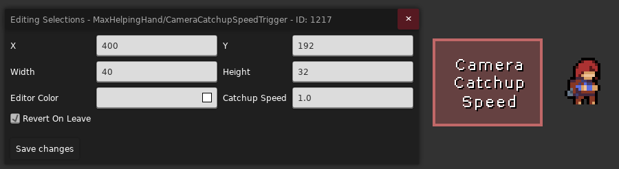

> 需要下载并启用 [Maddie's Helping Hand](https://gamebanana.com/mods/53687)

相机运动计算公式 

$camera.position = lerp(camera.position, camera.targetPosition, 1 - (0.01 / CatchupSpeed) ^ {0.0167})$

* `Catchup Speed`: 改变相机的跟随速度, 常用在[高速场景](https://www.bilibili.com/video/BV1MwdVBRE6q/?t=913)
* `Revert On Leave`: 表示 Trigger 是触碰后永久生效还是只在内部生效

## [Camera Offset Border Trigger](https://github.com/EverestAPI/Resources/wiki/Camera#camera-offset-border-triggers)

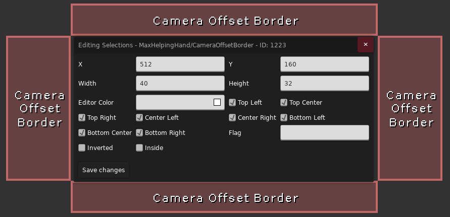

> 需要下载并启用 [Maddie's Helping Hand](https://gamebanana.com/mods/53687)

该 Trigger 常被用作 "镜头墙" 来阻挡镜头的移动, 以下是属性介绍

`Top Left`, `Top Center`, `Top Right`, `Center Left`, `Inside`, 
`Center Right`, `Bottom Left`, `Bottom Center`, `Bottom Right`, 表示 9 个方位, 像下面这样

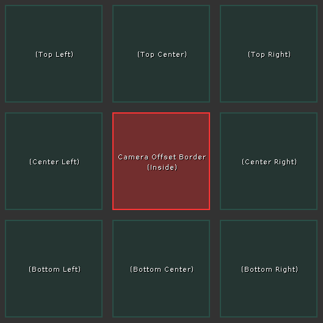

该 Trigger 会在玩家处在对应方位且对应属性勾选的情况下**生效**

当 Trigger **生效**且镜头跟该 Trigger **有重叠**时, 触发阻挡机制, 如下:

1. 当玩家在该 Trigger 右侧的左方, 且上述任意带 `Left` 字眼的属性勾选, 相机会向左移动直到相机右侧跟 Trigger 左侧贴合
2. 当玩家在该 Trigger 左侧的右方, 且上述任意带 `Right` 字眼的属性勾选, 相机会向右移动直到相机左侧跟 Trigger 右侧贴合
3. 当玩家在该 Trigger 上侧的下方, 且上述任意带 `Bottom` 字眼的属性勾选, 相机会向下移动直到相机上侧跟 Trigger 下侧贴合
4. 当玩家在该 Trigger 下侧的上方, 且上述任意带 `Top` 字眼的属性勾选, 相机会向上移动直到相机下侧跟 Trigger 上侧贴合

以上规则按顺序判断, 任意一条生效后后续规则都不再执行

在大多数情况下, 你只需要把对应方向的属性勾上, 把该 Trigger 视作一道阻碍镜头移动的镜头墙即可

* `Flag`: 除了上述条件, Trigger 的生效还取决于场景中是否有对应 [Flag](../useful_helpers/mapping_utils.md#flags) (留空这个选项就不生效)
* `Inverted`: 是否反转 Flag 的效果, 如果反转那么只有当场景里没有对应 Flag 的时候 Trigger 才生效

## [Camera Target Trigger](https://github.com/EverestAPI/Resources/wiki/Camera#camera-advanced-target-triggers)

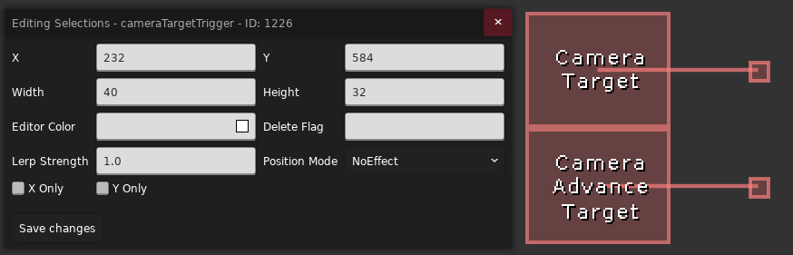

当你进入该 Trigger 时, 镜头会移动到该 Trigger 节点对应的位置

* `Lerp Strength`: 镜头移动速度, 如果数值小于 `1`, 那么在减慢镜头移动速度的情况下镜头会更偏向原来的位置而不是节点的位置, 如果数值大于等于 `1`, 那就是单纯的加快镜头移动速度
* [`Position Mode`](#position-mode): 与 [Smooth Camera Offset Trigger](#smooth-camera-offset-trigger) 类似, 
游戏会根据你在 Trigger 中的相对位置算出一个 `0 ~ 1` 的百分比值, 用于计算镜头原来的位置到 Trigger 节点位置的插值, 
比如 `1` 对应 Trigger 节点位置, `0` 对应原位置 (相当于 Trigger 不生效)
* `X Only`: 该 Trigger 是否只锁 X 方向
* `Y Only`: 该 Trigger 是否只锁 Y 方向
* `Delete Flag`: 如果房间加载时此 [Flag](../useful_helpers/mapping_utils.md#flags) 存在, 那么该 Trigger 就不会被加载, 
如果是加载后此 [Flag](../useful_helpers/mapping_utils.md#flags) 存在, 
那么只起到不让 Trigger 生效的作用, Trigger 已造成的更改并不会复原

### [Camera Advanced Target Trigger](https://github.com/EverestAPI/Resources/wiki/Camera#camera-advanced-target-triggers)

与 `Camera Target Trigger` 类似, 但是可以精细调整 X/Y 方向的 `Lerp Strength` 和 `Position Mode`

## [Flag Toggle Camera Offset Trigger](https://github.com/EverestAPI/Resources/wiki/Camera#flag-camera-triggers)

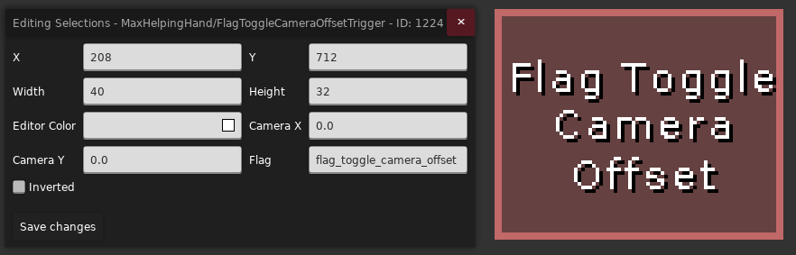

> 需要下载并启用 [Maddie's Helping Hand](https://gamebanana.com/mods/53687)
>
> 很多其他带 Flag 的镜头 Trigger 都是类似的, 这里不会全列出来

`Camera Offset Trigger` 的带 `Flag` 版本 (虽然你也可以用 [Eevee 的 Flag Toggle Modifier](../useful_helpers/eevee.md#flag-toggle-modifier) 超级拼装)

* `Flag`: 当 Flag 存在时, Trigger 才启用 
* `Inverted`: 若勾选, 则当 Flag 不存在时, Trigger 才启用

## [Zoom](https://github.com/EverestAPI/Resources/wiki/Camera#zoom)

### Eased Camera Zoom Trigger

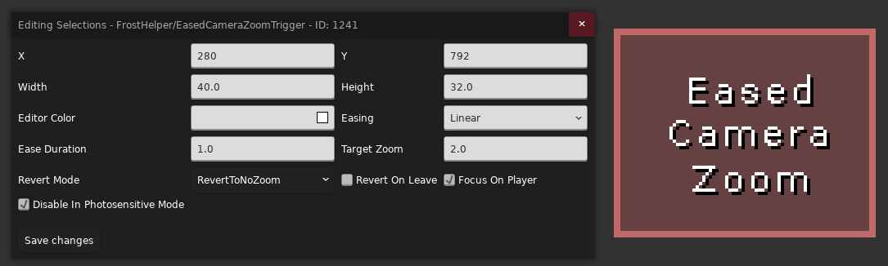

> 需要下载并启用 [Frost Helper](https://gamebanana.com/mods/53647)

* `Target Zoom`: 镜头放大倍率, 如果要缩小镜头, 请使用 [Camera Zoom](#camera-zoom-trigger)
* `Easing`: 镜头缩放时的[缓动](https://easings.net/zh-cn), 也就是线性缩放, 还是先快后慢, 先慢后快等
* `Eased Duration`: 镜头缩放所需时间
* `Revert On Leave`: 表示离开 Trigger 后是否要恢复镜头缩放
* `Revert Mode`: 
    * `Revert To No Zoom`: 表示离开 Trigger 后恢复镜头缩放至默认值
    * `Revert To Previous Zoom`: 表示离开 Trigger 后恢复镜头缩放到进入 Trigger 那一刻记录的镜头缩放值
* `Focus On Player`: 表示是否让玩家剧中在镜头内 (似乎会抽搐, 建议关闭)
* `Disable In Photosensitive Mode`: 表示在玩家开启光敏模式的前提下是否禁用该 Trigger, 以避免触发光敏癫痫 (建议关闭)

### [Camera Zoom Trigger](https://github.com/Ikersfletch/ExCameraDynamics/blob/main/README.md#camerazoomtrigger-trigger)

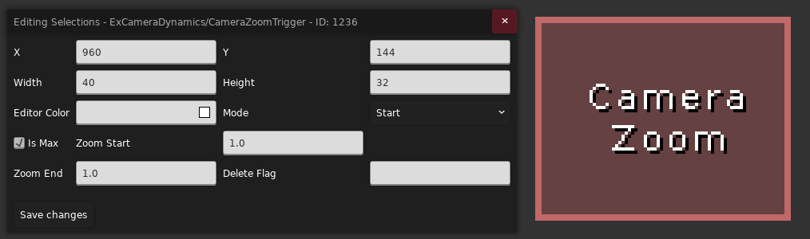

> 需要先配置好[拓展镜头 Extended Camera Dynamics](./faq.md#excamera) 并启用

* `Zoom Start`: 镜头缩放起始值
* `Zoom End`: 镜头缩放结束值
* `Mode`:
    * `Start`: 碰到 Trigger 后就将镜头缩放设置为 `Zoom Start`
    * `LeftToRight`: 类似 [Position Mode](#position-mode), 从左到右 `Zoom Start ~ Zoom End`
    * `RightToLeft`: 类似 [Position Mode](#position-mode), 从右到左 `Zoom Start ~ Zoom End`
    * `TopToBottom`: 类似 [Position Mode](#position-mode), 从上到下 `Zoom Start ~ Zoom End`
    * `BottomToTop`: 类似 [Position Mode](#position-mode), 从下到上 `Zoom Start ~ Zoom End`
* `Delete Flag`: 当 Flag 存在时, `Camera Zoom` 不再更新镜头缩放, 当然你走出去缩放还是会恢复的 (此项留空表示该选项不起作用)
* `Is Max`: 限定了镜头缩放的上界, 当多个 `Camera Zoom` 重叠时, 该选项保证最后设置的镜头缩放 `Zoom` 不会超过当前 `Camera Zoom` 对应的值, 反之限定下界 

## [Change Camera Angle Trigger](https://github.com/EverestAPI/Resources/wiki/Camera#changefade-camera-angle-trigger)

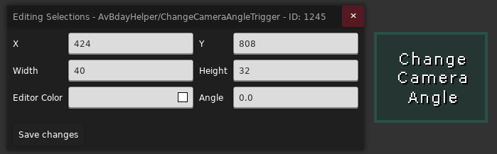

> 需要下载并启用 [AvBday Helper](https://gamebanana.com/mods/317098)

* `Angle`: 以镜头左上角为支点顺时针旋转镜头 `Angle` 角度

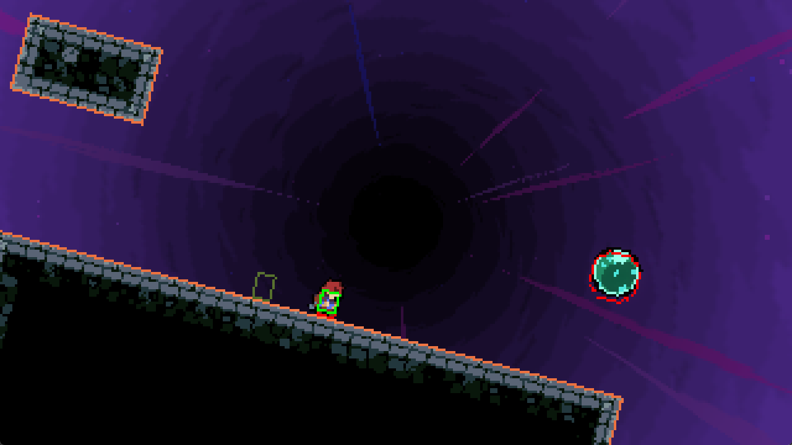

### Fade Camera Angle Trigger

同 [`Change Camera Angle Trigger`](#change-camera-angle-trigger), 但是带 [`Position Mode`](#position-mode)

## [Momentum Camera Offset Trigger](https://github.com/EverestAPI/Resources/wiki/Camera#momentum-camera-offset-trigger)

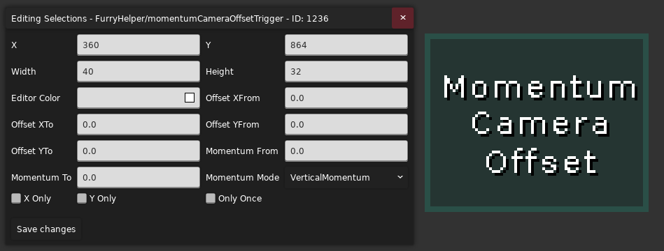

> 需要下载并启用 [Furry Helper](https://gamebanana.com/mods/300395)

类似于 [`Smooth Camera Offset`](#smooth-camera-offset-trigger), 
但是 [`Position Mode`](#position-mode) 换为由速度控制 

* `Momentum From`, `Momentum To`: 速度映射范围, 例如当速度小于 `Momentum From`, 游戏会使用 `Offset From`, 
当速度大于 `Momentum To`, 游戏会使用 `Offset To`, 当速度在 `Momentum From` 到 `Momentum To` 之间时, 
游戏也会使用 `Offset From` 到 `Offset To` 之间的一个相对值
* `Momentum Mode`: 表示使用玩家水平速度来映射还是垂直速度来映射 (似乎没有合速度选项)

## [Camera Target Corner Trigger](https://github.com/EverestAPI/Resources/wiki/Camera#camera-target-corner-trigger)
