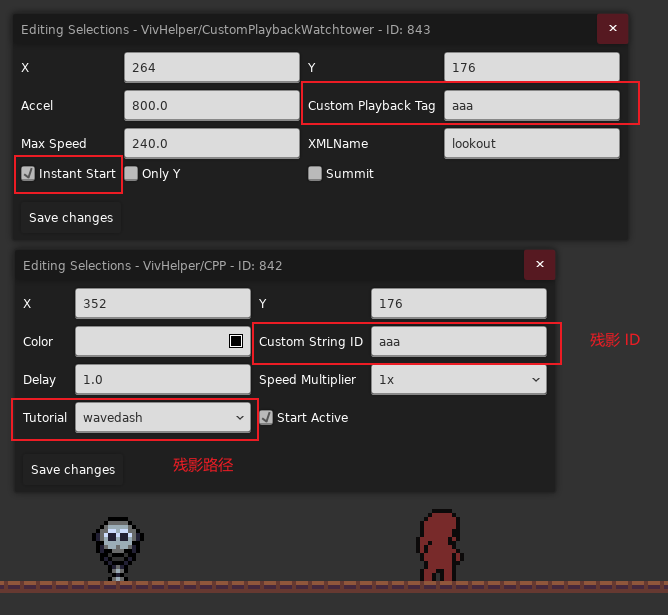
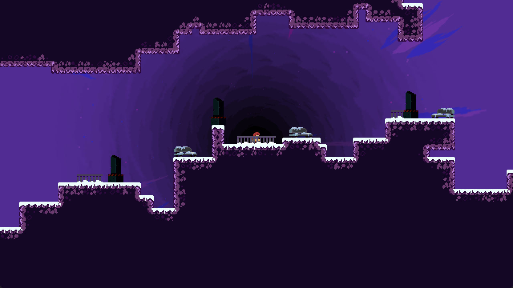

## 启动望远镜的同时开始播放残影

使用 `VivHelper/CustomPlayerbackWatchtower` 搭配 `VivHelper/CustomPlaybackGhost` 即可

{style="width: 700px; title="123"}

<a id="excamera"></a>

## 如何使用拓展镜头

首先下载并启用[拓展镜头(Extended Camera Dynamics)](https://gamebanana.com/mods/548940), 然后在自己地图旁边创建一个与地图同名的 `.meta.yaml` 元数据文件, 并填入以下信息

```yaml title="Mods/LuckyTestMap/Maps/Lucky_boy/0/FirstMap.meta.yaml"
ExCameraMetaData:
    EnableExtendedCamera: true
    RestingZoomFactor: 1.0
```

之后直接在游戏中使用 `Camera Zoom` 等 Trigger 即可

{style="width: 700px; title="123"}

## 为什么在开启 `space` 属性的房间中放置 `Camera Target Trigger` 会使房间上下联通属性 "失效"

首先我们要知道官方是怎么做 8a 结尾的上下联通效果的, 本质上是创建一个比标准大小房间大一点的房间, 
然后使用 `Camera Target Trigger` 并勾选 `onlyY` 属性, 使得镜头固定在房间中央, 
之后在代码里让玩家在穿过镜头下方的时候传送到上方, 穿过镜头上方的时候传送到下方即可实现房间上下 "联通" 的效果了,
~~所以你会意识到如果垂直方向速度够快玩家还是可以摔死的~~

其次呢, 为了提供便利(猜测), 让 mapper 能在勾选房间 `space` 属性后马上体验到房间联通的效果, 
Everest 会在你没有放任何 `Camera Target Trigger` 的时候[自动帮你放一个房间大小的 `Camera Target Trigger` 并将镜头的 Y 方向固定到房间中心](https://github.com/EverestAPI/Everest/blob/790e3a54112c5a18f12e51b338ddeac2c6bfcd8e/Celeste.Mod.mm/Mod/Core/CoreMapDataProcessor.cs#L187),
反过来说如果你放了 `Camera Target Trigger`, Everest 就会认为你想自己管镜头, 于是也不帮你自动生成了, 
结合前面提到的 `space` 机制, 如果你不是很了解原理的话确实很容易误解以为 `Camera Target Trigger` 让联通效果失效了(~~Everest 这波好心办坏事了属于是~~)
