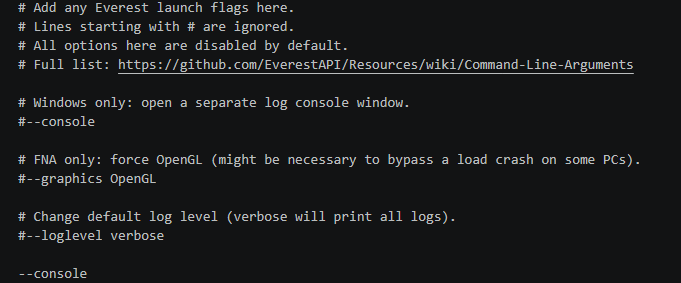
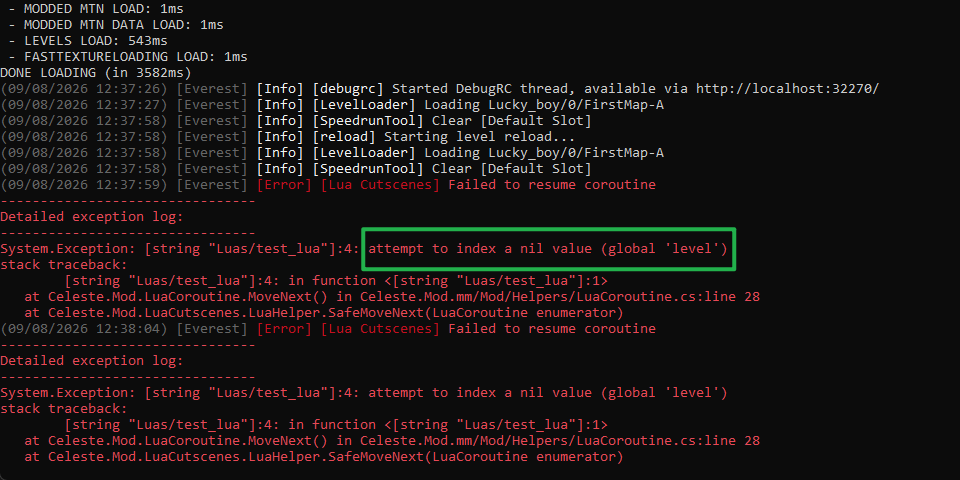
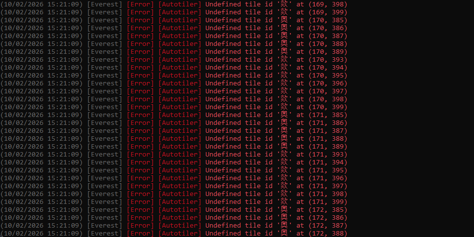

# 更好的调试

作图的问题千奇百怪, 打开控制台可以看到 Everest / Helper 输出的调试信息, 这会方便我们排查问题

## 打开控制台

找到蔚蓝根目录下的 `everest-launch.txt` 文件, 在里面新加入一行 `--console`, 这样之后蔚蓝在启动的时候就会附带一个控制台窗口.



之后你就能在控制台里看到 Everest / Helper 输出的信息啦

<pre class="celeste-log"><code><span class="log-time">(10/02/2026 14:04:36)</span> <span class="log-source">[Everest]</span> <span class="log-info">[Info]</span> <span class="log-module">[GameHelper]</span> Camera Entity Target Trigger found entity Celeste.TheoCrystal</code></pre>

### 查看更多的信息

> 更多配置请看 [Command Line Arguments](https://github.com/EverestAPI/Resources/wiki/Command-Line-Arguments)

你可以在 `--console` 下面一行加上 `--loglevel debug` 以查看更多详细信息, 当然这同时也意味着更多的冗余垃圾信息

<a id="lua"></a>

## [Lua Cutscenes](./lua/lua_cutscene.md)

如果你写的 lua 有语法错误, 对应的报错信息也会显示在控制台中, 这时你就可以自己排查或者问 AI 之类的了

比如如果我们在代码中忘记写 `level = getLevel()` 拿到 level, 那么后面就会因为拿不到 level 而报错



## [Tile 配置](./xml/tilesets.md)缺失

比如我们先在 `ForegroundTiles.xml` 写上我们的自定义砖块

```xml

<Data>
    <!-- ... 前面的配置... -->
    <Tileset id="奥" copy="z" path="awa"/>
    <Tileset id="欻" copy="z" path="qwq"/>
</Data>

```

如果后续因为不小心弄乱了 `ForegroundTiles.xml`, 自己的配置丢失或者出现错误之类的, 可能导致游戏明明记得数据里有你设置的砖对应的 `id`, 但是游戏就是无法通过 `ForegroundTiles.xml`
找到对应的贴图, 就会警告




## 没开 Helper

有的时候你捣鼓了半天实体发现没有效果的本质有没有可能是你压根没开 Helper, 所以游戏也会将加载失败的实体输出出来

<pre class="celeste-log"><code><span class="log-time">(10/02/2026 15:23:59)</span> <span class="log-source">[Everest]</span> <span class="log-warning">[Warn]</span> <span class="log-module">[LoadLevel]</span> Failed loading entity MaxHelpingHand/OneWayCameraTrigger. Room: CameraTutorial Position: {X:208 Y:1336}
<span class="log-time">(10/02/2026 15:23:59)</span> <span class="log-source">[Everest]</span> <span class="log-warning">[Warn]</span> <span class="log-module">[LoadLevel]</span> Failed loading entity MaxHelpingHand/OneWayCameraTrigger. Room: CameraTutorial Position: {X:1008 Y:712}
<span class="log-time">(10/02/2026 15:23:59)</span> <span class="log-source">[Everest]</span> <span class="log-warning">[Warn]</span> <span class="log-module">[LoadLevel]</span> Failed loading entity Sardine7/SmoothieCameraTargetTrigger. Room: CameraTutorial Position: {X:632 Y:1576}
<span class="log-time">(10/02/2026 15:23:59)</span> <span class="log-source">[Everest]</span> <span class="log-warning">[Warn]</span> <span class="log-module">[LoadLevel]</span> Failed loading entity Sardine7/SmoothieCameraTargetTrigger. Room: CameraTutorial Position: {X:160 Y:1624}
<span class="log-time">(10/02/2026 15:23:59)</span> <span class="log-source">[Everest]</span> <span class="log-warning">[Warn]</span> <span class="log-module">[LoadLevel]</span> Failed loading entity luaCutscenes/luaCutsceneTrigger. Room: CameraTutorial Position: {X:840 Y:304}
</code></pre>

当然更多情况下你只需要按 `~` 或是用 [Celeste TAS](https://gamebanana.com/tools/6715) 按下 ++ctrl+b++ 打开碰撞箱显示, 看看碰撞箱就知道实体加载了没有
