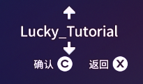
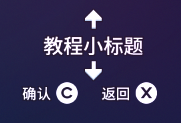
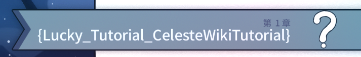
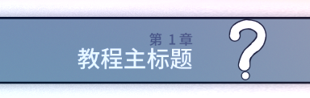
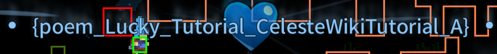
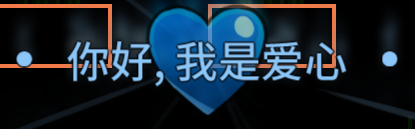
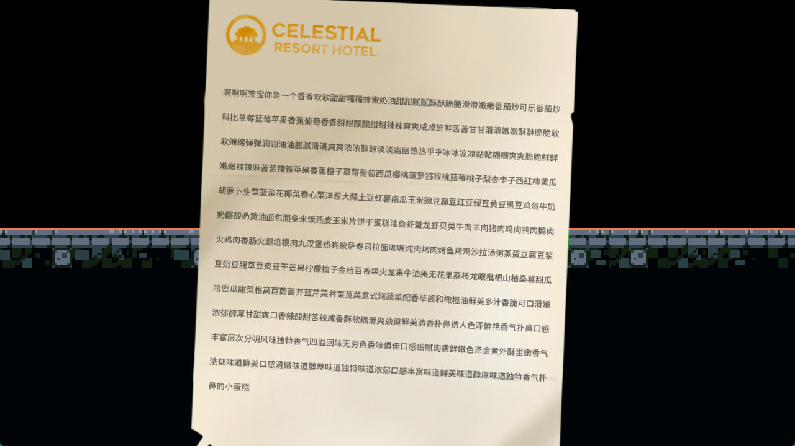
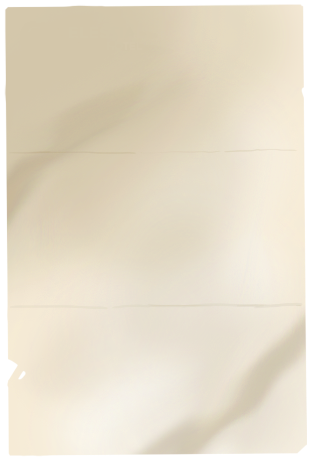
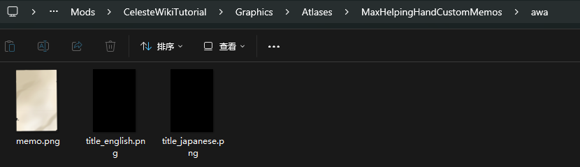
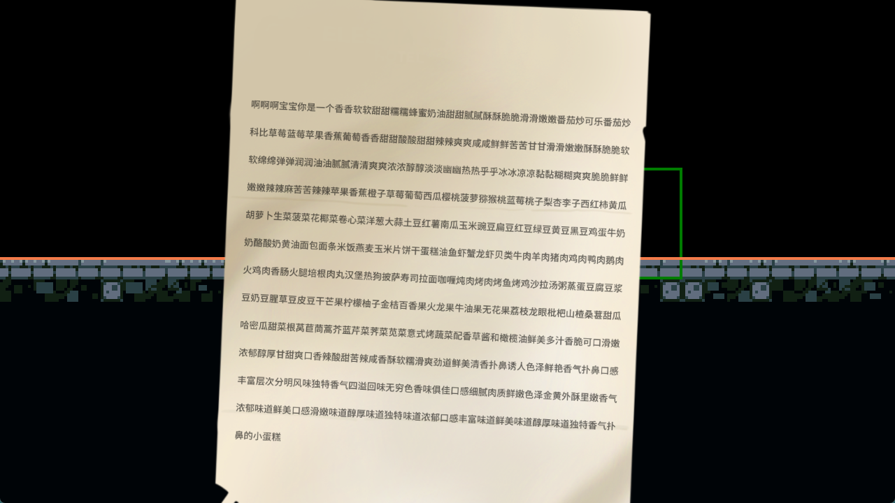

## 引用

* [Dialog 教程 by Saplonily](https://saplonily.top/celeste_modding_tutorial/mapping/room_meta_text/#_7){:target="_blank"}
* [Dialog 教程 by 底龙](https://uddrg.notion.site/UnderDragon-s-Partial-Wiki-2737f4f27e63808582b3f0689163d8f9?p=2737f4f27e6380419593c9bedbe01795&pm=s){:target="_blank"}
* [B站 Wiki 的 Dialog 教程](https://wiki.biligame.com/celeste/%E6%96%87%E6%9C%AC%E6%95%99%E7%A8%8B){:target="_blank"}
* [Everest Wiki 的 Dialog 教程](https://github.com/EverestAPI/Resources/wiki/Adding-Custom-Dialogue){:target="_blank"}
* [[Celeste蔚蓝]作图教程第四章-背景, 元数据, 文本教程](https://www.bilibili.com/video/BV1Av4y1D7a8/?t=158)

## 什么是 Dialog

顾名思义就是游戏中一切跟文本有关的东西, [主要包括](https://wiki.biligame.com/celeste/%E6%96%87%E6%9C%AC%E6%95%99%E7%A8%8B#%E6%96%87%E6%9C%AC%E4%BD%BF%E7%94%A8){:target="_blank"}

* 对话(人物对话文本)
* UI(例如开始界面的文本, Mod选项界面的文本, 暂停界面的文本, 选关界面的文本, 明信片等)

这么多文字必定要存放在某个地方, 不同的语言也要做不同的区分, 那么官方的做法是什么呢

官方的做法是一种语言对应一个特定的`.txt`, 一段 `文本` 对应 `.txt` 中唯一的`id`, 叫做**键**, 或者说`key`, 形如 `test_key=文本`, 这样游戏就可以根据你的语言使用对应的 `test_key`
来获得对应的 `文本`

我们以 `Celeste/Content/Dialog/Simplified Chinese.txt` 下的 `Main Menu` 部分为例(找不到可以`Ctrl + F`搜索), 看看这是不是和你游戏开始界面上显示的一样呢(左边是`key`, 右边是
`对应语言的文本`)

 ```ini title="Simplified Chinese.txt"
  # Main Menu
  MENU_DEBUG=		~调试~
  MENU_BEGIN=		攀登
  MENU_PICO8=		PICO-8
  MENU_OPTIONS=	    选项
  MENU_CREDITS=	    主创人员
  MENU_EXIT=		退出
 ```

## 编写 Dialog

知道原理后我们就可以添加新的`key`来生成我们需要的文本, 甚至是替换官图文本(同名的key后加载的的会覆盖先加载的, 如 [FunnyDialog](https://www.bilibili.com/video/BV1Pz421i7SZ){:target="_blank"}), 在使用上我们只需要写好对话, 在地图里放个触发对话的Trigger, 然后填入对应的
`key` 就好了

首先在你Mod根目录下创建一个Dialog**文件夹**形成类似`Celeste/Mods/你的mod名/Dialog/`的目录结构

接着你就可以创建[各种语言的`.txt`](https://github.com/EverestAPI/Resources/wiki/Adding-Custom-Dialogue#setting-up-the-dialogue-file){:target="_blank"}
文件来做不同语言的翻译和添加文本的工作, 但一般加英文 `English.txt` (必备)跟中文 `Simplified Chinese.txt` 就够了

写好对应的文本后在对应Trigger中填入对应`id/key`即可

### 常用对话 Trigger

如果要添加自定义文本键名一定要长~, 不然很可能和别人重了出问题, 一般建议是`作者名_图名_键名`

* Minitextbox Trigger(trigger)
* Everest Dialog Cutscene(trigger)
* Custom NPC(entity)

### 注意事项

* `=`左边不要有空格


## 常用部分

推荐下载 [VSCode](https://code.visualstudio.com/){:target="_blank"} 并安装 `Celeste Dialog Highlighter` 插件

* [文本汉化](https://saplonily.top/celeste_modding_tutorial/mapping/room_meta_text/#_8){:target="_blank"}: 图名, 吃心文本, 明信片, remix
* [文字效果](https://wiki.biligame.com/celeste/%E6%96%87%E6%9C%AC%E6%95%99%E7%A8%8B#%E6%96%87%E5%AD%97%E6%95%88%E6%9E%9C){:target="_blank"}: 抖动, 改色, 变速等
* [对话效果](https://wiki.biligame.com/celeste/%E6%96%87%E6%9C%AC%E6%95%99%E7%A8%8B#%E5%AF%B9%E8%AF%9D%E6%95%88%E6%9E%9C){:target="_blank"}: 翻转头像, 对话框置底, 引用等
* [人物表情](https://wiki.biligame.com/celeste/%E6%96%87%E6%9C%AC%E6%95%99%E7%A8%8B#%E4%BA%BA%E7%89%A9%E8%A1%A8%E6%83%85){:target="_blank"}(也可以在控制台输入`portraits`来查看)
* [添加对话emoji](https://github.com/EverestAPI/Resources/wiki/Adding-Custom-Dialogue#custom-emotes){:target="_blank"}
  把你的 emoji 图片放到 `Graphics/Atlases/Gui/emoji` 目录下(`.png`格式的), 对话对应文本为 `:你的图片相对路径(不带.png):`, 例如`:MyCelesteMod/shock:`
* [Lua Cutscene过场动画](lua/lua_cutscene.md): 即搭配对话的演出
* [入场明信片](https://www.bilibili.com/video/BV1Av4y1D7a8/?t=179){:target="_blank"}, [游戏中明信片](https://saplonily.top/celeste_mod_tutorial/extra_luacs/reference/#postcard){:target="_blank"}
* [替换人物头像](./xml/xml.md#portraitsxml)


### 修改自己地图名称和吃心文本

* [教程 by Everest](https://github.com/EverestAPI/Resources/wiki/map-metadata#map-name){:target="_blank"}
* [教程 by 电箱](https://www.bilibili.com/video/BV1Av4y1D7a8/?t=174){:target="_blank"}

最简单粗暴识别哪些东西是键名的方法就是那一串东西是不是被大括号`{}`或者中括号`[]`包着(因为蔚蓝会把无法识别的键用括号包着显示出来), 所以照抄就好了, 例如

{style="width: 200px; title="123"}
{style="width: 200px; title="123"}

{style="width: 350px; title="123"}
{style="width: 350px; title="123"}

{style="width: 450px; title="123"}
{style="width: 300px; title="123"}

```ini title="Simplified Chinese.txt"
Lucky_Tutorial=教程小标题
Lucky_Tutorial_CelesteWikiTutorial=教程主标题
poem_Lucky_Tutorial_CelesteWikiTutorial_A=你好, 我是爱心
```

## 常用工具

* [Dialog 图形化界面编辑工具 by Saplonily]()(群文件, 施工ing)
* [字库生成器](https://maddie480.ovh/celeste/font-generator){:target="_blank"}

## FAQ

### [为什么我文本缺字了](https://github.com/EverestAPI/Resources/wiki/Adding-Custom-Dialogue#custom-font-loading){:target="_blank"}

因为蔚蓝字库里没有, 请自己按[示例](https://www.bilibili.com/video/BV1A14y1W7hr){:target="_blank"}生成([字库生成网站](https://maddie480.ovh/celeste/font-generator){:target="_blank"}), 或者你直接依赖[
`Extended Chinese Font`](https://gamebanana.com/mods/53736){:target="_blank"}/[`Chinese Font Pack`](https://gamebanana.com/mods/493138){:target="_blank"}这个Mod, 大概率不会缺字, 但可能还是会缺

## 常用 Dialog 实体/Trigger

### MaxHelpingHand/CustomCh3Memo

{style="width: 800px; title="123"}

#### 制作无 Icon 版本

素材

{style="width: 300px; title="123"}

然后把官图素材从 `Graphics/Atlases/Memo` 粘贴到你的 Mod 下, 改个名, 之后在属性栏 `Paper Sprite Folder Name` 里填上文件夹名字即可(比如我这里的 `awa`), 还有就是别忘了把另两个素材给清空, 不然还是会有 icon

{style="width: 800px; title="123"}

成品

{style="width: 800px; title="123"}

