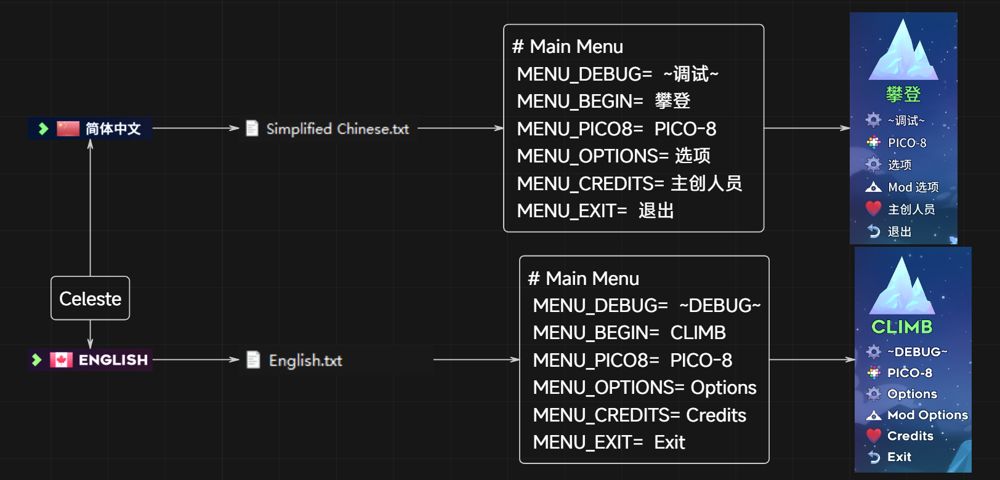
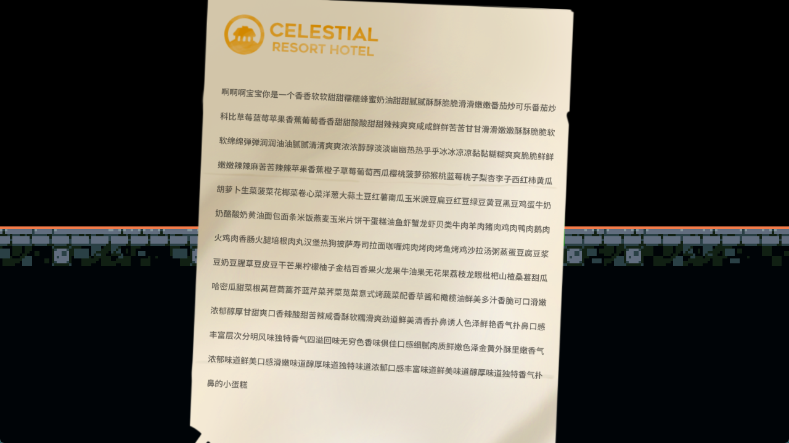
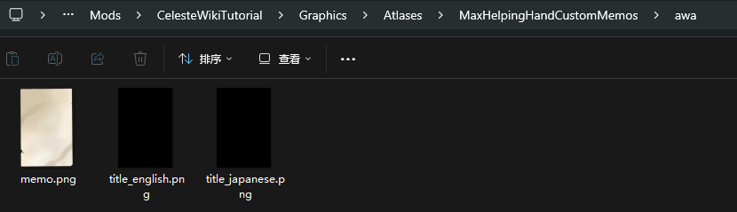
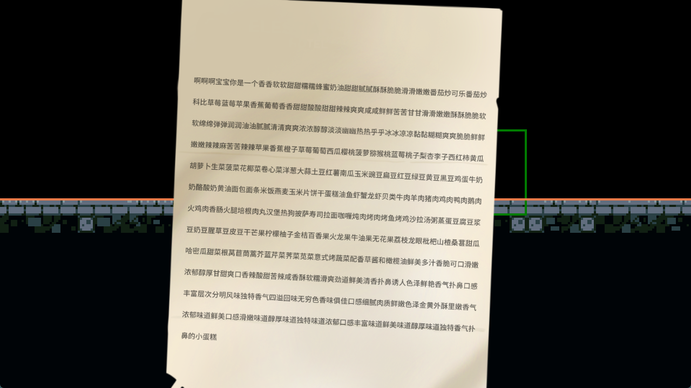

## 引用

* [Dialog 教程 by Saplonily](https://saplonily.top/celeste_modding_tutorial/mapping/room_meta_text/#_7){:target="_blank"}
* [Dialog 教程 by 底龙](https://uddrg.notion.site/UnderDragon-s-Partial-Wiki-2737f4f27e63808582b3f0689163d8f9?p=2737f4f27e6380419593c9bedbe01795&pm=s){:target="_blank"}
* [B站 Wiki 的 Dialog 教程](https://wiki.biligame.com/celeste/%E6%96%87%E6%9C%AC%E6%95%99%E7%A8%8B){:target="_blank"}
* [Everest Wiki 的 Dialog 教程](https://github.com/EverestAPI/Resources/wiki/Adding-Custom-Dialogue){:target="_blank"}
* [[Celeste蔚蓝]作图教程第四章-背景, 元数据, 文本教程](https://www.bilibili.com/video/BV1Av4y1D7a8/?t=158)

## 什么是 Dialog

顾名思义就是游戏中一切跟文本有关的东西, [主要包括](https://wiki.biligame.com/celeste/%E6%96%87%E6%9C%AC%E6%95%99%E7%A8%8B#%E6%96%87%E6%9C%AC%E4%BD%BF%E7%94%A8){:target="_blank"}

* 对话(人物对话文本)
* UI(例如开始界面的文本, Mod选项界面的文本, 暂停界面的文本, 选关界面的文本, 明信片等)

这么多文字必定要存放在某个地方, 不同的语言也要做不同的区分, 那么官方的做法是什么呢

官方的做法是一种语言对应一个特定的`.txt`, 一段 `文本` 对应 `.txt` 中唯一的 `Dialog ID`, 形如 `test_id=文本`, 
这样游戏就可以根据你的语言使用对应语言文件中的 `test_id` 来获得对应的 `文本`, 就像这样

{style="width: 1100px;"}

知道原理后我们就可以制作自己的文本库了, 一切用到了文本的地方都跟 `Dialog ID` 息息相关, 它常用于对话 Trigger 和基本翻译工作

## 创建 Dialog 相关文件

首先在你 Mod 根目录下创建一个 Dialog **文件夹**形成类似 `Celeste/Mods/你的mod名/Dialog/` 的目录结构

接着你就可以在该目录下创建[各种语言的`.txt`](https://github.com/EverestAPI/Resources/wiki/Adding-Custom-Dialogue#setting-up-the-dialogue-file){:target="_blank"}
文件来做不同语言的翻译和添加文本的工作, 但一般加英文 `English.txt` (必备)跟中文 `Simplified Chinese.txt` 就够了

### 注意事项

- Dialog ID 只能由英文、数字组成, 必要情况可以使用下划线, 不要使用空格
- 重复的 Dialog ID 后加载的会覆盖先加载的, 把这个特性当作技巧的话可以用来替换官图文本(同名的 Dialog ID 后加载的会覆盖先加载的,
  如 [FunnyDialog](https://www.bilibili.com/video/BV1Pz421i7SZ){:target="_blank"})
- Dialog ID 与等号之间不可以有空格, 但是等号和右侧文本之间可以有
- 如果你开着游戏新建了文件和文件夹可能导致热更失效, 这也是很多时候 Dialog ID 填对了但是没对话的原因, 建议按住 `Ctrl + F5` 快速重启游戏看看是不是🐖了

### Dialog 文本可换行

如果你把文本书写成类似于这样的形式:

```plaintext
ID1=
    键
    值能换
    行还
    算比
    较方便
ID2=写到一半允许
    突然
换
            行
```

蔚蓝在解析每一行时蔚蓝会丢弃掉左右出现的空白字符(也就是空格), 所以不必担心有空白字符混进去, 但是换行会最终包括在解析结果内, 
因此对于类似于原版 Core Message 这样的实体, 它默认情况只加载一行文本, 
如果你在 Core Message 的 Dialog ID 内填入上面的 `ID2` , 在游戏内得到的结果很有可能就是`写到一半允许`

## [本地化/翻译](./localization.md)

至此, 你已经知道怎么为地图保存所需要的文本, 以及实体中所谓的 Dialog ID 究竟是什么了, 
那么接下来我们就来讲一下 Dialog ID 最基础的用法之一, 即[文本本地化](./localization.md)


## [基本对话](talk.md)

学好了本地化, 这里我们再来讲讲[游戏内对话](talk.md)

## 常用部分

推荐下载 [VSCode](https://code.visualstudio.com/){:target="_blank"} 并安装 **Celeste Dialog Highlighter** 插件

* [文本汉化](https://saplonily.top/celeste_modding_tutorial/mapping/room_meta_text/#_8){:target="_blank"}: 图名, 吃心文本, 明信片, remix
* [文字效果](https://wiki.biligame.com/celeste/%E6%96%87%E6%9C%AC%E6%95%99%E7%A8%8B#%E6%96%87%E5%AD%97%E6%95%88%E6%9E%9C){:target="_blank"}: 抖动, 改色, 变速等
* [对话效果](https://wiki.biligame.com/celeste/%E6%96%87%E6%9C%AC%E6%95%99%E7%A8%8B#%E5%AF%B9%E8%AF%9D%E6%95%88%E6%9E%9C){:target="_blank"}: 翻转头像, 对话框置底, 引用等
* [人物表情](https://wiki.biligame.com/celeste/%E6%96%87%E6%9C%AC%E6%95%99%E7%A8%8B#%E4%BA%BA%E7%89%A9%E8%A1%A8%E6%83%85){:target="_blank"}(也可以在控制台输入 `portraits` 来查看)
* [添加对话 emoji](https://github.com/EverestAPI/Resources/wiki/Adding-Custom-Dialogue#custom-emotes){:target="_blank"}
  把你的 emoji 图片放到 `Graphics/Atlases/Gui/emoji` 目录下(`.png` 格式), 对话对应文本为 `:你的图片相对路径(不带.png):`, 例如`:MyCelesteMod/shock:`
* [Lua Cutscene过场动画](../lua/lua_cutscene.md): 即搭配对话的演出
* [入场明信片](https://www.bilibili.com/video/BV1Av4y1D7a8/?t=179){:target="_blank"},
  [游戏中明信片](https://saplonily.top/celeste_mod_tutorial/extra_luacs/reference/#postcard){:target="_blank"}
* [替换人物头像](../xml/portraits_xml.md)


## 常用工具

* [Dialog 图形化界面编辑工具 by Saplonily]()(群文件, 施工ing)
* [字库生成器](https://maddie480.ovh/celeste/font-generator){:target="_blank"}

## FAQ

### [为什么我文本缺字了](https://github.com/EverestAPI/Resources/wiki/Adding-Custom-Dialogue#custom-font-loading){:target="_blank"}

因为蔚蓝字库里没有,
请自己按[示例](https://www.bilibili.com/video/BV1A14y1W7hr){:target="_blank"}生成([字库生成网站](https://maddie480.ovh/celeste/font-generator){:target="_blank"}),
或者你直接依赖 [`Extended Chinese Font`](https://gamebanana.com/mods/53736){:target="_blank"}/[`Chinese Font Pack`](https://gamebanana.com/mods/493138){:target="_blank"}这个Mod,
大概率不会缺字(~~虽然可能还是会缺~~)

## 常用 Dialog 实体/Trigger

### MaxHelpingHand/CustomCh3Memo

{style="width: 800px; title="123"}

#### 制作无 Icon 版本

素材

{style="width: 300px; title="123"}

然后把官图素材从 `Graphics/Atlases/Memo` 粘贴到你的 Mod 下, 改个名, 之后在属性栏 `Paper Sprite Folder Name` 里填上文件夹名字即可(比如我这里的 `awa`), 还有就是别忘了把另两个素材给清空,
不然还是会有 icon

{style="width: 800px; title="123"}

成品

{style="width: 800px; title="123"}

