参考

* [Flag 科普 by 电箱](https://www.bilibili.com/video/BV1p44y1S79A)
* [常用 Trigger by Breaker-K](https://www.bilibili.com/video/BV1eZW5zVE4t/?t=2672)

## 什么是 Flag

Flag 是一种表示有和无, 开和关状态的东西, 我们可以切换它的状态

<label class="flag-toggle">
    <input type="checkbox">
    
    🚩
</label>

可以给 Flag 赋予一个名字

<label class="flag-toggle">
    <input type="checkbox">
    
    🚩: 这是一个 Flag
</label>

可以设置很多的 Flag

<label class="flag-toggle">
    <input type="checkbox">
    
    🚩: 这是一个 Flag
</label>

<label class="flag-toggle">
    <input type="checkbox" checked>
    
    🚩: 这又是一个 Flag
</label>

<label class="flag-toggle">
    <input type="checkbox">
    
    🚩: flagA
</label>

<label class="flag-toggle">
    <input type="checkbox" checked>
    
    🚩: flagB
</label>

这样游戏就可以根据**某个 Flag 是否启用**表现出不同的行为了!

> 对于 Flag 的使用每个人有自己的叫法, 比如启用 Flag, 添加 Flag, 生成 Flag, 设置 Flag 为真, 删除 Flag, 禁用 Flag, 销毁 Flag, 设置 Flag 为假, 
> 但不管怎么称呼 Flag, 都不妨碍 Flag 只能表示两种状态, 且这两种状态在逻辑上互斥

以使用 Flag 控制运动的硬币门 `Flag Switch Gate (Block) [Maddie's Helping Hand]` 为例

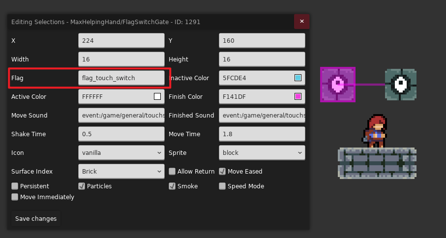

当该硬币门检测到对应 Flag 时, 比如这里的 `flag_touch_switch`

<label class="flag-toggle">
    <input type="checkbox" checked>
    
    🚩: flag_touch_switch Flag
</label>

硬币门就会启用

> 要方便的查看 Flag 的启用状态可以使用 [Mappings Utils](../useful_helpers/mapping_utils.md#flags)

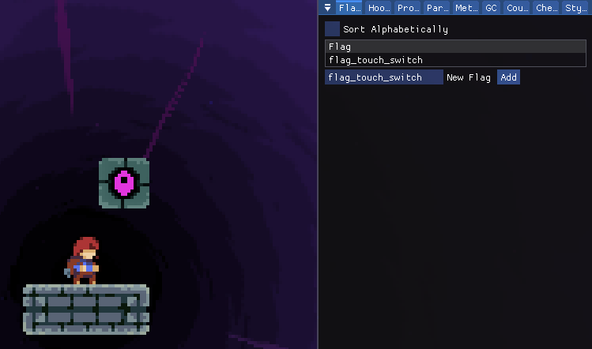

### 优点

Flag 是操控/联动所有实体的关键组成部分, 只要对应实体开放了通过 Flag 控制的功能, 那么你就能用 Flag 做出各种有意思的效果

### 单局持久化

当启用 Flag 后, Flag 会在你**保存并退出**游戏后依然存在, 只有当你**重新开始章节**或是**返回地图**后才会被清除

换句话说, Flag 会在单局游戏内保持持久化, 直到玩家重新开启了一段故事

#### 全局 Flag

如果你想要让 Flag 真真正正的永远的留在玩家的电脑上, 可以使用一些 Helper 提供的功能, 比如使用 `Flag Trigger [ChroniaHelper]` 中提供的 `Global` 选项

这样你就能实现一些跨时空的效果, 比如

* 让玩家在游玩二周目/三周目的过程中感受到游戏内的细节变化
* 让玩家在游玩你的第一张图后留下一个 Flag, 然后在第二张图里判断玩家是否游玩过你的第一张图, 以表示感谢玩家对你的支持之类的
 
## 常用 Flag Trigger

### `Flag [Everest]`

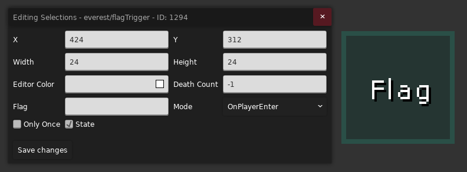

最最最朴实无华的 Flag Trigger, 如果你的需求非常简单, 那么用这个就可以了

* `Flag`: 你要作用的 Flag 对应的名字
* `State`: 你是要启用该 Flag 还是禁用
* `Only Once`: 是否在触发设置后销毁自己, 还是说可以多次使用
* `Death Count`: 只有当你在当前房间的死亡数等于这个数字时, 该 Trigger 才可以被触发, `-1` 表示该选项不起作用, 也就是该 Trigger 的触发跟死亡数无关  
* `Mode`: 
    * `OnPlayerEnter`: 在玩家进入 Trigger 的时候触发 
    * `OnPlayerLeave`: 在玩家离开 Trigger 的时候触发 
    * `OnLevelStart`: 在房间重新加载的时候触发, 一般指**玩家切板, 死亡重生**的时候 

### `Flag Trigger [ChroniaHelper]`

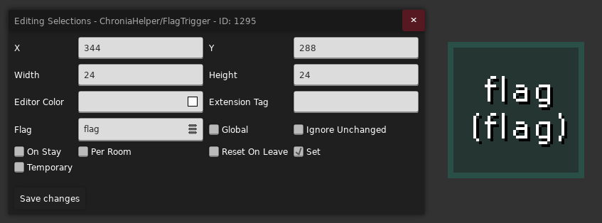

兼顾实用和简洁的 `Flag Trigger`

* `Flag`: 你要设置的 Flag 对应的名字, 可以一次性设置多个 Flag, 用逗号隔开, 如果在 Flag 名字前加上 `!`, 则表示反转这个 Flag 的状态
* `Set`: 你是要启用上述 Flag 组还是禁用, 比如启用 `Set`, 那么 `Flag1, !Flag2` 就对应启用 `Flag1`, 禁用 `Flag2`, 反之就是禁用 `Flag1`, 启用 `Flag2`
* `Temporary`: 表示上述设置的 Flag 是否是**暂时的**, 如果是, 那么在你死亡后上述所有 Flag 都会被禁用
* `Per Room`: 表示上述设置的 Flag 是否是**当前房间内暂时的**, 如果是, 那么在你复活后或是切板时, 上述所有 Flag 都会被禁用
* `Global`: 表示该 Flag 是一个全局 Flag 还是一个普通 Flag
* `Revert On Leave`: 是否在你离开该 Trigger 后反转你设置的 Flag
* `Ignore Unchanged`: 如果你设置的 Flag 并未对场上已存在的 Flag 造成影响, 比如场上已经有了 `Flag1`, 但是你是在当前 Trigger 中又要设置一遍, 那么这个 Flag 就会被忽略, 这样 `Temporary` 之类的选项就不会对该 Flag 造成影响了
* `On Stay`: 正常情况下你触碰 Trigger 后才会尝试设置 Flag, 该选项表示是否在 Trigger 内的时候也尝试设置 Flag

### `Flag If Flag [Flaglines And Such]`

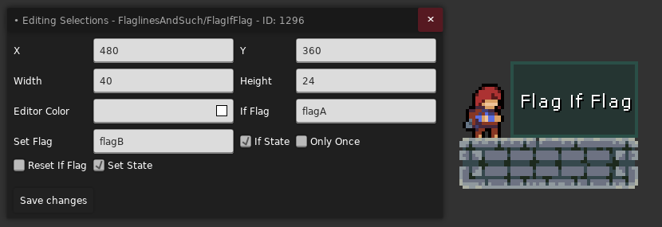

带条件的 `Flag Trigger`, 表示在 `Flag A` 启用/禁用的情况下才会启用/禁用 `Flag B`

适用于有先后顺序的场景, 比如先经过 A 区域再经过 B 区域才会触发某个东西, 你就可以在 A 区域设置一个普通 `Flag Trigger`, 在 B 区域设置一个 `Flag If Flag`

* `If Flag`: 条件 Flag, 搭配 `If State` 使用, 表示以 `If Flag` 启用还是禁用作为前提条件 
* `Set Flag`: 设置 Flag, 搭配 `Set State` 使用, 表示当前提条件符合的情况下, 我们是该禁用还是启用 `Set Flag`
* `Reset If Flag`: 表示成功设置 `Set Flag` 后, 是否将 `If Flag` 设置为**非 `If State`**, 这样 `If Flag` 就不容易残留了
* `Only Once`: 是否在触发设置后销毁自己, 还是说可以多次使用

### `Flag Array Trigger [ChroniaHelper]`

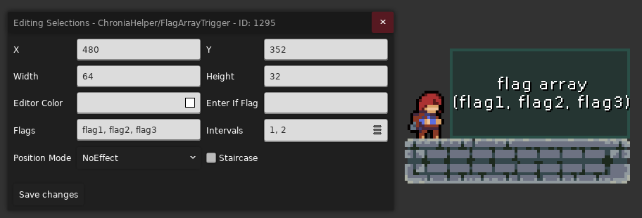

> 此 Trigger 在暂停情况下也会运行

根据时间间隔/玩家位置, 按序触发 Flag

* `Flag`: 你要设置的 Flag 对应的名字, 可以一次性设置多个 Flag, 用逗号隔开
* `Intervals`: 表示经过多少秒后触发下一个 Flag, 比如图中的例子就是进入 Trigger 时先把上述 Flag 全部禁用, 然后启用 `Flag1`, 一秒后启用 `Flag2`, 再过两秒后启用 `Flag3`
* `Enter If Flag`: 只有当该 Flag 存在, 上述操作才能生效, 留空表示该项不起作用
* `Staircase`: 默认情况下设置完下一个 Flag 后会禁用上一个 Flag, 勾选此选项可以保留前方已经设置过的 Flag
* `Position Mode`: `NoEffect` 表示按 `Intervals` 时间间隔触发 Flag, 其他模式表示根据玩家位置设置 Flag

### `Flag Random Trigger [ChroniaHelper]`

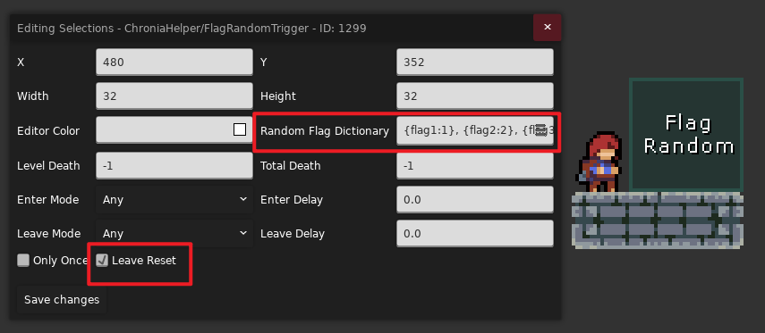

随机触发 Flag

* `Random Flag Dictionary`: 你要设置的 Flag 对应的名字和概率权重, 用大括号包裹, 逗号分隔, 比如上述例子的 `{flag1:1}, {flag2:2}, {flag3:3}` 表示每次进入 Trigger 时分别有 `1/6, 2/6, 3/6` 的概率触发对应 Flag
* `Leave Reset`: 是否在离开 Trigger 后移除触发的 Flag 

### `Flag List Trigger [ChroniaHelper]`

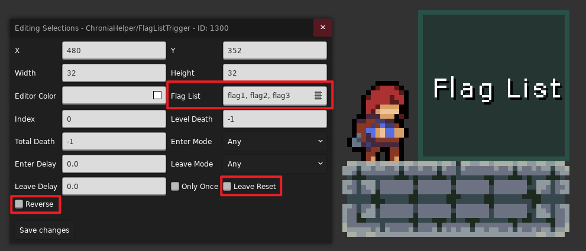

按顺序触发 Flag

* `Flag List`: 需要依次触发的 Flag 组, 如 `flag1, flag2, flag3`, 这样当你每次触碰到 Trigger 时就会按序启用下一个 Flag 并禁用上一个 Flag
* `Leave Reset`: 是否在离开 Trigger 后移除最新触发的 Flag
* `Reverse`: 倒着触发 `Flag List`

### `Flag Serial Trigger [ChroniaHelper]`

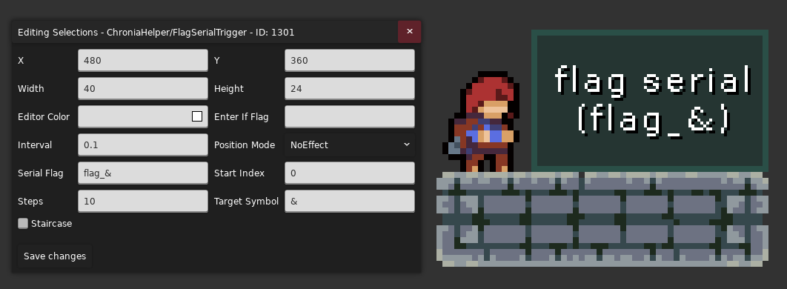

> 此 Trigger 在暂停情况下也会运行

根据时间间隔/玩家位置, 按序触发格式相似的 Flag, 类似 [`Flag Array Trigger`](#flag_array_trigger)

* `Serial Flag`: 你要设置的 Flag 对应的模板名字, 后续游戏会将该名字中的 `Target Symbol` 部分, 即 `&`, 替换为 `Start Index ~ Start Index + Steps - 1`, 对于上方的例子就是每过 `Interval` 秒设置下一个 Flag, 从 `flag_0` 一直设置到 `flag_9`
* `Enter If Flag`: 只有当该 Flag 存在, 上述操作才能生效, 留空表示该项不起作用
* `Staircase`: 默认情况下设置完下一个 Flag 后会禁用上一个 Flag, 勾选此选项可以保留前方已经设置过的 Flag
* `Position Mode`: `NoEffect` 表示按 `Interval` 时间间隔触发 Flag, 其他模式表示根据玩家位置设置 Flag

### `Flag Dictionary Trigger [ChroniaHelper]`

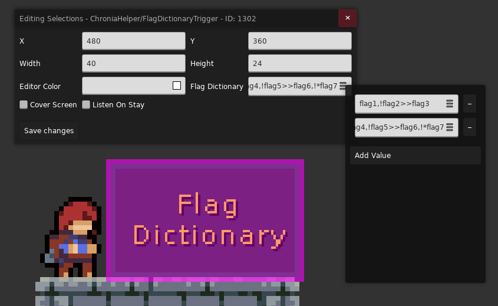

相当于更高级的 [`Flag If Flag`](#flag_if_flag)

* `Flag Dictionary`: 表示在什么 Flag 条件下输出什么 Flag, 比如 `flag1,!flag2>>flag3` 表示当触碰到 Trigger 的时候如果 `flag1` 存在且 `flag2` 不存在, 则输出 `flag3`, 如果有多组则用分号 `;` 分隔 (如果 Flag 名字带 `*` 则表示这是一个全局 Flag) 
* `Listen On Stay`: 默认情况下只有触碰到 Trigger 才会进行一次输出, 勾选此项后表示在 Trigger 内部也会一直进行逻辑判断
* `Cover Screen`: 相当于让 Trigger 充满整个房间

### `Logic Flag Trigger [LuckyHelper]`

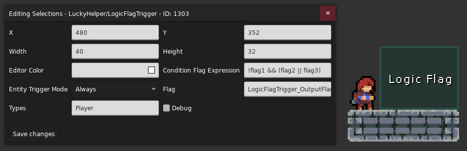

逻辑门 Flag Trigger, 条件为真时启用对应 Flag, 反之禁用

* `Condition Flag Expression`: 条件逻辑表达式, 当条件成立时输出 `Flag`, 比如 `!flag1 && (flag2 || flag3)` 表示当 `flag1` 禁用且 `flag2` 或者 `flag3` 启用的时候启用 `LogicFlagTrigger_OutputFlag`, 反之禁用
* `Types`: 填入[实体的 Type](../loenn/faq.md#type), 逗号分隔, 表示该 Trigger 会交互的对象, 默认情况下跟普通 Trigger 一样只跟玩家作用
* `Entity Trigger Mode`: 表示 Trigger 是在对象进入, 停留, 离开的时候工作, 还是一直工作 

## 常用 Flag 实体

### `Set Flag Logic Controller [ChroniaHelper]`

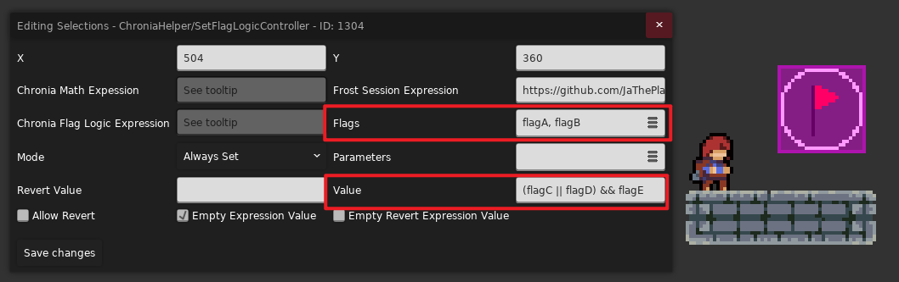

逻辑门 Flag 控制器, 条件为真时启用对应 Flag, 反之禁用

* `Value`: 条件逻辑表达式, 当条件成立时输出 `Flags`, 比如 `(flagC || flagD) && flagE` 表示当 `flagE` 启用且 `flagC` 或者 `flagD` 启用的时候启用 `flagA` 和 `flagB`, 反之禁用
* `Mode`: 控制器触发时机, 这里是 `Always Set` 表示一直设置, 这样就是逻辑门效果了

### `Set Flag On Respawn Controller [Maddie's Helping Hand]`

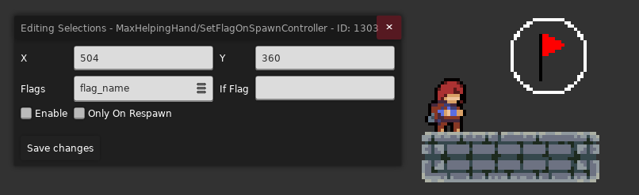

在玩家重生/切板的时候设置 Flag

* `Flags`: 你要设置的 Flag 对应的名字, 多个名字用逗号分隔
* `Enable`: 你是要启用上述的所有 Flag, 还是禁用
* `Only On Respawn`: 启用就是玩家在重生的时候才会生效, 反之重生和切板都会生效
* `If Flag`: 只有当该 Flag 启用时该 Controller 才会生效, 如果此项留空则不起作用, 即不需要以 Flag 为前提条件
