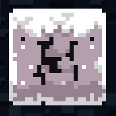

## 资源

[官图素材资源](../mods/resources.md)

## 界面

[b wiki](https://wiki.biligame.com/celeste/%E5%85%83%E6%95%B0%E6%8D%AE#.meta.yaml_%E6%96%87%E4%BB%B6)

### 开始

* [自定义开始界面(包括山体建模等) by Everest](https://github.com/EverestAPI/Resources/wiki/Overworld-Customisation)
* [自定义开始界面 by 电箱](https://www.bilibili.com/video/BV1Av4y1D7a8/?t=154)

### 结束

* [自定义结束界面 by Everest](https://github.com/EverestAPI/Resources/wiki/Chapter-Complete-Screen)
* [自定义结束界面 by 电箱](https://www.bilibili.com/video/BV1Av4y1D7a8/?t=154)
* 使用`XaphanHelper/CustomEndScreenController`, 放在你结束关卡的房间里即可(Myn力推)

## 自制皮肤

* [模板](https://kuksattu.github.io/celeste/skinmod-template/)
* [蔚蓝科技之自制皮肤mod教程](https://www.bilibili.com/video/BV1Uv4y1K751)
* [蔚蓝皮肤制作教程-星夜祈梦](https://www.bilibili.com/video/BV1YpYueREPt)
    * [文字版](../assets/mappings/graphics/skin/蔚蓝皮肤制作教程-星夜祈梦.pdf)

## Decal

* [Decal](https://wiki.biligame.com/celeste/Decal)
* [春暮Q 中翻 - Donker's Deco Guide](../assets/mappings/graphics/decals/中翻%20-%20Donker's%20Deco%20Guide.docx)
* [废话deco教程]()(群文件里下)
* [jpyx258的deco轮椅]()(群文件里下)

## DecalRegistry

* [摘自b站 Wiki(描述不详细, 但很全, 含helper自定义的decalregistry内容)](https://wiki.biligame.com/celeste/DecalRegistry)
* [celeste地图制作指南(装饰, decals)(适合新手, 有配图)](https://www.bilibili.com/read/cv18389517/)
* [摘自Everest Wiki(描述详细, 且提供了自定义decalregistry的教程)](https://github.com/EverestAPI/Resources/wiki/Decal-Registry)

## 替换官图素材

> ￥: 会找custom实体直接改贴图能改80%, 会改xml能改95%, 会code自己写实体能改100%

* [正常替换](https://github.com/EverestAPI/Resources/wiki/Replacing-A-Texture)
* [高级替换](https://github.com/EverestAPI/Resources/wiki/Reskinning-Entities)
* [[Celeste蔚蓝]作图教程第五章B面-自定义对话人物与实体贴图修改(xml进阶篇)](https://www.bilibili.com/video/BV1cP4y1m7B2)
* 冬菜教程

### 暴力替换

前面我们已经说过Everest在合并Mod和官图资源时同路径文件会发生覆盖, 那么也就是说如果我们按照官图素材路径放我们的图片, 那么自然我们的图片能覆盖官图的, 理论上所有素材都可以换(不过有的画面是程序生成的, 还是写code罢), 唯一不好的点就是"这会污染其他Mod, 因为这么做的影响是全局的" 

#### 官图素材路径

可参照`../Steam/steamapps/common/Celeste/Content/Graphics/Atlases`这个路径, 具体内容参照[解包素材](../mods/resources.md), 这里的`Content`相当于我们Mod的根目录

### 使用自定义实体

一般就是那些以Custom Reskinable之类的词为前缀的扩展实体, 显然Helper作者都帮我们写好了, 我们把路径填上直接用就好了([不知道路径填什么](./loenn/faq.md#_9))

### 修改`Sprites.xml`

你可能需要先了解一下什么是[XML](https://saplonily.top/celeste_mod_tutorial/other/xml-speedrun/)

`Sprites.xml`是蔚蓝的一个管理所有动画的配置文件

```xml title="Sprites.xml"
<Sprites>
  <player path="characters/player/" start="idle">
    ...
  </player>
</Sprites>
```

对于如上的内容, 蔚蓝会通过player这个标签加载path(相对于`Gameplay文件夹`)中的素材, 再根据`...`中的配置来组合出游戏中的一个动画对象, 听不懂也没关系, 既然你已经学会了"覆盖大法", 如果你要修改player的配置, 显然你可以自己创建一个`Sprites.xml`, 然后把下面这部分内容粘进去, 然后把path改成你自己的, 之后在Loenn`Map -> Metadata`中选择你的`Sprites.xml`即可,
这样它就会覆盖一部分官图的配置, 从而达到替换素材的效果, 而且这方法不会影响别人的图(不过有的实体不一定会有对应配置, 视情况而定)

### 自己写code

我又幻想了, 幻想自己写出让众人啧啧称赞的Helper, 并且在香蕉网上收获上千Like...  


## 自定义瓦片集

* [摘自电箱教程](https://www.bilibili.com/video/BV1kV4y137Mn/?spm_id_from=333.788&vd_source=217bacbee37820b5bf3ed2f4fb8f6c94)
* [摘自Everest Wiki](https://github.com/EverestAPI/Resources/wiki/Custom-Tilesets)
* [瓦片集格式参考](https://github.com/EverestAPI/Resources/wiki/Tileset-Format-Reference)
* [motonine的自制tiles教程](../assets/mappings/graphics/tileset/自制tiles教程%5B23.12.17更新%20作者motonine%5D.txt)
* [底龙的自定义tiles教程](https://www.bilibili.com/video/BV1Eu4y1L78Y)

**瓦片**, 即tileset, 分为前景砖和背景砖, 这里我们主要讨论前景砖 

我们游戏中的砖主要由一块块 `8px * 8px` 大小的碰撞箱和贴图组成(后文将其称为一个**单元**)


当然如果我们把 CelesteTAS 的简化图形看开了, 碰撞箱看的更清楚


<figure markdown>
  {style="width: 150px; image-rendering: pixelated; title=123"}
  <figcaption>路径: Celeste\Graphics\Atlases\Gameplay\tilesets\cement.png</figcaption>
</figure>

我们以 cement tileset 为例, 我们会发现它正是由一个个 `8px * 8px` 单元的贴图块组成, 游戏里的砖的贴图正是从这里面**切**出来的

现在我们搞清楚了砖是什么, 素材从哪儿来, 现在该开始摆砖了, 但你可能开始头疼起来, 这么一种砖就有这么多个单元, 要一个个选吗, 不仅费事, 还容易选错,
所以这时我们就要指定一套**规则**, 比如看下面这个 `3px * 3px` 大小的自定义砖

{style="width: 150px; image-rendering: pixelated; title=123"}

* 如果我告诉中间的砖: 嘿, 兄弟, 你要是看见周围都有砖的话, 你就把自己的的贴图改成素材第 i 行, 第 j 列单元对应的素材
* 如果我告诉正右边的砖: 嘿, 兄弟, 你要是看见上下都有砖, 而且左边也有砖的话, 你就把自己的的贴图改成素材第 m 行, 第 n 列单元对应的素材

如果我们把所有的砖通知一遍, 那是不是就不用我们自己一个个挑素材啦, 而这正是 `ForegroundTiles.xml` 和 Loenn(Celeste 也干了) 在做的事, `ForegroundTiles.xml` 制定了一套规则, 而 Loenn 使用这些规则告诉每个砖该如何绘制(所以如果我们要自定义砖的话, 我们要自己写`ForegroundTiles.xml`, 而且得在 Loenn 元数据里选)

下面我们来简单介绍一下`ForegroundTiles.xml` 中相对重要的格式(如果你还不知道什么是[XML](https://saplonily.top/celeste_mod_tutorial/other/xml-speedrun/))

更多属性请参考[Everest Wiki](https://github.com/EverestAPI/Resources/wiki/Tileset-Format-Reference)

* `id`: 嗯...就是类似身份证一样的东西, 唯一标识符, 对...你懂的吧...就..就是 id 啊...嗯...比如类比下你叫张三, 你的学号是 114, 那么你的 id 就是 114... id 不能重复你应该知道的吧...
* `path`: 指明了 tileset 对应的素材位置, 路径相对于`Gameplay/tilesets` 文件夹, 例如上面提到的 `cement` 对应的 `id` 就是 `cement` 
* `mask`: 也就是上文提到的**规则**, `x` 表示任意, `0` 表示无砖, `1` 表示有砖, 去掉 `-` 分三行排列刚好是个 `3 x 3` 的块, 如果填`padding`则表示最外层的里面一层(例如对于`4 x 4`的块, 它的`padding`在`3 x 3`位置), 如果填`center`, 则表示剩下的没有被考虑的所有情况(一般来说就是指中间的), 一个单元就是通过这样的规则来判断自己要选择什么贴图的  
* `tiles`: 对应素材的哪些单元(一个单元占`8px * 8px`的大小并且坐标从左上(0, 0)位置开始算, (1, 0)表示第二行第一列对应的单元格)  
* `ignores`: 需要忽略的 tileset 对应的 id, 被忽略后, 周围要是有那个 tileset, 则那个位置在当前 tileset 的 mask 中会被视为空气, 即 `0(无砖)` 
* `copy`: 需要拷贝配置(即内部的`set`节点)的 tileset 对应的 id, 这样我们就可以只写一个 template(模板) 然后复用了, 当然我们可以继续写`set`节点来覆盖拷贝过来的一部分配置  
* `sound`: Everest 添加的额外配置, 表示玩家踩上去什么声音, 写在`set`节点里, 如`<set ... sound="1"/>`

??? Sound对照表
    0. 无
    1. 沥青路（序章车后边的道路
    2. 车
    3. 土
    4. 雪
    5. 木头
    6. 桥
    7. 钢梁
    8. 砖
    9. traffic block
    10. (unused)
    11. 未启用时的果冻
    12. 启用时的果冻
    13. 山庄木头
    14. 山庄房顶
    15. 山庄移动板
    16. 山庄地窖砖
    17. 山庄衣物
    18. 山庄箱子
    19. 山庄书
    20. resort forcefield
    21. 山庄清理杂物开关
    22. 山庄电梯
    23. 山脊雪
    24. (unused)
    25. 枯草
    26. (unused)
    27. 山脊白块
    28. 缆车
    29. (unused)
    30. (unused)
    31. (unused)
    32. 玻璃
    33. 草
    34. (unused)
    35. 节奏块
    36. 核心冰块
    37. 核心岩石
    38. (unused)
    39. (unused)
    40. 故障块
    41. (unused)
    42. 网吧（凌波微步.ppt那个房子）
    43. 云
    44. 月亮块


```xml title="Celeste\Content\Graphics\ForegroundTiles.xml"
<Data>
  <Tileset id="z" path="template">
    <set mask="x0x-111-x1x" tiles="0,0;1,0;2,0;3,0"/>
    <set mask="x1x-111-x0x" tiles="0,1;1,1;2,1;3,1"/>
    <set mask="x1x-011-x1x" tiles="0,2;1,2;2,2;3,2"/>
    <set mask="x1x-110-x1x" tiles="0,3;1,3;2,3;3,3"/>

    ...

    <set mask="010-111-010" tiles="4,12"/>
    <set mask="110-111-011" tiles="4,13"/>
    <set mask="011-111-110" tiles="4,14"/>

    <set mask="padding" tiles="5,0;5,1;5,2;5,3;5,4;5,5;5,6;5,7;5,8;5,9;5,10;5,11"/>
    <set mask="center" tiles="5,12"/>
  </Tileset>
  <Tileset id="1" copy="z" path="dirt" ignores="g"/>
  <Tileset id="m" copy="z" path="lostlevels" ignores="n">
    <set mask="padding" tiles="5,0;5,1;5,2;5,3;5,4;5,5"/>
    <set mask="center" tiles="5,6;5,6;5,6;5,6;5,6;5,6;5,6;5,6;5,6;5,6;5,6;5,6;5,6;5,6;5,7;5,8;5,9;5,10;5,11;5,13;5,14;5,7;5,8;5,9;5,10;5,11;5,13;5,14;5,12"/>
  </Tileset>
</Data>
```

好了, 现在你已经完全懂了, 你可以

* 直接对原版素材改色, 然后把官图的`ForegroundTiles.xml` copy 一份, 在新的那份中添加一个自己的 Tileset节点, 之后在Loenn元数据里选择这个新的`xml`即可 
* 照着原版的 template 砖改 
* 自己写一个`ForegroundTiles.xml`
* 抄/借别人的`ForegroundTiles.xml`, 详情见[Everest Wiki](https://github.com/EverestAPI/Resources/wiki/Custom-Tilesets)
* 向群友要一份, 群友什么都有😋


### QA

#### 怎么设置存档点(章节)的插图

[看电箱教程](https://www.bilibili.com/video/BV1A14y1W7hr)或者冬菜教程

#### 怎样获取精美的美术素材

1. 自己画
2. 利用生成器自动生成
3. 在群“制图素材”文件夹里寻找素材。
4. 官图素材改色
5. [Itch.io](https://itch.io/game-assets)
6. [opengameart](https://opengameart.org/)

注：

1. 这些素材文件中有些是香蕉网的mod, 可直接取用而有些则要解压取用。可以通过celemod/Olympus搜索mod名区分, 搜不到=需解压。
2. 在解压取用的文件中, 如果有则请先阅读readme.txt/docx.了解格式和原作者的取用限制。并请严格按其规则执行。如果没有明确规定或只有“give a credit”, 请在地图明显处或香蕉网界面设置其为素材提供者。
