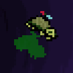
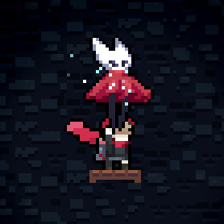
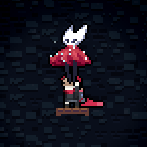
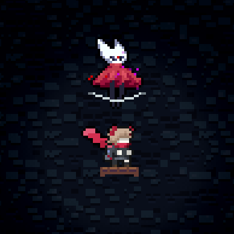

# [CharacterConfig](https://github.com/AAA1459/SkinModHelper/blob/release/docs/guide/skinconfig/CharacterConfig.md#characterconfigyaml)

## CharacterConfig.yaml

在人物皮肤贴图位置创建 `skinConfig` 文件夹, 并放入一个 `CharacterConfig.yaml` 文件, 可以用来配置人物相关的东西

```yaml
SilhouetteMode: [true/false]

LowStaminaFlashHair: [true/false]
LowStaminaFlashColor: [use six digit RGB hex code]

IdleColdOptions: [Lists with identifiers and weights]
IdleWarmOptions: [Lists with identifiers and weights]
IdleAnimationChance: [floats]

TrailsColor: [use six digit RGB hex code]
DeathParticleColor: [use six digit RGB hex code]

HoldableFacingFlipable: [true/false]

ParticleModify:
- < particleModifier >

ColorGradingAfterColored: [true/false]

EntityTweaks:
- < Tweaks >
```

以 Neuro 皮肤为例(加了点东西)

```yaml title="neuro-skinmod/Graphics/Atlases/Gameplay/Neuro_Skin/characters/player/Evil_Neuro/skinConfig/CharacterConfig.yaml"
SilhouetteMode: false
LowStaminaFlashColor: "ba3535"
LowStaminaFlashHair: true

IdleColdOptions:
  - A, 3
  - B, 5
  - C, 1

IdleWarmOptions:
  - A, 5
  - B, 3

IdleAnimationChance: 0.2

DeathParticleColor: "ff0000"
ColorGradingAfterColored: false
```

### SilhouetteMode

表示是否开启残影模式, 开启后全身的颜色偏向头发颜色, 而不是替换为头发颜色(要替换的话建议用前面提到的 **ColorGrades**)

### LowStaminaFlashColor

设置疲劳状态下的闪烁颜色

### LowStaminaFlashHair

表示疲劳状态下头发是否会跟着闪(原版只会人物自己闪而头发不闪), 默认为 false

### IdleColdOptions

在寒冷状态下(其实只要核心模式不是 `Hot` 就行), 我们可以为角色配置更多的 `idle` 动画, 并赋予一定的权重, 比如下方 ABC 对应于 `idleA`, `idleB`, `idleC`, 右边是对应的权重, 如果要加配置, 往下继续写即可

```yaml
IdleColdOptions:
- A, 3
- B, 5
- C, 1
```

### IdleColdOptions

在炎热状态下, 我们可以为配置角色更多的 `idle` 动画, 并赋予一定的权重, 配置方式同上

```yaml
IdleWarmOptions:
- A, 5
- B, 3
```

### IdleAnimationChance

每次循环播放完一次默认 `idle` 动画后, 游戏会有一定概率播放 `idleA`, `idleB` ..., 然后返回默认的 `idle` 动画(因为 `Sprites.xml` 里它们最终都会 `goto` 回 `idle`),
这个概率默认为 `0.2`, 即 `20%`, `IdleAnimationChance` 这个选项就是用来改这个概率的


### TrailsColor

填入 16 进制 RGB

用来设置除人物皮肤外的对象的残影轨迹颜色(人物的 Trail 上面已经有方法可以设置了), 比如 `bird`, `oshiro boss`, `seeker`, 你需要将 `skinConfig/CharacterConfig.yaml` 放到对应对象的贴图位置, 而不是人物皮肤位置

比如我们尝试修改 bird(Vedal) 的残影颜色为绿色

```yaml title="neuro-skinmod/Graphics/Atlases/Gameplay/Neuro_Skin/characters/bird/skinConfig/CharacterConfig.yaml"
TrailsColor: "00cc00"
```

<figure markdown>
  {style="width: 100px; image-rendering: pixelated; title=123"}
  <figcaption>绿了</figcaption>
</figure>

### DeathParticleColor

设置人物死亡时粒子效果(烟花)的颜色

### HoldableFacingFlipable

这里以[大黄蜂水母皮肤](https://gamebanana.com/mods/617490)为例, 我们可以使用该设置使一些可抓取物体的皮肤随其移动方向自动翻转

```yaml title="hornet_jellyfish/Graphics/Atlases/Gameplay/zbs/Hornet_jellyfish/objects/glider/skinConfig/CharacterConfig.yaml"
HoldableFacingFlipable: true
```

<figure markdown>
  {style="width: 200px; image-rendering: pixelated; title=123"}
  <figcaption>右</figcaption>
</figure>

<figure markdown>
  {style="width: 200px; image-rendering: pixelated; title=123"}
  <figcaption>左</figcaption>
</figure>

### ParticleModify

我们可以修改对应皮肤下对象释放的粒子的各种属性(~~如果你拥有一定的代码知识那就更方便了~~)

简单来说我们可以在 config 里配置我们自己的粒子属性 `ParticleModify`, 在里面指定要覆盖的粒子字段, SMH+ 会为我们做好覆盖工作, 比如我想要[大黄蜂水母](https://gamebanana.com/mods/617490)散发偏红/粉的粒子以适配大黄蜂和 Neuro 的配色,
我可以这么设置(更多设置请参考 [SMH+ 文档](https://github.com/AAA1459/SkinModHelper/blob/release/docs/guide/skinconfig/CharacterConfig.md#particlemodify))

```yaml title="hornet_jellyfish/Graphics/Atlases/Gameplay/zbs/Hornet_jellyfish/objects/glider/skinConfig/CharacterConfig.yaml"
ParticleModify:
- TargetFullName: Celeste.Glider::P_Glow    # 要覆盖的粒子字段, 格式为: 该类的完全限定名::字段

  Color: "cc0000"  # 要覆盖的粒子属性部分, 不填就不覆盖
  Color2: "cc00cc"

```

<figure markdown>
  {style="width: 200px; image-rendering: pixelated; title=123"}
</figure>


当然小白也是能改的, 这里提供一个相对通用的思路, 首先你得知道[粒子有哪些属性](https://github.com/TheCyndaquilDecompilers/Celeste_Decompiled/blob/main/Celeste/Monocle/ParticleType.cs#L11),
其次你要知道[粒子如何更新](https://github.com/TheCyndaquilDecompilers/Celeste_Decompiled/blob/main/Celeste/Monocle/Particle.cs), 然后找到使用了这个粒子的地方, 比如上面的[水母 Glider 的字段 P_Glow](https://github.com/TheCyndaquilDecompilers/Celeste_Decompiled/blob/main/Celeste/Glider.cs#L507),
然后我们得知道该[类](https://github.com/TheCyndaquilDecompilers/Celeste_Decompiled/blob/main/Celeste/Glider.cs#L10)对应的完全限定名(即[命名空间](https://github.com/TheCyndaquilDecompilers/Celeste_Decompiled/blob/main/Celeste/Glider.cs#L7) + [类名](https://github.com/TheCyndaquilDecompilers/Celeste_Decompiled/blob/main/Celeste/Glider.cs#L10)), 这里是 `Celeste.Glider`

此时我们就可以通过 `Celeste.Glider::P_Glow` 告诉 SMH+ 咋们要覆盖这个粒子, 之后你想覆盖哪个属性就覆盖哪个属性就好了(比如上面我们就覆盖了两个颜色, 其他的运动信息保留)


### ColorGradingAfterColored

简单来说原来的滤镜换算方式为先通过滤镜贴图做一个映射, 然后把映射后的颜色乘以原动画的底色(比如 player 底色一般为白色, player hair 底色就是 hair 本身对应的颜色),
这导致如果你的滤镜贴图把原颜色转化为了灰色, 会使得角色只有身体变黑了, 但是头发还是有颜色, `ColorGradingAfterColored` 这个选项就是用来解决这个问题的, 设置为 `true` 后,
计算方式就会变为先乘上底色再做映射

{ width="1000" style="image-rendering: pixelated;"}

<p style="text-align: center;"> NeuroMod/Graphics/Atlases/Gameplay/Neuro_Skin/characters/player/Evil_Neuro/ColorGrading/dash1.png</p>

<figure markdown>
  {style="width: 200px; image-rendering: pixelated; title=123"}
  <figcaption>错的</figcaption>
</figure>

<figure markdown>
  {style="width: 200px; image-rendering: pixelated; title=123"}
  <figcaption>对的</figcaption>
</figure>

### EntityTweaks

这个选项可以用来微调实体的一些属性(同样需要一定的代码知识), 以[大黄蜂水母](https://gamebanana.com/mods/617490)为例, 这里我们尝试开启水母的教程模式(抓取的操作提示)和气泡效果(被抓之后才会有重力)

```yaml title="hornet_jellyfish/Graphics/Atlases/Gameplay/zbs/Hornet_jellyfish/objects/glider/skinConfig/CharacterConfig.yaml"
EntityTweaks:
- Name: "tutorial"
  Value: true
  LimitOnType: Celeste.Glider
- Name: "bubble"
  Value: true
  LimitOnType: Celeste.Glider
```

<figure markdown>
  {style="width: 200px; image-rendering: pixelated; title=123"}
  <figcaption>只有 bubble 生效</figcaption>
</figure>

但事实上你会发现 `tutorial` 这个属性并没有生效, 我想是因为 SMH+ 修改实体属性的时机过晚, 导致教程模式的提示已经被初始化过了,
而 `bubble` 随开随关, 所以它的效果生效了


