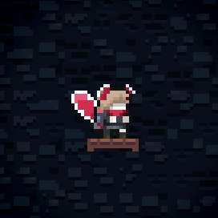

# [HairConfig](https://github.com/AAA1459/SkinModHelper/blob/release/docs/guide/skinconfig/HairConfig.md)

## 自定义头发贴图

### 随着刘海 bangs 变化的头发

在人物皮肤文件夹放置 `bangs00, hangs01, bangs02`, `hair00, hair01, hair02`, 这样在[使用对应的刘海的时候](../xml/sprites_xml.md#hair)就会使用对应的 hair 贴图而不是固定的 `hair00` 了

### 直接修改头发贴图

将头发贴图命名为 `hair00_{数字}`, 数字为正数是表示正数第几段头发,
比如 `hair00_1` 为正数第二段头发(第一段对应原来的 `hair00`), 数字为负数表示倒数第几段头发, 比如 `hair00_-1` 表示最末端的头发

**调整贴图元数据**

这是 Everest 提供的一个功能, 如果你要给对应贴图添加额外信息, 可以在同级目录创建和贴图**同名**的 `.meta.yaml` 文件, 并调整贴图最终绘制出来的偏移和宽高, 可以用来微调头发的相对位置

```yaml title="neuro-skinmod/Graphics/Atlases/Gameplay/Neuro_Skin/characters/player/Evil_Neuro/hair00_-1.meta.yaml"
X: -3  # 贴图绘制坐标 X 方向的偏移, 比如原来画在 (3, 3) 位置的, 现在会画到 (0, 3) 位置
Y: 2
Width: 16  # 主要影响锚点位置(这里其实可以不填)
Height: 16
```

## [HairConfig.yaml](https://github.com/AAA1459/SkinModHelper/blob/release/docs/guide/skinconfig/HairConfig.md#hairconfigyaml)

在人物皮肤贴图位置创建 `skinConfig` 文件夹, 并放入一个 `HairConfig.yaml` 文件, 可以用来配置人物头发相关的东西

由于新版本的 SMH+ 采用了新的配置结构, 所以我会把 Neuro 皮肤的设置换成新版结构(虽然 SMH+ 是兼容老版本结构的), 顺便加了点额外设置以便讲解

```yaml  title="neuro-skinmod/Graphics/Atlases/Gameplay/Neuro_Skin/characters/player/Evil_Neuro/skinConfig/HairConfig.yaml"
HairAttrWithDashes:
  - Dashes: -1
    Color: "ff0000"
    Length: 6
  - Dashes: 0
    Color: "44c5ff"
    Length: 6
    Scale: "1, 0.25"
    SegmentAttrs:
      - Segment: 0
        Color: "63dbff"
      - Segment: 1
        Color: "83cdff"
      - Segment: 2
        Color: "83cdff"
      - Segment: 3
        Color: "62b7f0"
      - Segment: 4
        Color: "83cdff"
      - Segment: 5
        Color: "a5dbff"
      - Segment: 6
        Color: "a5dbff"

      - Segment: "DashPtcl"
        Color: "ff0000"
      - Segment: "Trail"
        Color: "ff0000"
  - Dashes: 1
    Length: 6
    Color: "ff87bf"
    Scale: "1, 0.25"
    SegmentAttrs:
      - Segment: 0
        Color: "b21d38"
      - Segment: 1
        Color: "901229"
      - Segment: 2
        Color: "b21d38"
      - Segment: 3
        Color: "d22b4a"
      - Segment: 4
        Color: "d22b4a"
      - Segment: 5
        Color: "e05671"
      - Segment: 6
        Color: "e05671"
        
      - Segment: "Outline"
        Color: "ff0000"
      - Segment: "Flash"
        Color: "ff0000"
  - Dashes: 2
    Length: 6
    Color: "b1ea38"
    Scale: "1, 0.25"
    SegmentAttrs:
      - Segment: 0
        Color: "d221bf"
      - Segment: 1
        Color: "901282"
      - Segment: 2
        Color: "901282"
      - Segment: 3
        Color: "d221bf"
      - Segment: 4
        Color: "df34cc"
      - Segment: 5
        Color: "ff79f1"
      - Segment: 6
        Color: "ffffff"

OutlineColor: "ffffff"
HairFlipMode: "SyncBangs"
HairOrigin: 5, 5
BangsOrigin: 5, 5
HairFlash: true
HairFloatingDashCount: 0
```

### HairAttrWithDashes

设置不同冲次数下的头发状态, 比如**颜色**, **缩放**, **长度**

* Color: 填十六进制 RGB
* Length: 表明这个冲次数下头发应该有多少段
* Scale: 表明头发的缩放, 官图是根据当前头发段在在所有头发段中的相对位置(即第几段)从 `1 ~ 0.25` 中插值出一个缩放, 所以我们可以改变这个值的范围比如填入 `1.2, 0.2`

如果冲刺数设置为 -1, 可以设置羽毛状态下的头发, 不过我们得把 evil 的头发先加回来

```xml
<Sprites>
    <Evil_Neuro path="Neuro_Skin/characters/player/Evil_Neuro/" start="idle">
        ...
        <Metadata>
            ...
<!--            原来的配置把头发去了-->
<!--            <Frames path="starFly" hair="x"/>-->
<!--            现在加回来-->
            <Frames path="starFly" hair="0,0|0,0|0,0|0,0"/>
        </Metadata>
    </Evil_Neuro>
</Sprites>
```

写好配置后我们就可以看到 evil 在羽毛状态下红红的围巾了(我怎么老是看成尾巴🥰)

```yaml
HairAttrWithDashes:
  - Dashes: -1
    Color: "ff0000"
    Length: 6
```

如果我们想对某一段头发做单独的设置, 可以用 `SegmentAttrs` 设置/覆盖对应的上述 **Color** 和 **Scale** 两个属性, 如下

```yaml
 SegmentAttrs:
  - Segment: 0
    Color: "d221bf"
    Scale: 0.25
```

* Color: 如果填入 16 进制 RGB 那就使用该颜色, 如果留空, 则显示上一级设置的颜色(也就是 **Dashes** 那一级), 如果填入 `orig`, 则表示使用原版游戏此时对应的颜色
* Scale: 直接填入对应缩放即可(但是你得先在 Dash 那一层级设置好缩放范围这里的设置才能覆盖生效)
* Segment: 如果填入数字则表示对应段数, 如果填入特殊标识则表示当前冲次数下的对应状态(而不是对应某一段), 如
    * Trail: 表示当前冲次数下的冲刺尾迹部分设置
    * DashPtcl: 表示当前冲次数下的冲刺粒子部分设置
    * [Outline](#outlinecolor): 表示当前冲次数下的头发描边部分设置
    * [Flash](#hairflash): 表示当前冲次数下的闪白部分设置

### OutlineColor

修改头发描边颜色(默认为黑色, 即 `000000`)

<figure markdown>
  {style="width: 300px; image-rendering: pixelated; title=123"}
  <figcaption>OutlineColor: "ffffff"</figcaption>
</figure>

### HairFlipMode

官图中 bangs 的朝向会根据玩家朝向变化, 而 hair 的朝向不会, 由于 Evil 的尾巴末端是尖尖的, 导致如果 hair 不翻转会出现人物朝右时尾巴正常, 人物朝左时尾巴出错, 此时我们需要这个选项来调整翻转

<figure markdown>
  {style="width: 300px; image-rendering: pixelated; title=123"}
  <figcaption>对的</figcaption>
</figure>


<figure markdown>
  {style="width: 300px; image-rendering: pixelated; title=123"}
  <figcaption>错的</figcaption>
</figure>

SMH+ 提供了四个选项

* None: 啥也不干
* SyncBangs: 约等于随人物朝向翻转
* FacingBangs: 根据当前 hair 段在 bangs 的左边还是右边来选择性翻转
* FacingPrevHair: 根据当前 hair 段在前一个 hair 段的左边还是右边来选择性翻转

### HairOrigin

游戏默认头发贴图 `hair00` 的锚点为 `5, 5`, 所以如果你自定义的 hair 贴图尺寸不太一样, 可能导致头发整体偏上/下/左/右, 建议使用

* BangsOrigin: pivot_x, pivot_y (调整刘海锚点)
* HairOrigin: pivot_x, pivot_y (调整头发锚点)

来调整自己头发的锚点, 或者你可以直接把这个选项当作位移用来调整头发的相对位置, 比如 Neuro 皮肤这里巧妙地替换了头发贴图并将头发移到下面充当了围巾

!!! 注意
    1. 因为该选项对应图片锚点设置, 所以数字调大了绘制出来会往反方向偏移

    2. 由于 Neuro Skin 已经用上面提到的 Everest 提供的 `.meta.yaml` 方法调过了, 所以这里不用再使用 SMH+ 提供的方法了

### HairFlash

设置玩家头发能否在回冲或者吃 refill 的时候闪烁(~~研究了半天没啥用才发现是[最近的 bug](https://github.com/AAA1459/SkinModHelper/commit/6cf263dd966c4f1a267335cb235e9acbd76a7ecb)~~)

### HairFloatingDashCount

表示当冲次数大于等于这个数值时, 头发会硬朗起来(类似原版双冲时的状态), 不然会耷拉下去

设置为 0 表示一直 float, 设置为 -1 表示永远不 float