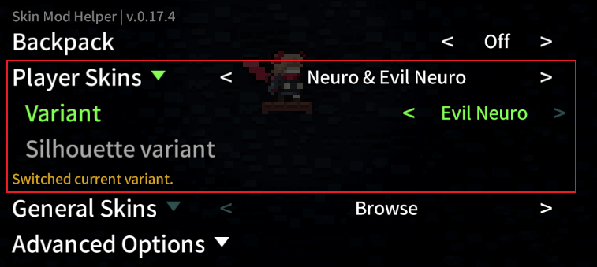
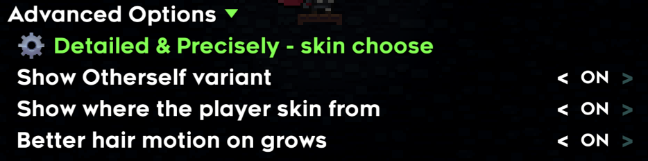
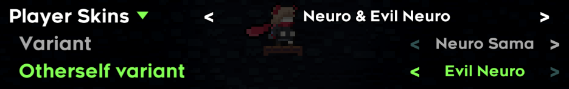
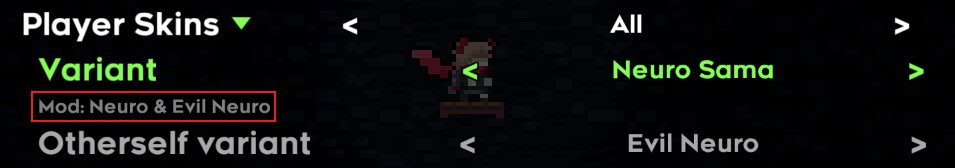
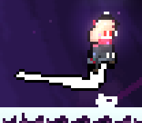
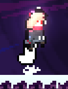

# [SkinModHelperConfig](https://github.com/AAA1459/SkinModHelper/blob/release/docs/guide/README.md#skin-mod-helper-plus-guide)

## SkinModHelperConfig.yaml

在你的皮肤 Mod 根目录放置 `SkinModHelperConfig.yaml`, 这是皮肤 Mod 的身份证(由于 SMH+ 兼容 SMH, 所以后续会将 SMH 的 `SkinModHelperConfig.yaml` 称为老配置)

因为 Neuro 皮肤是少有的一个皮肤 Mod 里有两种不同的角色皮肤(双胞胎姐妹🤤), 再加上人家比较 ... 再加上人家用到了很多 SMH+ 提供的新东西, 于是我就不得不使用 Neuro 皮肤作为示例讲解了, HEART🥰

!!! 注意
    为了方便讲解, 我会为皮肤额外添加配置/贴图, 所以如果你顺着教程没找到对应的东西是正常的

```yaml title="Neuro & Evil Neuro/SkinModHelperConfig.yaml"
- SkinName: "Neuro_Sama"
  Player_List: true
  Silhouette_List: false
  Character_ID: "Neuro_Sama"
  OtherSprite_Path: "Neuro_Skin/neuro"
  SkinDialogKey: "Neuro_Sama"
  Mod: "Neuro & Evil Neuro"

- SkinName: "Neuro_Sama_NB"
  Player_List: false
  Silhouette_List: false
  Character_ID: "Neuro_Sama_no_backpack"
  OtherSprite_Path: "Neuro_Skin/neuro"


- SkinName: "Evil_Neuro"
  Player_List: true
  Silhouette_List: false
  Character_ID: "Evil_Neuro"
  OtherSprite_Path: "Neuro_Skin/evil"
  SkinDialogKey: "Evil_Neuro"
  Mod: "Neuro & Evil Neuro"

- SkinName: "Evil_Neuro_NB"
  Player_List: false
  Silhouette_List: false
  Character_ID: "Evil_Neuro_no_backpack"
  OtherSprite_Path: "Neuro_Skin/evil"


- SkinName: "Neuro_Skin_Npc"
  General_List: true
  OtherSprite_ExPath: "Neuro_Skin/neuro_npc"
  SkinDialogKey: "Neuro_Skin_Npc"
  Mod: "Neuro & Evil Neuro"

- SkinName: "Neuro_Skin_Collectable"
  OtherSprite_ExPath: "Neuro_Skin/neuro_collectable"
  SkinDialogKey: "Neuro_Skin_Collectable"
  Mod: "Neuro & Evil Neuro"

- SkinName: "Neuro_Skin_Badeline_As_Neuro"
  General_List: true
  OtherSprite_ExPath: "Neuro_Skin/badeline_as_neuro"
  SkinDialogKey: "Neuro_Skin_Badeline_As_Neuro"
  Mod: "Neuro & Evil Neuro"

- SkinName: "Neuro_Skin_Badeline_As_Evil"
  General_List: true
  OtherSprite_ExPath: "Neuro_Skin/badeline_as_evil_neuro"
  SkinDialogKey: "Neuro_Skin_Badeline_As_Evil"
  Mod: "Neuro & Evil Neuro"
```

```ini  title="NeuroSkin/Dialog/English.txt"
Neuro_Sama= Neuro Sama
Evil_Neuro= Evil Neuro

Neuro_Skin_Npc= Neuro NPC
Neuro_Skin_Npc__Description=
Bird = Vedal
Madeline's mom = Anny

Neuro_Skin_Collectable= Neuro Collectable
Neuro_Skin_Collectable__Description=
Strawberries = Cookies

Neuro_Skin_Badeline_As_Neuro= Badeline as Neuro
Neuro_Skin_Badeline_As_Evil= Badeline as Evil Neuro
```

在 SMH+ 中, 皮肤组成被分的更精细了, 以 Neuro 皮肤为例, 整体上来看, 一个皮肤 Mod 可以包含多个配置, 每个配置被分为了两种类型

1. 皮肤类型 `Player Skin`: 对应主要皮肤选项, 可以改变玩家皮肤
2. 通用类型 `General Skin`: 对应其他实体的皮肤, 如 `Booster`, `Bird`, `Strawberry` 等等

接下来逐一讲解单个配置中的不同属性

### SkinName

这里你可以看作 (`Player Skin` + `General Skin`) 的 ID, 也就是当前配置的 ID, SMH+ 需要一个 ID 来存放你的皮肤信息(跟老配置中的 `SkinId` 有点不一样)

### Mod

即皮肤分组, 一个皮肤 Mod 中可能包含多个皮肤配置, 有时我们需要将其中的一些归为一组, 比如这里的 `Neuro & Evil Neuro`(不填的话默认使用你 everest.yaml 里的 Mod 名)

{style="width: 1000px; title="123"}

这个 Mod 选项所填的内容本质上就是 Dialog Key, 如果你 Dialog 里有设置对应的 Dialog Key, 那么设置里就会显示对应的值, 否则只显示这个 key 的英文表示

```yaml hl_lines="7"
- SkinName: "Neuro_Sama"
  Player_List: true
  Silhouette_List: false
  Character_ID: "Neuro_Sama"
  OtherSprite_Path: "Neuro_Skin/neuro"
  SkinDialogKey: "Neuro_Sama"
  Mod: "Neuro & Evil Neuro"
```

!!! 注意
    其实我们完全可以一个配置做一个皮肤 Mod 的, 但是太散了不好管理, 不如都放一个皮肤 Mod 里做多个配置, 再用分组将它们组织起来

### Character_ID

对应当前配置使用的人物动画对象 ID, 你需要将自定义的 `Sprites.xml` 放置在 `{你的皮肤 Mod}/Graphics/` 文件夹中, 后续 SMH+ 会使用这个 ID 在这个 XML 中加载你的玩家皮肤

比如这里的 `Neuro_Sama`, `Neuro_Sama_no_backpack`, `Evil_Neuro`, `Evil_Neuro_no_backpack`, 都能在上面配置的 `Character_ID` 中找到(你会发现后 4 个配置没有 `Character_ID`,
那是因为他们不修改玩家的皮肤, 改的是其他实体的皮肤)

同时你也发现了, 这个时候我们的 `Sprites.xml` 跟官图的同路径不会有影响, 因为我们使用的名字是特殊的, 不太可能发生覆盖(如果你不知道这意味着什么,
请看[这里](../mod_structure.md#everest))

```xml title="NeuroSkin/Graphics/Sprites.xml" hl_lines="2 5 8 11"

<Sprites>
    <Neuro_Sama path="Neuro_Skin/characters/player/Neuro/" start="idle">
        ...
    </Neuro_Sama>
    <Neuro_Sama_no_backpack copy="Neuro_Sama" path="Neuro_Skin/characters/player/Neuro_no_backpack/">
        ...
    </Neuro_Sama_no_backpack>
    <Evil_Neuro path="Neuro_Skin/characters/player/Evil_Neuro/" start="idle">
        ...
    </Evil_Neuro>
    <Evil_Neuro_no_backpack copy="Evil_Neuro" path="Neuro_Skin/characters/player/Evil_Neuro_no_backpack/">
        ...
    </Evil_Neuro_no_backpack>
</Sprites>
```

!!! 注意
    人物皮肤的配置可以参考这些动画 ID: `player`, `player_no_backpack`, `player_badeline`, `player_playback`, 分别对应 Madeline/Madeline 无背包/Badeline(异变中的 `另一个自己` 选项)/教程残影

    你可能需要替换别的 helper 提供的特定人物动画, 你可以在[这里](https://github.com/AAA1459/SkinModHelper/wiki/Textures-list-of-Various-Type)找到当前人物动画对象下包含的的更多的动画 ID, 又有皮肤可以画了(~~好耶!~~)

### OtherSprite_Path

SMH+ 会通过 OtherSprite_Path 找到你的 XML 资源, 这里的 XML 主要存放**除人物皮肤之外的人物相关**的皮肤配置(比如 2a 最后电话亭的剧情中, 梦魇将 Madeline 吞噬, 但是这里的 Madeline 本身不是一个人物皮肤), 动画 ID 跟官图的一样即可

* 比如 `Neuro_Skin/neuro` 路径指向了 `NeuroSkin/Graphics/Neuro_Skin/neuro/` 文件夹里的 XML


### OtherSprite_ExPath

SMH+ 会通过 OtherSprite_ExPath 找到你的 XML 资源, 这里的 XML 主要存放**实体相关**的皮肤配置, 比如 strawberry(一般作为 `General Skin` 使用), 动画 ID 跟官图的一样即可

* 比如 `Neuro_Skin/neuro_collectable` 路径指向了 `NeuroSkin/Graphics/Neuro_Skin/neuro_collectable/` 文件夹里的 XML

这样做的好处是你可以手动开启单个皮肤 Mod 中的一些预设或者组合不同皮肤 Mod 中的预设, 比如你可以选择让 bird 变成 Vedal, 金草莓变成 OneShot 中的灯泡

{style="width: 1000px; title="123"}

### SkinDialogKey

皮肤名字对应的 Dialog Key, 对应 `Player Skins` -> `Variant`/`Silhouette variant` 中的皮肤名, 或者 `General Skins` 下的设置名

如果你在 key 后面添加 `__Description` 则可以为这个名字添加注释(注意, `=` 紧贴前面的单词才算一个 key, 不然不会被解析)

```ini  title="NeuroSkin/Dialog/English.txt"
Neuro_Skin_Npc= Neuro NPC
Neuro_Skin_Npc__Description=
Bird = Vedal
Madeline's mom = Anny
```

### Player_List

是否将该配置视为人物皮肤配置并使其在 `Player Skins` -> `Variant` 中显示(默认为 **False**, 要显示的话别忘了填 `Character_ID`)

### Silhouette_List

是否将该配置视为残影皮肤配置并使其在 `Player Skins` -> `Silhouette variant` 中显示(默认为 **False**, 要显示的话别忘了填 `Character_ID`)

### General_List

是否将该配置视为通用皮肤配置并使其在 `General Skins` 中显示(默认为 **"True"**, 前提是你已经写了 `OtherSprite_ExPath`)

### hashSeed

为了在联机 Mod 中认出你的 Skin, 你需要一个独特的 ID(虽然你不填默认会使用你的 `SkinName`)

### Backpack

如果你需要实现无背包版本的人物皮肤, 可以在 `SkinName` 后添加 `_NB`, 并作相应配置(之后玩家可以通过切换 `Backpack` 设置来更改)

### Silhouette

你可以用和配置人物皮肤相同的方式配置残影皮肤(倒不如说残影本身就是一种人物皮肤), 这里用 Niko 皮肤举例

```yaml hl_lines="3 5"
- SkinName: "Zaro_Niko_Silhouette"
  Player_List: false
  Silhouette_List: true

  Character_ID: "niko_playback"
  OtherSprite_Path: "Zaro/niko"
```

```xml  title="Niko Skin/Graphics/Sprites.xml" hl_lines="3"
<Sprites>
    ...
 <niko_playback copy="niko" path="characters/niko_playback/">
	<Metadata>
		<Frames path="idleC" hair="0,-2|-1,-2|-2,-2|-2,-2|-2,-2|-2,-2|1,-1|2,0|0,0|-1,-1|0,-1|0,-1|0,-1|0,-1|0,-1"/>
	</Metadata>
  </niko_playback>
</Sprites>
```

### 总结

由于 SMH -> SMH+ 确实多了很多东西, 有些东西的组织也不太一样, 这里做个小总结让大家更好的理解(~~其实是因为我自己也研究的有点晕需要组织一下语言~~)

* 如果要做皮肤一定要有配置, 配置一定要有一个独特的 ID [`SkinName`](#skinname)
* 如果写了很多配置, 想要给配置分个组, 请搭配 [`Mod`](#mod) 食用
* 如果要翻译当前配置在设置中显示的名字, 请搭配 [`SkinDialogKey`](#skindialogkey) 食用
* 如果要做人物的皮肤, 请搭配 [`Player_List`](#player_list) 和 [`Character_ID`](#character_id) 食用
    * 如果人物皮肤要附带其他**除人物皮肤之外的人物相关**的皮肤 , 请搭配 [`OtherSprite_Path`](#othersprite_path) 食用
    * 如果人物皮肤要区分有/无背包的版本 , 请搭配 [`Backpack`](#backpack) 食用
    * 如果人物皮肤要兼容联机 Mod , 请搭配 [`hashSeed`](#hashseed) 食用
* 如果要做教程残影的皮肤, 请搭配 [`Silhouette_List`](#silhouette_list) 和 [`Character_ID`](#character_id) 食用, 可参考 [niko 残影教程皮肤](#silhouette)
* 如果要做其他实体的皮肤, 请搭配 [`General_List`](#general_list) 和 [`OtherSprite_ExPath`](#othersprite_expath) 食用

!!! 注意
    你也许需要重启章节/重启游戏来使一些设置/改变生效

## Advanced Options

高级设置

{style="width: 1000px; title="123"}

### Detailed & Precisely - skin choose

字面意思, 你可以在里面设置单个实体的皮肤, 而不局限于配置预设

### Otherself Variant

默认情况, 当你开启异变中的**另一个自己**选项后, 游戏仍会使用当前选中的 `SkinName` 配置作为角色的皮肤, 所以如果你要单独设置**另一个自己**对应的皮肤, 你需要在高级设置中打开 `Show Otherself Variant` 选项, 然后你就可以在 `Player Skins` 中看到 `Otherself Variant` 选项了

比如这里我们就可以让 Neuro 作为 Madeline 的皮肤, 而 Evil Neuro 作为**另一个自己**(Badeline)的皮肤

{style="width: 1000px; title="123"}

### Show where the player skin from

当 `Player Skins` 选项为 `All` 时, 是否显示你每个选中的皮肤来自于哪个皮肤分组

{style="width: 1000px; title="123"}

### Better hair motion on grows

如果你的头发突然变长(比如我这里单冲到双冲头发长度从 6 -> 16), 按原版的代码来头发位置会突变, 你可以开启这个选项让头发位置平滑过渡


<figure markdown>
  {style="width: 200px; image-rendering: pixelated; title=123"}
  <figcaption>错的</figcaption>
</figure>

<figure markdown>
  {style="width: 200px; image-rendering: pixelated; title=123"}
  <figcaption>对的</figcaption>
</figure>
