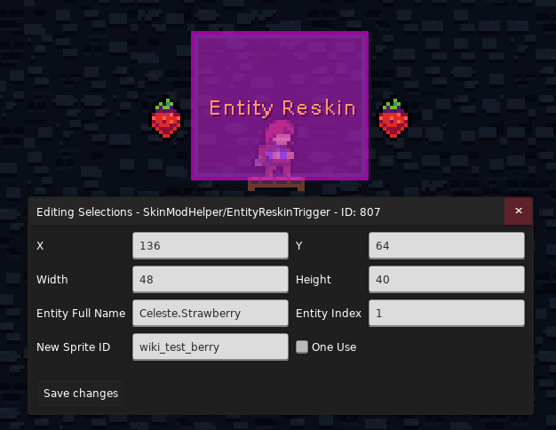
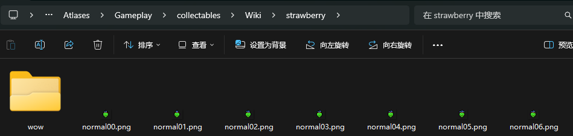
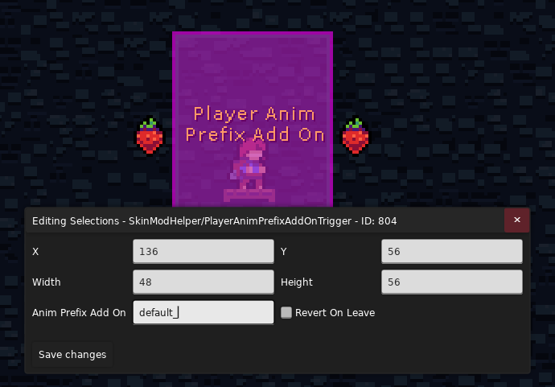

## Skin Swap Trigger

{style="width: 700px"}

SMH+ 的这个 Trigger 相比 SMH 的最大好处就是只会影响当前地图, 同时你可以选择性的替换某些皮肤, 而不是全部

* Skin Id: 填入要替换的皮肤的 `SkinName` 即可, 默认为 `Default`, 即 Madeline 原皮
* Player Variant: 是否将配置应用于 **Madeline** 的皮肤
* Otherself Variant: 是否将配置应用于 **另一个自己** 的异变皮肤
* Silhouette Variant: 是否将配置应用于残影教程皮肤
* Revert On Leave: 是否要在离开 Trigger 后切回原来的皮肤

## Entity Reskin Trigger

 这就是一个用来切换实体皮肤的 Trigger, 用法相对 SMH+ 的配置流程简单很多

{style="width: 700px"}

* Entity Full Name: 指明你要作用的实体对象的[完全限定名](../loenn/faq.md#type)(这里不能简写)
* Entity Index: 如果场景里有多个同类型实体, 你可以通过这个索引来指定第几个实体, 从 0 开始计数, 默认为 -1, 即作用于所有该类型实体
* New Sprite ID: 使用你自己在 `Sprites.xml` 里定义的要作用对应于实体的 ID
* One Use: 是否只能触发一次

首先把你的 `Sprites.xml` 放在 `Graphics/` 文件夹下, 然后把你想改的实体配置尻过来改一改(这里以 `strawberry` 为例)

```xml title="Graphics/Sprites.xml" hl_lines="2"
<Sprites>
  <wiki_test_berry path="collectables/Wiki/strawberry/" start="idle">
    <Center />
    
    <Loop id="idle" path="normal" delay=".1" frames="0-6,0-6,0-6,0-6,0-7" />
    <Loop id="noFlash" path="normal" delay=".1" frames="0-6"/>
    <Anim id="collect" path="normal" delay=".07" frames="7-11"/>
    <Loop id="flap" path="wings" delay=".08" frames="0-8,0-8,0-7,9" />
	  
    <Anim id="fade0" path="normal" delay=".08" frames="12-14,14*10,15-19"/>
    <Anim id="fade1" path="normal" delay=".07" frames="20-22,22*10,23-26"/>
    <Anim id="fade2" path="normal" delay=".07" frames="28-30,30*10,31-34"/>
    <Anim id="fade3" path="normal" delay=".07" frames="36-38,38*10,39-42"/>
    <Anim id="fade4" path="normal" delay=".07" frames="44-46,46*10,47-50"/>
	  <Anim id="fade5" path="normal" delay=".07" frames="52,53,54,53,54,53,54,53,54,53,54,53,54-59"/>
	  <Anim id="fade_wow" path="wow/normal" delay=".1" frames="52-66"/>
  </wiki_test_berry>
</Sprites>
```

然后放好素材

{style="width: 700px"}

碰下 tirgger 就好了

{style="width: 700px"}

## Player Anim Prefix Add On

{style="width: 700px"}

简单来说, 这个 Trigger 可以设置你后续播放的动画的加前缀版本 

* Anim Prefix Add On: 要加的前缀, 之后游戏尝试播放 `{动画 ID}` 的时候, 会先尝试播放 `{prefix}_{动画 ID}` 比如当前动画为 `idle`, 前缀为 `wind_`, 设置后游戏会尝试播放 `wind_idle`(如果有的话)
* Revert On Leave: 是否要在离开 Trigger 后切回原来的设置

想象一下原本 Madeline 在逆风中艰难行走, 突然风向改变, Madeline 开始自由的奔跑, 也许会需要用的这个 Trigger 来增加画面表现力
