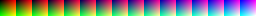

## 滤镜贴图

<figure markdown>
  {style="width: 900px; image-rendering: pixelated; title=123"}
  <figcaption>路径: Celeste\Content\Graphics\ColorGrading\none.png</figcaption>
</figure>

这是一张所谓的滤镜贴图, 仔细观察你会发现这张图片是由 16 个 16 x 16 的 像素块组成, 三个数字...跟颜色有关...聪明的你一定已经想到了吧, 这不就是精度低一点儿的 RGB 嘛, 一个块里用 x 方向(从左上角开始)存储 R, 用 y 方向存储 G,
从左到右 16 个块存储 B(用二维的图片存储三维的颜色信息), 所以你会发现第一个块只有红绿, 越往右蓝的成分就越多, 而滤镜就是你把对应像素的颜色改掉, 然后游戏中的对应颜色也会被改成你修改后的颜色, 而这里的 `none.png` 贴图正好对应不改色, 所以接下来介绍基于 `none.png` 滤镜的制作

### [滤镜制作](https://www.bilibili.com/video/BV1WW7czqEPi)

这里本来想贴 WEG 录的视频的, 但是太久远了没找到, 只能仿照录一个了

既然滤镜本质上是替换颜色, 那么我们把滤镜图片和游戏图片放一起调整即可

视频中演示的是改 HSV, 如果你改 RGB 啥的原理也是一样的

这里有个一[网站](https://colorgrade-visualiser.modded-celeste.com/)给出了一些官图画面方便你查看滤镜效果, 复制你的滤镜在网站内 `Ctrl + V` 即可

如果你觉得这还是太吃操作了, 建议你使用[滤镜生成工具 / Celeste Colorgrade Generator](https://lostinnowhere314.github.io/celeste-colorgrade-gen/): 生成完毕将图像另存为即可, 但我感觉还是感觉像 WEG 这样调符合直觉一点

