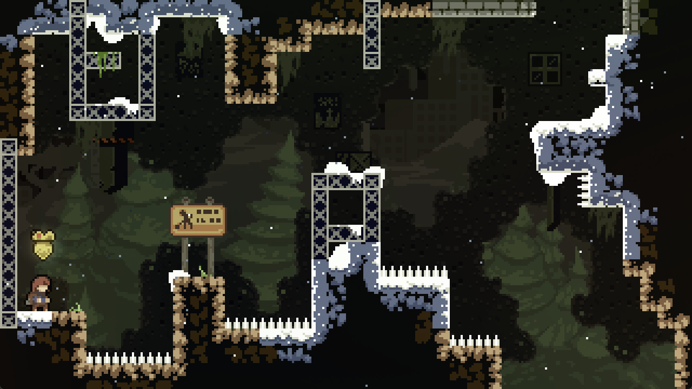
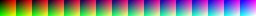
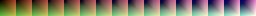
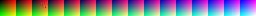

你可以想象一下透过红色玻璃看世界, 世界也会染上红色, 滤镜的原理就是这样, 
把你看到的颜色整体修改一下就可以在微调色彩的同时保证整体颜色的协调

而蔚蓝为游戏添加滤镜的一种手段则是**滤镜贴图**

## 滤镜贴图

### RGB

我们在电脑上表示颜色一般通过 RGB 来描述, 即一个颜色由三个分量红绿蓝组成, 每个分量数值从 `0 ~ 255` 表示亮度, 
组合起来格式为 `(0 ~ 255, 0 ~ 255, 0 ~ 255)`, 例如红色写法是 `(255, 0, 0)`, 黄色写法是 `(255, 255, 0)`,
总共能表示 `256 ^ 3 = 16777216` 种颜色

### 原理

你可能会想, 如果想在游戏内实现滤镜效果是不是可以通过配置每个颜色应该改为什么颜色, 最后在绘制的时候应用一下就能给游戏加上滤镜了?
比如我们把每个颜色都映射到更暗且偏黄的颜色去, 不就可以表现凄凉萧条的效果了?

事实也正是如此, 不过为了让滤镜可以通过绘图软件方便调整, 蔚蓝采用了更加聪明的办法, 也就是滤镜贴图

我们可以定义一个宽为 `256px * 256px`, 高为 `256px` 的图像, 图像的大小正好可以包含所有颜色的 RGB 信息, 
之后我们只需要找到一个公式, 使得对于每一个颜色都能在图像中找到唯一的坐标即可, 例如 `(R * G, B)`, 像下面这种感觉

> 蔚蓝使用了别的公式, 且蔚蓝使用了分辨率更小的图, 只需要把 0 ~ 255 分成 16 组看成一个整体即可, 如 0 ~ 15, 16 ~ 31, ..., 240 ~ 255

<figure markdown>
  {style="width: 900px; image-rendering: pixelated; title=123"}
  <figcaption>路径: Celeste\Content\Graphics\ColorGrading\none.png</figcaption>
</figure>

现在颜色就是坐标, 坐标就是颜色, 我只需要把对应坐标的颜色改成自己想要的, 游戏就知道你要把什么颜色换成什么颜色了

例如在你不做任何修改的时候, 滤镜的作用就是用原颜色替换原颜色, 所以没有效果, 对应上方的 `none.png` 滤镜贴图, 
而上方 1a 示例的滤镜就是使用的 `templevoid.png` 滤镜贴图

<figure markdown>
  {style="width: 900px; image-rendering: pixelated; title=123"}
  <figcaption>路径: Celeste\Content\Graphics\ColorGrading\templevoid.png</figcaption>
</figure>

### 使用

* 正常游玩/挑选滤镜: 开启[拓展异变](https://gamebanana.com/mods/53650), 游戏内 `Esc -> 拓展异变 -> 视觉 -> 色调`
* 作图全局设置: 在 [Loenn 元数据](../loenn/metadata.md)里修改 `Colour Grade` 滤镜贴图设置即可
* 作图游戏内修改: 使用[拓展异变](https://gamebanana.com/mods/53650)提供的 `Extended Variant (Color Grading) Trigger`, 或是带渐变切换的滤镜效果 `Color Grade Fade [Maddie's Helping Hand]` 即可

    
注意

    

    由于拓展异变似乎并不会显示贴图具体自于哪个 Mod, 所以我 vibe 了一个<a href="/celeste_wiki/assets/mappings/graphics/colorgrades/ColorGradingFinder.exe">搜索工具</a>, 将其放在 Mods 文件夹下,
    双击运行就会返回所有的滤镜贴图和对应的 Mod 名了(之后在控制台内部 <code>Ctrl + F</code> 或者 <code>Ctrl + Shift + F</code> 搜索对应贴图即可)
    

## [自制滤镜贴图](https://www.bilibili.com/video/BV1WW7czqEPi)

> 这里本来想贴 WEG 录的视频的, 但是太久远了没找到, 只能仿照录一个了

既然滤镜本质上是替换颜色, 那么我们把不改色的 `none.png` 滤镜图片和游戏图片放一起调整即可, 
由于滤镜贴图非常灵活, 所以其实你也可以只改贴图的一部分

这里有个一[网站](https://colorgrade-visualiser.modded-celeste.com/)给出了一些官图画面方便你查看滤镜效果, 复制你的滤镜在网站内 `Ctrl + V` 即可

### 其他工具

* [滤镜生成工具 / Celeste Colorgrade Generator](https://lostinnowhere314.github.io/celeste-colorgrade-gen/): 生成完毕将图像另存为即可,

## 自制[皮肤](skin.md)滤镜贴图

在制作皮肤的过程中, 有时我们可能需要替换皮肤中某一类颜色随着冲次数变化而变化, 而这可以通过滤镜贴图来做到(毕竟原理差不多嘛)

假设我们尝试替换 [Theo 皮肤](https://gamebanana.com/mods/251813)的围巾颜色 `DF7126` 使其在单冲状态下呈现红色 `FF0000`, 
由于滤镜贴图的分辨率比较低 (`16/256`), 所以我们也得把围巾的颜色下取整,

* `DF / 16 = 0D` 对应坐标 `13` (从 `0` 开始数)
* `71 / 16 = 07` 对应坐标 `7`
* `26 / 16 = 02` 对应坐标 `2` 
 
其实就是 DF7126,
也就是我们只需要把坐标 `(13, 7, 2)` 对应的像素涂红, 之后把这个贴图改名放到 SMH(+) 要求的目录中即可

> 如果失效了请尝试将该点的周围一圈都涂涂试试, 因为后来发现游戏内换算的时候不是线性的

    
坐标转换

    
首先你要知道图片的坐标描述是先行后列, 从左上角且数值为 0 开始

    
其次是蔚蓝采取的公式是 <code>(G, R + B * 16)</code>

    
所以 <code>(13, 7, 2) -> (7, 45)</code> 才对应红点位置

电视机前的小朋友, 你找到那个红点了吗😋

<figure markdown>
  {style="width: 900px; image-rendering: pixelated; title=123"}
  <figcaption>路径: Graphics/ColorGrading/{UniquePath}/dash1.png</figcaption>
</figure>

