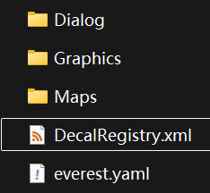
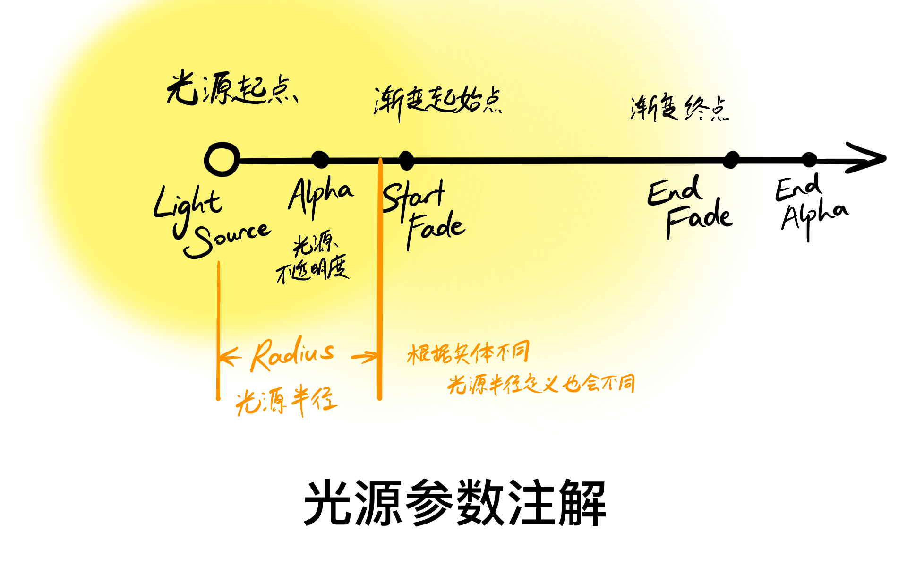
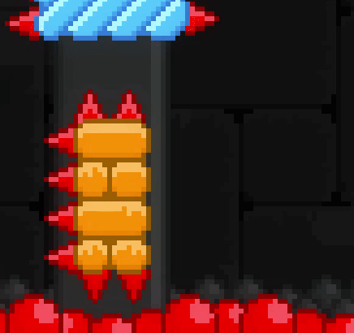

参考/引用

* [摘自b站 Wiki (描述不详细, 但很全, 含 helper 自定义的 DecalRegistry 内容)](https://wiki.biligame.com/celeste/DecalRegistry)
* [celeste 地图制作指南 (装饰, decals)(适合新手, 有配图)](https://www.bilibili.com/read/cv18389517/)
* [摘自 Everest Wiki (描述详细, 且提供了自定义 DecalRegistry 的教程)](https://github.com/EverestAPI/Resources/wiki/Decal-Registry)
* [DecalRegistry 使用 by 底龙](https://uddrg.notion.site/Decal-2787f4f27e638051a265e8b708adbe03)

如果你有留意过原版的 Decal, 可能会发现一些 Decal 放置后就自带特殊效果, 无需额外设置.

这是因为官方会通过代码中的硬编码路径规则, 自动为特定的 Decal 添加效果. 例如:

- `Gameplay/decals/7-summit/cloud_*` 下的云 Decal 自动获得视差效果
- `0-prologue/house` 房子自动获得烟囱冒烟效果
- `10-farewell/cliffside` 等很多 9a 的 Decal 自动获得浮动效果 (像月亮块一样)

官方硬编码是爽了, 但是 Mapper 就无法直接让自己的 Decal 享受这些预设效果了.

因此, Everest 提供了 `DecalRegistry.xml` 这一配置文件, 将这些原本写死在代码中的 Decal 效果开放为配置项. Mapper 只需要在其中注册对应的 Decal 路径, 就可以使用这些效果.

<div class="admonition note">
    <p class="admonition-title">注意</p>
    <p>
    DecalRegistry.xml 与砖块的 XML 不同, DecalRegistry.xml 的应用范围是你整个 mod 项目, 而不是单个章节, 
    因此你一旦设置好一个 decal 属性, 你在你的 mod 中的任何章节使用它的属性都会生效, 不能实现在一个章节中它有特效一个章节中它没有特效.
    </p>
</div>

## DecalRegistry.xml 的设置

你可能需要了解一下什么是[XML](../xml/basics.md)

首先, 在你的项目根文件夹 (`蔚蓝本体/Mods/你的项目`)中, 创建一个 DecalRegistry.xml (可以先创建一个 `.txt` 文本文档, 然后再重命名), 像这样



打开它, 在其中输入

```xml

<decals>
    <!--这个decals与/decals构成一个容器-->
    <!--里面是容器内容-->
</decals>
```

在上述容器中, 我们可以对装饰物添加属性, 针对每一个装饰物, 我们需要先建立一个 decal 容器:

```xml

<decal path="">
    <!--里面是decal属性-->
</decal>
```

这样, 基本结构就已经设置好了, 也就是说你的 DecalRegistry.xml 的完整结构应该是类似于:

```xml

<decals>
    <decal path="decal路径A">
        <!--里面是decal属性-->
    </decal>

    <decal path="decal路径B">
        <!--里面是decal属性-->
    </decal>

    ...
</decals>
```

现在, 我们来介绍每一个单独的 Decal 属性

## Decal 属性

### animation 和 animationSpeed

```xml

<animation frames="帧数"/>
<animationSpeed value="整数"/> <!-- value 单位为帧/秒. -->
```

动画控制器, 可以控制你的 decal 动画播放. 

frames 中的帧数对应动画的数字序号, 假设你的动画有 60 帧, 你的文件命名应当是 `name00.png` 一直到 `name59.png`, 而这里面每一帧的序号就分别是0到59.

frames 书写是每个数字使用英文逗号隔开, 同时可以使用如下符号:

* m-n: 表示从序号为 m 的帧播放到序号为 n 的帧.
* m*n: 表示将序号为 m 的帧播放 n 次. 

例如对于 `1, 2, 4-6, 3*2` 的展开就是 `1, 2, 4, 5, 6, 3, 3`

### banner

```xml

<banner speed="小数" amplitude="小数" sliceSize="整数" sliceSinIncrement="小数" easeDown="true 或者 false" offset="小数" onlyIfWindy="true 或者 false"/>
```

相当于按 sliceSize 间距横着将图片切分成若干份, 之后每一段会随正弦函数摆动, 常用于小草等装饰物的随风摆动

拟合函数图像 $f(x) = \mathrm{amplitude} \times \sin(\mathrm{sliceSinIncrement} \times \mathrm{speed} + \mathrm{offset})$

### floaty

```xml

<floaty/>
```

让装饰物可以有上下漂浮的效果

### smoke

```xml

<smoke offsetX="小数" offsetY="小数" inbg="true 或者 false"/>
```

offsetX 和 offsetY 都是基于装饰的画布中心来计算的

### parallax

```xml

<parallax amount="小数"/>
```

这个参数可以让装饰有视差, 和 bg 一样, amount 参数可正可负的, 相当于 bg 从 `scroll=1` 开始计算

### sound

```xml

<sound event=""/>
```

event 里面填 event 名字

### bloom

```xml

<bloom offsetX="小数" offsetY="小数" alpha="小数" radius="小数"/>
```

发光 offset 从画布中心开始计算

### light

```xml

<light offsetX="小数" offsetY="小数" color="hex" alpha="小数" startFade="整数" endFade="整数"/>
```



### lightOcclude

```xml

<lightOcclude x="整数" y="整数" width="整数" height="整数" alpha="小数"/>
```

阻挡光线的区域

### overlay

```xml

<overlay/>
```

相当于把 decal 作为 Tile(不受缩放影响) 替换掉 decal 对应位置的 Tile, 
比如把你的 decal 放在 Dash Block 上, Dash Block 身上的部分区域就会被替换(建议 decal 长宽为 8px 倍数)

使用上感觉不如用 `staticMover` 或者 Eevee Helper 直接把 decal 粘在对象上

### scale

```xml

<scale multiplyX="小数" multiplyY="小数"/>
```

装饰放缩

### randomizeFrame

```xml

<randomizeFrame/>
```

装饰会从随机的一帧开始

### coreSwap

```xml

<coreSwap coldPath="" hotPath=""/> 
```

### flagSwap

```xml

<flagSwap flag="" offPath="" onPath=""/>
```

path 从 Gameplay 往后填写

### mirror

```xml

<mirror keepOffsetsClose="true 或者 false"/>
```

给装饰添加一个镜面反射效果, `decals/modname/mytexture.png` 对应的镜面贴图是 `mirrormasks/modname/mytexture.png` 用彩色图像来定义镜面的远近

* 红色值表示 X 方向偏移
* 绿色值 Y 方向偏移 

白色(颜色值为 255)表示最近, 黑色(颜色值为 0)表示最远

### staticMover

```xml

<staticMover x="整数" y="整数" width="整数" height="整数"/>
```

将装饰连接在实体的判定箱上, [Y 方向向下](../loenn/faq.md#_16)

### scared

```xml

<scared hideRange="整数" showRange="整数" hideFrames="帧数" showFrames="帧数" idleFrames="帧数" hiddenFrames="帧数" /> 
```

* hideRange: 当玩家距离 decal 小于该值时, decal 进入 hide 状态并播放 hide 动画, 使用 hiddenFrames 里的帧序列
* showRange: 当玩家距离 decal 大于该值时, decal 进入 show 状态并播放 show 动画, 使用 showFrames 里的帧序列

其他情况正常播放 idleFrames 里的帧序列

### solid

```xml

<solid x="小数" y="小数" width="小数" height="小数" index="整数" blockWaterfalls="true 或者 false" safe="true 或者 false"/>
```

给装饰加一个可以交互的碰撞箱, 但是不能和 container 起作用

* x 和 y 从装饰中间开始计算, Y 方向向下
* index 是[交互的材质音效](../audio/tile_sounds.md)
* safe 用于判定草莓能否被收集 

### depth

```xml

<depth value="整数"/>
```

可以规定[装饰的层级](entity_depth.md)

## 由Adam’s Add-Ons提供的属性

### rotate

```xml

<adamsaddons.rotate speed="小数" addX="小数" addY="小数" addWind="小数"/>
```

* rotate 允许装饰物围绕其自身中心旋转 
* speed 控制旋转速度 
* addX 与 addY 允许装饰沿轴进行位移运动 
* addWind 允许装饰按倍率受风的影响被吹动

### [oscillate](https://gist.github.com/AdamKorinek/7e27d288701db5a0df095f756f0f8e9a#oscillate-adamsaddonsoscillate)

```xml

<adamsaddons.oscillate speed="小数" offset="小数" backPath="decals/路径"/>
```

* oscillate 允许装饰沿 Y 坐标轴进行转动, 像立体旋转一样
* speed 定义旋转速度, offset 定义位差
* backPath 表示旋转时背面对应的图片路径(相对于 `decals` 文件夹), 不填默认跟正面用的一样

举例: 你的装饰文件如果放在 `Celeste/Mods/yourMap/Graphics/Atlases/Gameplay/decals/yourName/yourMap` 文件夹内, 
文件名叫做 `flower.png` 此处的写法就应该是: `yourName/yourMap/flower`

### aim

```xml

<adamsaddons.aim/>
<adamsaddons.aim theo="true 或者 false"/>
```

* aim 会让装饰朝向玩家所在的方向
* theo 参数控制是否响应 theo 水晶所在的方向

### pendulum

```xml

<adamsaddons.pendulum speed="小数" offset="小数" angle="整数"/>
```

pendulum 允许装饰像钟摆一样摆动 

* speed 定义摆动速度
* offset 定义起始位差
* angle 定义摆动角度

### shake

```xml

<adamsaddons.shake/>
<adamsaddons.shake delay="小数" height="整数" width="整数"/>
```

shake 会使得装饰随机“颤抖” 

* width 与 height 控制随机颤抖的区域大小
* delay 是出现颤抖的间隔

### move

```xml

<adamsaddons.move amount="整数" width="整数" height="整数" locked="true 或者 false"/>
```

move 本质是让装饰相对于所在的位置发生偏离, 但是结合前文 `adamsaddons.rotate` 一起就可以做出类似于风车一样的效果,
由于 rotate 会使得装饰本身也产生旋转, 因此可以在此用 locked 参数锁定旋转, width 与 height 就是装饰相对于装饰所在点产生的位移

### randomize

```xml

<adamsaddons.randomize frame="true false" flipX="true false" flipY="true false" rotations="整数" colors="" shrink="小数" chance="小数"/>
```

randomize 可以将你的装饰随机化变换! 

* frame 应用于你的装饰原本是一个动画序列的情况, 它将会取消装饰的动画播放, 转而变成随机从这些帧数里面挑一张展示
* flipX 与 flipY 决定随机处理装饰时是否会让他出现上下或者左右翻转
* rotations 的整数表示这个装饰将会以几个不同的角度出现, 比如 `rotations="4"`, 则这个装饰在地图中可能以旋转 `0, 90, 180, 270` 度的形态随机出现 
* colors 中填入的是若干 hex 颜色代码, 如 `colors="ffffff,ff0000,00ff00,0000ff"`, 等同于“白, 红, 绿, 蓝”, 不同颜色的 hex 代码用英文逗号隔开 
* shrink 表示随机处理装饰的时候其最小放缩的倍数, 设置完成后在地图中装饰会以 `shrink ~ 1` 倍随机大小出现在地图中 
* chance 决定随机处理装饰的概率, 比如 `chance="0.25"`, 则地图中约有四分之一的装饰可能会被随机化处理

### fade

```xml

<adamsaddons.fade alphaFrom="小数"/>
<adamsaddons.fade alphaFrom="小数" alphaTo="小数" randomize="布尔值" speed="小数" offset="小数"/>
```

fade 属性可以让装饰以匀速不透明度进行闪烁 

* alphaFrom 为起始不透明度
* alphaTo 为终止不透明度
* randomize 将其随机化 offset 表示起始位差

### wobble

```xml

<adamsaddons.wobble width="小数" height="小数" speed="小数" offset="小数" randomize="布尔值"/>
```

wobble 会让装饰产生像原版泡泡一样的鼓动效果 

width 和 height 控制的是在对应方向的挤压变形倍率 如 `width="0.25"` 时,
宽度就会在 `75%-125%` 之间鼓动, height 同理

### depthChange

```xml

<adamsaddons.depthChange depthFrom="-100" depthTo="100"/>
<adamsaddons.depthChange depthFrom="250" depthTo="500" speed="0.5"/>
<adamsaddons.depthChange depthFrom="100" depthTo="-100" relativeX="true"/>
```

### playerAttach

```xml

<adamsaddons.playerAttach/>
<adamsaddons.playerAttach offsetX="5" offsetY="-8" facing="true"/>
<adamsaddons.playerAttach hairOffset="true" copyScale="true"/>
<adamsaddons.playerAttach flag="attach_flag" preSpawn="true"/>
```

### cameraAttach

```xml

<adamsaddons.cameraAttach/>
<adamsaddons.cameraAttach offsetX="-8" offsetY="-8"/>
<adamsaddons.playerAttach flag="attach_flag" preSpawn="true"/>
```

### debris (一般和Static Mover属性一起用)

```xml

<adamsaddons.debris path="相对于 Gameplay 的路径" sound="碎片落地的声音 id" fromPlayer="true" fromBadeline="true"/>
```




### global

```xml

<adamsaddons.global transitionUpdate="true" frozenUpdate="true" pauseUpdate="true"/>
```

让装饰物既便在玩家离开房间的状态下也能持续刷新, 类似于全局 decal 的效果

* transitionUpdate 是否在房间过渡阶段刷新
* frozenUpdate 是否在冻结帧刷新 
* pauseUpdate 是否在游戏暂停时刷新

### **animateOnFlag**

```xml

<adamsaddons.animateOnFlag flag="flag 名字" singleFrame="true"/>
```

让 decal 在特定 flag 激活时才会播放动画 (控制动画播放)

* singleFrame: 每当 flag 激活一次, decal 才会前进一帧

### **mouseAttach**

```xml

<adamsaddons.mouseAttach/>
<adamsaddons.mouseAttach offsetX="-8" offsetY="-8"/>
<adamsaddons.mouseAttach flag="flag名字"/>
```

字面意思, 将 decal 粘在鼠标上

* offsetX 和 offsetY 设置 decal 的偏移量 
* flag 属性存在时需要 flag 才会将装饰物粘到鼠标上

## 由 Frost Helper 提供的属性

### rainbow

```xml

<frosthelper.rainbow/>
```

让 decal 进行彩虹变化, 可以被能改变彩虹刺颜色的实体改变变化的颜色.

## 由 Jungle Helper 提供的属性

### rainbow

```xml

<jungleHelper_rainbow/>
```

让 decal 进行彩虹变化, 可以被能改变彩虹刺颜色的实体改变变化的颜色.

## 由 Xaphan Helper 提供的属性

### flagsHide

```xml

<XaphanHelper_flagsHide flags="flag1,flag2,..." room="room name" inverted="true"/>
```

默认情况下 flags 中只要存在一个这个 decal 就会被隐藏

## 由 Kosei Helper 提供的属性

### kill

```xml

<koseihelper.kill offsetX="0" offsetY="8" width="16" height="16"/>
```

装饰会刺杀玩家

### moving

```xml

<koseihelper.moving ySpeed="1"/>
<koseihelper.moving xSpeed="1" moveWithWind="true"/>
<koseihelper.moving ySpeed="-1" collideWithSolids="true" width="16" height="16" offsetX="-8" offsetY="-8"/>
```

装饰运动

### trail

```xml

<koseihelper.trail color="f94a4a"/>
<koseihelper.trail duration="0.75" spawnInterval="0.15" color="ffffff22"/>
```

装饰运动 + 轨迹
