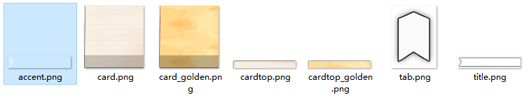
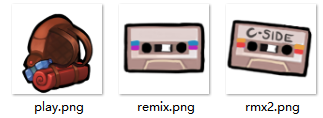
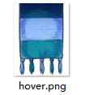

摘抄/整合

* [素材替换 by Saplonily](https://saplonily.top/celeste_modding_tutorial/mapping/room_meta_text/#_6)
* [真的大 Helper](https://gamebanana.com/mods/597196), [Wiki](https://github.com/kyfex-uwu/ReallyBigHelper/wiki/Using-ReallyBigHelper): 改章节图标 (如果你需要更丰富的样式的话)

横幅, 卡片, 围巾, 攀爬按钮的贴图也能够自定义, 例如你有如下这几个地图:

- 📁 `Maps`
    - 📁 [`{套文件夹}`](../../mod_structure.md#conflict)
        - 📄 `0-MyFirstMap.bin`
        - 📄 `1-MySecondMap.bin`
        - 📄 `2-MyThirdMap.bin`

能够自定义的贴图有:   
横幅 (`title.png` `accent.png`), 攀爬按钮 (`tab.png`), 卡片 (`card.png` `cardtop.png` `card_golden.png` `cardtop_golden`):   
  
攀爬按钮图标 (`play.png` `remix.png` `rmx2.png`):   
  
围巾 (`hover.png`):   

在制作好这些贴图后, 命名成同上的名字, 然后放置在这些地方:

- 📁 `Graphics`
    - 📁 `Atlases`
        - 📁 `Gui`
            - 📁 `areas`
                - 📁 [`{套文件夹}`](../../mod_structure.md#conflict)
                    - 📄 `hover.png`
            - 📁 `menu`
                - 📁 [`{套文件夹}`](../../mod_structure.md#conflict)
                    - 📄 `play.png`
                    - 📄 `remix.png`
                    - 📄 `rmx2.png`
            - 📁 `areaselect`
                - 📁 [`{套文件夹}`](../../mod_structure.md#conflict)
                    - 📄 `title.png`
                    - 📄 `accent.png`
                    - 📄 `card.png`
                    - 📄 `card_golden.png`
                    - 📄 `cardtop.png`
                    - 📄 `cardtop_golden.png`
                    - 📄 `tab.png`

这样会对 [`{套文件夹}`](../../mod_structure.md#conflict) 下的所有地图生效, 如果要只针对一个地图生效, 只需要在文件名前加上地图文件名和一个下划线, 例如:

- 📁 `Graphics`
    - 📁 `Atlases`
        - 📁 `Gui`
            - 📁 `areas`
                - 📁 [`{套文件夹}`](../../mod_structure.md#conflict)
                    - 📄 `hover.png`
            - 📁 `menu`
                - 📁 [`{套文件夹}`](../../mod_structure.md#conflict)
                    - 📄 <code>2-MyThirdMap_play.png</code>
                    - 📄 <code>2-MyThirdMap_remix.png</code>
                    - 📄 <code>2-MyThirdMap_rmx2.png</code>
            - 📁 `areaselect`
                - 📁 [`{套文件夹}`](../../mod_structure.md#conflict)
                    - 📄 <code>0-MyFirstMap_title.png</code>
                    - 📄 <code>0-MyFirstMap_accent.png</code>
                    - 📄 <code>1-MySecondMap_card.png</code>
                    - 📄 <code>1-MySecondMap_card_golden.png</code>
                    - 📄 <code>1-MySecondMap_cardtop.png</code>
                    - 📄 <code>1-MySecondMap_cardtop_golden.png</code>
                    - 📄 <code>tab.png</code>
