# 素材替换

> ￥: 会找 custom 实体直接改贴图能改 80%, 会改 xml 能改 95%, 会 code 自己写实体能改 100%

参考/整合/摘抄

* [替换素材 by 底龙 (视频)](https://www.bilibili.com/video/BV1uUHYzLEu5/)
* [[Celeste蔚蓝]作图教程第五章B面-自定义对话人物与实体贴图修改 (xml 进阶篇)](https://www.bilibili.com/video/BV1cP4y1m7B2)
* [冬菜教程](../../../assets/mappings/overall/dong_cai.pdf)
* [正常替换 by Everest Wiki](https://github.com/EverestAPI/Resources/wiki/Replacing-A-Texture)
* [高级替换 by Everest Wiki](https://github.com/EverestAPI/Resources/wiki/Reskinning-Entities)

由于图片是最常见的最需要被替换的资源, 所以本章主要围绕图片展开, 并给出一些替换素材的示例以供参考

不过在此之前你最好了解下 [Everest 合并 Mod 资源的逻辑](../../mod_structure.md#conflict), 这有助于你理解替换素材背后的本质


<a id="force"></a>

## 暴力替换 `Booster` 贴图

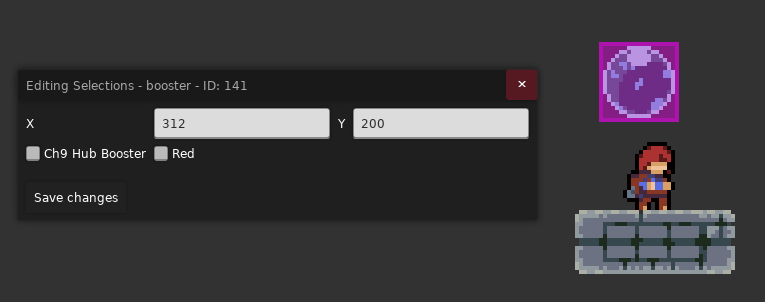

首先找到 `Booster` 图片素材放哪儿了, 如下

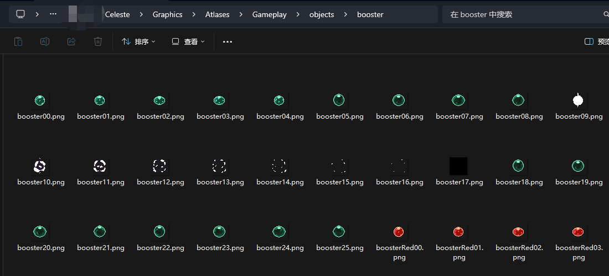

然后把素材尻到自己 Mod 的相同路径下, 并改色以方便查看效果

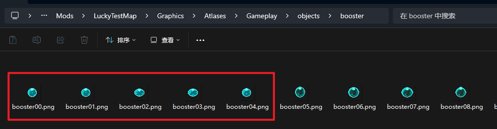

顺带一提 Windows 现在可以在资源管理器上打开多个条目了, 这方便你在不同文件夹之间来回切换


然后就完事了, 因为你的素材覆盖了官图的素材


我的天哪, 这简直太方便了, 但是谁能告诉我为什么所有地方的素材都被换了啊💩

> 如果你只是为了方便测试, 又或是做着玩, 那当然是怎么简单怎么来,
> 但 Mod 生态是需要大家一起去维护的, 所以如果可以的话还是尽量不要使用暴力替换, 把别人的贴图搞乱了就不好了


<a id="sprites_xml"></a>

## 正确替换 `Booster` 贴图

我们发现 `Booster` 的动画配置可以在官图的 [`Sprites.xml`](../../xml/sprites_xml.md) 中找到

所以我们可以通过修改这一文件把引向官图的 `Booster` 素材路径改成自己的路径

```xml title="路径: Celeste/Content/Graphics/Sprites.xml" hl_lines="3"

<Sprites>
    <!--  其他内容  -->
    <booster path="objects/booster/" start="loop">
        <Justify x="0.5" y="0.5"/>
        <Loop id="loop" path="booster" delay="0.1" frames="0-4"/>
        <Loop id="inside" path="booster" delay="0.1" frames="5-8"/>
        <Loop id="spin" path="booster" delay="0.06" frames="18-25"/>
        <Anim id="pop" path="booster" delay="0.08" frames="9-17"/>
    </booster>
</Sprites>
```

首先我们把官图的 `Sprites.xml` 粘贴到我们自己的 Mod 中, 路径为 `你的 Mod/Graphics/{套文件夹}/Sprites.xml`, 比如这里为 `/Graphics/Wiki/Sprites.xml`

> 如果你并不清楚套文件夹是什么意思, 请参考[教程](../../mod_structure.md#conflict)

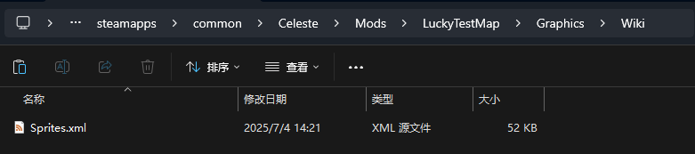

然后在 [Loenn 的元数据](../../metadata/loenn_metadata.md#xml) 中选择你的 `Sprites.xml`, 表示这张地图将使用这个 `Sprites.xml` 为配置, 如下

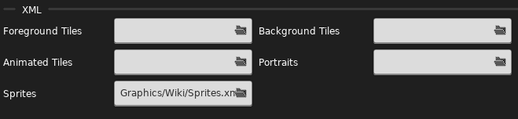

然后我们把配置中的素材路径改成自己的即可

```xml title="路径: /Graphics/Wiki/Sprites.xml" hl_lines="3"

<Sprites>
    <!--  其他内容  -->
    <booster path="objects/Wiki/booster/" start="loop">
        <Justify x="0.5" y="0.5"/>
        <Loop id="loop" path="booster" delay="0.1" frames="0-4"/>
        <Loop id="inside" path="booster" delay="0.1" frames="5-8"/>
        <Loop id="spin" path="booster" delay="0.06" frames="18-25"/>
        <Anim id="pop" path="booster" delay="0.08" frames="9-17"/>
    </booster>
</Sprites>
```

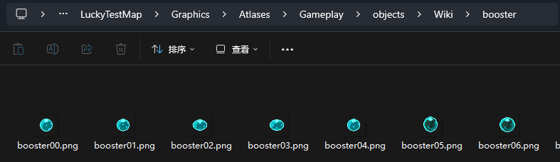

于是我们就能成功替换素材而不影响官图或是其他 Mod 了


<a id="helper"></a>

## 替换 `Refill` 贴图

如果一个实体并没有使用 `Sprites.xml` 中的配置, 而是在代码里直接使用了对应的贴图, 比如这里的 `Refill`, 那我们该怎么办呢

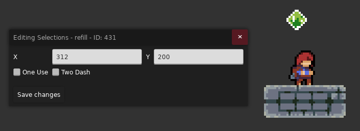

很简单, 我不用不就是了?

我们看看 Helper 有没有给我们提供一些能改皮肤的实体, 于是我们找到了 `Refill [ChroniaHelper]`

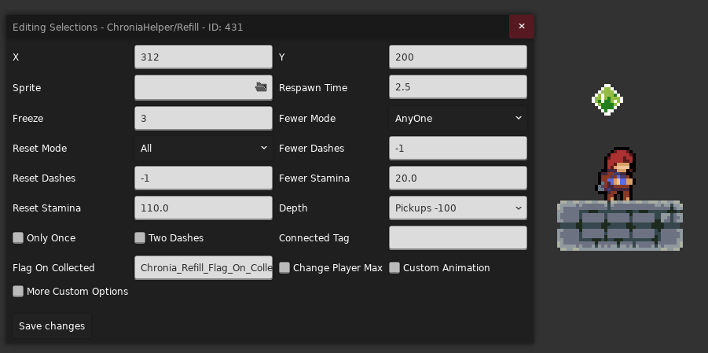

接着我们按照作者的注释来放置我们的图片素材, 如下

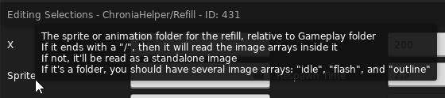

然后找到官图素材

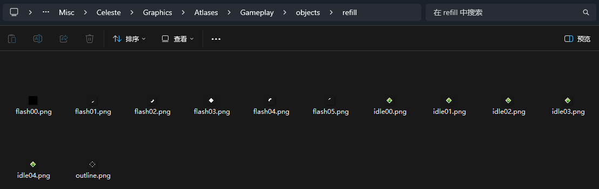

粘一份到自己的 Mod 里, [套文件夹](../../mod_structure.md#conflict)并改色

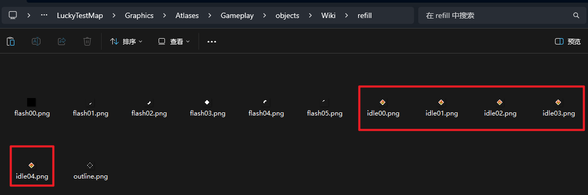

然后按照注释, 填上正确路径 `objects/Wiki/refill/`

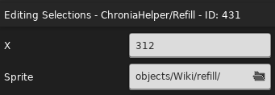

即可完成换肤

> 别忘了开对应 Mod, 不开我用什么啊


<a id="helper_xml"></a>

## 替换 `CollabUtils2/WarpPedestal` 贴图

如果 Helper 实体的配置是让你填 `Sprites.xml` 中的动画组 ID 的话也是跟替换原版 XML 同理, 只需要[到 Helper 文件夹内部找到它的
`Sprites.xml` 里的内容即可](https://www.bilibili.com/video/BV1uUHYzLEu5/?t=3387)

例如 `CollabUtils2/WarpPedestal`

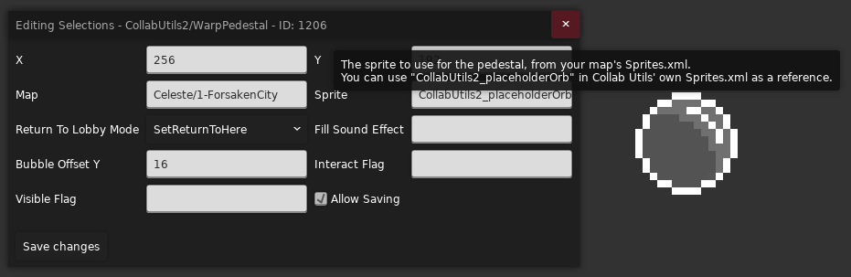

```xml title="路径: CollabUtils2/Graphics/Sprites.xml"

<Sprites>
    <!-- 其他配置 -->
    <CollabUtils2_placeholderOrb path="CollabUtils2/placeholderorb/" start="empty">
        <Justify x="0.5" y="0.92"/>
        <Loop id="empty" path="placeholderorb" frames="0"/>
        <Anim id="before_fill" path="placeholderorb" delay="1" frames="0*2" goto="fill"/>
        <Anim id="fill" path="placeholderorb" frames="1-11" delay="0.1" goto="full"/>
        <Loop id="full" path="placeholderorb" frames="12"/>
    </CollabUtils2_placeholderOrb>
</Sprites>

```

如果

> 如果你好奇为什么 CollabUtils2 的 `Sprites.xml` 可以跟官图的 `Sprites.xml` 同路径, 可以参考[路径冲突 -- `Sprites.xml`](../../mod_structure.md#conflict_sprites_xml)

之后找到对应素材后就完全跟前面的换法一样了 (尻素材, 套路径, 抄配置, 改路径, 最后在实体面板设置即可)

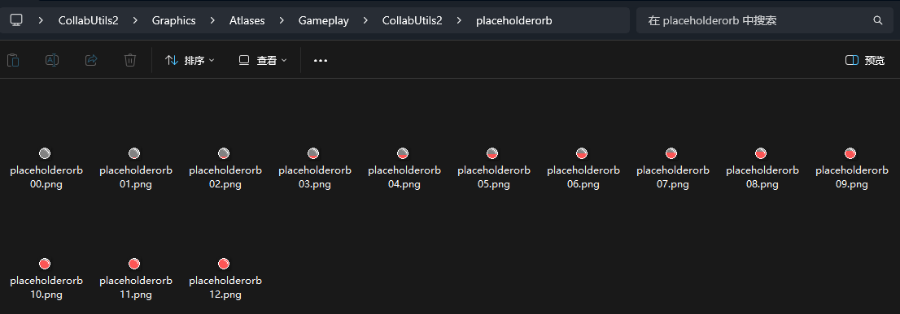

### 注意

如果有些实体并没有给你开放替换皮肤的配置, 但你还是能在它的文件夹中找到相关的 `Sprites.xml`, 这说明其实还是能换的, 只不过人家没把配置开放出来而已

比如肯定存在一条世界线 `CollabUtils2/WarpPedestal` 使用了 `CollabUtils2_placeholderOrb` 这个动画组 ID, 但是没在属性面板里开放

> 这里只是举例说明把 `CollabUtils2/WarpPedestal` 的 `Sprite` 属性[删了](../../loenn/faq.md#loenn_data)

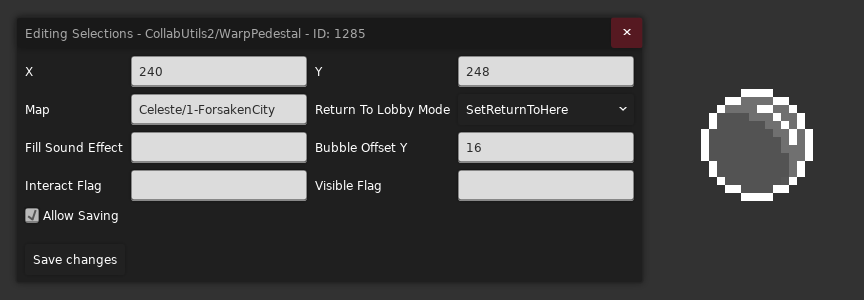

<a id="sprite_replace"></a>

## 替换 `CommunalHelper/MoveSwapBlock` 贴图

如果一个实体是 Helper 自定义的新实体, 但是它既没有为你提供可修改皮肤的配置, 也没有在代码里[使用 `Sprites.xml`](#sprites_xml),
又或是使用了自定义的外部无法干预的 `Sprites.xml`, 像这里的 `CommunalHelper/MoveSwapBlock`, 那我们该怎么办呢

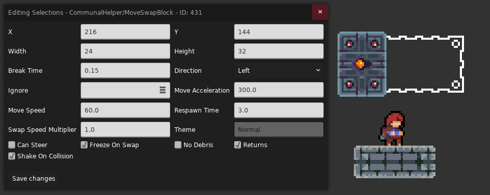

我们可以使用 [`Sprite Replace Trigger`](../../useful_helpers/hELPER.md) 动态的将对应实体的皮肤更换成我们自己的

首先找到 `CommunalHelper/MoveSwapBlock` 用了哪些贴图

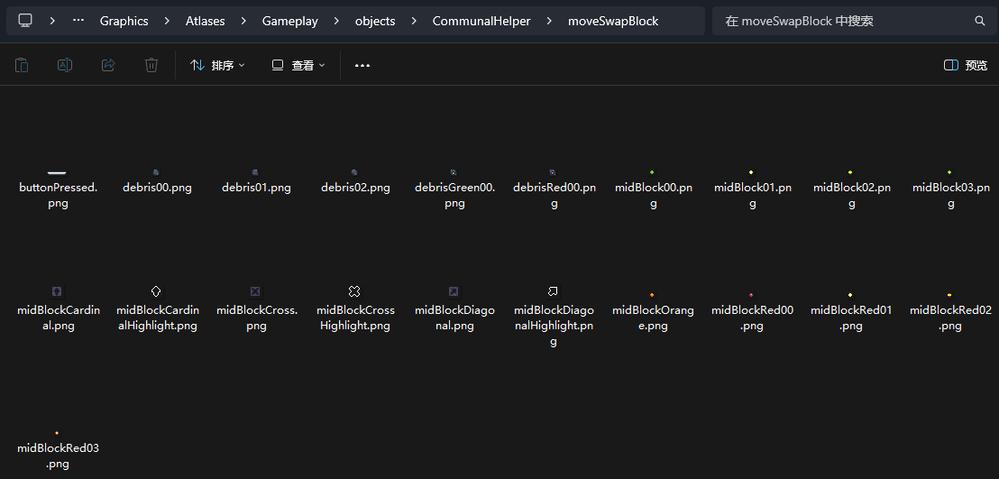

素材对应的公共路径为 `objects/CommunalHelper/moveSwapBlock/`, 我们把素材尻过来随便放在一个地方, 比如这里的 `objects/Wiki/moveSwapBlock`, 然后简单改个色方便查看换肤效果

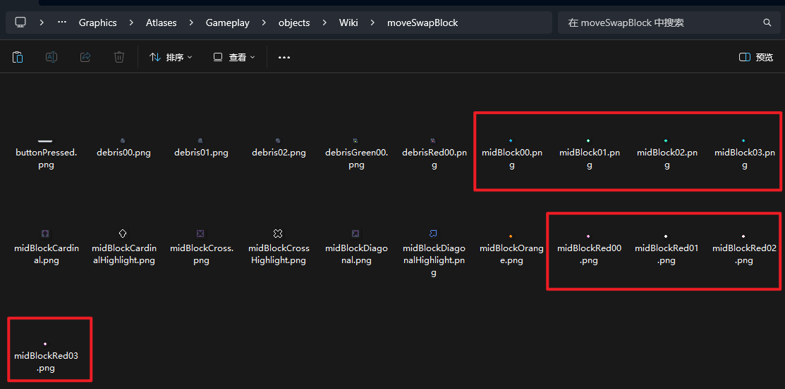

然后在 `Sprite Replace Trigger` 中填入要换肤对象的[完全限定名](../../loenn/faq.md#type)和替换公共路径的新路径即可

* `Affected Types`: `Celeste.Mod.CommunalHelper.Entities.MoveSwapBlock`
* `Sprite Path`: `objects/Wiki/moveSwapBlock`

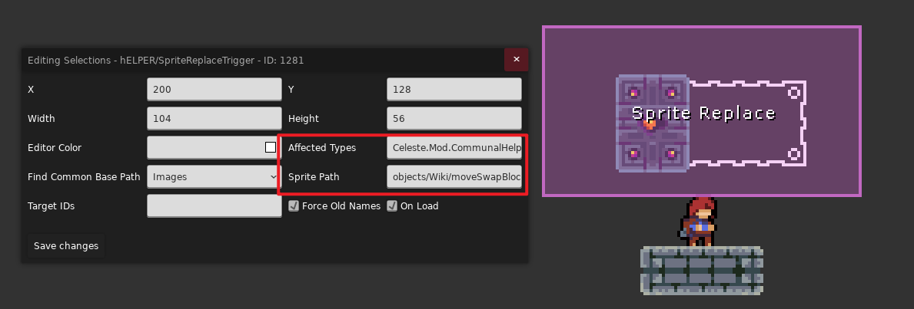

效果

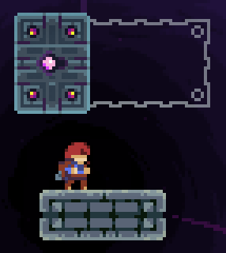

你会发现还有一部分素材使用的是官图素材

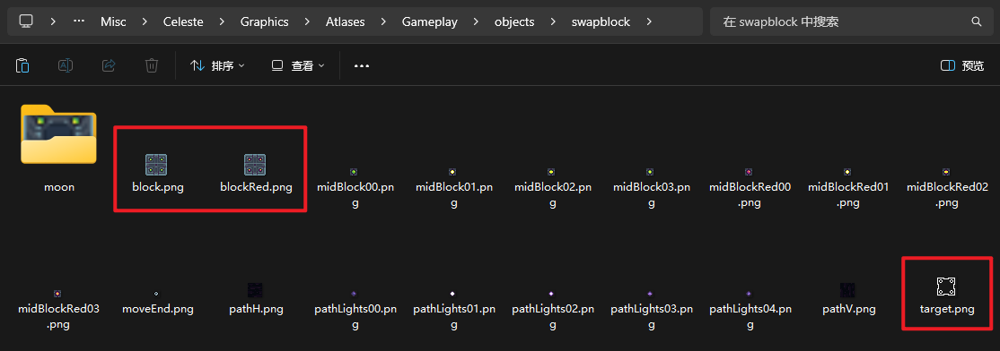

而这部分在代码中是手动绘制的, 所以用 `Sprite Replace Trigger` 不太能改这部分, 所以我们只能暴力替换素材路径, 例如使用 `Atlas Path Replacer`

我们先把官图素材尻过来简单改个色, 如下

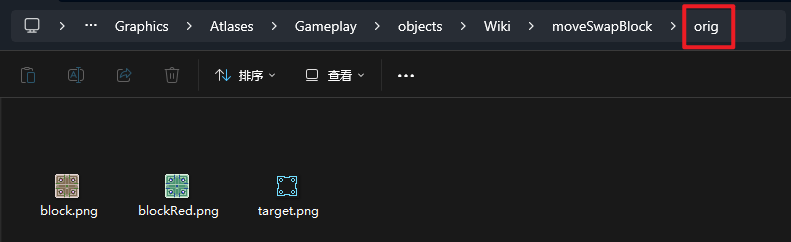

然后把官图素材路径映射到我们的素材路径

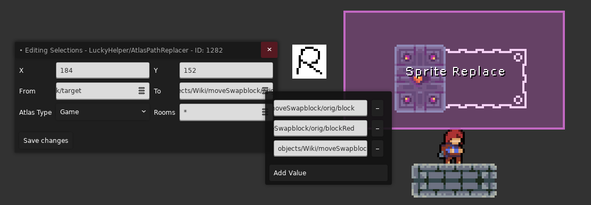

* `objects/swapblock/block`: `objects/Wiki/moveSwapblock/orig/block`
* `objects/swapblock/blockRed`: `objects/Wiki/moveSwapblock/orig/blockRed`
* `objects/swapblock/target`: `objects/Wiki/moveSwapblock/orig/target`

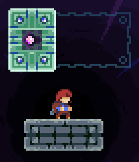

但是你发现中间怎么还有个 `midBlockCardinal.png` 换不了, 因为这部分 `Communal Helper` 是动态修改且硬编码的, 所以我们仍然只能替换路径, 于是我们再次把这个素材尻过来

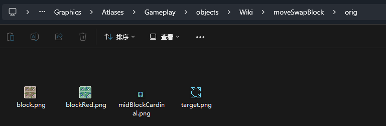

在 `Atlas Path Replacer` 里再加上一组

* `objects/CommunalHelper/moveSwapBlock/midBlockCardinal`: `objects/Wiki/moveSwapblock/orig/midBlockCardinal`

最终效果

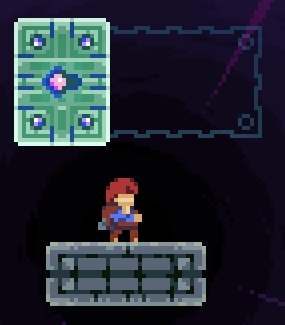

## 根据语言替换贴图

可以使用 [Localization Helper](https://gamebanana.com/mods/644851), 不同语言下可以使用不同的替换方式, 在 `.json` 文件中配置

## 替换任意实体贴图

自己写 [Code](../../code.md)

我又幻想了, 幻想自己写出让众人啧啧称赞的 Helper, 并且在香蕉网上收获上千 Like...
