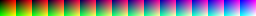

# 皮肤制作

## 参考

* [模板](https://kuksattu.github.io/celeste/skinmod-template/)
* [蔚蓝皮肤制作教程-星夜祈梦](https://www.bilibili.com/video/BV1YpYueREPt)
    * [文字版](../../assets/mappings/graphics/skin/蔚蓝皮肤制作教程-星夜祈梦.pdf)
* [Skin Mod Helper README](https://github.com/bigkahuna443/SkinModHelper/blob/dev/docs/guide/README.md)
* [蔚蓝科技之自制皮肤mod教程](https://www.bilibili.com/video/BV1Uv4y1K751)

如果你已经看过了 [Sprites.xml](../xml/sprites_xml.md) 的引导, 那么改 Madeline 皮肤这事儿应该不难理解

无非就是改贴图, 改 Sprites.xml, 但是这样皮肤只会作用于单图, 而不是随时能使用/切换的皮肤

所以你还得下载 Skin Mod Helper(SMH)/Skin Mod Helper Plus(SMH+) 相关 Helper, 并根据他们指定的规则做相应配置

由于其他教程相对来说讲的已经够详细了, 还有一堆 Mod 可以抄(建议先看其他教程), 这里就简单补充一点(我就是想说!)

## &lt;Metadata&gt;&lt;/Metadata&gt;

### &lt;Frames&gt;&lt;/Frames&gt;

为对应动画的某一帧附上一些"信息"(path: 对应的动画 id), 这里讲解两个比较重要的属性

#### hair

首先你可以了解下蔚蓝的头发是怎么绘制的, 这里举一个相近的[例子](https://www.bilibili.com/video/BV1dy421v7o1), 蔚蓝差不多就是这么干的(在这基础上会加个刘海, 具体看`player`素材里的`bangs00`), 要是想知道更详细的细节欢迎来学 [Code](../code.md)😋

这里的刘海相当于上面例子中的头节点, 其他部分就是一个个圆形

{style="width: 150px; image-rendering: pixelated; title="123"}
{style="width: 150px; image-rendering: pixelated; title="123"}


然后我们开始介绍 `hair` 属性

`hair`的格式类似`a,b|c,d|...|g,h|` , 它被 `|` 分隔成一个个组, 每个组对应了动画的一帧, 按顺序排列, 比如 `idle` 动画占 8 帧, 所以下面配置有 8 组,
每个组有两个数被 `,` 分隔, 表示刘海相对于  Madeline  头顶的某个位置的 x/y 偏移(要是不设置 Madeline 的头就掉了), 因为官方已经大概调好了, 所以你只需要微调 x/y 即可(这也是为什么这些数字都很小的原因),
有些分组形如`a,b:c`, 这里的 `c` 范围为`0~2`(不填默认为 `0`), 表示 Madeline 的刘海朝向(具体看`player`素材里的`bangs00` `bangs01` `bangs02` `bangs03`), 比如像 `idleA` 动画中的 Madeline 会左看看右看看, 这就得修改刘海的朝向 

#### carry

`carry`的格式类似`a,b,c,d,...,l,m,n` , 它被 `,` 分隔成一个个组, 每个组对应了动画的一帧, 表示对应帧抓取物 y 方向的偏移(不然抓取物一直僵在一个高度很不自然)

```xml
<Metadata>
    <Frames path="idle" hair="0,-2|0,-2|0,-2|0,-2|0,-1|0,-1|0,-1|0,-1|0,-1"/>
    <Frames path="idleA" hair="0,-2|-1,-2:1|-1,-2:2|-1,-2:2|-1,-2:2|-1,-1:2|-1,-1:2|-1,-1:2|-1,-1:1|-1,-1:1|-1,-1|0,-1|0,-1"/>
    <Frames path="idleB" hair="0,-2|-1,-2|-1,-2|-1,-2|-1,-2|-1,-2|-1,-2|-1,-2|-1,-2:1|-1,-2:2|-1,-2:2|-1,-2:2|-1,-2:2|-1,-2:1|-1,-2|-1,-2|-1,-2|0,-2|0,-2|0,-1|0,-1|0,-1|0,-1|0,-1"/>
    <Frames path="idleC" hair="0,-2|-1,-2|-2,-2|-2,-2|-2,-2|-2,-2|1,-1|2,0|0,0|-1,-1|0,-1|0,-1"/>
    
    ...

    <Frames path="idle_carry" hair="0,-2|0,-2|0,-2|0,-2|0,-1|0,-1|0,-1|0,-1|0,-1" carry="-1,-1,-1,0,0,0,0,0,-1"/>
    <Frames path="jump_carry" hair="1,-3|1,-3|1,-2|0,-2" carry="-3,-3,-1,-1"/>
    <Frames path="run_carry" hair="1,-2|1,-1|1,-1|1,-1|1,-3|1,-2|1,-1|1,-1|1,-1|1,-1|1,-3|1,-2" carry="-1,0,0,0,-3,-2,-1,0,0,0,-3,-1"/>
    <Frames path="pickup" hair="2,0|1,-1|0,-2|0,-2|0,-2"/>
    <Frames path="throw" hair="0,-3|2,-2|2,-2|1,-2"/>

    ...
  </Metadata>
```

## [ColorGrading](https://github.com/bigkahuna443/SkinModHelper/blob/dev/docs/guide/README.md#part-3-miscellaneous)

使用一张图片来配置皮肤在不同冲次数下的冲刺颜色

<figure markdown>
  {style="width: 900px; image-rendering: pixelated; title=123"}
  <figcaption>路径: Celeste\Content\Graphics\ColorGrading\none.png</figcaption>
</figure>

仔细观察你会发现这张图片是由 16 个 16 x 16 的 像素块组成, 那么聪明的你一定已经想到了吧, 这不就是精度低一点儿的 RGB 嘛, 一个块里用 x 方向(从左上角开始)存储 R, 用 y 方向存储 G,
从左到右 16 个块存储 B(用二维的图片存储三维的颜色信息)

这样你只需要把文件名改成对应的冲次数(具体配置看上面链接, 或者抄), 把对应颜色 A 换成你想要的颜色 B, 
这样 SMH 就可以通过这个配置来设置, 使你在这个冲次数下你皮肤中的颜色 A 变成颜色 B


### [滤镜制作](https://www.bilibili.com/video/BV1WW7czqEPi)

这里本来想贴 WEG 录的视频的, 但是太久远了没找到, 只能新录一个了

既然滤镜本质上是替换颜色, 那么我们把滤镜图片和游戏图片放一起调整即可

视频中演示的是改 HSV, 如果你改 RGB 啥的原理也是一样的


