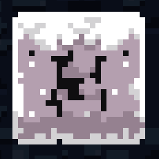
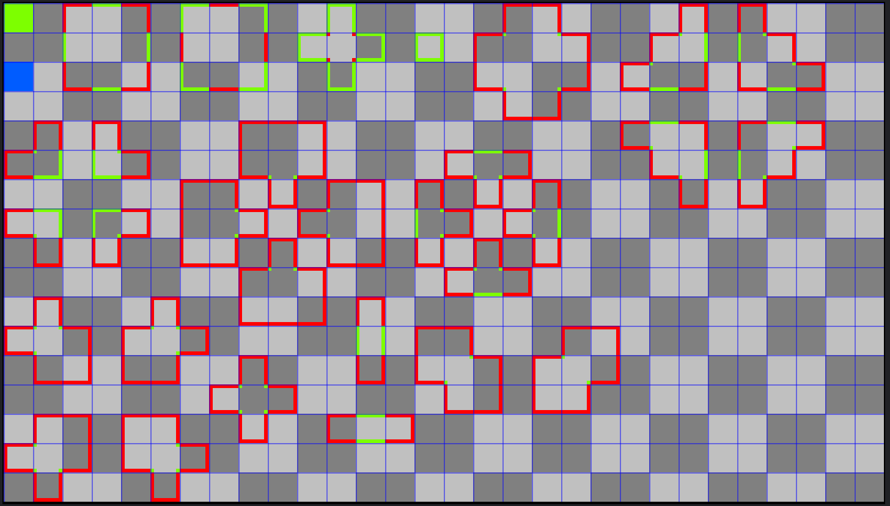

# 自定义瓦片(Tileset)

* [摘自电箱教程](https://www.bilibili.com/video/BV1kV4y137Mn/?spm_id_from=333.788&vd_source=217bacbee37820b5bf3ed2f4fb8f6c94)
* [摘自Everest Wiki](https://github.com/EverestAPI/Resources/wiki/Custom-Tilesets)
* [瓦片集格式参考](https://github.com/EverestAPI/Resources/wiki/Tileset-Format-Reference)
* [motonine的自制tiles教程](../assets/mappings/graphics/tileset/自制tiles教程%5B23.12.17更新%20作者motonine%5D.txt)
* [底龙的自定义tiles教程](https://www.bilibili.com/video/BV1Eu4y1L78Y)

## Tile

Tile, 即**瓦片**

想想我们在贴地面瓷砖或是在房顶摆瓦片的时候, 操作是不是就像在 Loenn 里拿着砖在那儿涂涂画画呢

## Tileset

Tileset, 即 Tile set, **瓦片集**

表示各种瓦片的集合, 就像我们在 Loenn 里涂砖的时候, 不可能所有的砖都一个样, 每个砖的样式会随着周围砖的摆放和清除而变化

Tileset 分为前景砖和背景砖, 这里我们主要讨论前景砖 

我们游戏中的砖主要由一块块 `8px * 8px` 大小的碰撞箱和贴图组成(后文将其称为一个**单元**)


<figure markdown>
  {style="width: 150px; image-rendering: pixelated; title=123"}
  <figcaption>路径: Celeste\Graphics\Atlases\Gameplay\tilesets\cement.png</figcaption>
</figure>

我们以 cement tileset 为例, 我们会发现它正是由一个个 `8px * 8px` 单元的贴图块组成, 游戏里的砖的贴图正是从这里面**切**出来的


当然如果我们把 CelesteTAS 的简化图形看开了, 碰撞箱看的更清楚


现在我们搞清楚了砖是什么, 素材从哪儿来, 现在该开始摆砖了, 但你可能开始头疼起来, 这么一种砖就有这么多个单元, 要一个个选吗, 不仅费事, 还容易选错,
所以这时我们就要指定一套**规则**, 比如看下面这个 `3px * 3px` 大小的自定义砖

{style="width: 150px; image-rendering: pixelated; title=123"}

* 如果我告诉中间的砖: 嘿, 兄弟, 你要是看见周围都有砖的话, 你就把自己的的贴图改成素材第 i 行, 第 j 列单元对应的素材
* 如果我告诉正右边的砖: 兄弟...你好..., 你要是看见上下都有砖, 而且左边也有砖的话, 你就把自己的的贴图改成素材第 m 行, 第 n 列单元对应的素材

如果我们把所有的砖通知一遍, 那是不是就不用我们自己一个个挑素材啦, 而这正是 `ForegroundTiles.xml` 和 Loenn(Celeste 也干了) 在做的事, `ForegroundTiles.xml` 制定了一套规则, 而 Loenn 使用这些规则告诉每个砖该如何绘制(所以如果我们要做自定义砖的话, 我们要自己写`ForegroundTiles.xml`, 而且得在 Loenn 元数据里选)

下面我们来简单介绍一下`ForegroundTiles.xml` 中相对重要的属性(如果你还不知道什么是[XML](https://saplonily.top/celeste_mod_tutorial/other/xml-speedrun/))

更多属性请参考[Everest Wiki](https://github.com/EverestAPI/Resources/wiki/Tileset-Format-Reference)

* `id`: 嗯...就是类似身份证一样的东西, 唯一标识符, 对...你懂的吧...就..就是 id 啊...嗯...比如类比下你叫张三, 你的学号是 114, 那么你的 id 就是 114... id 不能重复你应该知道的吧...
* `path`: 指明了 tileset 对应的素材位置, 路径相对于`Gameplay/tilesets` 文件夹, 例如上面提到的 `cement` 对应的 `id` 就是 `cement` 
* `mask`: 也就是上文提到的**规则**, `x` 表示任意, `0` 表示无砖, `1` 表示有砖, 去掉 `-` 分三行排列刚好是个 `3 x 3` 的块, 如果填`padding`则表示最外层的里面一层(例如对于`4 x 4`的块, 它的`padding`在`3 x 3`位置), 如果填`center`, 则表示剩下的没有被考虑的所有情况(一般来说就是指中间的), 一个单元就是通过这样的规则来判断自己要选择什么贴图的  
* `tiles`: 对应素材的哪些单元(一个单元占`8px * 8px`的大小并且坐标从左上(0, 0)位置开始算, (1, 0)表示第二列第一行对应的单元格, 是的没错, 从列开始算!)  
* `ignores`: 需要忽略的 tileset 对应的 id, 被忽略后, 周围要是有那个 tileset, 则那个位置在当前 tileset 的 mask 中会被视为空气, 即 `0(无砖)` 
* `copy`: 需要拷贝配置(即内部的`set`节点)的 tileset 对应的 id, 这样我们就可以只写一个 template(模板) 然后复用了, 当然我们可以继续写`set`节点来覆盖拷贝过来的一部分配置  
* `sound`: Everest 添加的额外配置, 表示玩家踩上去什么声音, 写在`set`节点里, 如`<set ... sound="1"/>`

??? Sound对照表
    0. 无
    1. 沥青路（序章车后边的道路
    2. 车
    3. 土
    4. 雪
    5. 木头
    6. 桥
    7. 钢梁
    8. 砖
    9. traffic block
    10. (unused)
    11. 未启用时的果冻
    12. 启用时的果冻
    13. 山庄木头
    14. 山庄房顶
    15. 山庄移动板
    16. 山庄地窖砖
    17. 山庄衣物
    18. 山庄箱子
    19. 山庄书
    20. resort forcefield
    21. 山庄清理杂物开关
    22. 山庄电梯
    23. 山脊雪
    24. (unused)
    25. 枯草
    26. (unused)
    27. 山脊白块
    28. 缆车
    29. (unused)
    30. (unused)
    31. (unused)
    32. 玻璃
    33. 草
    34. (unused)
    35. 节奏块
    36. 核心冰块
    37. 核心岩石
    38. (unused)
    39. (unused)
    40. 故障块
    41. (unused)
    42. 网吧（凌波微步.ppt那个房子）
    43. 云
    44. 月亮块


```xml title="Celeste\Content\Graphics\ForegroundTiles.xml"
<Data>
  <Tileset id="z" path="template">
    <set mask="x0x-111-x1x" tiles="0,0;1,0;2,0;3,0"/>
    <set mask="x1x-111-x0x" tiles="0,1;1,1;2,1;3,1"/>
    <set mask="x1x-011-x1x" tiles="0,2;1,2;2,2;3,2"/>
    <set mask="x1x-110-x1x" tiles="0,3;1,3;2,3;3,3"/>

    ...

    <set mask="010-111-010" tiles="4,12"/>
    <set mask="110-111-011" tiles="4,13"/>
    <set mask="011-111-110" tiles="4,14"/>

    <set mask="padding" tiles="5,0;5,1;5,2;5,3;5,4;5,5;5,6;5,7;5,8;5,9;5,10;5,11"/>
    <set mask="center" tiles="5,12"/>
  </Tileset>
  <Tileset id="1" copy="z" path="dirt" ignores="g"/>
  <Tileset id="m" copy="z" path="lostlevels" ignores="n">
    <set mask="padding" tiles="5,0;5,1;5,2;5,3;5,4;5,5"/>
    <set mask="center" tiles="5,6;5,6;5,6;5,6;5,6;5,6;5,6;5,6;5,6;5,6;5,6;5,6;5,6;5,6;5,7;5,8;5,9;5,10;5,11;5,13;5,14;5,7;5,8;5,9;5,10;5,11;5,13;5,14;5,12"/>
  </Tileset>
</Data>
```

好了, 现在你已经完全懂了, 你可以

* 直接对原版素材改色, 然后把官图的`ForegroundTiles.xml` copy 一份, 在新的那份中添加一个自己的 Tileset节点, 之后在Loenn元数据里选择这个新的`xml`即可 
* 照着原版的 template 砖改 
* 自己写一个`ForegroundTiles.xml`
* 抄/借别人的`ForegroundTiles.xml`, 详情见[Everest Wiki](https://github.com/EverestAPI/Resources/wiki/Custom-Tilesets)
* 向群友要一份, 群友什么都有😋

## 自定义 ForegroundTiles.xml

虽说你可以直接改色或者抄, 我还是撸了一份样例来帮助大家自制 ForegroundTiles.xml(丐版制作耗时不超过 4 节水课)

我们这次将制作纯色砖, 为的是便于理解点和线之间的关系, 而且无需为一种规则的单元画多种样式(绝对不是我懒

### 借用 xml

首先你肯定得有xml才能写吧, 简单点就是直接从官图文件(路径: `Celeste\Content\Graphics\ForegroundTiles.xml`)里复制粘贴出来, 不然就自己建一个, 之后放在自己的mod里, 随便取什么名字, 放哪儿都行(但要记得之前提过的重名问题, 需要套文件夹来降低风险)

这里仿照官图就直接塞 Graphics 文件夹里了, 就像这样


### 清理, 补充 xml

既然都是自制 ForegroundTiles.xml, 那官图相关的配置就没必要留了(你想留的话也可以), 清理一下, 然后加上自己的配置后大概长这样(记得看里面灰灰的注释)
```xml 

<Data>
    <!-- 这里是一些官图配置, 如果你不删的话 -->
    ...
    
  <Tileset id="A" path="awa">
      <!-- 我们之后在这里写规则-->
  </Tileset>
      <!-- 好像得至少写一个带 copy 的节点 Loenn 才会显示, 所以这里我们重复写一遍 -->
  <Tileset id="B" copy="A" path="awa"/>
</Data>

```

### 准备 tileset 素材

可以使用任意像素绘画软件(Aseprite, Pixel Studio, PS等)

<figure markdown>
  {style="width: 700px; image-rendering: pixelated; title=123"}
  <figcaption>路径: Celeste\Mods\CelesteWikiTutorial\Graphics\Atlases\Gameplay\tilesets\awa.png</figcaption>
  <figcaption>可右键图像另存为</figcaption>
</figure>

<figure markdown>
  {style="width: 700px; image-rendering: pixelated; title=123"}
  <figcaption>使用软件自带网格查看更加清晰</figcaption>
</figure>

### 写配置

虽然写配置在准备素材之后, 但实际操作上我们是边写配置边画的

对于一个单元, 它只会由点和线组成, 最多 4 个点, 4 条边, 最少 0 个点, 0 条边, 所以我们可以分类讨论穷举所有情况

我们用绿色/蓝色来表示规则里对应的砖, 红色只是方便理解对应的情况

```xml title="Celeste\Mods\CelesteWikiTutorial\Graphics\PureColorForegroundTiles.xml"
<Data>
  <Tileset id="A" path="awa">
    <!-- 0 个点, 0 条边 -->
    <!-- 绿色 -->
    <set mask="center" tiles="0,0"/>
    <!-- 蓝色 -->
    <set mask="padding" tiles="0,2"/>  

    <!-- 0 个点, 1 条边 -->
    <set mask="x0x-111-111" tiles="3,0"/>
    <set mask="111-111-x0x" tiles="3,2"/>
    <set mask="x11-011-x11" tiles="2,1"/>
    <set mask="11x-110-11x" tiles="4,1"/>

    <!-- 0 个点, 2 条边 -->
    <!-- L型 -->
    <set mask="x0x-011-x11" tiles="6,0"/>
    <set mask="x0x-110-11x" tiles="8,0"/>
    <set mask="11x-110-x0x" tiles="8,2"/>
    <set mask="x11-011-x0x" tiles="6,2"/>
    <!-- 平行 -->
    <set mask="x0x-111-x0x" tiles="12,14"/>
    <set mask="x1x-010-x1x" tiles="12,11"/>

    <!-- 0 个点, 3 条边 -->
    <set mask="x0x-010-x1x" tiles="11,0"/>
    <set mask="x0x-110-x0x" tiles="12,1"/>
    <set mask="x1x-010-x0x" tiles="11,2"/>
    <set mask="x0x-011-x0x" tiles="10,1"/>

    <!-- 0 个点, 4 条边 -->
    <set mask="x0x-010-x0x" tiles="14,1"/>

    <!-- 1 个点, 0 条边 -->
    <set mask="011-111-111" tiles="17,1"/>
    <set mask="110-111-111" tiles="18,1"/>
    <set mask="111-111-110" tiles="18,2"/>
    <set mask="111-111-011" tiles="17,2"/>

    <!-- 1 个点, 1 条边 -->
    <!-- 左上 -->
    <set mask="01x-110-11x" tiles="23,1"/>
    <set mask="011-111-x0x" tiles="22,2"/>
    <!-- 右上 -->
    <set mask="110-111-x0x" tiles="26,2"/>
    <set mask="x10-011-x11" tiles="25,1"/>
    <!-- 右下 -->
    <set mask="x11-011-x10" tiles="25,5"/>
    <set mask="x0x-111-110" tiles="26,4"/>
    <!-- 左下 -->
    <set mask="x0x-111-011" tiles="22,4"/>
    <set mask="11x-110-01x" tiles="23,5"/>

    <!-- 1 个点, 2 条边 -->
    <set mask="01x-110-x0x" tiles="1,5"/>
    <set mask="x10-011-x0x" tiles="3,5"/>
    <set mask="x0x-011-x10" tiles="3,7"/>
    <set mask="x0x-110-01x" tiles="1,7"/>

    <!-- 1 个点, 3 条边(不存在) -->
    <!-- 1 个点, 4 条边(不存在) -->
     
    <!-- 2 个点, 0 条边 -->
    <!-- 同侧 -->
    <set mask="111-111-010" tiles="9,5"/>
    <set mask="011-111-011" tiles="11,7"/>
    <set mask="010-111-111" tiles="9,9"/>
    <set mask="110-111-110" tiles="7,7"/>
    <!-- 对角 -->
    <set mask="110-111-011" tiles="15,12"/>
    <set mask="011-111-110" tiles="19,12"/>

    <!-- 2 个点, 1 条边 -->
    <set mask="x0x-111-010" tiles="16,5"/>
    <set mask="01x-110-01x" tiles="18,7"/>
    <set mask="010-111-x0x" tiles="16,9"/>
    <set mask="x10-011-x10" tiles="14,7"/>

    <!-- 2 个点, 2 条边(不存在) -->
    <!-- 2 个点, 3 条边(不存在) -->
    <!-- 2 个点, 4 条边(不存在) -->


    <!-- 3 个点, 0 条边 -->
    <set mask="010-111-011" tiles="1,11"/>
    <set mask="010-111-110" tiles="5,11"/>
    <set mask="110-111-010" tiles="5,15"/>
    <set mask="011-111-010" tiles="1,15"/>

    <!-- 3 个点, 1 条边(不存在) -->
    <!-- 3 个点, 2 条边(不存在) -->
    <!-- 3 个点, 3 条边(不存在) -->
    <!-- 3 个点, 4 条边(不存在) -->

    <!-- 4 个点, 0 条边 -->
    <set mask="010-111-010" tiles="8,13"/>

  </Tileset>

  <!-- 好像得至少写一个带 copy 的节点 Loenn 才会显示-->
  <Tileset id="B" copy="A" path="awa"/>
</Data>
```
### 在 Loenn 中选择配置

不要问我元数据是什么😡


然后`Ctrl + F5`刷新 Loenn, 随便涂涂画画即可

### 成果展示

理论上 Loenn 只会显示绿色和蓝色的砖


