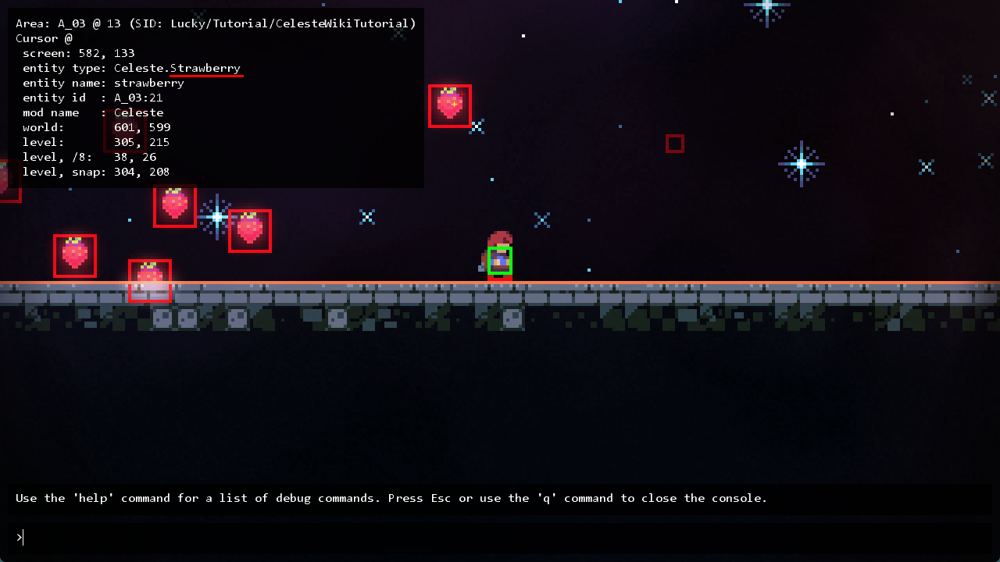

## [b站 Wiki 常见问题解决方案](https://wiki.biligame.com/celeste/Loenn#%E5%B8%B8%E8%A7%81%E9%97%AE%E9%A2%98){:target="_blank"}

## [Everest Wiki 常见问题解决方案](https://github.com/EverestAPI/Resources/wiki/Mapping-FAQ){:target="_blank"}

## [常见 Helper 问题 by 底龙](https://uddrg.notion.site/UnderDragon-s-Partial-Wiki-2737f4f27e63808582b3f0689163d8f9?p=2737f4f27e638075b776eeb404fda8b3&pm=s){:target="_blank"}

## [Discord 问答区](https://discord.com/channels/403698615446536203/953393160464269402){:target="_blank"}

你能问出的问题别人大概率也问过了, 可以在问答区和和全局搜索区(右上角)试着搜搜看

## 为什么不能切板

请放重生点: 请好好阅读其他教程先(

## xxx 出问题了, 没反应, 没效果

内容填对了吗?

保存了吗(Save Changes了吗, Loenn 保存了吗, Ctrl + S 了吗)?

路径对了吗(斜杠有敲反吗, 文件名对吗, 要加后缀吗)?

xml 内容对了吗(id 冲突, 模板错误, 是否多加或者少加了一个 `/`)?

Mod 启用了吗?

游戏重启了吗?

## 忘了自己把地图文件保存在哪儿了

重开一次 Loenn, 右下角应该会显示 "Loaded map: xxxx.bin", 或者你下个 `Everthing`

## 怎么修改查看对象属性

Loenn 里右键对象

## 怎么置顶右侧 placement 条目, 方便查找

双击置顶, 双击取消置顶

## 如何找到 xxx 官图实体的 plus 版

理论上你直接输入这个实体的名字就会跳出来了(所以这个 QA 好像不是很有必要写, 但真的会有人会找不到😂, 或者可能缺 helper), 一般名字会在原来的基础上加上 Custom,
Grouped, Connected 之类的前缀, 最稳的方法是直接在[所有Helper及其对应实体](https://maddie480.ovh/celeste/custom-entity-catalog){:target="_blank"}里搜关键词即可

## xxx 这个实体叫什么

### 推荐的方式

* 搭配[对照表](../useful_links.md#entity), 用你聪明的大脑猜猜看这个实体可能叫什么
* 拆包(即打开对应地图文件查看)
* 下载 CelesteTAS Mod, 运行有这个实体的图, 然后按 `~` 打开控制台点击相应实体的碰撞箱查看信息, 类似于[这样](#type)
* 搜聊天记录

### 不推荐的方式

* 频繁问群友

### 经典永流传

* 灰砖：Crumble Block
* 一碰就碎的砖块：Crumble Block On Touch

## xxx 效果怎么实现

* 搜搜聊天记录
* 想想有没有见过有类似效果的图, 拆包看看人家怎么做的
* 尝试在 Loenn 里搜索关键词:
    * 比如你想改圆刺颜色, 给圆刺换贴图啥的, 那你肯定搜 spinner 吧, 然后发现有 Custom Spinner 这个 Entity
    * 比如你想改电网颜色, 那你肯定搜 lightning 或者 color 吧, 然后发现有 Lightning Color 这个 Trigger
    * 比如你想加个光照, 那肯定搜 glow, bloom, light 什么的吧
* 如果自己解决不了再问群友(不过偶尔随便问问是没问题的)

## xxx Entity/Trigger 怎么用

* 搜搜聊天记录
* 凭直觉试试, 到游戏里看看变化
* 鼠标移到属性上可能会显示详细的描述(俗称注释)
* 到香蕉网上搜对应的 helper, 运气好的话, 它的界面上会提供 wiki 链接, 里面会有更加详细的描述([所有Helper及其对应实体](https://maddie480.ovh/celeste/custom-entity-catalog){:target="_blank"})
* 如果你会 code, 有时直接看源码也不失为一种好办法(不是
* 还不行就请教群友

## 如何把不同 tile 分层

* 一种方法是用 viv helper 的 custom depth tile entity
* 另一种方法是改 [ForegroundTiles.xml](../xml/tilesets.md) 给 tile 加 ignore

## 怎么做对准

按住 ctrl 就能`1px` `1px`地移动对象了

## 怎么游戏里更新不了 Mod 了

先关闭 Loenn, 因为它占用了 Mod 文件, 所以你会发现开着的时候想删 Mod 都删不了

## 为什么我的刺吸在另一个红绿灯上了

请先阅读[更新顺序](../../general/common/mechanics.md#_3), 所以你想让刺吸在另一个红绿灯上就把那个红绿灯删了重放即可, 对了, 想在 Loenn 里判断深度直接看谁的图层在下面即可,
这里就是在下面的红绿灯先加载, 先占刺

## 怎么将两个物体绑定在一起

用 Eevee Helper 的 [Attached Container](../useful_helpers/eevee.md#attached-container)

## 我的镜头怎么不受控制了, 看望远镜怎么死了

可参考[镜头垂直锁定](../../general/common/mechanics.md#_13), 大概率是因为你的场景内 有badeline 球, 把它的 `Lock Camera` 属性取消即可

## 这个实体上的属性让我填的路径填什么

把鼠标移到属性上可能会显示详细的描述, 上面可能直接告诉你根路径在哪儿了(一般相对与 gameplay 或者原贴图所在文件夹)

如果没告诉你, 那看看这个栏目有无默认值, 有默认值就可以参照素材在原官图素材中的位置很方便的推导出这个路径是相对什么文件夹的

如果还没有, 那么可以在对应 Helper 的 香蕉网 / Github 上查看有无相应文档(在[所有实体列表](https://maddie480.ovh/celeste/custom-entity-catalog){:target="_blank"}上搜索更方便)

如果都没有, 要么就是作者觉得填的东西非常符合直觉所以没加注释, 要么就是懒, 问群友还是搞不懂的话就算了吧, ~~不过真的有这样的实体吗~~

## 路径对的但图片加载不出来

看看斜杠是不是反了, 要用正斜杠 `/` 而不是反斜杠 `\`, ~~一般偷懒直接从文件资源管理器里复制过来的路径都是反斜杠~~

## Loenn 数据

我们有时能看到群友在互相转发如下所示的东西

```ini
{
    {
        _editorLayer = 0,
        _fromLayer = "entities",
        _id = 160,
        _name = "refill",
        oneUse = false,
        twoDash = false,
        x = 1536,
        y = 552
    }
}
```

这些其实就是 Loenn 里各种实体, 触发器, 背景的数据, 对着选中实体复制一下粘到 `.txt` 里你就懂了, 本质上和你打开属性面板看到的东西是一样的(比如上面这个就是 `Refill` 实体的属性数据), 
所以你经常能看到群友在转发它们, 使得这些实体可以在大家的 loenn 里相互传播


### 添加隐藏数据😱

在此基础上 mapper 们甚至还整出了为其添加新的属性的骚操作(原理就是有的 Helper 的配置文件缺失了部分属性, 但是在代码中仍然有用到那个属性(如果找到了属性就用属性的值, 没找到就用默认值)), 所以如果你偷偷在数据后面加对应的属性说不定可以实现一些"隐藏功能", 至于为什么 Helper 作者把属性删了, 
估计是不小心的, 也有可能是觉得对应属性没什么人用, 加了容易增加实体学习成本之类的

#### 举例

Bounce Helper 的 Bounce Move Block 属性长这样, 你想改它贴图但是发现好像改不了

```json
{
    {
        _editorLayer = 0,
        _fromLayer = "entities",
        _id = 350,
        _name = "BounceHelper/BounceMoveBlock",
        activationFlag = "",
        direction = "Right",
        height = 32,
        oneUse = false,
        speed = 60,
        width = 48,
        x = 1384,
        y = 336
    }
}
```

在翻看[源码](https://github.com/FlynnSC/BounceHelper/blob/d52a0b2b97e1014fc132110373492694fdf27f1a/Source/Entities/BounceMoveBlock.cs#L280){:target="_blank"}后你会发现, 他使用到了 `spritePath` 这个属性, 默认值为 `objects/BounceHelper/bounceMoveBlock`

```csharp
data.Attr("spritePath", "objects/BounceHelper/bounceMoveBlock")
```

所以如果我们要加贴图的话自己偷偷把属性加上就好了, 之后换贴图就跟普通的换法如出一辙了

```json
{
    {
        _editorLayer = 0,
        _fromLayer = "entities",
        _id = 350,
        _name = "BounceHelper/BounceMoveBlock",
        activationFlag = "",
        direction = "Right",
        height = 32,
        oneUse = false,
        speed = 60,
        width = 48,
        x = 1384,
        y = 336,
        spritePath="objects/BounceHelper/bounceMoveBlock"
    }
}
```


## 如何获取实体 Type 名

下载 Celeste TAS Mod, 运行有这个实体的图, 然后按 `~` 打开控制台点击相应实体的碰撞箱, 在左上角查看相应信息, 比如草莓的 Type 就是 `Celeste.Strawberry`, 但是大部分 Helper 支持简写,
所以一般都是写 `Strawberry` 就够了

{style="width: 1000px; title="123"}

如果信息刷屏了, 你可以在控制台输入 clear 来清除它们

## 砖瓦 XML 核对清单 by 底龙

1. XML 是否应用进地图(Metadata 里是否已经设置好 XML), 前景砖(ForegroundTiles.xml)后景砖(BackgroundTiles.xml)是否对应
2. XML 格式是否正确, 大容器为 `<Data></Data>`, 小容器为 `<Tileset id="" path=""></Tileset>`(记得下载 [XML 插件](../xml/xml.md), 别用你那记事本看半天纯文本了)
3. XML 的模板是否包含原版模板 `id="z"`, 不包含会崩(反正我这里基本上必崩)
4. `<set mask="x0x-111-111" tiles="3,0" sprites="xxx"/>` (模板主体)里面是否包含多余的 sprites, 有的话查看是否有对应的 AnimatedTiles.xml
5. 每个砖的 `id` 必须不同, 一般为一个字符, 允许中文, 但是绝对不能重复
6. `<Tileset id="" path="">` 中的 `path` 部分是否填写正确, 不要多了或者少了 `/`
7. 同一种砖换砖材质时尽可能保持 `id` 相同
8. 有时你使用了错误的模板在 loenn 里画好砖后, 之后又使用了正确的模板, 那么得在 loenn 里重新涂一次砖