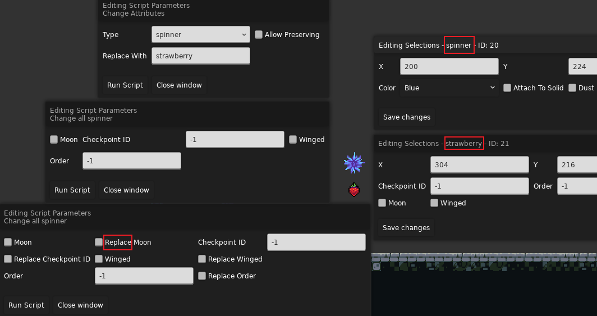

# Loenn 插件

我将在这里对一些相对简单的插件(也可能是插件的部分功能)作简短的介绍

[记得先把该下的 Mod 都下了(](../start/must_do.md#helper)

## Room

{style="width: 150px; title="123"}

原来移动房间需要按 `Alt + 方向键`, 现在你可以用鼠标拖动/创建房间了

## [styleground preview](https://gamebanana.com/tools/11768){:target="_blank"}

{style="width: 500px; title="123"}

方便我们在 Loenn 里查看 Parallax 背景在游戏中的实际效果

## [Entity Brush](https://gamebanana.com/tools/10691){:target="_blank"}

按鼠标中键选取实体, 接着像刷砖块一样刷实体

## [Teleporter](https://gamebanana.com/tools/11768){:target="_blank"}

点击地图上的某个位置传送过去, 类似 F6 的功能

## [Copy / Paste Stylegrounds](https://gamebanana.com/tools/11768){:target="_blank"}

在 Scripts 一栏找到这两项

{style="width: 700px; title="123"}

首先进入你想拷贝背景的图, 然后使用如下插件

{style="width: 700px; title="123"}

* Convert Apply Groups To Flattened List: 将拷贝出来的数据扁平化(就是减少嵌套), 看起来简洁点
* Only Selected Rooms: 只拷贝当前选中的房间的背景

然后回到你的地图来粘贴你复制的背景

{style="width: 700px; title="123"}

* Replace Only: 将背景应用于特定的房间
* Add Tags: 给你的背景打上 Tag, 一般用于 Mask
* Replace Existing Stylegrounds: 清除掉原来的背景

## Change Attributes

我们常常使用这个插件来一键替换实体, 比如你摆好了刺, 但是想用自定义的刺的时候就可以用这个插件换

也很容易实现各种奇异搞笑的效果, 比如 [7c, 但是刺都变成草莓](https://www.bilibili.com/video/BV1fj411b7Vt){:target="_blank"}

{style="width: 1000px; title="123"}

左上角就是插件面板

Type 和 Replace With 分别表示要被替换的实体 SID, 和要替换成的实体 SID, SID 就是实体面板上面红色框起来的部分

而 Allow Preserving 简单来说就是你想挑个别属性换, 还是全换, 如果你想全换, 那么就不勾选, 它会打开左中的面板, 如果你想挑着换, 那就勾选, 它会打开左下面板, 你可以勾选 Replace XXX 来替换对应属性
