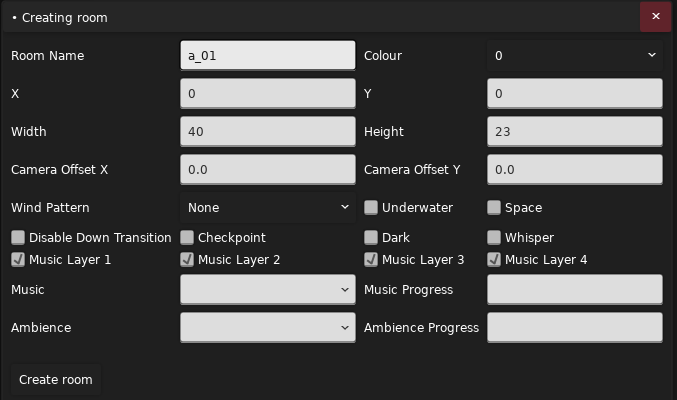
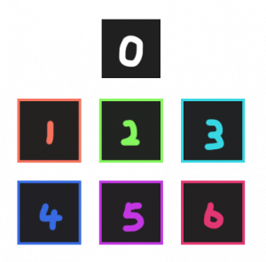

摘抄/整合/引用

* [by b 站 Wiki](https://wiki.biligame.com/celeste/%E6%88%BF%E9%97%B4%E5%B1%9E%E6%80%A7)
* [房间属性, 元数据, 文本 by Saploniy](https://saplonily.top/celeste_modding_tutorial/mapping/room_meta_text/#_2)
* [【Celeste蔚蓝】作图教程第二章-基础作图教程 by 电箱](https://www.bilibili.com/video/BV1ze411V7Yb)
* [【Celeste蔚蓝】二代作图教程 1-3 房间制作与设置 (重点) by 电箱](https://www.bilibili.com/video/BV1Mk4y1N76K)
* [【Celeste蔚蓝】二代作图教程 1-4 房间衔接 by 电箱](https://www.bilibili.com/video/BV1F14y1z72i)
* [【Celeste蔚蓝】二代作图教程 1-8 房间过渡 by 电箱](https://www.bilibili.com/video/BV1du4y1e7DK)

## 房间性质

### [坐标系](https://www.bilibili.com/video/BV1Mk4y1N76K/?t=158)

蔚蓝的坐标系与平时常见的平面直角坐标系相同, 只不过 y 轴方向向下

### 重生点

一般情况下玩家无法进入一个没有重生点 (`Player (Spawn Point)`)的房间, 
反之在进入带重生点的房间后会找一个房间内最近的重生点当作自己的重生点 

所以没有带重生点的房间往往作为装饰用的 [Filler](https://www.bilibili.com/video/BV1F14y1z72i/?t=26), 让切板的时候房间之间的过渡更加自然

### [切板](https://www.bilibili.com/video/BV1F14y1z72i/)

只要你的速度能在一帧内使你触碰到另一个房间, 你就能切板到那个房间, 否则你将被限制回当前房间边界内的位置

所以只要把房间贴在一起相连即可实现常规的切板, 
当然如果你拥有[超高的速度](https://www.bilibili.com/video/BV1oV4y1r7YA/?t=75)也可以达成看似不可能的非常规切板

#### [切板卡死](https://www.bilibili.com/video/BV1du4y1e7DK/?t=3)

简单来说如果你切板到对应房间的时候空间不够容纳玩家游戏就会卡死

那么为什么向左切板的时候明明一格空间大小正好也会死呢, 你有没有觉得这根本不是一个特性, 显然这是一个 bug 呀~

### [房间衔接](https://www.bilibili.com/video/BV1du4y1e7DK/?t=48)

一些 Tile 和房间摆放的建议

## 房间属性

### 打开房间属性面板

* 点击对应房间, 按 `Ctrl + Shift + T`
* `右键左侧房间名 -> Edit` 打开房间属性面板
* 顶部导航栏 `Room -> Edit`

### 介绍

- `Room Name`: 房间名称, 不要以 `lvl_` 为前缀即可, 比如 `lvl_awa_qwq` 会被视作 `awa_qwq`, 这可能会引发 bug
- [`Colour`](https://www.bilibili.com/video/BV1Mk4y1N76K/?t=39): 在游戏内 F6 地图中和 Loenn 中显示的房间颜色, 设置后不会对游戏体验有任何影响

- `X`: 房间横坐标 (单位 tile, `8px`)
- `Y`: 房间纵坐标 (单位 tile, `8px`)
- `Width`: 房间宽度 (单位 tile, `8px`)
- `Height`: 房间高度 (单位 tile, `8px`)

- `Camera Offset X`: 房间默认的镜头横坐标偏移 (单位 `48px`)
- `Camera Offset Y`: 房间默认的镜头纵坐标偏移 (单位 `32px`)
- `Wind Pattern`: 房间起始刮风的类型 (见下方列表或是自己用 `Wind Pattern Trigger` 试试)
- [`Underwater`](https://www.bilibili.com/video/BV1Mk4y1N76K/?t=66): 是否让整个房间充满水
- [`Space`](https://www.bilibili.com/video/BV1Mk4y1N76K/?t=75): 房间是否具有 8A/B 结尾的低重力和上下贯通效果
- `Disable Down Transition`: 是否禁用向下切板 (掉下去直接死即使有房间接邻), 在官图 7A/B 中大量用到
- `Checkpoint`: 房间是否是一个记录点, 也就是作为地图新的一节的第一面
- [`Dark`](https://www.bilibili.com/video/BV1Mk4y1N76K/?t=89): 是否降低房间亮度, 与 5A 变黑效果相同
- `Whisper`: 背景是否有人声倒放 (5A 的效果)
- [`Music Layer X`](../audio/params.md#layer): 是否启用第 X 层的音乐
- `Music`: 进入房间时所使用的音乐对应的 [Event ID](../audio/audio.md), 如果空着不写, 那么玩家进入房间时将沿用原来的音乐
- [`Music Progress`](../audio/params.md#progress): 音乐的进度
- [`Ambience`](https://www.bilibili.com/video/BV1Mk4y1N76K/?t=108): 环境音
- `Ambience Progress`: 环境音的进度

    
风的基本类型

    <ul>
        <li><code>Left</code>: 左风 (<code>400px/s</code>)</li>
        <li><code>Right</code>: 右风 (<code>400px/s</code>)</li>
        <li><code>LeftStrong</code>: 左强风 (<code>800px/s</code>)</li>
        <li><code>RightStrong</code>: 右强风 (<code>800px/s</code>)</li>
        <li><code>LeftOnOff</code>: 左间歇风 (<code>800px/s</code>, <code>3s</code>)</li>
        <li><code>RightOnOff</code>: 右间歇风 (<code>800px/s</code>, <code>3s</code>)</li>
        <li><code>LeftOnOffFast</code>: 左快速间歇风 (<code>800px/s</code>, <code>2s</code>)</li>
        <li><code>RightOnOffFast</code>: 右快速间歇风 (<code>800px/s</code>, <code>2s</code>)</li>
        <li><code>Alternating</code>: 左右交替间歇风 (<code>400px/s</code>, <code>3s 风 2s 停</code>)</li>
        <li><code>LeftGemsOnly</code>: 仅在玩家携带草莓籽时挂左风 (<code>400px/s</code>)</li>
        <li><code>RightCrazy</code>: 右极强风, 出现于官图 4C 第三面 (<code>1200px/s</code>)</li>
        <li><code>Down</code>: 下风 (<code>300px/s</code>)</li>
        <li><code>Up</code>: 上风 (<code>400px/s</code>)</li>
        <li><code>Space</code>: 上风, 出现于官图 9-9 (<code>600px/s</code>)</li>
    </ul>

