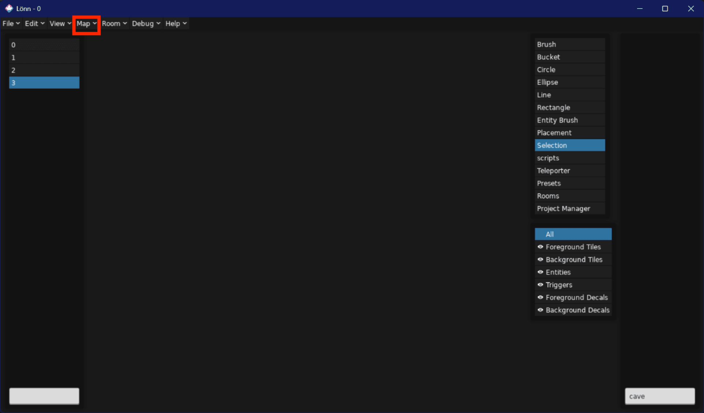
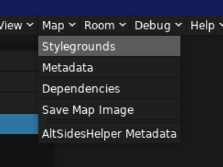
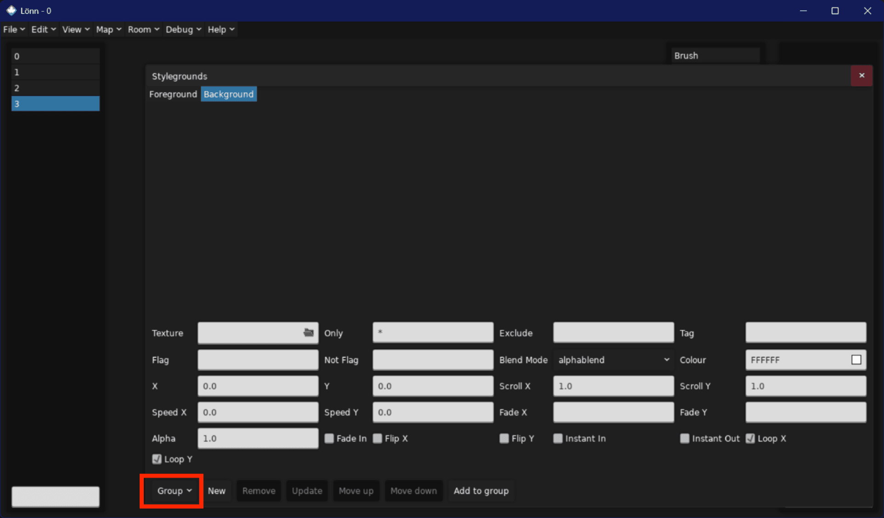
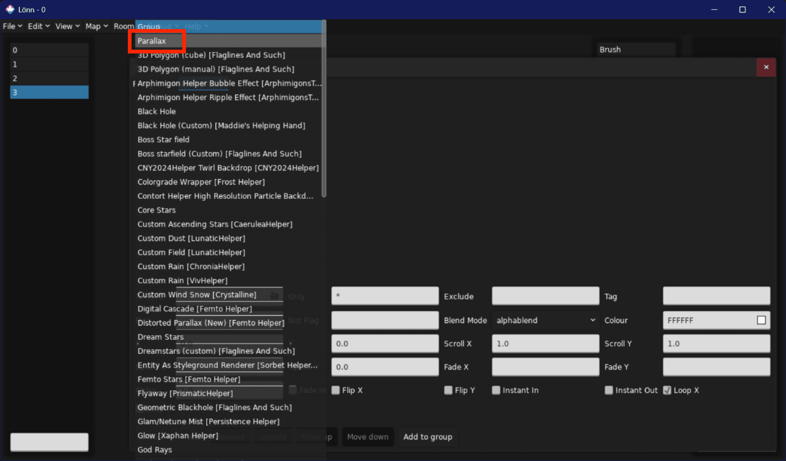
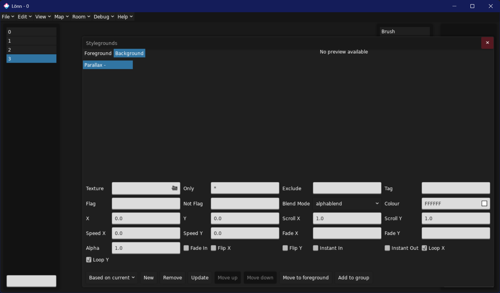
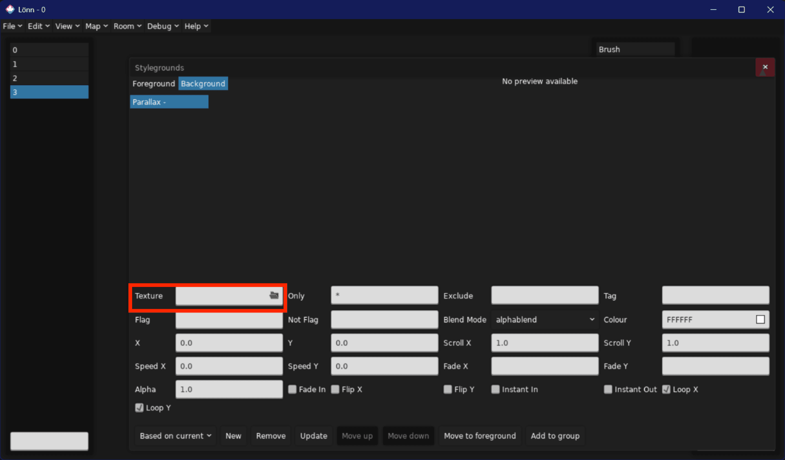

# 地图背景设置

参考

* [Stylegrounds 教程 by Saplonily](https://saplonily.top/celeste_modding_tutorial/mapping/room_meta_text/#stylegrounds)
* [Stylegrounds 教程 by b站 Wiki](https://wiki.biligame.com/celeste/%E8%83%8C%E6%99%AF)
* [Stylegrounds 教程 by Everest](https://github.com/EverestAPI/Resources/wiki/Adding-Stylegrounds)
* [Stylegrounds 教程 by 底龙](https://uddrg.notion.site/UnderDragon-s-Partial-Wiki-2737f4f27e63808582b3f0689163d8f9?p=2737f4f27e6380409619df28307bd725&pm=s)
* [电箱教程 1](https://www.bilibili.com/video/BV1Av4y1D7a8), [电箱教程 2](https://www.bilibili.com/video/BV1HUejzWEjw)
* 冬菜教程(群文件里)


工具

* [Styleground picker](https://styleground-picker.modded-celeste.com/): 方便查看官图背景并可以点击复制路径


## 普通 Parallax 背景

设置背景时, 首先找到[标准文件夹结构](../mod_structure.md)中的 Gameplay 文件夹, 在里面创建如下结构

- 📁 Graphics
    - 📁 Gameplay
        - 📁 bgs
            - 📁 作者名
                - 📁 项目名
                > 把你的背景图片文件放在这里
                    - 📄 backgroundA.png
                    - 📄 backgroundB.png
                    - 📄 backgroundC.png


打开地图编辑器 Map - Stylegrounds

{style="height: 300px;"}
{style="height: 300px;"}

找到左下角的 Group(早期 Loenn 版本可能是 Base On Current, 总之是左下角那个), 
打开选择 Parallax, 选择后, 点击 Parallax 旁边的 New

{style="height: 270px;"}
{style="height: 270px;"}

设置完, 目前状态应该是



现在你就成功为 Loenn 添加了一层 Parallax 背景, 只不过我们还没有为这个背景添加所需的图片素材

所以我们需要在 Texture 处填写图片素材对应文件的路径, 路径相对于 Gameplay 文件夹(不包括 Gameplay 本身)



举例, 按照前文所述创建 bgs 文件夹结构, 这里应该填 `bgs/作者名/项目名/backgroundA` (注意不带.png尾缀)

如果文件正确, 右侧会出现背景的预览图

### 其他选项 <!-- omit from toc -->

#### Only: 房间名

指定 bg 在哪些房间加载, 可以采用 `*` 作为通配符, 比如 `sec*` 代表地图中的 `sec1`, `sec02`, `sec003`, `secXXX`, `secABCDEFG` 等房间都会出现这个背景

#### Exclude: 房间名

指定 bg 不在哪些房间加载

#### Tag、Flag、Not Flag

> 这些选项有时候会跟某些 Helper 的某些功能联系起来

Flag 与 Not Flag 一般指地图某个 flag 激活或者不激活时, 这个背景会显示

#### Blend Mode 混合模式, 即颜色叠加模式

#### Color: HEX 颜色代码

可以对 bg 贴图进行颜色叠加, 适用于一些纯色背景

#### X 和 Y

设定背景位置

#### Scroll X 和 Scroll Y

设置背景视差, 即地图镜头变换多少, 背景会随着镜头变化在横轴竖轴移动 Scroll X 和 Scroll Y 倍的距离

#### Speed X 和 Speed Y

给背景一个初速度

#### Fade X 和 Fade Y: `数值1-数值2,alpha1-alpha2`

当玩家位置的 X 或者 Y 坐标从数值 1 变化到数值 2, 背景的不透明度会从 `alpha1` 变换到 `alpha2`

#### alpha: 0 - 1 之间的小数

设置背景不透明度

#### Fade In

设置背景渐变进入

> 原版没有 Fade Out, 所以有需要的话可以使用 MaxHelpingHand 的 Styleground Fade Controller

#### Instant In 和 Instant Out

背景立刻进入或者消失

#### Flip X 和 Flip Y

将背景水平/竖直反转

#### Loop X 和 Loop Y

背景水平/竖直方向衔接

### 注意事项

1. 背景文件名结尾不能是数字
2. 背景文件名如果需要空格, 建议用下划线代替
3. 背景文件需要是 `.png` 格式的透明背景文件
4. 一个房间大小的背景画布大小为 320 * 180px
5. 如果设置完成后地图内没有及时加载出来, 请尝试重启游戏

## 动态背景

设置背景时, 找到[标准文件夹结构](../mod_structure.md)中的 Gameplay 文件夹, 在里面创建如下结构

- 📁 Graphics
    - 📁 Gameplay
        - 📁 bgs
            - 📁 MaxHelpingHand
                - 📁 animatedParallax
                    - 📁 作者名
                        - 📁 项目名
                        > 把你的动画文件放在这里
                            - 📄 background00.png
                            - 📄 background01.png
                            - 📄 background02.png


之后的操作就跟添加普通 Parallax 背景一样了, 只需要注意填写 Texture 时要一直填写到完整的文件名, 包括数字, 不包括尾缀, 
而且填写时必须填写序列第一帧的文件名, 即`bgs/MaxHelpingHand/animatedParallax/你的名字/你的项目名字/background00`, 
之后将 Maddie’s Helping Hand 加入地图依赖即可(毕竟是这个 Mod 提供的功能嘛)

### 动画控制

- 📁 Graphics
    - 📁 Gameplay
        - 📁 bgs
            - 📁 MaxHelpingHand
                - 📁 animatedParallax
                    - 📁 作者名
                        - 📁 项目名
                        > 把你的动画文件放在这里
                            - 📄 background.meta.yaml
                            - 📄 background00.png
                            - 📄 background01.png
                            - 📄 background02.png


在你的背景图片旁放置一个同名的 `background.meta.yaml`

将以下内容粘贴进去, 并按需修改即可

```yaml
FPS: 10
Frames: 0,1,2,3,4,5
```

* FPS: 控制动画速度
* Frames: 控制帧播放顺序

### 注意事项

1. 背景文件名结尾必须是数字
2. 背景文件名如果需要空格, 建议用下划线代替, 字母和数字之间不建议有特殊字符
3. 背景序列文件需要是 `.png` 格式的透明背景文件
4. 一个房间大小的背景画布大小为 320 * 180px
5. 如果设置完成后地图内没有及时加载出来, 尝试重启游戏

## 高清背景

设置背景时, 找到[标准文件夹结构](../mod_structure.md)中的 Gameplay 文件夹, 在里面创建如下结构

- 📁 Graphics
    - 📁 Gameplay
        - 📁 bgs
            - 📁 MaxHelpingHand
                - 📁 hdParallax
                    - 📁 作者名
                        - 📁 项目名
                            > 可以放置普通背景文件
                            - 📄 backgroundA.png
                            - 📄 backgroundB.png
                            > 也可以放动画文件
                            - 📄 background00.png
                            - 📄 background01.png
                            - 📄 background02.png
                      

设置好背景结构后, 其余操作与前文完全一致

设置完成后将 Maddie’s Helping Hand 加入地图依赖即可

### 注意事项

1. 背景文件名如果需要空格, 建议用下划线代替, 字母和数字之间不建议有特殊字符
2. 背景序列文件需要是 `.png` 格式的透明背景文件
3. 一个房间大小的背景画布大小为 1920 * 1080px
4. 如果设置完成后地图内没有及时加载出来, 尝试重启游戏
