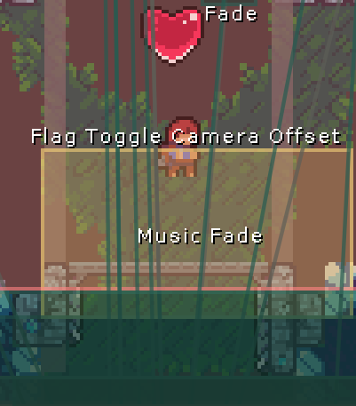
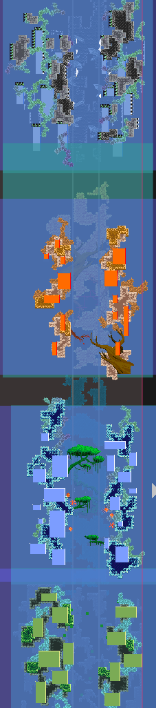

参考

* [【蔚蓝/Celeste】画游心门 画界·万花筒 金草莓](https://www.bilibili.com/video/BV1bttheAEZ6/)
* [地图](https://gamebanana.com/mods/494348)

## [心门 f1 到 f2 衔接](https://www.bilibili.com/video/BV1bttheAEZ6/?t=812)

房间名: GCHeartSide_e5_intro

### 流程

{style="width: 800px; title="123"}

从左往右进入内部, 途径 `ExtendedVariantMode/FloatExtendedVariantFadeTrigger`(被 Trigger Trigger 操控),
使房间亮度 `BackgroundBrightness` 不断变暗

随后进入到心的下方, 两侧被 `MaxHelpingHand/OneWayInvisibleBarrierHorizontal` 挡住, 此时除了吃心别无选择

吃心后, `FemtoHelper/CustomFakeHeart` 触发 flag `NY2024HS_Flag1intro1` , flag 触发 `VivHelper/CustomFallingBlock`, 掉落快下落, 把 player 挤下去(下面的"砖"其实是
`VivHelper/CustomCoverupWall` 无碰撞的空墙, 仅作遮挡作用)

{style="width: 200px; title="123"}

然后使用 lua 关闭 player 的移动, 禁用重试(我看好像还用了 `FrostHelper/NoMovementTrigger`, 是因为 lua 里的 diable 写成 enable 了吗🤔)

```lua title="Assets/ChineseNewYear2024/zzmhelpBside"
function onBegin()
    disableRetry()
    enableMovement()
end

function onEnd(level, wasSkipped)
    if wasSkipped then
        player.ForceCameraUpdate = false
        enableMovement()
    end
end
```

往下掉的黑场过渡使用的是 `JungleHelper/UIImageTrigger`, 碰到就显示一个黑色前景, 离开就不显示, 然后配合 `musicTrigger` 播放声音

刺和果冻之类的选择能调色实体的即可, startJumpBlock 调色则是用了 `everest/starClimbGraphicsController`, 而背景则是使用了 `PrismaticHelper/StylegroundsPanel` 来使用其他房间的背景并以自身作为蒙版所以每一段背景颜色都不太一样 

{style="width: 200px; title="123"}

最后时机差不多了传送到下一个房间即可(顺带一提倒二房间的飞速下落段使用 `ExtendedVariantMode/MaxFallSpeedTrigger` 更改最大下落速度即可)