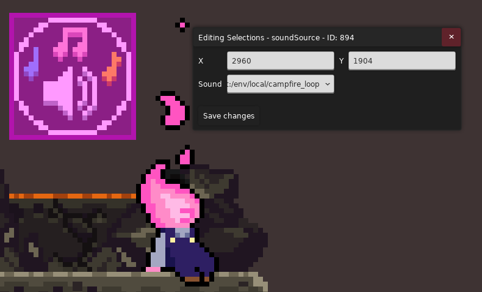

终于要来了吗

来了吗

了吗

吗

我们激动人心的 lua 示例讲解! 在忙活完其他的事之后我终于有功夫腾出来做这个模块了!
由于群友想要了解 `journeys of a bygone wanderer 的开头`, `烈冕号倒一最后`, `画心 f2 到 f1 衔接`, `WELCOME TO MEGALOPHOBIA 的 STAFF ROLL` 相关的剧情制作方式,
于是我会从他们开始, 从头到尾讲解它们关键/有趣的部分, 第一次出现的剧情技巧我会提供一个链接跳转到更详细的解释, 之后再次出现则不再重复, 那么话不多说, 让我们开↗~始~吧~

## 实用

### 快速找到某一段文本被哪个实体使用了

使用 [BinaryXML](../../useful_links.md#tools) 将地图 `.bin` 转化为 `.xml`, 之后在 Dialog 文件夹里的语言文件中找到对应的 dialog key,
之后在 `.xml` 中搜索这个 key 即可(除非这个 key 是硬编码的, 否则这个方法通用)

> 当然情况比较简单的话直接找到对应房间翻着看就行了

### 从某一个房间开始研究, 方便理清顺序

比如你可以查看 `Map -> Metadata` 中的 `Starting Room` 来从初始房间开始研究, 而不是捣鼓了半天连剧情从哪儿开始的都不知道

## 技巧

接下来我会讲解不同的技巧以及他们的出处, 但是为了简洁, 这里就以字母来指代地图名了, 如

* A: [Journeys of a Bygone Wanderer](https://www.bilibili.com/video/BV1SbWSe6EAT/)
* B: [The Solar Express(烈冕号)](https://www.bilibili.com/video/BV1Lx4y1F7wy)
* C: [Gallery Collab(画游心门)](https://www.bilibili.com/video/BV14j421S7Zs/)
* D: [WELCOME TO MEGALOPHOBIA](https://www.bilibili.com/video/BV1Pp5qzPEtL/)
* E: [寻年城](https://www.bilibili.com/video/BV1shfHBmEpj)

### 运动

#### 设置 Player 为 Dummy 状态

使用 `CherryHelper/PlayerStateChange` 将玩家状态设置为 `11`, 即 Dummy, 一般是用在一些简单的场合让玩家不能动

<a id="teleport"></a>

#### 传送

* A: 通过 Lua Cutscene 触发对应 Flag, 触发对应 [Trigger Trigger](../../useful_helpers/trigger_trigger.md), 触发对应[传送 Trigger](../teleport.md), 传送到对应 Teleport Target
* B: 你可以调整传送 Trigger 的触发时间, 这样你就可以用 Trigger Trigger 做一个简单的[开门进入效果](https://www.bilibili.com/video/BV1Lx4y1F7wy/?t=170)(`设置 player 状态为 dummy` ->
  `使用 flag 使前景淡入` -> `等待若干时间后开始传送`)

<a id="slip-in"></a>

#### 滑入

B: 通过 `XaphanHelper/Slope` 斜坡实体, 用 lua 让玩家向右行走并播放下蹲动画, 可以参考[视频](https://www.bilibili.com/video/BV1Lx4y1F7wy/?t=22)

#### 倒走

B: 使用 walkTo 的时候把 `walkBackwards` 参数设置为 true, 可以参考[视频](https://www.bilibili.com/video/BV1Lx4y1F7wy/?t=22)

``` lua
walkTo(15408, true) -- 第二个参数表示是否倒着播放动画, 同时水平翻转你的人物贴图, 让他看起来往左跑但实际上是在向右移动
```

### 文本

<a id="show-text-by-order"></a>

#### 按序触发 UI 文本

A: 通过使用 Lua Cutscene 让 player 向右行走, 按序接触 [UI Text](../text.md#ui-text)

<a id="scroll-text"></a>

#### 滚动文本

E: 使用硬币门让玩家从上往下运动, 看起来就像[字从下往上滚动](https://www.bilibili.com/video/BV1shfHBmEpj/?p=2&t=1093)(这里文本使用了 `DBBHelper/AlignedText`)

### 视效

<a id="black-background"></a>

#### 黑色背景

* A: 啥背景都不加不就是黑色的了🤓☝️
* A: 整个黑色的图片(decal 啥的都行)

<a id="hide-player"></a>

#### 隐藏玩家

* A: 使用 `Camera Target Trigger` 将相机移动到一个看不到玩家的地方
* A: 使用异变 `ExtendedVariantMode/BooleanExtendedVariantTrigger` 的 `AlwaysInvisible` 直接隐藏玩家
* A: [直接把玩家塞土里](https://www.bilibili.com/video/BV1SbWSe6EAT/?t=4178)
* A: [整个前景直接把玩家遮住](https://www.bilibili.com/video/BV1SbWSe6EAT/?t=4166)

<a id="create-npc"></a>

#### 创建 NPC

```lua
local celeste = require("#celeste")  -- 导入对应的命名空间, 这样我们才能拿到对应的东西

-- 创建一个 NPC, 这里传入了玩家的相对位置, 方便定位 NPC 应该放在哪
theo = celeste.NPC(player.Position + vector2(60, 0))  -- 必做
-- 将 NPC 加入场景, 这样 NPC 才是活的
level:Add(theo)  -- 必做
-- 创建一个动画, 这样 NPC 才能显示图片(动画), 这里的 "theo" 对应 Sprites.xml 里的动画组 ID
local sprite = celeste.GFX.SpriteBank:Create("theo")  -- 必做
-- 把动画应用到 NPC 身上, 这样后续动画才能生效
theo:Add(sprite)  -- 必做
-- 把 sprite 设置到 theo.Sprite 身上, 方面后面去拿这个 Sprite
theo.Sprite = sprite  -- 可选
```

<a id="play-npc-animation"></a>

#### 播放 NPC 动画

第一个参数为要播放的动画 ID, 也就是 `Sprites.xml` 动画组下对应的动画 ID, 如果要播放新的动画, 那么动画会直接切过去, 如果选择再次播放同样的动画, 这个时候需要参考第二个参数

第二个参数表示是否要重新播放动画, 如果你连续播放相同的动画, 到底是应该不理睬, 还是从该动画的第 0 帧开始重新播放

第三个参数表示是否从随机帧开始而不是第 0 帧

所以播放动画基本上是使用 ` sprite:Play("animation_id", false, false)`

```lua
local celeste = require("#celeste")

theo = celeste.NPC(player.Position + vector2(60, 0))
level:Add(theo)
local sprite = celeste.GFX.SpriteBank:Create("theo")
theo:Add(sprite)

sprite:Play("sitDown", false, false)
```

<a id="play-wipe"></a>

#### 播放擦除动画

我们可以调用那些原版的玩家入场, 死亡的擦除特效来为我们的剧情增添活力

```lua
-- 拿到原版的聚光灯 wipe 类型
local spotlight = require("#Celeste.SpotlightWipe")

-- 设置一下聚光灯聚焦位置
spotlight.FocusPoint = player.Position - getRoom().Camera.Position + vector2(30, 0)
-- 创建一个聚光灯(游戏会自动将其加入场景, 所以这里我们不用自己加了)
local wipe = spotlight(getRoom(), true)
-- 表示 wipe 将持续 2s
wipe.Duration = 2
```

<a id="fade-in-out-logo"></a>

#### 淡入/出 Logo

B: 在 `Map -> Stylegrounds` 勾选 Fade In, 并设置好 flag, 这样在设置 flag 后背景就会淡入
A: 在 `Map -> Stylegrounds` 里设置对应的 Logo, 并使用 `MaxHelpingHand/StylegroundFadeController` 根据 flag 设置 Logo 的淡入淡出(可以精细的控制淡入淡出时间)

<a id="move-stylegrounds"></a>

#### 移动背景图片

A: 在 `Map -> Stylegrounds` 里设置对应的图片, 并使用 `FrostHelper/StylegroundMoveTrigger` 根据 flag 设置图片的移动, 参考[视频](https://www.bilibili.com/video/BV1SbWSe6EAT/?t=785)

<a id="flag-decal"></a>

#### 根据 flag 显示 decal

A: 使用 `MaxHelpingHand/FlagDecal` 即可, 参考[视频](https://www.bilibili.com/video/BV1SbWSe6EAT/?t=957)中的火箭尾焰

<a id="custom-npc"></a>

#### [自定义 NPC](https://github.com/EverestAPI/ModResources/wiki/Helping-Hand-Entities#npcs)

* A: 使用 `MaxHelpingHand/CustomNPCSprite`, 在 lua 中通过固定代码拿到对应 NPC 而不再是手动创建, 参考[视频](https://www.bilibili.com/video/BV1SbWSe6EAT/?t=1243)
  中的 <font color="EE9933">Salem</font>

```lua
local salem = celeste.Mod.MaxHelpingHand.Entities.MoreCustomNPC.GetNPC("salem")
salem:SetHorizontalScale(-1)  -- 朝左转
salem.Maxspeed = 40
say("SSC2024_fonda_salem01")
```

<a id="bird-path"></a>

#### 路过的 Bird

A: 使用 Bird Path, 并使用 Eevee 的 [Flag Toggle Modifier](../../useful_helpers/eevee.md#flag-toggle-modifier) 根据 flag 设置 Bird 的激活状态

<a id="flicker-bonfire"></a>

#### 闪烁的火堆

A: 火堆 `Bonfire` 本来就可以闪烁(憋笑)

#### 夜空中飞舞的萤火虫

A: 使用 `JungleHelper/Firefly`, 参考[视频链接](https://www.bilibili.com/video/BV1SbWSe6EAT/?t=115)

#### 原版的门

A: 使用 `door`, 参考[视频链接](https://www.bilibili.com/video/BV1SbWSe6EAT/?t=350)

<a id="particle-effect"></a>

#### 粒子特效

A: 火箭发射粒子特效, 使用 `FemtoHelper/ParticleEmitter`, 搭配 flag 控制, 参考[视频链接](https://www.bilibili.com/video/BV1SbWSe6EAT/?t=374)

#### 自定义形状的云

A: 火箭发射粒子特效, 使用 `FrostHelper/ArbitraryShapeCloud`, 搭配 flag 控制, 参考[视频链接](https://www.bilibili.com/video/BV1SbWSe6EAT/?t=405)

#### 小鸟

A: 使用原版的 `flutterBird`, 参考[视频链接](https://www.bilibili.com/video/BV1SbWSe6EAT/?t=378)

#### flag 控制的掉落块

A: 使用 `VivHelper/CustomFallingBlock`, 参考[视频链接](https://www.bilibili.com/video/BV1SbWSe6EAT/?t=3116)

#### flag 控制的碎块

* A: 使用 `SorbetHelper/CrumbleOnFlagBlock`, 参考[视频链接](https://www.bilibili.com/video/BV1SbWSe6EAT/?t=3116)
* B: 使用 Trigger Trigger 搭配原版的 `rumbleTrigger` 和 `crumbleWallOnRumble` 即可, 参考[视频链接](https://www.bilibili.com/video/BV1Lx4y1F7wy/?t=922)

#### 下坠过场

> 虽然可以在 lua 代码里直接改, 但是使用 Trigger 更方便控制时机

A: 使用 `CherryHelper/PlayerStateChange` 将玩家的状态设置为 `TempleFall`, 参考[视频链接](https://www.bilibili.com/video/BV1SbWSe6EAT/?t=3133)

#### 冲击波

* B: 使用 `ContortHelper/BurstEffect`, 在一个区域发出类似 `Crystal Heart`, `Strawberry`, 等实体释放的冲击波, 参考[视频链接](https://www.bilibili.com/video/BV1Lx4y1F7wy/?t=100)(
  比如那个符号就是一个 decal 动画加一个 burst 特效)
* B: 使用 `ContortHelper/BurstEffectTrigger`, 参考[视频链接](https://www.bilibili.com/video/BV1Lx4y1F7wy/?t=822)

#### 电梯

B: 使用 `Communal/SolarElevator`(移植自草莓酱) 即可, 参考[视频链接](https://www.bilibili.com/video/BV1Lx4y1F7wy/?t=390)

<a id="emoji"></a>

#### [使用 Emoji](https://github.com/EverestAPI/Resources/wiki/Adding-Custom-Dialogue#custom-emotes)

B: 参考[视频链接](https://www.bilibili.com/video/BV1Lx4y1F7wy/?t=544)

把你的 emoji 图片放到 `Graphics/Atlases/Gui/emoji/` 目录下(`.png`格式的), 比如 `Graphics/Atlases/Gui/emoji/MyCelesteMod/shock.png`,
对话对应文本为`:你的图片相对路径(不带.png):`例如`:MyCelesteMod/shock:`

```ini
SJ2021_SOLOIINI_CABLOGENTRY =
    {anchor bottom}
    [SIGNPOST]
    Cabob 日志 #:SJ2021_Soloiini_100:
    搓果冻跳已经把我的手给搓废了，但我还有脚呀！
    可能等到我把脚也搓废的时候，我的速度还能再快一点点吧。
    我需要做的就是利用一些方便放置的物体来打断我的冲刺。
    如果我真打算离开这里做点别的事情而不是在这里{n}写些杂七杂八的东西，那么刚提到的东西可能会很有用。
```

#### 使用蒙版

* B: 比如烈冕号这里的裂隙前的粒子特效, 本质上是黑洞改了个色然后蒙上一层 `StylegroundMask`, 参考[视频链接](https://www.bilibili.com/video/BV1Lx4y1F7wy/?t=822)
* C: 使用 `PrismaticHelper/StylegroundsPanel`, 使用其他房间的背景并以自身作为蒙版, 不过体感上跟用 `StylegroundMask` 可能差不多, 这个在背景多起来后可能会方便点,
  参考[视频链接](https://www.bilibili.com/video/BV1bttheAEZ6/?t=821)

使用蒙版的方式非常的简单啊, 给你想加蒙版的 `Styleground` 加上对应 tag `mask_{xxx}`, 之后你在房间里放一个 `StyleMaskHelper/StylegroundMask`,
在里面 tag 属性里填上 `xxx` 即可, 还可以用 flag 控制该实体的显隐(顺带一提他的 fade 取的位置是根据相机位置来的)

#### 上升的岩浆

B: 使用 `FrostHelper/CustomRisingLava` 搭配 `everest/lavaBlockerTrigger` 即可, 参考[视频链接](https://www.bilibili.com/video/BV1Lx4y1F7wy/?t=934)

#### starJumpBlock 调色

C: 使用 `everest/starClimbGraphicsController` 即可, 参考[视频链接](https://www.bilibili.com/video/BV1bttheAEZ6/?t=821)

### 声音

<a id="close-walk_sound"></a>

#### 关闭行走声音

A: 使玩家在一个单向板上行走, 并将单向板的接触声音设置为 `Resort Basement`

<a id="close-bgm"></a>

#### 关闭背景音乐

* A: 使用 `Music Fade Trigger` 将音量调为 0
* A: 用代码调整 Fmod 中的 Fade 参数, 参考[视频](https://www.bilibili.com/video/BV1SbWSe6EAT/?t=3836)

```lua
local celeste = require("#celeste")
function onBegin()
    celeste.Audio.SetMusicParam("fade", 0.0)
end
```

<a id="sound-source"></a>

#### 设置音源

* B: 使用 `SoundSource` 即可, 参考[视频](https://www.bilibili.com/video/BV1Lx4y1F7wy/?t=361)

{style="width: 300px; title="123"}

<a id="play-sfx"></a>

#### 播放(随机)音效

* B: 使用 `ContortHelper/RandomSound` 即可, 参考[视频](https://www.bilibili.com/video/BV1Lx4y1F7wy/?t=446)(~~虽然这里传送声不是很明显~~)

<a id="keyboard"></a>

### 输入

我们可以在 lua 中监听蔚蓝中的键盘操作, 本质上归属于 [C# 交互一栏](https://saplonily.top/celeste_mod_tutorial/extra_luacs/cs_access/)

比如我们可能会使用 flag 显示一张图片, 之后如果玩家按下交互键什么的再关闭对应的 flag

```lua
local celeste = require("#celeste")

function onBegin()
    setFlag("note", true)
    local Talked = false
    while not Talked do
        if celeste.Input.MenuConfirm.Check then
            Talked = true
        else
            wait()
        end
    end
    setFlag("note", false)
end
```

### 交互

<a id="holdable-trigger"></a>

#### 可抓取物触发 Trigger

B: 使用 Trigger Trigger 的 Holdable Entered 模式即可, 参考[视频](https://www.bilibili.com/video/BV1Lx4y1F7wy/?t=1111)

### 对话

<a id="choice"></a>

#### 有选择的对话

由于本质上就是使用 [choice](https://sapcelestemod.netlify.app/extra_luacs/reference/#choice) 然后就完事了, 但是如果你想做些高级的功能,
比如每个对话需要什么前置对话(说完 A 才能说 B 这种), 所以这里提供一个辅助类来帮你完成这件事

首先看一个画游序章的[例子](https://www.bilibili.com/video/BV17RsWeDE3Y/)(搭配了 `LuaCutscnes/Lua Talker`), 这是 choice 的一种比较常见的用法: 列出一系列选项,
想选哪个选哪个

<details>
<summary>granny.lua</summary>

```lua title="gallerycollab2024/Cutscenes/cny2024/prologue/granny.lua(已删除无关部分)"
function onTalk()
    disableMovement()
    --选择对话部分
    a = 0
    repeat
        local thischoice = choice("ChineseNewYear2024_0_lobby_prologue_grannytea_B_MAD_A", "ChineseNewYear2024_0_lobby_prologue_grannytea_B_MAD_B", "ChineseNewYear2024_0_lobby_prologue_grannytea_B_MAD_C", "ChineseNewYear2024_0_lobby_prologue_grannytea_B_MAD_D")
        if thischoice == 1 then
            say("ChineseNewYear2024_0_lobby_prologue_grannytea_B_MAD_A_01")
        elseif thischoice == 2 then
            say("ChineseNewYear2024_0_lobby_prologue_grannytea_B_MAD_B_01")
        elseif thischoice == 3 then
            say("ChineseNewYear2024_0_lobby_prologue_grannytea_B_MAD_C_01")
        elseif thischoice == 4 then
            say("ChineseNewYear2024_0_lobby_prologue_grannytea_B_MAD_D_01")
            a = 514
        else
            say("ChineseNewYear2024_0_lobby_prologue_grannytea_B")
        end
    until (a > 114)

    enableMovement()

end
```

</details>

再看一个烈冕号的[例子](https://www.bilibili.com/video/BV1Lx4y1F7wy/?t=115), 
[例子](https://www.bilibili.com/video/BV1Lx4y1F7wy/?t=709)或者[例子](https://www.bilibili.com/video/BV1Lx4y1F7wy/?t=1049), 这是
choice 的一种比较高级的用法, 如果我们想要弹出对话 B 之前需要对话过对话 A, 我们就得写一些 if else(当然 choice 本身是很朴素的, 关键是我们代码怎么写能让它实现更丰富的效果)

<details>
<summary>conductorConversation.lua</summary>

```lua title="Assets/SJ2021/Soloiini/conductorConversation.lua(已删除无关部分)"

local result

function onTalk()
    repeat
        if not getFlag("solex_conductorA") then
            result = choice("SJ2021_SOLOIINI_CONDUCTOR_CONV01_ASK", "SJ2021_SOLOIINI_CONDUCTOR_CONV02_ASK", "SJ2021_SOLOIINI_CONDUCTOR_CONV00_ASK")
            if result == 1 then
                say("SJ2021_SOLOIINI_CONDUCTOR_CONV01_SAY")
                setFlag("solex_conductorA")
            elseif result == 2 then
                say("SJ2021_SOLOIINI_CONDUCTOR_CONV02_SAY")
                setFlag("solex_conductorB")
            else
                result = 9
            end

        else
            if not getFlag("solex_conductorB") then
                result = choice("SJ2021_SOLOIINI_CONDUCTOR_CONV01_ASK", "SJ2021_SOLOIINI_CONDUCTOR_CONV02_ASK", "SJ2021_SOLOIINI_CONDUCTOR_CONV00_ASK")
                if result == 1 then
                    say("SJ2021_SOLOIINI_CONDUCTOR_CONV01_SAY")
                elseif result == 2 then
                    say("SJ2021_SOLOIINI_CONDUCTOR_CONV02_SAY")
                    setFlag("solex_conductorB")
                else
                    result = 9
                end

            else
                result = choice("SJ2021_SOLOIINI_CONDUCTOR_CONV01_ASK", "SJ2021_SOLOIINI_CONDUCTOR_CONV02_ASK", "SJ2021_SOLOIINI_CONDUCTOR_CONV03_ASK", "SJ2021_SOLOIINI_CONDUCTOR_CONV00_ASK")
                if result == 1 then
                    say("SJ2021_SOLOIINI_CONDUCTOR_CONV01_SAY")
                elseif result == 2 then
                    say("SJ2021_SOLOIINI_CONDUCTOR_CONV02_SAY")
                elseif result == 3 then
                    say("SJ2021_SOLOIINI_CONDUCTOR_CONV03_SAY")
                else
                    result = 9
                end
            end
        end
    until result == 9
end

```

</details>

所以为了统一这些用法, 简化逻辑, 我写了一个辅助类来帮大家方便的添加这些选项(vibe coding😋)

<details>
<summary>dialog_choice_helper.lua</summary>

```lua title="Mods/LuckyTestMap/Cutscenes/LuckyHelper/dialog_choice_helper.lua"
-- 对话选项类
local DialogOption = {}
DialogOption.__index = DialogOption

function DialogOption:new(askString, sayString, prerequisites, alwaysAlive, callback)
    local obj = {
        ask = askString,                     -- 问的字符串
        say = sayString,                     -- 回答的字符串
        prerequisites = prerequisites or {}, -- 前置条件table（flag列表）
        alwaysAlive = alwaysAlive or false,   -- 表示是否在任意时候都显示(当然前置条件得先满足)
        callback = callback   -- 选择对话时调用的函数
    }
    setmetatable(obj, DialogOption)
    return obj
end

-- 检查前置条件是否满足
function DialogOption:checkPrerequisites()
    for _, flagName in ipairs(self.prerequisites) do
        if not getFlag(flagName) then
            return false
        end
    end
    return true
end

-- 获取对应的flag名称（根据ask字符串生成）
function DialogOption:getFlagName()
    return self.ask -- 或者可以自定义命名规则
end

-- 对话管理器类
dialogChoiceHelper = {}
dialogChoiceHelper.__index = dialogChoiceHelper

function dialogChoiceHelper:new()
    local obj = {
        options = {} -- 存储所有对话选项
    }
    setmetatable(obj, dialogChoiceHelper)
    return obj
end

-- 添加对话选项
function dialogChoiceHelper:addOption(askString, sayString, prerequisites, alwaysAlive, callback)
    local option = DialogOption:new(askString, sayString, prerequisites, alwaysAlive, callback)
    table.insert(self.options, option)
end

-- 获取当前可用的对话选项
function dialogChoiceHelper:getAvailableOptions()
    local available = {}
    local askStrings = {}

    for _, option in ipairs(self.options) do
        local flagName = option:getFlagName()
        -- 检查：1. 前置条件满足 2. 该对话未触发过活常驻
        if option:checkPrerequisites() and (not getFlag(flagName) or option.alwaysAlive == true) then
            table.insert(available, option)
            table.insert(askStrings, option.ask)
        end
    end

    return available, askStrings
end

-- 获取当前可用的对话选项
function dialogChoiceHelper.setTestFlag()
    setFlag("dialogChoiceHelper's Test Flag QWQ!")
end

-- 执行对话循环
function dialogChoiceHelper:run(exitOption)
    repeat
        local availableOptions, askStrings = self:getAvailableOptions()

        if exitOption ~= nil then
            -- 添加退出选项
            table.insert(askStrings, exitOption)
        end

        -- 没选项的话就退出
        if #askStrings == 0 then
            break
        end
        -- 显示选择
        local result = choice(table.unpack(askStrings))

        if exitOption ~= nil then
            -- 如果选择了退出
            if result == #askStrings then
                break
            end
        end


        local selectedOption = availableOptions[result]
        if selectedOption.callback ~= nil then
            selectedOption.callback()
        end

        say(selectedOption.say)
        setFlag(selectedOption:getFlagName())
    until false
end

return dialogChoiceHelper

```

</details>

看不懂也没关系, 这里直接讲使用方式

```lua title="Mods/LuckyTestMap/Cutscenes/LuckyHelper/Test.lua"
-- 从你的 Mod 根目录开始导入这个辅助类(别忘了在旁边新建一个 lua 脚本把辅助类的代码粘过去)
local dialogChoiceHelper = loadCelesteAsset("Cutscenes/LuckyHelper/dialog_choice_helper")

-- lua talker 的函数入口, 还有一个是 onEnd
function onTalk()
    disableMovement()

    -- 新建对话管理器
    local conductor = dialogChoiceHelper:new()

    -- 添加对话选项
    conductor:addOption(
            "A_ask", -- 问题对应的 dialog key
            "A_answer", -- 回答对应的 dialog key
            {}, -- 前置条件: 填对应问题的 dialog key
            true, -- 是否常驻: 在满足前置条件的情况下是否问过了还能问, 不填默认为 false
            dialogChoiceHelper.setTestFlag  --在选择完对应对话后, 调用一个函数(这里填入函数名即可), 比如这里你选择 A 对话后会输出一个测试 flag
    )

    conductor:addOption(
            "B_ask",
            "B_answer",
            {} -- 无前置条件
    )

    conductor:addOption(
            "C_ask",
            "C_answer",
            { "A_ask" } -- 需要对话 A 完成
    )

    conductor:addOption(
            "D_ask",
            "D_answer",
            { "A_ask", "B_ask", "C_ask" } -- 需要前三个对话完成
    )


    -- 运行对话系统
    -- conductor:run()  -- 建议拿来用在 Lua Cutscene 中, 说完所有话之后就结束
    conductor:run("exit")  -- 填入 dialog key 后会自动添加一项用来退出的按钮, 建议拿来放在 Lua Talker 中, 方便反复询问

    enableMovement()
end
```

#### 连续对话

有时我们可能需要[跟一个人物进行多次对话](https://www.bilibili.com/video/BV1Dp4y1D7QR/?t=234), 搭配上一些 lua 函数, 但是如果自己写 flag 去判断的话还是略显麻烦, 所以这里也提供一个辅助类来实现

<details>
<summary>dialog_sequence_helper.lua</summary>

```lua 
dialogSequenceHelper = {}
dialogSequenceHelper.__index = dialogSequenceHelper

function dialogSequenceHelper:new()
    local obj = {
        options = {}
    }
    setmetatable(obj, dialogSequenceHelper)
    return obj
end

function dialogSequenceHelper:addItem(dialogKeyOrCallback, id)
    table.insert(self.options, { dialogKeyOrCallback = dialogKeyOrCallback, id = id })
end

function dialogSequenceHelper:run()
    for _, value in pairs(self.options) do
        if not getFlag(value.id) then
            if type(value.dialogKeyOrCallback) == "string" then
                say(value.dialogKeyOrCallback)
            else
                value.dialogKeyOrCallback()
            end
            setFlag(value.id)
            break
        end
    end
end

return dialogSequenceHelper
```

</details>

使用方式如下, 效果是我们交互一次触发 `dialogA`, 再交互一次触发 `dialogB`, 再交互一次会触发对应函数

```lua title="Mods/LuckyTestMap/Cutscenes/LuckyHelper/Test.lua"
local dialogSequenceHelper = loadCelesteAsset("Cutscenes/LuckyHelper/dialog_sequence_helper")

function onTalk()
    disableMovement()

    -- 新建对话管理器
    local sequence = dialogSequenceHelper:new()

    -- 添加对话选项
    sequence:addItem(
            "dialogA", -- 填 dialog key, 或者一个函数
            "A"        -- id, 用来设置 flag, 方便我们后续判断要不要继续这个对话
    )

    sequence:addItem(
            "dialogB",
            "B"
    )

    sequence:addItem(
            function()
                say("awa")
                wait(1)
                say("qwq")
                setFlag("talkEnd")  -- 搭配外部 controller 使用, 为了让交互图标隐藏
            end,
            "C"
    )

    -- 运行
    sequence:run()

    enableMovement()
end

```

<div class="admonition note">
    <p class="admonition-title">注意</p>
    <p>你可能注意到了哪怕你能说的话都说完了 lua taker 也不会自动关闭交互图标, 所以推荐使用 <code>LuckyHelper/TalkComponentController</code> 包裹住交互图标, 并在 <code>hideIfFlag</code> 一栏填入对应 <code>flag</code>(比如这里的 <code>talkEnd</code>), 这样就可以达成说完话交互图标也不会弹出来的效果了</p>
</div>

### Flag

#### 在玩家重生时设置 flag

使用 `MaxHelpingHand/SetFlagOnSpawnController` 即可, 如果用 trigger 在 player 重生的时候设置可能会导致一些更新上的时序问题, 而且摆起来也麻烦