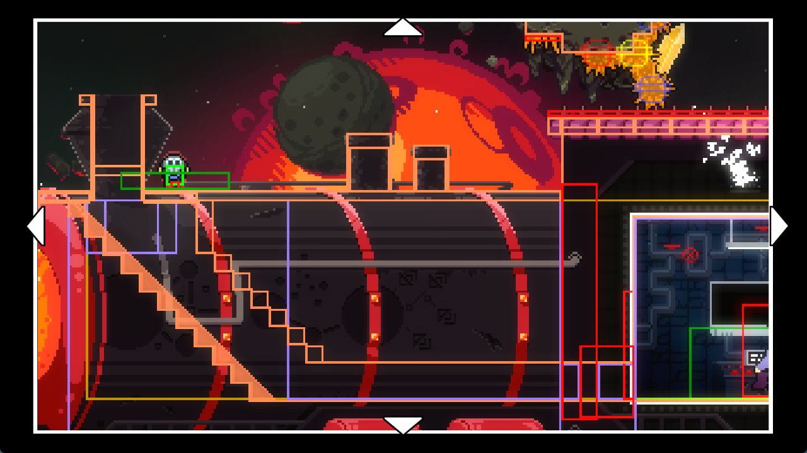

参考

* [【蔚蓝Celeste】酱游第五章爆表 烈冕号（The Solar Express）全收集流程](https://www.bilibili.com/video/BV1Lx4y1F7wy)
* [地图](https://gamebanana.com/mods/424541)

## [进入列车](https://www.bilibili.com/video/BV1SbWSe6EAT/?t=0)

房间名: All Aboard

### 技巧

* [玩家滑入列车](intro.md#slip-in)
* [有选择的对话](intro.md#choice)

{style="width: 800px; title="123"}

## [进入豪华套房](https://www.bilibili.com/video/BV1Lx4y1F7wy/?t=822)

房间名: Spectacle

### 技巧

> 我操这是真帅吧

```lua title="strawberryjammappack/Assets/SJ2021/Soloiini/postObelisk.lua(已简化一定内容)"

local vector2 = require("#microsoft.xna.framework.vector2")
local coroutineEntity = monocle.Entity()

function onBegin()
    disableRetry()
    disableMovement()
    walkTo(15324, false, 0.9, false)
    -- 应该是自己在 flmod 做过配置了
    celeste.Audio.SetMusicParam("dialog", 1.0)
    celeste.Audio.SetMusicParam("kick", 0.0)
    say("SJ2021_SOLOIINI_SPECTACLE_A")
    -- ... 其他对话和镜头缩放等 ...

    -- 盛大开场
    -- 播放音效
    playSound("event:/Kataiser/nelumbo_fire_on")
    wait(0.02)
    -- 通过 FrostHelper/OnFlagActivator 触发 ContortHelper/BurstEffectTrigger (当然这里用 Trigger Trigger 也行), 在人物位置释放一个冲击波
    -- 通过 flag 搭配 pandorasBox/entityActivator 关闭了光源(当然这里用 Eevee/FlagToggleModifier 也行) 
    -- 通过该 flag 直接触发 FemtoHelper/ParticleEmitter 触发一个小小的火苗飘散的动画
    setFlag("spectacleBFout", true)
    -- 通过 HonlyHelper/FlagSoundSource 关闭篝火音效
    setFlag("spectacleFireSFX", false)
    -- 好像是光敏模式相关的
    if not getFlag("SJ_Solar_noFlash") then
        -- 打开裂隙的特效(闪黄一下), 通过 MaxHelpingHand/StylegroundFadeController 实现
        setFlag("spectacleOpenRift", true)
    end
    wait(0.18)
    celeste.Audio.SetMusicParam("kick", 1.0)
    -- 通过 flag, 触发 Sardine7/AmbienceTrigger 和 MaxHelpingHand/AmbienceVolumeTrigger 播放一个 pong 的开启传送门的音效, 顺便触触发一个冲击波
    -- 通过该 flag 直接触发 FemtoHelper/ParticleEmitter, 生成传送门的边框
    -- 通过该 flag 直接触发 MaxHelpingHand/FlagDecal, 生成传送门的内部
    -- 通过设置一个黑洞(改成偏黄的颜色)前景并搭配 StylegroundMask 生成被吸进传送门的粒子
    -- 顺便往传送门里塞了几个火球 FireBall, 充当传送门音效
    setFlag("spectaclePortal", true)
    -- 黄色前景淡出
    setFlag("spectacleOpenRift", false)
    player.DummyAutoAnimate = false
    -- 往左跑
    player.Sprite:Play("runSlow", true, false)
    -- 往左慢跑一小段
    walkTo(15296, false, 0.6, false)
    setFlag("spectacleBFout", false)
    -- 往左快跑一小段
    player.Sprite:Play("runFast", true, false)
    walkTo(15284, false, 0.2, false)
    -- 往右跑但是调用了反向的动画, 所以呈现起来是往左跑但是实际上往右移动, 表现出了吸的过程(所以你会发现头发的方向是错误的)
    player.Sprite:Play("runStumble", true, false)
    walkTo(15408, true, 1.6, false)
    player.DummyAutoAnimate = true
    coroutine.yield(getLevel():ZoomBack(0.01))
end

function onEnd(level, wasSkipped)
    getLevel():remove(coroutineEntity)
    player.Facing = luanet.enum(luanet.import_type("Celeste.Facings"), "Right")
    celeste.Audio.SetMusicParam("kick", 1.0)
    teleportTo(16176, -1656, "Halcyon Promenade")
    enableRetry()
    enableMovement()
    if wasSkipped then
        setFlag("spectacle_skipped", true)
    end
end

```

## [倒一](https://www.bilibili.com/video/BV1Lx4y1F7wy/?t=1049)

房间名: Luxury Suite

### 技巧

* [有选择的对话](./intro.md#choice)
* [theo 触发 trigger](./intro.md#holdable-trigger)
