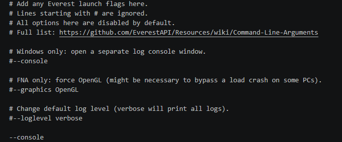
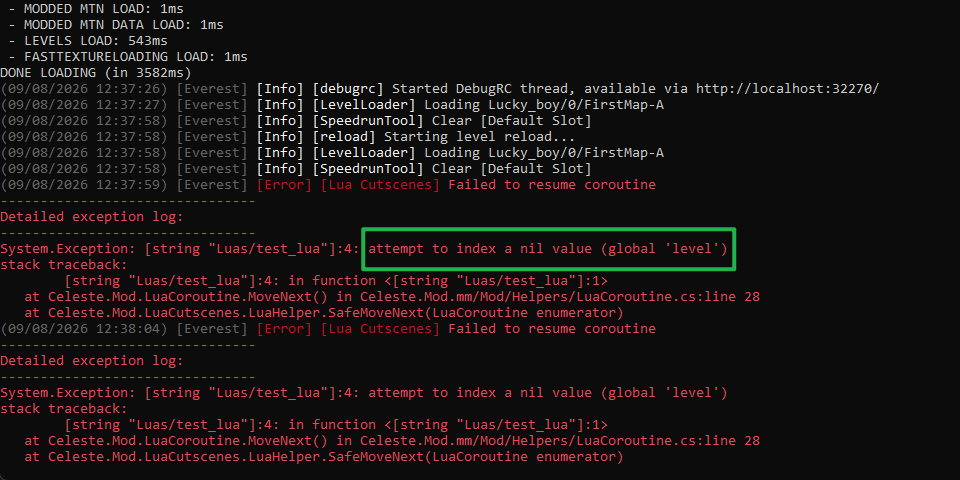

参考

* [Saplonily 的 LuaCutscenes 教程](https://sapcelestemod.netlify.app/extra_luacs/begin/)
* [Lua Cutscenes 词典 by Nacline]()(制图群群文件)
* motonine 的 LuaCutscene 教程 (群文件里)
* [Lua Cutscenes 文档](https://maddie480.ovh/lua-cutscenes-documentation/modules/helper_functions.html)
* [Lua Cutscenes 函数源码](https://github.com/Cruor/LuaCutscenes/blob/master/LuaCutscenes/Assets/LuaCutscenes/helper_functions.lua)
* [Prismatic Helper 文档](https://github.com/l-Luna/PrismaticHelper/blob/master/DOCUMENTATION.md#cutscenes)
* [Prismatic Helper 指令 by 底龙](https://uddrg.notion.site/Text-Dialog-2737f4f27e6380419593c9bedbe01795#2737f4f27e6380788771c5a9a78c3a39)
* [Lua Cutscenes Recipe Book by Everest Wiki](https://github.com/EverestAPI/ModResources/wiki/Lua-Cutscenes-Recipe-Book)
* [Lua Cutscenes without Lua Experience by Gamation](https://medium.com/@crumpledmemes/lua-cutscenes-without-lua-experience-3c2d87804e20)


## Lua Cutscenes 基本介绍

由于蔚蓝是用 `C#` 编程语言编写制作的, 而官方的剧情都是硬编码的 (直接在代码里写好), 所以如果大家想要制作剧情就得写代码, 门槛太高了!
所以就出现了 [Lua Cutscenes](https://gamebanana.com/mods/53678) 这样的 helper 来用 `Lua` 这种简单的编程语言来对接 `C#`, 即我们可以编写简单的 `Lua` 脚本来使用官方代码中的各种跟剧情相关的函数

下面讲解常见的剧情制作方式, 如果你想要更为细致的剧情操作, 比如在对话过程中加入操作, 
可以使用 Prismatic Helper 等 Helper 的 [Dialog 指令](../dialog/talk.md#prismatic-helper)

首先在你的 Mod 下放置新创建的空 lua 文件以供后续使用, 记得[套文件夹](../mod_structure.md#everest)

- 📁 Mods
    - 📁 你的 Mod
        - 📄 everest.yaml 
        - 📁 LuaCutscenes 
            - 📁 作者名 
                - 📁 项目名
                    - 📄 trigger.lua
                    - 📄 talker.lua

然后这里以 `Lua Cutscene Trigger` 为例(`Lua Talker` 同理), 请你在地图中放置一个 `LuaCutscene/LuaCutsceneTrigger`, 
并在 `Filename` 属性中填入 `LuaCutscenes/作者名/项目名/trigger`, 此时 Lua Cutscenes Helper 就能找到你的 lua 文件了,
如果文件是在游戏运行的时候新放的, 可能需要 Ctrl + F5 重启一下加载文件

## Lua Cutscene Trigger

打开 `trigger.lua` 并填入以下内容

```lua title="路径: 你的 Mod/LuaCutscenes/作者名/项目名/trigger.lua"
function onBegin()
  -- 这里面是你的过场动画代码
end

function onEnd(room, wasSkipped)
  -- 这里面是你的结束过场代码
end
```

对于 Lua Cutscene Trigger 来说, 当你进入 Trigger 时,  `onBegin` 函数中的代码会被逐行执行, 
执行完毕后, `onEnd` 函数中的代码会被逐行执行

此时你就可以在函数内部加入一些 Lua Cutscenes Helper 为你[预制好的 lua 函数](lua_cutscene_handbook.md)了, 比如

```lua
function onBegin()
    -- 让玩家无法移动
    disableMovement()
    -- 让 setCameraOffset 能被正确作用, 详情见机制库
    player.ForceCameraUpdate = true
    -- 让镜头向右偏移一单位, 即 48px, y 方向一单位是 32px
    setCameraOffset(1, 0)

    -- 等一秒让镜头移动完再缩放
    wait(1)
    -- 拿到关卡信息
    level = getLevel()
    coroutine.yield(level:ZoomTo(vector2(160, 90), 2, 3))  -- 花 3s 将镜头放大一倍, 并将镜头居中

    -- 向右走 32px
    walk(32)
    -- 说一句话, 这里填 Dialog ID
    say("WOW")

    -- 镜头花 1.5s 复原
    coroutine.yield(level:ZoomBack(1.5))
    wait(1)

    
    enableMovement()
    player.ForceCameraUpdate = false
    setCameraOffset(0, 0)

end

function onEnd(room, wasSkipped)
    -- 如果玩家在执行剧情的过程中跳过剧情, 这里的 wasSkipped 就会为 true, 此时我们让玩家自杀
    if wasSkipped then
        player:Die(vector2(0, 1))  -- 第一位参数是烟花方向
        return
    end
end
```

此时当你触碰 Lua Cutscene Trigger 的时候剧情函数就会往下执行了!

如果你觉得这些函数无法满足你, 可以参考 [C# 交互](https://saplonily.top/celeste_modding_tutorial/code_modding/extra/lua_cutscene/cs_access/)栏目,
通过 Lua 访问游戏中的 C# 代码(刚才使用的预制 lua 代码本质上[也是这么做的](https://github.com/Cruor/LuaCutscenes/blob/master/LuaCutscenes/Assets/LuaCutscenes/helper_functions.lua))


### 注意事项

1. 这个流程是按顺序进行的, 也就是说上面的例子中, 镜头右移和镜头缩放 **不会同时执行**. 而且假设有一个流程被暂停或者耽误了, 后面的流程就会一直卡住不动, 直到那个卡住的进程结束.
2. Lua 脚本在不做特殊处理的情况下, **跨房间会直接失效**.
3. Lua 脚本在暂停跳过以后, 会直接进入 `onEnd` 代码然后结束过场流程.

### 更好的调试

找到蔚蓝根目录下的 `everest-launch.txt` 文件, 在里面新加入一行 `--console`,  这样之后蔚蓝在启动的时候就会附带一个控制台窗口.



如果 lua 写得不对了, 对应的报错信息也会显示在其中, 这时你就可以自己排查或者问 AI 之类的了

比如如果我们在上方忘记写 `level = getLevel()` 拿到 level, 那么后面就会因为拿不到 level 而报错




## Lua Talker

和 `Lua Cutscene Trigger` 的格式其实比较类似, 但是 `Lua Talker` 启动过场的方式是玩家和实体交互, 因此我们在脚本中不使用 `onBegin`, 而是 `onTalk`:

```lua title="路径: 你的 Mod/LuaCutscenes/作者名/项目名/talker.lua"
function onTalk()
end

function onEnd(room, wasSkipped)
end
```


与 `Lua Cutscene Trigger` 不同的是, 跳过剧情并不会中断 `onTalk` 函数, 比如如果你在 `onTalk` 里 `walk(10000)`,
那么跳过剧情之后 player 仍然会接着行走