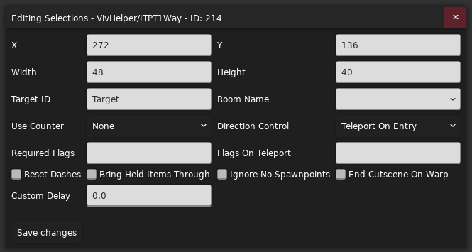
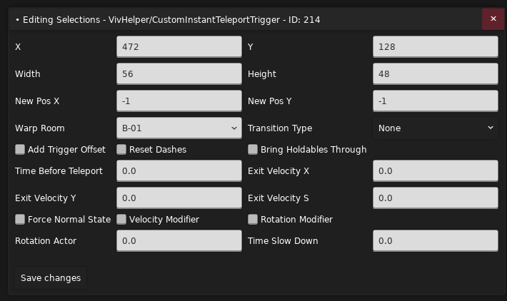

参考

* [VivHelper 文档](https://docs.google.com/document/d/1g1w0HChLaEH7S1rh-eDftlIvzgCJTZxWj9Vzzq5Rmr0/edit?tab=t.0)
* [VivHelper 香蕉网](https://gamebanana.com/mods/53700)
* [VivHelper Github](https://github.com/vivianlonging/VivHelper)

做剧情免不了传送, 所以这里会简单讲解下传送 Trigger 的使用

## VivHelper/Teleport Trigger

{style="width: 700px; title="123"}

用法基本上就是: 放个 `VivHelper/TeleportTrigger`, 把要传送到的房间对应的名字 `Room Name` 填上, 然后在对应房间里放个 `VivHelper/TeleportTarget`, 把两个 Trigger 的 `Target ID` 填成一样的, 
这样当玩家进入 `VivHelper/TeleportTrigger` 时就会被传送到对应房间里的对应位置了

## VivHelper/Custom Instant Teleport Trigger

{style="width: 700px; title="123"}

### New Pos X/Y

表示在传送到新房间后, 目标位置离房间左上角的相对位置是多少, 也就是你想传送到新房间中的哪个位置

### Wrap Room

填目标房间名字, 表示你要传送到哪个房间

### Transition Type

表示传送的时候用什么转场特效(你可能需要关闭光敏模式来使一些设置生效)

### Add Trigger Offset

表示新位置是否要加上 Trigger 自身离房间左上角的位置偏移, 如果要传送到的房间跟当前房间差不多大, 那么勾选上之后对传送位置的定位应该会省点事

### Reset Dashes

字面意思, 是否恢复冲刺

### Bring Holdables Through

字面意思, 如果抓着东西, 是否顺便也传送过去

### Time Before Teleport

进入 Trigger 后等待多少秒再传送

### Exit Velocity X/Y/S

分别表示传送后改变玩家的水平速度, 垂直速度, 以及合速度(如果 S 不为 0 则 X/Y 无效)

你只能设置 S 速度或者 X/Y 速度, 如果你想设置合速度, 那就把 S 改成一个 > 0 的数即可

如果你想要设置 X/Y 速度, 你需要将 S 速度设置为 -1, 并将 X/Y 速度都设置为 0

### Velocity Modifier

表示传送后玩家速度的变化方式, 开了就是乘算, 关了就是加算

### Force Normal State

表示传送后是否强制让玩家进入普通状态, 也就是取消冲刺/爬墙等状态

### Rotation Actor

表示传送后是否旋转对应的速度

### Rotation Modifier

开了表示将当前速度向 `Rotation Actor` 旋转一定角度, 关了表示将当前速度旋转 `Rotation Actor` 角度

### Time Slow Down

理论上应该是在传送后会有一个时间减缓效果, 但是我没试出来(而且看代码好像传送后 trigger 自己也被 [unload](https://github.com/vivianlonging/VivHelper/blob/c7b893c2bfb03a1f0a5071386b2b015d92eae28d/_Code/Triggers/InstantTeleportTrigger.cs#L352) 了)