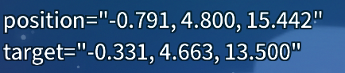
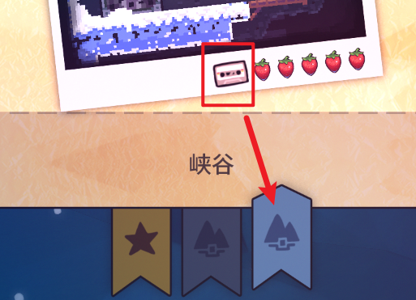
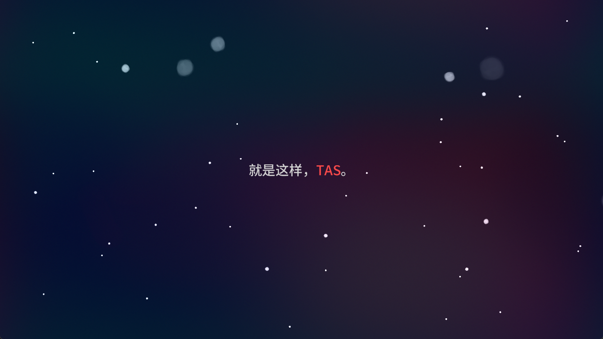
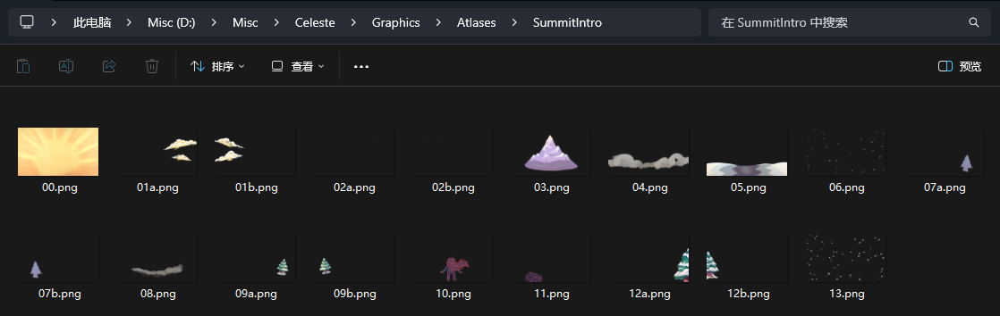

摘抄/整合

* [文件外元数据 by Saplonily](https://saplonily.top/celeste_modding_tutorial/mapping/room_meta_text/#_5)
* [元数据 by b 站 Wiki)](https://wiki.biligame.com/celeste/%E5%85%83%E6%95%B0%E6%8D%AE#.meta.yaml_%E6%96%87%E4%BB%B6)
* [[Celeste蔚蓝] 作图教程第四章 - 背景, 元数据, 文本教程 by 电箱](https://www.bilibili.com/video/BV1Av4y1D7a8/?t=149)
* [额外元数据 by Everest Wiki](https://github.com/EverestAPI/Resources/wiki/Map-Metadata)


Loenn 元数据是相对来说是比较少的, 又由于游戏本体很多元数据实际上硬编码在代码里, 
所以 `Everest` 通过 `.meta.yaml` 文件帮我们把那些配置开放了出来, 
即我们可以创建一个和地图文件同名的 `.meta.yaml` 文件来设置对应的属性, 像下面这样 

- 📄 `0-MyFirstMap.bin`
- 📄 `0-MyFirstMap.meta.yaml`


## Everest 提供/开放的元数据

> 你可能需要知道下文的[套文件夹](../mod_structure.md#conflict)是什么意思
> 
> 比如对于 `Maps/MyName/MapName/my_first_map.bin`, 套文件夹路径对应 `MyName/MapName`
> 
> 相当于 `Maps/{套文件夹}/my_first_map.bin`

```yaml title="0-MyFirstMap.meta.yaml" hl_lines="1 41 43 57 46"
Mountain:
  ShowSnow: false

  FogColors:
    - 039668
    - 039645

  StarFogColor: ffffff
  StarStreamColors:
    - ffffff
    - ffffff
    - ffffff
  StarBeltColors1:
    - ffffff
    - ffffff
  StarBeltColors2:
    - ffffff
    - ffffff

  MountainModelDirectory: "Mountain/{套文件夹}"
  MountainTextureDirectory: "{套文件夹}"

  Idle:
    Position: [ -1.374, 1.224, 7.971 ]
    Target: [ -0.440, 0.499, 6.358 ]
  Select:
    Position: [ -1.390, 0.784, 7.593 ]
    Target: [ -0.052, 0.545, 6.125 ]
  Zoom:
    Position: [ -1.104, 0.661, 7.292 ]
    Target: [ -0.324, 0.565, 5.452 ]
  Cursor: [ -0.880595, 0.8781773, 6.77277 ]

  State: 0
  Rotate: true
  ShowCore: false
  BackgroundMusic: "event:/some_great_music/here"
  BackgroundAmbience: "event:/some_great_ambience/here"
  MarkerTexture: "marker/{套文件夹}"

CassetteCheckpointIndex: -1

LoadingVignetteText:
  Dialog: "{Dialog ID}"

LoadingVignetteScreen:
  Atlas: "VignetteScreens/{套文件夹}"
  Start: [ 0.0, 0.0 ]
  Center: [ 0.0, 0.0 ]
  Offset: [ 0.0, 0.0 ]
  Layers:
    - Type: "layer"
      Images: [ "MyFirstMap" ]
      Position: [ 0.0, 0.0 ]
      Scroll: [ 0.0 ]

CompleteScreen:
  Atlas: "Endscreens/{套文件夹}"
  Start: [ 0.0, 0.0 ]
  Center: [ 0.0, 0.0 ]
  Offset: [ 0.0, 0.0 ]
  Title:
    ASide: "AREACOMPLETE_NORMAL"
    BSide: "AREACOMPLETE_BSIDE"
    CSide: "AREACOMPLETE_CSIDE"
    FullClear: "AREACOMPLETE_NORMAL_FULLCLEAR"
  Layers:
    - Type: "layer"
      Images: [ "chap1" ]
      Position: [ 0.0, 0.0 ]
      Scroll: [ 0.0 ]
```

> 选项修改后需要重启游戏才能生效

这个文件很长, 不过上面所有内容都是可选的, 接下来我们逐一介绍

### [Mountain](https://github.com/EverestAPI/Resources/wiki/Overworld-Customisation)

主要配置选章界面的背景的 3D 山有关的东西

#### 山体建模相关

* [山体建模 by Everest](https://github.com/EverestAPI/Resources/wiki/Overworld-Customisation#mountainmoon-models)
* [山体建模 by crylone](https://www.bilibili.com/video/BV15V3n65EmY/)

[//]: # (sap: RIP, 原本打算全写了, 但是还是只提取一部分罢 )
[//]: # (lucky: RIP 你的 RIP, 我看看能不能补充  )

```yaml
Mountain:
  ShowSnow: false

  FogColors:
    - 039668
    - 039645

  StarFogColor: ffffff
  StarStreamColors:
    - ffffff
    - ffffff
    - ffffff
  StarBeltColors1:
    - ffffff
    - ffffff
  StarBeltColors2:
    - ffffff
    - ffffff

  MountainModelDirectory: "Mountain/{套文件夹}"
  MountainTextureDirectory: "{套文件夹}"

  Idle:
    Position: [ -1.374, 1.224, 7.971 ]
    Target: [ -0.440, 0.499, 6.358 ]
  Select:
    Position: [ -1.390, 0.784, 7.593 ]
    Target: [ -0.052, 0.545, 6.125 ]
  Zoom:
    Position: [ -1.104, 0.661, 7.292 ]
    Target: [ -0.324, 0.565, 5.452 ]
  Cursor: [ -0.880595, 0.8781773, 6.77277 ]

  State: 0
  Rotate: true
  ShowCore: false
  BackgroundMusic: "event:/some_great_music/here"
  BackgroundAmbience: "event:/some_great_ambience/here"
  MarkerTexture: "marker/{套文件夹}
```

- `ShowSnow`: 是否正在下雪
- `FogColors`: 雾的颜色, 不限数量
- `StarFogColor`: 星空中雾的颜色, 不限数量
- `StarStreamColors`: 星河的颜色, 不限数量
- `StarBeltColors1`, `StarBeltColors2`: 星带, 就是那一堆星星的颜色, 不限数量
- `MountainModelDirectory`: 自定义山体模型的路径, 从 Mod 的最顶级目录开始
- `MountainTextureDirectory`: 自定义山体模型中用到的贴图所在目录, 从 `Graphics/Atlases/Mountain/` 开始填路径
- `Idle`, `Select`, `Zoom`: 分别是未选择, 选择 (打开了 ABC 面选择或小节选择), 进入时, 镜头对应的位置 (`Position`)和所看向的目标位置 (`Target`), 两个位置不能相同否则会报错
- `Cursor`: 玛德琳小人标记的位置
- `State`: 山体的状态, `0` 为夜晚, `1` 为白天, `2` 为黄昏, `3` 为月球
- `Rotate`: 镜头是否要绕着山转
- `ShowCore`: 山的核心是否打开
- `BackgroundMusic`: 选章界面的背景音乐
- `BackgroundAmbience`: 选章界面的环境音
- `MarkerTexture`: 玛德琳小人标记的贴图动画, 从 `Graphics/Atlases/Mountain/` 开始填路径


对于镜头的位置, 在 `Everest` 调试模式中可以按下默认 ++space++ 键进行自由移动, 然后移动到合适的位置就可以抄写左上角的信息了: 



如果只需要自定义镜头, 大可直接删掉文件的多余部分: 

```yaml title="0-MyFirstMap.meta.yaml"
Mountain:
  ShowSnow: false
  Idle:
    Position: [ -1.374, 1.224, 7.971 ]
    Target: [ -0.440, 0.499, 6.358 ]
  Select:
    Position: [ -1.390, 0.784, 7.593 ]
    Target: [ -0.052, 0.545, 6.125 ]
  Zoom:
    Position: [ -1.104, 0.661, 7.292 ]
    Target: [ -0.324, 0.565, 5.452 ]
  Cursor: [ -0.880595, 0.8781773, 6.77277 ]

  State: 0
  Rotate: true
  ShowCore: false
```


### CassetteCheckpointIndex

```yaml
CassetteCheckpointIndex: -1
```

表示显示在选关界面中的磁带应该放在第几小节 (从 0 开始), 像下面这样



对应

```yaml
CassetteCheckpointIndex: 2
```


如果你填 `-1` 或是干脆不写这个选项, 那么 Everest 会自动帮你挑选一个值, 挑选方式是遍历所有房间, 
当遇到带磁带的房间的时候将最后一个遇到的存档点作为这个值, 所以如果你的房间名字乱七八糟没有规律, 或是地图结构蜿蜒曲折,
可能还是需要手动设置一下这个值的


### LoadingVignetteText

```yaml
LoadingVignetteText:
    Dialog: "CH0_INTRO"
```

```title="Simplified Chinese.txt"
CH0_INTRO=
    就是这样，{+MADELINE}。
    只需呼吸。
    为什么你这么紧张？
```

填入 Dialog ID (记得[套路径](../mod_structure.md#conflict)), 实现类似序章开场的效果

{style="width: 600px;"}


### [LoadingVignetteScreen](https://github.com/EverestAPI/Resources/wiki/Map-Metadata#loading-vignette)

```yaml
LoadingVignetteScreen:
  Atlas: "VignetteScreens/{套文件夹}"
  Start: [ 0.0, 0.0 ]
  Center: [ 0.0, 0.0 ]
  Offset: [ 0.0, 0.0 ]
  Layers:
    - Type: "layer"
      Images: [ "MyFirstMap" ]
      Position: [ 0.0, 0.0 ]
      Scroll: [ 0.0 ]
```

{style="width: 400px;"}

进图的开场动画, 格式同 [`Complete Screen`](#completescreen), 你可以参考 

这里我们以 [7a 对应的配置](./orig_metadata.md#summit)为例

> 括号里填一个数等于填两个一样的数, 也就是 `[ 0.0 ]` 跟 `[ 0.0, 0.0 ]` 是一样的

```yaml
LoadingVignetteScreen:
  Atlas: "SummitIntro"
  Start: [ 0.0, 1500.0 ]
  Center: [ 0.0, -4000.0 ]
  Layers:
    - Type: "layer"
      Images: [ "00" ]
      Position: [ -108.0, -80.0 ]
      Speed: [ 0.0, 0.0 ]
      Scroll: [ 0.0 ]
      Scale: 2
      Alpha: 0.8
      FrameRate: 6
      Loop: true
#   其他 layer ...
```



- `Atlas`: 从 `Graphics/Atlases/` 开始填你的素材文件夹对应的路径, 比如这里的 `SummitIntro`
- `Start`: VignetteScreen 的锚点对应的起始位置, 默认为 `[0, 0]`
- `Center`: VignetteScreen 的锚点对应的结束位置, 游戏会在一定时间内让 VignetteScreen 从起始位置移动到结束位置, 因为蔚蓝 y 轴向下, 所以这里 7a 的例子对应 VignetteScreen 整体向上移动, 默认为 `[0, 0]`
- `Layers`: 图层组, 越后面的图层会显示在更上方
    - `Type`: 当前层为图片时, 填写 `layer`, 当前层为标题时, 填写 [`ui`](#completescreen)
    - `Images`: 所用到的图片, 当填入多帧时会自动形成动画, 如 `[ "00", "01", "02", "02", "", "", "03" ]`, 可留空
    - `Position`: 当前层相对于 VignetteScreen 的初始位置 (相当于 VignetteScreen 移动管整体, layer 移动只移动自己)
    - `Speed`: 图片的循环速度, 7a 结尾底下的云就是水平方向无限循环的, 对应 `[ -50.0, 0.0 ]`
    - `Scroll`: 视差, VignetteScreen 移动时, 不同 layer 的不同视差会形成纵深感, 范围 `0 ~ 1` 
    - `Scale`: 当前层的缩放
    - `Alpha`: 当前层的透明度
    - `FrameRate`: 动画播放速率, 默认一秒六帧
    - `Loop`: 动画是否循环


### [CompleteScreen](https://github.com/EverestAPI/Resources/wiki/Chapter-Complete-Screen)

```yaml
CompleteScreen:
  MusicBySide:
    - event:/music/menu/complete_area # A-side
    - event:/music/menu/complete_bside # B-side
    - event:/music/menu/complete_bside # C-side
  Title:
    ASide: "AREACOMPLETE_NORMAL" # A 面通关对应的 Dialog ID ("Chapter Complete")
    BSide: "AREACOMPLETE_BSIDE" # B 面通关对应的 Dialog ID ("B-Side Complete")
    CSide: "AREACOMPLETE_CSIDE" # C 面通关对应的 Dialog ID ("C-Side Complete")
    FullClear: "AREACOMPLETE_NORMAL_FULLCLEAR" # A 面 FC 对应的 Dialog ID ("Chapter Clear")
  Layers:
    - Type: "ui" # 让你的 title 显示在某一层 (必填)
      Scroll: [ 0.62 ]
```

结算图动画, 格式同 [`LoadingVignetteScreen`](#loadingvignettescreen)

- `MusicBySide`: 进结算图时, A/B/C 面对应的音效 (7a 结算图音效为 `event:/music/menu/complete_summit`)
- `Title`: 结算图标题对应的 Dialog ID (好像不能用在 LoadingVignetteScreen 上), 需要配置 `ui` layer

{style="width: 400px;"}

你也可以使用 `XaphanHelper/Custom End Screen Controller` 实体, 将其放在你结束关卡的房间里并作相应配置即可 (Myn 力推)


## Helper 提供的额外元数据

上述主要是 Everest 提供的配置, 自定义的 Helper 也能在 `.meta.yaml` 中加入新的配置, 如下

* [AltSides Helper](https://gamebanana.com/mods/166210), [Wiki](https://github.com/l-Luna/AltSidesHelper/wiki): 自定义 D/E/F 面
* [真的大 Helper](https://gamebanana.com/mods/597196), [Wiki](https://github.com/kyfex-uwu/ReallyBigHelper/wiki/Using-ReallyBigHelper): 改章节图标 (更丰富的样式)
* [Extended Camera Dynamics](https://gamebanana.com/mods/548940), [Wiki](https://github.com/Ikersfletch/ExCameraDynamics/blob/main/README.md): 改镜头大小
* [Communal Helper](https://gamebanana.com/mods/53697), [Wiki](https://github.com/CommunalHelper/CommunalHelper/blob/db7b27060ebf64553e299fa1c98ab21534e360de/docs/Home.md#custom-textures):
  改默认 Gem 材质
* [Lucky Helper](https://gamebanana.com/mods/553921), [Wiki](https://github.com/LuckyBoy-7/LuckyHelper/blob/main/README.md#metadata): 改默认 Textbox 材质