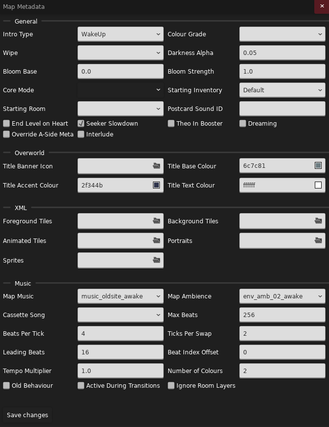
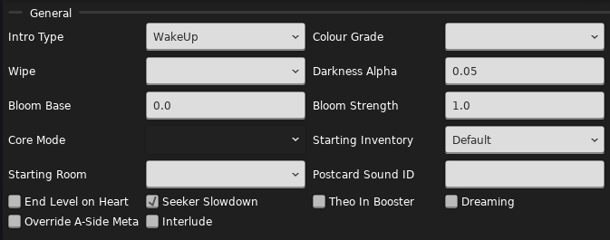
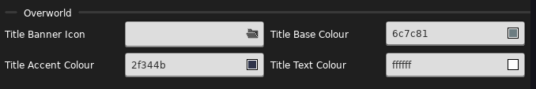
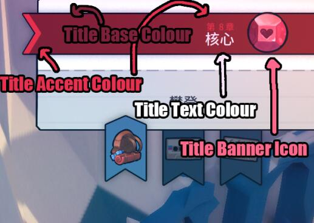
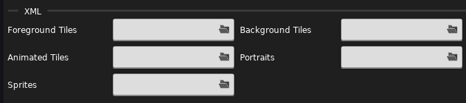
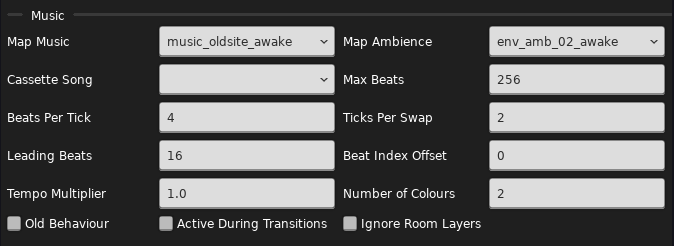

参考/整合/摘抄/引用

* [元数据 by Saplonily](https://saplonily.top/celeste_modding_tutorial/mapping/room_meta_text/#_3)
* [元数据 by b 站 Wiki](https://wiki.biligame.com/celeste/%E5%85%83%E6%95%B0%E6%8D%AE)
* [元数据 by Everest Wiki](https://github.com/EverestAPI/Resources/wiki/Map-Metadata)
* [磁带音乐 by Everest Wiki](https://github.com/EverestAPI/Resources/wiki/Cassette-Music)
* [[Celeste 蔚蓝] 作图教程第二章 - 基础作图教程 by 电箱](https://www.bilibili.com/video/BV1ze411V7Yb/?t=126)

## Loenn 元数据

地图有两种元数据, 一种写在地图文件里面, 一种写在地图文件外面, 这里我们先看看地图文件里面的元数据有些什么, 
这部分内容可以在 Loenn 顶部菜单 `Map -> Metadata` 中找到: 



可以看到它们被分为了四栏: 

- `General`: 通用的属性
- `Overworld`: 选章界面的属性
- `XML`: XML 相关属性
- `Music`: 音乐相关属性

接下来我们逐一介绍

### General



- `Intro Type`: 进入地图的动画类型
    - `Respawn`: 使用重生动画
    - `WalkInRight`: 从地图右侧同一高度走到重生点
    - `WalkInLeft`: 从地图左侧同一高度走到重生点
    - `Jump`: 跳跃进入 (1A)
    - `WakeUp`: 醒来 (2A)
    - `Fall`: 从出生点一直往下掉落, 直到碰到水 (6A)
    - `TempleMirrorVoid`: 5A 从镜中世界虚空中醒来, 需要使用代码辅助. &#8203;~~否则玛德琳就无法醒过来了~~
    - `ThinkForABit`: 9A 开头的动画
    - `None`: 无动画
- [`Colour Grade`](../graphics/color_grading.md): 地图所使用的滤镜
    - `oldsite`: 旧址 (2a)
    - `reflection`: 沉思 (6a)
    - `cold`: 冷色调 (8a)
    - `credits`: 7a感谢人员名单
    - `feelingdown`: 消沉 (6a)
    - `golden`: 金限面 (9a)
    - `hot`: 暖色调 (8a)
    - `none`: 无
    - `panicattack`: 恐慌 (5a)
    - `templevoid`: 寺庙虚空 (5a)
- `Wipe`: 重生及复活时用到的黑屏转场动画
    - `Angled`: 1A/B/C 中使用
    - `Curtain`: 序章和尾声中使用
    - `Dream`: 2A/B/C 中使用
    - `Drop`: 5A/B/C 中使用
    - `Fade`: 渐变, 官图中用于其它地方
    - `Fall`: 6A/B/C 中使用
    - `Heart`: 8A/B/C 中使用
    - `KeyDoor`: 3A/B/C 中使用
    - `Mountain`: 7A/B/C 中使用
    - `Spotlight`: 聚光灯, 官图中用于其它地方
    - `Starfield`: 9A 中使用
    - `Wind`: 4A/B/C 中使用
- [`Darkness Alpha`](../useful_helpers/mapping_utils.md): 黑暗程度 (`0 ~ 1`), 越大地图越黑, `Styleground` 不受影响
- [`Bloom Base`](../useful_helpers/mapping_utils.md): 地图泛光强度基值
- [`Bloom Strength`](../useful_helpers/mapping_utils.md): 地图泛光强度
- `Core Mode`: 默认的核心模式, 即 8A/B/C 的冰或火模式
- `Starting Inventory`: 初始的“物品栏”, 以冲刺次数, 启用了果冻, 有背包, 落地恢复冲刺为基准, 有: 

| 场景             | 冲刺次数 | 有无背包 | 果冻是否启用 | 落地是否恢复冲刺 |
|------------------|----------|----------|--------------|------------------|
| Prologue 序章    | 0        | ✅       | /            | /                |
| Default 默认     | 1        | ✅       | ✅           | ✅               |
| OldSite 2A       | 1        | ✅       | ❌           | ✅               |
| CH6End 6A        | 2        | ✅       | ✅           | ✅               |
| TheSummit 7A/B/C | 2        | ❌       | ✅           | ✅               |
| Core 8A/B/C      | 2        | ✅       | ✅           | ❌               |
| Farewell 9A      | 1        | ❌       | ✅           | ✅               |

- `Starting Room`: 决定游戏从哪个房间开始, 玩家会从这个房间里 id 最小的重生点进入
- [`Postcard Sound ID`](../audio/faq.md#postcard): [明信片](../dialog/localization.md#postcard)音效 ID
- `End Level on Hear`: 是否在吃心后结束关卡
- `Seeker Slowdown`: 是否启用新浪靠近玩家时的一系列效果
- `Theo In Booster`: 是否允许玩家在泡泡内时依然持有抓取物 (Theo 水晶, 水母等)
- `Dreaming`: 主要决定 `Stars` 这个 [`Styleground`](../loenn/stylegrounds.md) 的星星特效是流动的还是静止的 (需重新开始章节)
- `Override A-Side Meta`: 是否覆盖 A 面的元数据, 因为 A/B/C 面共享 A 面元数据以及 [`.meta.yaml`](./extra_metadata.md) 文件
- `Interlude`: 表示这章是否只是一个“过场”, 例如官图/草莓酱的序章/尾声, 完成关卡后会不带结算图直接返回主界面, 且不计死亡数, 不带 B/C 面, 选关页面里也不会显示这是第几章

### Overworld




- `Title Banner Icon`: 地图图标

<figure style="display: flex; gap: 1rem;">
  <div>
       
    <figcaption>areas/intro</figcaption>
  </div>
  <div>
       
    <figcaption>areas/city</figcaption>
  </div>
  <div>
       
    <figcaption>areas/oldsite</figcaption>
  </div>
  <div>
       
    <figcaption>areas/resort</figcaption>
  </div>
  <div>
       
    <figcaption>areas/cliffside</figcaption>
  </div>
</figure>

<figure style="display: flex; gap: 1rem;">
  <div>
       
    <figcaption>areas/temple</figcaption>
  </div>
  <div>
       
    <figcaption>areas/reflection</figcaption>
  </div>
  <div>
       
    <figcaption>areas/Summit</figcaption>
  </div>
  <div>
       
    <figcaption>areas/core</figcaption>
  </div>
  <div>
       
    <figcaption>areas/farewell</figcaption>
  </div>
</figure>


* 📁 Mods
    - 📁 你的 Mod
        - 📁 Graphics
            - 📁 Atlases
                - 📁 Gui
                    - 📁 areas
                        - 📁 [{套文件夹}](../mod_structure.md#conflict)
                            - 📄 chap1.png
                            - 📄 chap1_back.png

如果你要自定义图标, 你需要将地图图标放置在上述位置中, 文件名字任意, 例如 `chap1.png`,
然后在元数据中写上 `areas/{套文件夹}/chap1` 作为路径即可

由于选中关卡时地图图标会从围巾上旋转平移至对应位置, 所以如果你要给图标添加背面的话, 
在一旁放置一个以 `_back` 为后缀的同名文件即可, 如 `chap1_back.png` 

- `Title Base Colour`: 章节标题背景主色
- `Title Accent Colour`: 章节标题名以及左侧副色
- `Title Text Colour`: 章节标题颜色



以下是官图用到的 `Title Base Colour` 和 `Title Accent Colour`:

```yaml title="官图的颜色信息"
序章/尾声: 383838, 50afae
被遗弃的城市: 6c7c81, 2f344b
旧址: 247f35, e4ef69
天空度假山庄: b93c27, ffdd42
黄金山脊: ff7f83, 6d54b7 
镜之寺庙: 8314bc, df72f9
沉思: 359fe0, 3c5cbc
山顶: ffd819, 197db7
核心: 761008, e0201d
再见: 240d7c, ff6aa9 
```

### XML



- [`Foreground Tiles XML`](../xml/tilesets.md): 前景砖 XML 配置
- [`Background Tiles XML`](../xml/tilesets.md): 背景砖 XML 配置 (同前景砖)
- [`Animated Tiles XML`](../xml/tilesets.md#animated): 前景砖附带动画 XML 配置
- [`Portraits XML`](../xml/portraits_xml.md): 对话人物动画/音效 XML 配置
- [`Sprites XML`](../xml/sprites_xml.md): 实体贴图 XML 配置

### [Music](https://github.com/EverestAPI/Resources/wiki/Cassette-Music)



- `Map Music`: 地图的默认[音乐](../audio/audio.md), 填 Event ID 或是官方自定义的别名
- `Map Ambience`: 地图的默认环境音
- `Cassette Song`: 地图的节奏面音乐, 前提是你已经在房间内放置了 `Cassette Block` 实体

接下来我们以 1a 节奏面音乐为例讲解剩余属性, 你可以边听边理解

<audio controls>
    <source src="/celeste_wiki/assets/mappings/metadata/loenn/1a_cassette.mp3" type="audio/mpeg">
    Your browser does not support audio.
</audio>

- `Max Beats`: 通过 [`sixteenth_note` 参数](../audio/params.md#sixteenth_note) 我们知道了上述音乐中的最短的音对应一个十六分音符, 每个节奏面由若干十六分音符的拍子组成, `Max Beats` 就表示一个音乐对应的总拍子数
- `Beats Per Tick`: Tick 是音乐中的拍手音效 clap, 这里表示多少拍后播放一次拍手声, 默认四拍对应一次 clap (可以降低音乐音量感受一下)
- `Ticks Per Swap`: 表示每多少次拍手声后改变一次节奏块的亮暗状态, 默认两次 clap 变一次状态
- `Leading Beats`: 游戏会在 `Leading Beats` 拍后开始播放拍的声音, 并把已经亮起的节奏块作为默认值重新开始进行数拍切换节奏块循环, 不会出现进拍后节奏块突然切换这种情况, 所以如果你想让磁带音乐立刻播放将该选项设置为 0 即可
- `Beat Index Offset`: 上面我们提到一个节奏音乐有 `Max Beats` 拍, 从第 0 拍开始, 所以 `Beat Index Offset` 表示从 `Beat Index Offset` 拍开始
- `Templo Multiplier`: 拍的速率倍数, 默认为 1, 对应 `1 秒 6 拍`, 如果你要使这个选项生效, 需要勾选 `Old Behaviour`, 因为默认情况下, 游戏会使用节奏块的倍率设置 (默认为 1, 否则使用第一个倍率不唯一 1 的值)
- `Number of Colours`: 节奏块的种数, 默认为 2, 这样节奏块在切换的时候就会在前 2 个颜色之间切换, 如果你要使这个选项生效, 需要勾选 `Old Behaviour`, 因为默认情况下, 
游戏会根据最大索引颜色 (<font color="#49aaf0">蓝</font><font color="#f049be">粉</font><font color="#fcdc3a">黄</font><font color="#38e04e">绿</font>)来初始化这个值, 
比如<font color="#49aaf0">蓝</font><font color="#f049be">粉</font><font color="#38e04e">绿</font>在游戏眼里是四种颜色 (<font color="#fcdc3a">黄</font>色节奏块会偷吃掉一次切换)
- `Old Behaviour`: 上文已提及
- `Active During Transitions`: 如果你连着两个房间都是节奏面的话, 这个选项可以让你在切板的时候保持音乐节奏而不是断掉
- `Ignore Room Layers`: 使 Room 中的四层 layer 设置无效 (既不是启用也不是禁用, 单纯没用)