> 幻想结局: 群友们对自己太过苛刻, 反而使得图的质量优秀, 在蔚圈有了一个良好的口碑 -- by P2P Conlab

引用/参考

* [【Celeste引导】香蕉网投稿 & Celeste国区工作室引导](https://www.bilibili.com/video/BV1NFpoeSEKt)
* [电箱教程](https://www.bilibili.com/video/BV1sK411o79u)
* [香蕉网传图教程[rifs]]()(群文件里下)
* [Everest Wiki](https://github.com/EverestAPI/Resources/wiki/Uploading-Mods)

## 登陆[香蕉网](https://gamebanana.com/games/6460)

登不上可以挂梯子或者尝试[替换 Google CDN](https://www.bilibili.com/opus/959792914272092167) 来连接

## 账号注册

点击 Sign Up 填写相关信息注册即可

如果注册失败可以试试 QQ 邮箱, [参考](https://tieba.baidu.com/p/8879322824)

## 国区工作室

在你注册账号后, 如果有想法, 你可以考虑加入国人工作室, 这是一个底龙维护的用于收集国人 Mod 的香蕉网工作室, 欢迎各位积极加入并且投上自己的作品! 

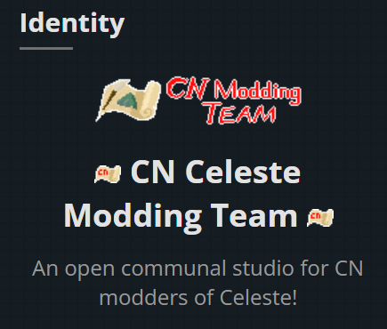

这个工作室不主张精英理念, 不管你是优质地图、抽象地图、还是你就想随便拉依托, 在投 mod 时你都可以选择加入工作室名下, 让你的 Mod 旁边多一个小小的国人工作室图标. 毕竟这个工作室只是出于收集国人作品的目的,
而不是“优秀 Mod”展示榜

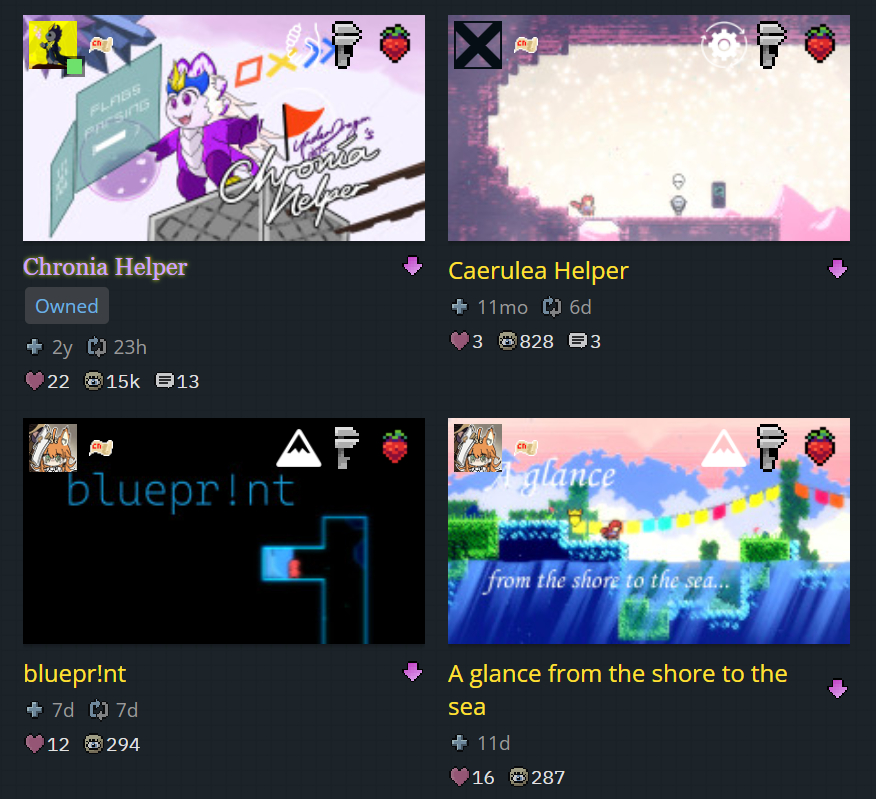

如果你有兴趣, 只需要点击[国人工作室的页面链接](https://gamebanana.com/studios/37724), 然后在中间的工具栏找到 Join, 点击后在说明中随便写点什么 Submit, 等待底龙通过即可.

## Mod投递

在你注册完帐号之后, 你就可以对香蕉网投递你自己的 Mod 啦~! 

下面底龙为各位讲解标准投递流程.

首先, 登陆你的账号, 并在[香蕉网的蔚蓝主页](http://gamebanana.com/games/6460)找到 Add.

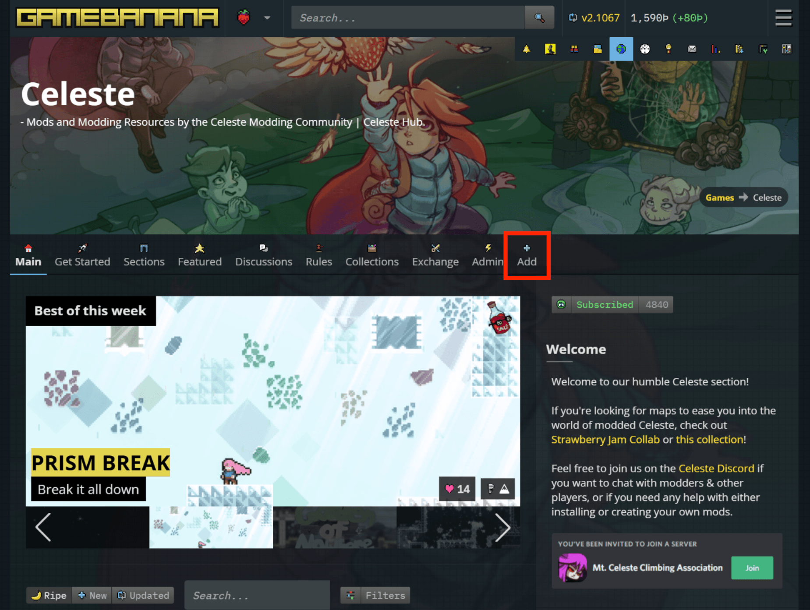

点击后, 你会进入 Celeste 的 Mod 投递页面.

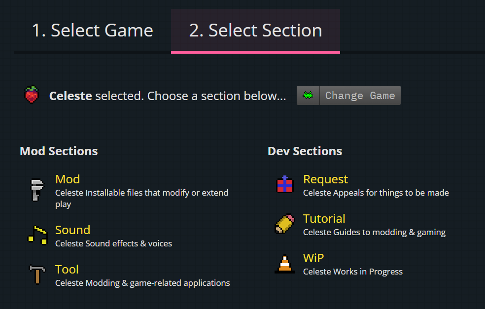

由于香蕉网的更新, 这里的内容会有些不同, 但是你只需要知道其中的三样东西就行:

1. Tool - 投递 Loenn 插件之类的 Mod
2. WiP - 香蕉网的一个类似博客的页面, 如果你想在香蕉网分享你的 Mod 进展但不想公开文件的话, 这个会很有用
3. Mod - 地图、皮肤、Helper 等等常见分类都用这个

根据你的 Mod 分类选好你对应的投递通道, 现在假设底龙想投递一张图, 那么我自然会选择 Mod.

接下来就开始补充 Mod 信息了.

> 注意, 本文不提及的内容在正常投递时均不需要涉及, 如有需要请自行了解, 本文不做介绍, 可能产生的后果请自行承担.

### Main

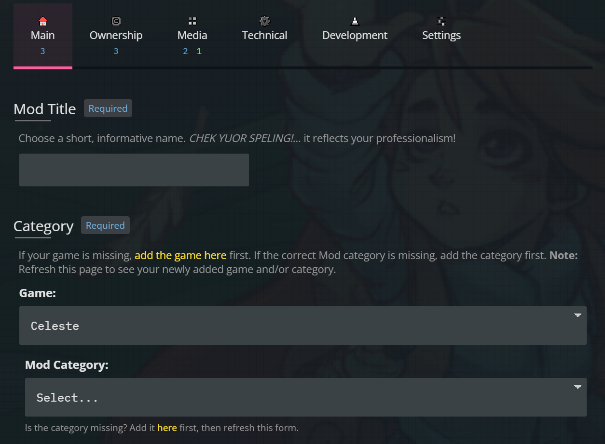

#### Mod Title

你的 Mod 页面的标题名称, 一般是你的 Mod 名字.

#### Category

你的 Mod 的细致分类.

在前面不同的投递通道的基础上, 这里的子类也会不同, 点击 Mod Category 的下拉列表即可查看.

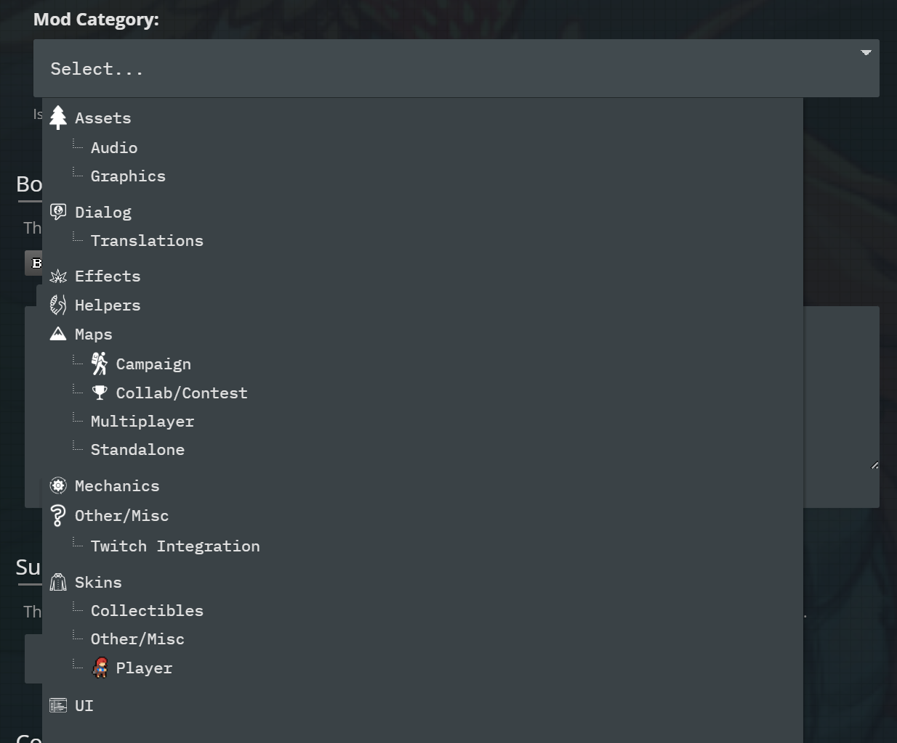

因为投递通道的不同, 这里显示的东西会不一样, 底龙想要投递地图, 那么底龙自然会选择 Maps.

这里做一些简单的讲解:

* Assets 为素材分类, Audio 为音频, Graphics 为贴图素材.
* Dialog 为文本类, Translations 一般为外置翻译包类.
* Effects 为特效类.
* Helpers 就是字面意思, 提供额外实体或者 trigger 的分类.
* Maps 这个分类很多, 而且比较讲究, 在具体分类上其实很多 mapper 容易混为一谈, 但是社区的潜规则其实还是对地图分类有一些说明的:
     1. Campaign, 地图的形式类似原版, 多个章节, 单章可能存在 BC 面, 可能在剧情或者难度上是循序渐进的.
     2. Collab/Contest, 类似于春游或者草莓酱, 多个章节分别为不同的大厅, 没有 BC 面, 有时还会有一个序章前导, 大厅地图内部由多个小地图组成.
     3. Multiplayer, 利用 CelesteNet 或者 MiaoNet 通过多人的互动机制来通关的地图, 多人地图.
     4. Standalone, 独立地图, 一般情况只有一章, 可能存在 BC 面.

* Mechanics 为机制类 Mod, 例如一些抓勾或者传送门类 Mod.
* Other/Misc 为杂项类, 不符合其他分类的都可以扔这里.
* Skins 为皮肤类, Collectibles 为收集物皮肤, Player 为玩家皮肤, Other/Misc 包含一些杂七杂八的物品的皮肤.
* UI 是界面修改类 Mod, 例如更改启动页面的 Celeste 大图标等等.

#### Body

这里写对你的 Mod 的详细介绍, 以地图举例的话, 一般会写明地图类型, 地图难度, 或者一些其他需要补充的简介内容, 这里大家自由发挥.

> 建议在写 Mod 页面的介绍时, 以英文语言为主, 如果需要可以增加汉语版本的翻译.

#### Subtitle

子标题, 会出现在 Featured 页面的标题下方以及你的 Mod 页面内正文的上方.

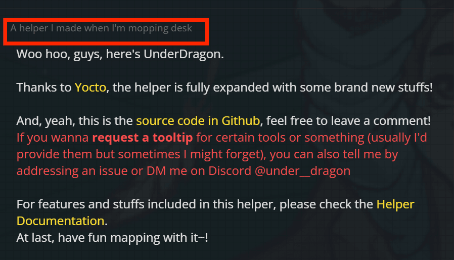

### Ownership

这一栏的内容是关于 Mod 进行 credits 致谢或者撰写参与人员列表的地方.

#### Is this a port?

这是否是从别的游戏移植过来的内容, 但一般不存在, 选 No.

#### Did you create this Mod?

你是否是 Mod 原作者? 

如果你是帮别人进行 mod 投递, 选 No, 否则选 Yes.

#### Authors

撰写参与人员或者致谢名单.

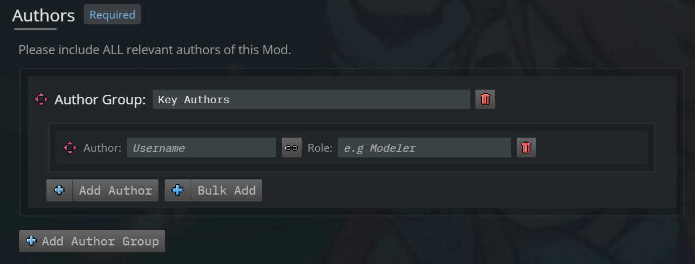

你可以根据需要自行决定如何书写, 香蕉网提供了几个功能:

1. Author Group: 可以对同一类的参与人员进行分类, 比如 Artists, Coders 等等.
2. Add Author: 对人员组添加人员, Username 填写对方的香蕉网账号, 如果对方有对应的账号, 点击对方的用户名就可以使名称变黄, 表示正常链接到对方的账户, 对方在收到 credits 时会有提醒.

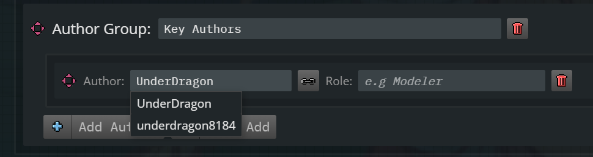

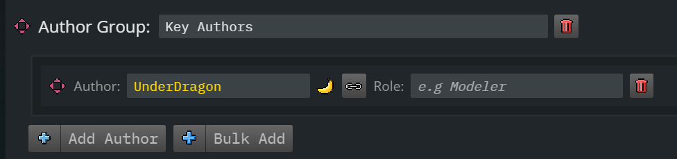

但如果对方没有香蕉网账号, 就不要点下面出现的用户名, 直接写名字之后随便在旁边点一下即可.

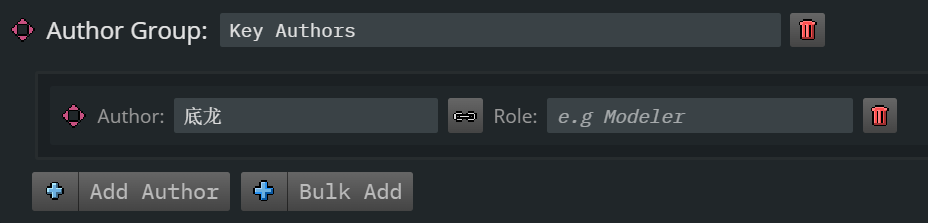

但是如果对方有一个社交媒体账号, 那么在这个基础上可以点击后面的锁链图标添加对方的社交页面.

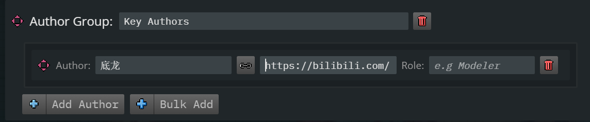

之后在后面的**eg.Modeler**这里写对方的具体职责即可, 这里也可以留空, 不过如果你写了的话, 在 Mod 页面提交之后, 这个地方的文字就会出现在右侧栏对应人员的下方.

完整呈现效果如下:

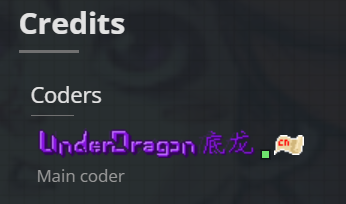

#### Studio

如果你前面添加了国区工作室, 这里就可以在下拉列表中选择将 mod 投递到工作室, 如果没加, 这里不会出现任何其他选项.

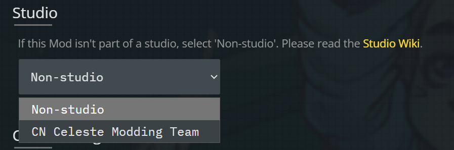

### Media

这里就是主要上传文件的地方啦~

#### Screenshots

Mod 相关的截图, 下面的灰色文字是截图的要求.

1. 大小不超过 `6.1MB`
2. 大小在 400 * 100px 至 2560 * 2048px 之间
3. 格式为 `jpg jpeg gif png`
4. 最少需要两张
5. 最多只能有五十张

此外, 底龙额外给个小知识, 上传图片后, 图片的顺序是可以调整的, 只需要通过拖动左侧的小箭头图标即可.

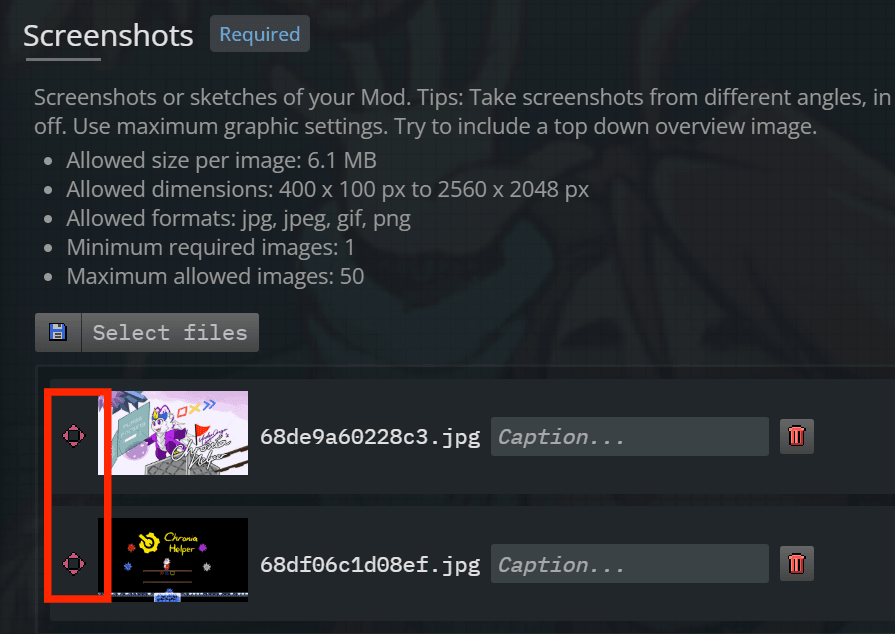

而第一张就会被用作你的 mod 封面, 在香蕉网展示.

#### Files

传文件的地方.

最大大小 `1.6GB`, 一般 mod 都是 `.zip` 格式.

#### Video, GIFs & 3D Models

这里允许添加一些超链接、动图或者 3D 模型, 但是对蔚蓝而言这里一般是添加油管视频超链接的地方, 除此之外没什么很大用处.

### Technical

这个部分没有特殊想法的话不需要研究.

### Development

#### Contest

注意, 香蕉网上举办的的 Contest 并不是这样参加的, 因此这里忽略.

#### Version

这里其实写也可以, 不写也没事, 填你的 mod 版本号.

#### Jam

如果你想参加通过香蕉网举办的一些活动, 比如 Music Translation Contest 等等, 那么你就需要在这里下拉找到对应的活动名称, 然后选择.

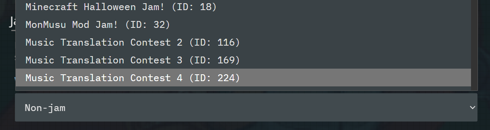

### Settings

#### Access

这里是一个快捷的将你的 mod 隐藏或者重新展示的开关, 可以灵活运用, 例如提前上传 mod 但是不公开.

#### 1-Click Support

是否支持 Olympus 一键安装, 选 Enabled.

### 提交

在上述所有步骤完成后, 点页面底部 Save 提交.

## 修改/更新 Mod

登录香蕉网账号, 进入你的 Mod 页面, 在工具栏找到 Edit:

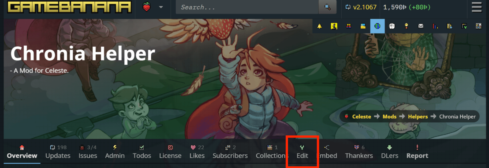

点击进入和 mod 投递完全相同的界面, 对你所需要修改的内容作出修改即可.

内容完全同上, 但是有一点需要强调:

Files 这里, 如果你不打算删除旧版文件的话, 需要知道香蕉网最多一个页面只能存放 20 份文件.

同时你上传时最新的版本会出现在列表底部, 但是 Olympus 绿色强调的最新版本为列表顶部的那一个, 所以建议将新版本手动挪到最上方.

修改完成后, 点击页面底部 Save 保存即可提交.

### 添加更新记录

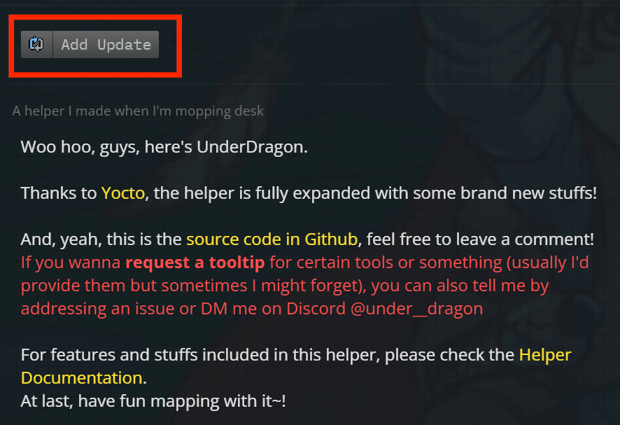

在你的 mod 页面正文上方找到 Add Update

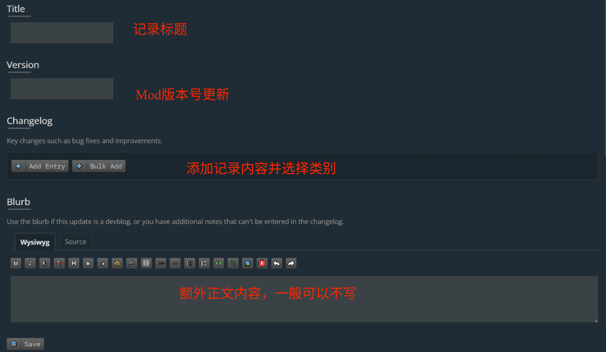

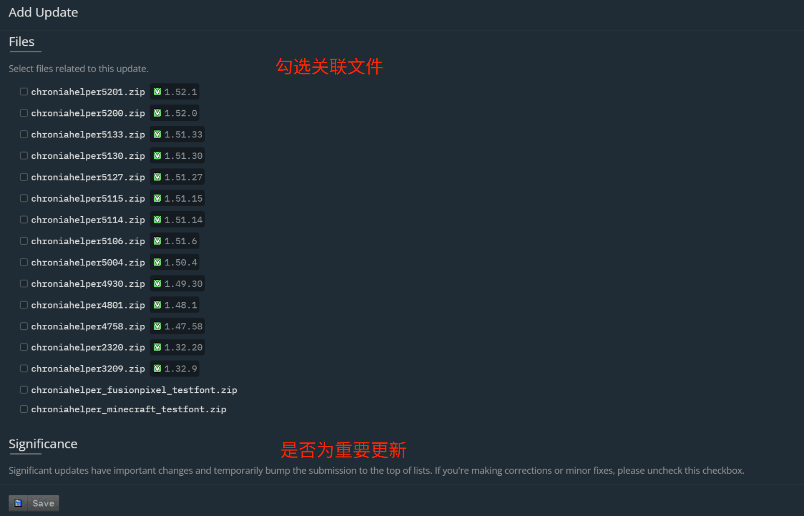

填写完毕点击 Save 保存即可. 
