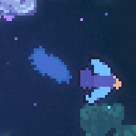
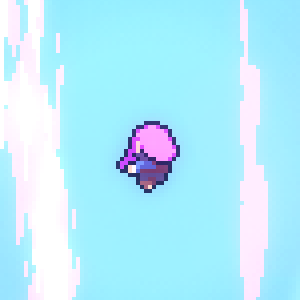
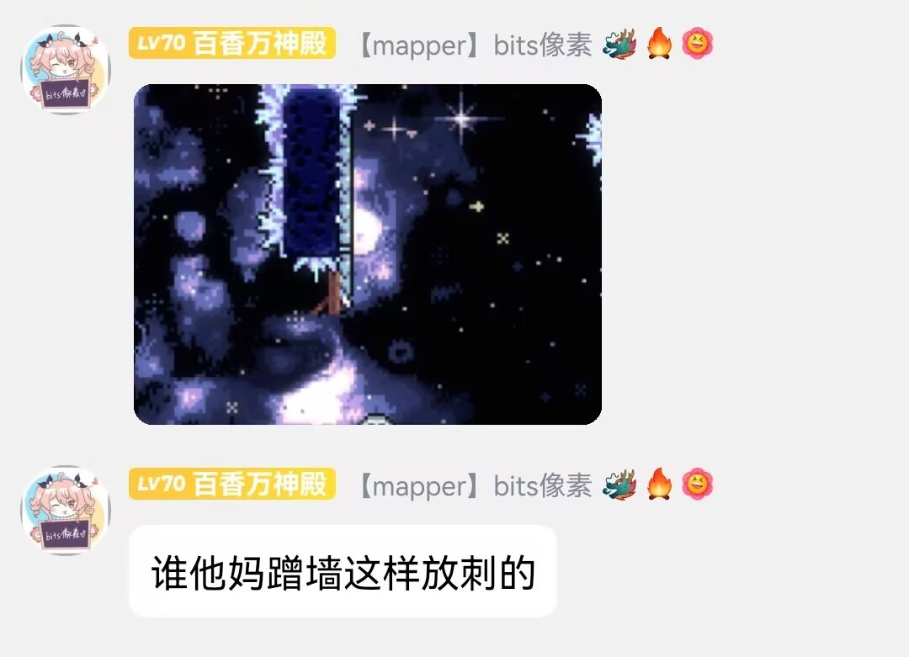
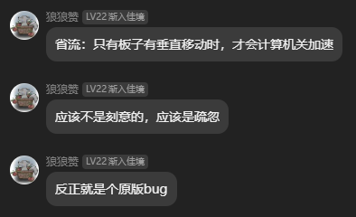

# 第一届蔚蓝制图小测(总分: 202 {style="width: 40px; image-rendering: pixelated; vertical-align: middle;"})

<big>出题组: 底龙, ShadowRo, Lucky_boy</big>

<middle>热心群众: Myn, AppleSheep</middle>

---

> 本次考试没有监考老师, 请同学们不要交流打闹, 诚信考试, 不要作弊, 考试时间为 2h
>
> 请大家携带好本次考试提神醒脑的好伙伴
> {style="width: 40px; image-rendering: pixelated; vertical-align: middle;"},
> 携带后, 他会在你作弊的时候将你回溯至考试开始, 并使你能获取的最大分数值降低 10
> {style="width: 40px; image-rendering: pixelated; vertical-align: middle;"},
> 若全程无作弊, 则考试完成后额外获得特殊的一分 {style="width: 40px; image-rendering: pixelated; vertical-align: middle;"}
>
> 叮铃铃 ...... 同学们, 考试现在开始! 请大家仔细阅读试卷上的题目和答题要求, 合理安排答题时间。遇到难题不要慌张, 可以先跳过, 等做完其他题目后再回来思考

    
注意

    
考虑到国内 Coder 的稀缺性, 这里并没有将 Coder 送上 ban 位, 但仍希望 Coder 以 Mapper 的思维回答问题, 不要降维打击鸭!

## 一. 单选题(总分 80 {style="width: 40px; image-rendering: pixelated; vertical-align: middle;"}, 一题 5 {style="width: 40px; image-rendering: pixelated; vertical-align: middle;"})

### 1 使用 Bird Path 实体时, 我们需要额外小心放置的节点数量, 算上头节点跟子节点, 总共需要多少个游戏才不会崩溃?

<figure markdown>
  {style="width: 200px; image-rendering: pixelated; align=middle"}
</figure>

<table>
<tr>
<td>A. 3n</td>
<td>B. 3n + 1</td>
<td>C. 2n + 1</td>
<td>D. 3n + 2</td>
</tr>
</table>

### 2. 心门既是一种演出道具, 也是一种即将迎来更大挑战的警告, 但是最近一位群友遇到了心门无法打开的问题, 请问下列选项中最不可能的原因是?

<table>
<tr>
<td>A. 收集的水晶之心数量不够</td>
<td>B. 玩家处于心门右侧</td>
<td>C. 玩家离心门太远</td>
<td>D. 心门太胖了, 距离判断失效导致不开门</td>
</tr>
</table>

### 3. 当你放置了红绿灯 A, 并在它的上面叠了一个红绿灯 B, 你在他俩上面放了一个刺, 刺会吸附到?

<table>
<tr>
<td>A. 红绿灯 A 上面</td>
<td>B. 红绿灯 B 上面</td>
<td>C. 都吸附失败</td>
<td>D. 会额外生成一个刺, 各吸附一个</td>
</tr>
</table>

### 4. 当使用 Parallax 背景并设置了 `flag` 和 `Fade In`, 开启 `flag` 后背景会淡入, 但如果此时关闭了 `flag` 会发生?

<table>
<tr>
<td>A. 背景正常淡出</td>
<td>B. 背景直接消失</td>
<td>C. 取决于其他设置</td>
<td>D. 钝角</td>
</tr>
</table>

### 5. 众所周知, 当房间中存在 SummitBackgroundManager 实体且玩家位置高于此 controller 时, 玩家会进入一个炫酷的上升过场(如图), 最终以 `240px/s` 的速度尝试进入上方的房间, 这意味着两个房间的建议间距为 0 ~ 3 格, 与此同时, 我们还要考虑下一个房间的布置以防卡死, 请问下列选项中哪一种是正确的布置?

<figure markdown>
  {style="width: 200px; image-rendering: pixelated; align=middle"}
</figure>

<table>
<tr>
<td>A. </td> 
<td>B. </td> 
<td>C. </td> 
<td>D. </td> 
</tr>
</table>

### 6. 中华古诗词是中国优秀传统文化之一, 在优质国产地图《万家灯火》中存在以下贴图元素, 呈现了诗句: “奔流到海不复回”, 但图示 decal 摆放并不规范, 请问应该按照以下哪个 Loenn 快捷键顺序调整 decal 位置, 使其合乎中国传统诗句的阅读顺序?

<figure markdown>
  {style="height: 300px; image-rendering: pixelated; title=123"}
  <figcaption>对的</figcaption>
  {style="width: 300px; image-rendering: pixelated; title=123"}
  <figcaption>错的</figcaption>
</figure>

<table>
<tr>
<td>A. L, R, H, R</td>
<td>B. R, H, L, L</td>
<td>C. H, R, L, R</td>
<td>D. R, R, H, L</td>
</tr>
</table>

### 7. 我在 Loenn 中放置了一个实体并保存了, 但是游戏中并没有出现我的实体, 原因几乎不可能是?

<table>
<tr>
<td>A. Loenn 抽风了</td>
<td>B. Everest 抽风了</td>
<td>C. 实体对应的 Helper 未启用</td>
<td>D. 实体配置错误, 实体加载失败</td>
<td>E. 加载了, 但是单纯没看到</td>
<td>F. 我以为我保存了</td>
</tr>
</table>

### 8. 在 Loenn 中搜索不到对应 Helper 实体的原因几乎不可能是?

<table>
<tr>
<td>A. Mod 还未下载</td>
<td>B. Mod 还未更新</td>
<td>C. Mod 下坏了</td>
<td>D. Loenn 还在加载对应 Mod</td>
<td>E. 刚下的 Helper, 还未重启 Loenn</td>
</tr>
</table>

### 9. 在打包完 Mod 准备发布后, 别人发现游戏里找不到你的图的原因几乎不可能是?

<table>
<tr>
<td>A. Mod 文件夹结构错误</td>
<td>B. 未在 Mod 根目录配置 <code>everest.yaml</code></td>
<td>C. 别人缺少对应依赖</td>
<td>D. 地图路径错误, 被别的 Mod 覆盖</td>
</tr>
</table>

### 10. 游戏崩溃的原因几乎不可能是?

<table>
<tr>
<td>A. 刚更新 Helper, 新鲜的 bug</td>
<td>B. 刚更新 Everest, 新鲜的 bug</td>
<td>C. 没更新 Helper, 老旧的 bug</td>
<td>D. 没更新 Everest, 老旧的 bug</td>
<td>E. 实体使用方式错误</td>
<td>F. Mapper play 的一环</td>
<td>G. 加拿大人往你的电脑里安装了大炮!</td>
</tr>
</table>

### 11. 我们常常在蔚蓝音乐相关的知识中听说过 Layer 这种概念, 请问在下列房间选项中, Music Layer 的含义是什么?

{style="width: 900px;"}

<table>
<tr>
<td>A. 是否禁用或启用对应的音轨</td>
<td>B. 是否将 fmod 里对应 event 的 layer 参数设置为 0 或 1</td>
<td>C. 是否将对应的音轨的音量设置为 0 或 1</td>
<td>D. 是否禁用或启用 fmod 里对应 event 的 layer 参数</td>
</tr>
</table>

### 12. 如果你在作图过程中发现自己的实体变成了下面这样, 最不可能的原因是?

{style="width: 300px;"}

<table>
<tr>
<td>A. 实体本身就没有材质</td>
<td>B. 实体不再被 Helper 支持</td>
<td>C. Loenn 读取问题</td>
<td>D. 实体配置文件出错</td>
</tr>
</table>

### 13. 由于蹭墙跳作为一个极难的技巧, 我们常常需要为它做额外的处理, 以提供更多的容错, 请问下列选项中, 哪种做法是不推荐的?

<table>
<tr>
<td>A. </td> 
<td>B. </td> 
<td>C. </td> 
<td>D. (隐形单向板)</td> 
</tr>
</table>

### 14. 请问下列实体中, 哪一个能做到持续遮挡人物的效果, 而且能融入周围的砖?

<table>
<tr>
<td>A. Fake Wall</td> 
<td>B. Fake Block</td> 
<td>C. Coverup Wall</td> 
<td>D. Exit Block</td> 
</tr>
</table>

### 15. 镜头在蔚蓝中起到了非常重要的作用, 情绪的表达, 路线的引导, 更开阔的视野都离不开它,请问当玩家触碰到 Camera Offset Trigger 将相机偏移设置为 `(1, 1)` 时, 此时相机中心相对人物位置偏向哪里?

<table>
<tr>
<td>A. 左上</td> 
<td>B. 右上</td> 
<td>C. 左下</td> 
<td>D. 右下</td> 
</tr>
</table>

### 16. 在 9a 中, 官方通过 RumbleTrigger 来使 CrumbleWallOnRumble 依次碎裂, 增强了游戏的画面表现力, 请问这个碎裂的顺序是?

<table>
<tr>
<td>A. 按 Loenn 内的摆放顺序</td> 
<td>B. 完全随机</td> 
<td>C. 从左往右</td> 
<td>D. 从上往下</td> 
</tr>
</table>

## 二. 填空题(总分 42 {style="width: 40px; image-rendering: pixelated; vertical-align: middle;"}, 一题 3 {style="width: 40px; image-rendering: pixelated; vertical-align: middle;"})

### 1. 蔚蓝的 `log.txt` 存放在 `______` 路径下(Windows 系统, Steam 版蔚蓝)

### 2. 蔚蓝的 Mod 加载器叫 `______`, 蔚蓝的 Mod 管理器有 `______`, `______`

### 3. 理解英文单词的缩写有利于提高 mapper 之间的交流效率, 就比如 gp 和 deco 在日常交流中常常表示 `______` 和 `______`

### 4. 蔚蓝的默认房间大小为 `______` x `______`(填数字, 单位 px)

### 5. 设置 flag 的方式: `______`, `______`(至少两种)

### 6. 显示碰撞箱的方式: `______`, `______`(至少两种)

### 7. 游戏内更新 Mod 失败原因: `______`, `______`(至少两种)

### 8. 默写草莓 idle 动画第一帧图片对应的路径, 从 `Graphics/` 开始 `______`

### 9. 官方 `.xml` 文件存放在 `______` 文件夹下(从游戏根目录开始), `Sprites.xml` 的社区规范路径为 `______`(从自己 Mod 根目录开始)

### 10. 在 Loenn 中, 添加节点的快捷键是 `______`, 实体或者贴图左右翻转的快捷键是 `______`

### 11. 地图背景的循环由 `______` 和 `______` 属性控制

### 12. 请默写 1a 灰砖的英文名 `______`

### 13. 当你使用 bits & bolts 提供的全局房间功能时, 全局房间的房间名必须包含前缀 `______`

### 14. 蔚蓝的人物音效主要用到了 Fmod 中的 `______` 技术

## 三. 判断题(总分 30 {style="width: 40px; image-rendering: pixelated; vertical-align: middle;"}, 一题 1 {style="width: 40px; image-rendering: pixelated; vertical-align: middle;"})

### 1. 我们无法进入一个没有重生点的房间

### 2. 在地图同路径创建同名 `.meta.yaml` 文件即可使用拓展镜头的功能

### 3. 在原版游戏中, 我们可以通过替换 Dialog 文件来替换所有的官图文本

### 4. 我们可以将我们的 `Sprites.xml` 直接放置在 `Graphics/` 文件夹下, 只要里面的 xml id 不跟官图和其他 Mod 图里的 xml id 重复即可

### 5. 当你有顺着 Trigger Spikes 的速度时, Trigger Spikes 并不会被触发

### 6. 显示玩家轨迹是 Loenn 的固有功能

### 7. 左右翻转的快捷键总是有效果

### 8. 我们可以使用 CelesteTAS 提供的 `Ctrl + B` 快捷键来查看游戏中的各种碰撞箱, 方便制图

### 9. 我们可以使用 Speedrun Tool 提供的 SL(快速保存和加载) 方便测试游戏的 GP

### 10. 如果你的镜头运动到了非预期的位置, 需要警惕场景中可能存在的 Badeline Boost

### 11. 发布 Mod 时, 我们需要将` everest.yaml` 层级的文件打包到 `.zip` 中, 而不是 `Mods/` 文件夹下自己的 Mod

### 12. 我们必须使用 [Sublime](https://www.sublimetext.com/){:target="_blank"} 文本编辑器来打开 `everest.yaml`

### 13. 在原版中, 官方通过 `DecalRegistry.xml` 来为 decal 添加其他额外的效果, 比如给云添加了视差, 给烟囱添加了烟雾, 给 Dash Block 添加了裂纹

### 14. 我们可以通过 SMH+ 修改人物/实体皮肤中的方方面面

### 15. Foreground Decals 和 Background Decals 除了深度不同, 并没有本质区别

### 16. 在 Loenn 中, 素材路径中的正斜杠 `/` 写成反斜杠 `\` 可能导致路径解析错误

### 17. 在月亮块, 红绿灯, Swap Block 旁边放上原版的单向板, 单向板都会自动吸附上去

### 18. 在 DashBlock 上放置一排原版 Spikes, 在 DashBlock 被撞碎后, 刺不会跟着被销毁

### 19. 使用 BadelineBoost 时最后一个节点处 Badeline 会大抛, 其他位置 Badeline 会小抛

### 20. 大部分官图实体都可以不借助 Helper 更换材质

### 21. 当你把两个月亮块放在一起, 它们会连起来, 但本质还是两个月亮块, 所以如果此时提着 TheoCrystal 刚好碰到它俩的交界处, 可能导致意外的挤死

### 22. 4a 里水平移动的平台不会给你提供机关加速

### 23. 我们在 7a 最后上升段会经过不断倒数的记录点 Summit Checkpoint, 触发它们只是视觉效果, 它们并不会自动帮我们把重生点刷新到最近的

### 24. 在 `Sprites.xml` 里我们可以修改携带抓取物时的抓取物高度偏移量, 所以使用有些皮肤 Mod 可能会影响到游戏机制

### 25. 9a 的黑洞背景位置会随风向改变

### 26. 若我们要实现 4a 大雪纷飞的效果, 使用 Wind Pattern Trigger 改变风向/风力即可

### 27. 7a 上升段所使用的 Kill Box 会使你在与其接触后直接死亡

### 28. 金草莓在放置后, 出现的必要条件之一是完成一次关卡, 同时在玩家通关的时候会自动收集

### 29. Badeline Boss 处于房间外时不会攻击

### 30. 若要实现官图中草莓籽合成草莓的效果, 只需在场景中放置若干草莓籽即可

## 四. 实验题(总分 50 {style="width: 40px; image-rendering: pixelated; vertical-align: middle;"}, 一题 5 {style="width: 40px; image-rendering: pixelated; vertical-align: middle;"})

同学们, 接下来是上机部分, 请大家领取好各自的[地图文件](../assets/mappings/quiz/1/CNY2025FinalTest.zip)以进行接下来的作答

> 接下来的五题分别对应 a-01 ~ a-05 房间

### 1. 请利用 Camera Offset 调整 a-01 房间的镜头

### 2. 请调整圆刺来优化这些基础操作的细节

### 3. Camera Offset Border 可以把镜头限定在一个区域, 并且可以被 flag 控制, 这是画游中默城的倒一, 这里的镜头被我魔改导致出现问题, 请找出问题所在并作出修改

### 4. One-Way Camera 则可以限定 Camera 只能在某个方向移动, 请在下方已经摆好的镜头 Trigger 中调整设置, 来让镜头变得流畅自然(无需改动 `flag` 和 `invert` 设置)

### 5. 在这里我们需要传送进入隔壁 a-05 (1), 但是有笨蛋乱改了设置, 请你修复传送中出现的所有问题

---

请打开 b-01, 其设定路线已经附在以下视频中, 根据指示实操以下五题, 修改越少, 得分越高!

<video controls width="800">
    <source src="../../assets/mappings/quiz/1/b-01_path.mp4" type="video/mp4" />
</video>

### 6. 请不利用任何其它作弊手段完整操作出 a-01 设定路线, 证明你有足够的底力来进行接下来的测试

### 7. 请打开 b-01 (1) 房间, 很明显, 摆刺后这里的细节做的并不是很好, 请你尝试调整蓝色 Spinner 的位置以增加容错。

### 8. 测试人员发来了一个偷鸡, 偷掉了你的预输入, 请在 b-01 (2) 房间中利用 Spikes 实体杀掉视频中的鸡

<video controls width="800">
    <source src="../../assets/mappings/quiz/1/chicken1.mp4" type="video/mp4" />
</video>

### 9. 也许, 在尽量少改动 gp 的前提下, 下面可以多出一条草莓路线? 请在b-01 (3) 房间内适量修改右侧 Falling Block 及其 attached 的紫色圆刺和尖刺来设计通向右下的路线

### 10. 你也许注意到了, 在玛德琳预输入左下冲后, 当你触地时, 仍有 2 帧弹簧带来的 ForceMove 导致你只能向左 hyper, 请在 b-01 (4) 中，只利用 FallingBlock, 消除这 2 帧 ForceMove 带来的不利影响(允许修改 Fgtiles)

## 答案

### 一. 单选题

#### 1

C

因为 bird path 需要使用贝塞尔曲线, 所以从第一个节点开始, 每次往后必须多两个节点才够构造这个曲线, 不然找不到点就会报错

#### 2

D

* A: 数量不够怎么开
* B: 代码是这么写的
* C: 正确的
* D: 没关系

#### 3

A

更新顺序问题, 先加载的实体会先把刺占了

#### 4

B

因为本来就没有 `Fade Out` 设置, 所以如果没 flag 就是直接消失, 如果你想做 `Fade Out` 效果并设置 `Fade In/Out` 的持续时间, 请使用 `MaxHelpingHand/StylegroundFadeController`

#### 5

C

* A: 如果什么都不放的话玩家会不断下坠, 且速度会越来越大(不过如果有幸落到砖上还有救x)
* B: 会卡死
* C: 正常落地
* D: 也会卡死(留两格缝隙就不会卡死了)

#### 6

B

先逆时针旋转, 再水平翻转(一个 L 和一个 R 可以相互消掉不看, H/V 同理), 由于是像素字比较难辨认, 所以这里盯住**到**这个字会看的清楚一点

#### 7

A

Loenn 抽风的概率其实比较小(~~完全没见过~~), 反倒是 Everest 热更突然坏掉也是有可能的,
建议使用 `Ctrl + F5` 快速重启游戏看看实体是否出现, 虽然大概率是你猪了哪里弄错了

#### 8

D

一开始 Loenn 的 Loading Logo 跑完就算加载完了, 反而是刚下的 Mod 确实需要重启一下 Loenn 让它重新看一下 Mods 文件夹里的各种 Mod

#### 9

B

未配置 `everest.yaml` 只会导致别人更容易缺依赖, 或是影响后续你 Mod 的流通, 并不会导致你的图无法加载

> 也就是能进你的图, 但是发现你摆的实体什么的都不见了, 因为极大概率人家根本没开那些 Mod

#### 10

G

#### 11

B

#### 12

C

#### 13

C

{style="width: 400px;"}

#### 14

C

* [Fake Wall](https://github.com/EverestAPI/Resources/wiki/Entity-and-Trigger-Documentation#fake-wall): 隐藏墙壁, 进入后自动淡出, 能融入周围的砖
* [Fake Block](https://github.com/EverestAPI/Resources/wiki/Entity-and-Trigger-Documentation#fake-block): 隐藏墙壁, 进入后自动淡出, 不能融入周围的砖
* [Coverup Wall](https://github.com/EverestAPI/Resources/wiki/Entity-and-Trigger-Documentation#cover-up-wall): 镂空墙壁, 进入后不会自动淡出, 能融入周围的砖
* [Exit Block](https://github.com/EverestAPI/Resources/wiki/Entity-and-Trigger-Documentation#exit-block): 实心墙壁, 在玩家离开后会现形, 能融入周围的砖, 适用于阻挡玩家返回

#### 15

D

蔚蓝坐标系 x 轴朝右, y 轴朝下

#### 16

B

纯随机, 小子!

### 二. 填空题

#### 1

[`Celeste/log.txt`](game_crashes.md)

#### 2

1. [Everest](https://github.com/EverestAPI/Everest){:target="_blank"}
2. [Olympus](https://gamebanana.com/tools/download/6449){:target="_blank"}
3. [Celemod](https://www.bilibili.com/video/BV1Hx4y1z7L5/){:target="_blank"}

#### 3

1. Gameplay: 通关当前地图所需的技巧, 常常泛指广义上的操作, 即操作的衔接流畅程度, 组合丰富程度, 实体复用程度等等
2. Decoration: 指游戏内的装饰, 常常泛指各种 [背景 Stylegrounds](loenn/stylegrounds.md), [decal](graphics.md#decal), 光效等视觉上的**装修**要素

#### 4

1. 320 px
2. 184 px (镜头高度 180 px)

#### 5

1. 使用 Flag Trigger
2. 使用 [Mapping Utils](useful_helpers/mapping_utils.md#flags)

#### 6

1. 按键盘上的波浪键 `~`
2. 下载并启用 [Celeste TAS](https://gamebanana.com/tools/6715){:target="_blank"}, 按下 `Ctrl + B`

#### 7

1. 单纯是网络问题
2. 你开着 Loenn, Loenn 占用了文件

#### 8

`Atlases/Gameplay/collectables/strawberry/normal00.png`

#### 9

1. `Celeste/Content/Graphics/`
2. `MyMod/Graphics/MyMod/Sprites.xml`(没撞路径即可得分)

#### 10

1. `n`
2. `h`

#### 11

1. `Scroll X`
2. `Scroll Y`

#### 12

Crumble Block

#### 13

[_bb_global](useful_helpers/bits%20&%20bolts.md)

#### 14

[Transition](audio/audio.md#speak)

### 三. 判断题

#### 1

F

我们可以通过传送 Trigger 进入

#### 2

F

我们需要额外在 .meta.yaml 中填入以下内容, [参考](camera.md#excamera)

yaml
ExCameraMetaData:
EnableExtendedCamera: true
RestingZoomFactor: 1.0

#### 3

F

{style="width: 400px;"}

#### 4

T

Sprites.xml 撞路径本身没有错, 错的是如果你覆盖了官图或者别的 Mod 图 的 xml id 会影响到他们, 所以只要 id 不重复路径想撞就撞

#### 5

T

代码是这么写的🤓

#### 6

F

是[插件](loenn/plugins.md#ghost)

#### 7

F

并非总是有效果, 得看 coder 有没有做对应的功能, 而且除了 decal 很多东西并没有高频的翻转需求

#### 8

T

对的对的, 看碰撞箱这功能真的很好用

#### 9

T

> 不要用 SL 做了张自己都打不过的大粪图😡

#### 10

T

勾选 Badeline Boost 的 Lock Camera 选项可能导致这种问题

#### 11

T

不然文件夹结构就多套了一层了

#### 12

F

Sublime 只是文本编辑器而已, 你用记事本也是一样的

#### 13

F

具体原因[参考](graphics.md#decalregistry)

#### 14

T

[SMH+](graphics/SMHP.md) 虽然有点复杂, 但功能确实强大

#### 15

T

~~应该是送分题吧~~

#### 16

T

> 你是不是偷懒在资源管理器上面复制粘贴了🧐

#### 17

F

只有月亮块能吸住单向板, 其他两个都不行

这个解释起来比较复杂, 简单来说对于这些实体, 如果要发生吸附(Attach)这个动作, 必须满足三个条件

1. 要去吸别人的实体需要有吸的功能
2. 要被别的实体吸的实体需要有被吸的功能
3. 吸和被吸的实体要贴贴

对于绝大多数你可以踩上去的物块(这被称为 Solid), 他们都有吸附功能(例如月亮块, 红绿灯), 对于绝大多数你可以单向穿过的实体(这被称为 JumpThru), 也有吸附的功能(例如移动平台)

对于刺这种实体, 它具有被吸附的功能, 所以你会发现, 刺不管怎么放, 基本上都是能被吸到某一个东西上的

然后就是一些特殊情况, 比如单向板其实并没有吸别人或者被吸的功能, 所以单向板被月亮块吸住单纯是月亮块自己特殊处理了, 而且此时往单向板上放刺也粘不住

> 如果你要让单向板拥有吸/被吸的功能, 可以试试自定义的单向板, 比如 `VortexHelper/AttachedJumpThru`

#### 18

T

虽然 Spikes 被 DashBlock 吸附了, 但是 DashBlock 并没有处理吸附物的销毁状态, 所以如果你需要在 DashBlock 撞碎后顺便销毁吸附物, 可以试试自定义的 DashBlock

#### 19

T

所以一般我们都是给 Badeline Boost 创建多个节点, 然后最后一个节点放房间外面

#### 20

T

你可以使用 [`Sprites.xml`](xml/sprites_xml.md#xml) 来更换大部分原版实体的材质, 更详细的换肤教程[请看](graphics/replace_assets.md)

#### 21

T

就是这样

#### 22

T

代码里没写(即答

{style="width: 400px;"}

#### 23

T

是会的😱

#### 24

T

[是这样的](xml/sprites_xml.md#carry)

#### 25

T

又是一个小细节

> 玩家平时注意不到的点 mapper 其实都考虑到了

#### 26

T

Wind Pattern 只管物理上的风力, 视觉效果上需要同时使用 Snow 等背景才可以生效

#### 27

F

官方这个 Kill Box 的意思其实是在你到达它上方一定距离后会一直保持激活状态, 到达它下方一定距离后会一直保持未激活状态,
只有在激活状态下你碰到了 Kill Box 才会死亡, 这样就给人营造了上去不死掉下来死的感觉

#### 28

F

在放置了金草莓后, 若开启了 [Cheat Mode(序章彩蛋)](https://www.bilibili.com/video/BV1hh411T78T/), 则金草莓一定会出现, 否则金草莓出现的必要条件为

* 没有死过或者只在金草莓房间及其前面的房间死过
* ABC 面都已解锁或者开启了 Debug 模式(一般在 Mod 设置中常开, 所以没有 BC 面也没事)
* 至少通关过一次地图(初见金吗, 你这家伙)

同时什么时候收集金草莓也是要我们自己控制的, 我们需要放置 `GoldenBerryCollectTrigger` 让玩家触碰后才收集金草莓

#### 29

T

同时建议将最后一个节点放置在房间外, 防止玩家在最后一个节点触碰到 Badeline Boss 发生意料之外的错误

#### 30

F

放一个草莓然后按 `n` 加节点就是草莓籽草莓了

### 四. 实验题

所有答案都可以在地图文件里找到(以 `answer` 为后缀)

#### 7

> 【评分标准: 仅修改 1 个刺 = 5 分, 2 个 = 3分, 3 个 = 1 分, 4 个/调整位置错误 = 0 分】

#### 8

> 【评分标准: 中间六格放刺 = 5 分, 左边弹簧那里刺填满扣 0 分】

#### 9

> 【评分标准: 完全不改图 = 5 分, 其他情况能过就有 3 分, 完全过不了 0 分】
