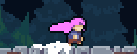
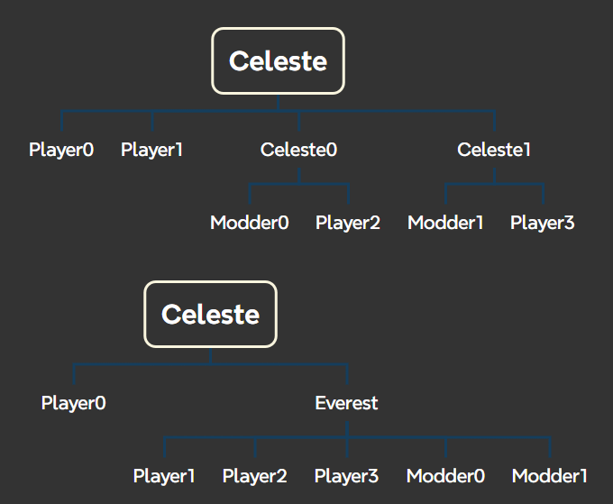

> sam 在捣鼓 Dialog 百思不得其解拼尽全力无法战胜后表示: 我以后一定要做一个更加详细易懂的教程
>
> 我听到这句话后感觉天都塌了, 我们的教程不能被 sam 所理解, 那一定是写的还不够清晰易懂, 感谢 sam 旁敲侧击, 我马上就改😭

!!! note
    本文使用的环境为 Windows 11, Celeste 为 Steam 版本

请先阅读[引言](./introduction.md), 不管你是做着玩的还是想做出东西的, 制图都值得你认真对待,
在那之后制图一定会成为你[独特的回忆](is_that_a_dream.md)

## 建议

* 建议一开始的时候先过一遍教程有个印象, 虽然我知道你很想赶紧在制图器里摆几个砖然后开u, 但还是请你先忍一忍
> K: 所有不看群文件教程就在群里问教程讲过的东西的人直接踢出群聊
* 建议你下载的所有东西, 蔚蓝, 制图工具和素材等都放在英文路径下(如果用户名是中文那么桌面也算中文路径), 不然可能会有奇奇怪怪的 bug(同时这也是个良好的习惯, 不仅仅适用于蔚蓝)
* [学会提问/搜索/自学](../question_and_self_study.md) 

## 前期准备

### [显示文件后缀/扩展名](./must_do.md#_2)

## 初出茅庐

### 游戏是咋做出来的

要知道我们在电脑上运行一款软件本质上是跑了一段 `.exe` 格式的程序, 游戏也是如此, 是不过写出来的程序是拿来给人玩的, 想象一个画面, Madeline(后续称作`player/玩家`) 在一块平坦的地面上不断向右走, 镜头跟随, 你听到了玛德琳跑步的声音, 这个过程中实际上发生了什么呢?
程序发现你按着右键, 于是更新 player x 方向的速度, 尝试将 player 位置右移若干格, 发现途中没有发生碰撞, 所以移动成功, 然后程序设置镜头跟随 player, 接着程序发现 player 现在是"跑步"状态, 所以绘制跑步的素材, 并播放跑步的声音

所以我想...你大概已经明白了, 程序员用一行行代码定义规则模拟出一个世界, 用图片来绘制游戏对象, 用音效来增添真实感, 用音乐来渲染氛围, 用文本来添加对话, 用角色互动来演绎剧情等等等等, 然后游戏就做出来了

所以如果我们把蔚蓝大卸八块, 大概能看到这样的结构(有些不理解也没事, 以后会明白的)

 程序

* 核心程序: 资源的加载, 游戏逻辑的执行

 资源

* 代码 `Code`: `Coders` 写的各种 Helper
* 美术 `Graphics`: 游戏中你看得见的几乎都是, 就是一张张 `.png` 图片
* 音乐音效 `Audio`: BGM, [玛德琳音](https://www.bilibili.com/video/BV1vrFieDEak)等等
* 文本 `Dialog`: 对话, 文本本地化/汉化
* 过场 `Lua Cutscenes`: 游戏中各种剧情的演绎
* 残影 `Tutorials`: 9a 凌波教程
* 地图 `Maps`: 包含上述所有内容, 使用 Loenn 制作(马上就要提到了)
* 等等

### 啥是 Mod, 啥是 Everest

你说蔚蓝是这么做出来的, 那理论上我们要是写出跟官方一样的代码, 画出一样的素材, 做出一样的音乐也能搓个蔚蓝出来咯, 还能加自己想要的功能, 事实也确实如此, 但是别急, 蔚蓝代码就在那儿啊, 素材也能解包, 与其重新造轮子, 不如直接在原版的基础上改, 🤔 ... 欸☝️🤓, 这不就是 Mod 吗

所以你应该明白了, 为一个游戏做 Mod, 本质上就是修改部分核心程序, 让程序按我们的意愿额外加载我们资源(所以你经常能看到各种游戏跟 Mod 有关的资源都是放到游戏本体根目录下的 Mods 文件夹中), 
然后 Modder 在 Mods 文件夹中添加各种上述资源, 我们的Mod就完成啦

显然, 不是所有人都有能力去修改核心程序的, 这不仅需要门槛, 而且大家各改各的容易造成混乱, 所以需要一个中间商来制定一套规则, 只要大伙儿都遵循这套规则, 做出来的东西就方便传播和使用

这就是 [Everest Mod 加载器](https://github.com/EverestAPI/Everest)在干的事, 它修改了游戏的核心程序并在此基础上添加了更丰富的内容, 我们无需关心资源是怎么读取的,
只需要按它规定的把我们的 Mod 放到 `.../Steam/steamapps/common/Celeste/Mods/` 文件夹下, 然后把上文说的所谓的游戏资源也按它[规定的格式](../mod_structure.md)放在自己的 Mod 里该放的位置,
理论上你的 Mod 就能被正确的加载并运行

如果我们把 Celeste 跟民间制作的 Mod 加载器(Celeste0, Celeste1, Everest等)看作一个个节点, 则可以画出如下的思维导图(因为蔚蓝相对小众所以一种 Mod 加载器已经满足需求了, 不然像 MC 这种就会有 Forge, Fabric 之类的五花八门的 Mod 加载器)

{width=500}

### 下载 [Olympus](https://everestapi.github.io/) 或 [Celemod](https://www.bilibili.com/video/BV1Hx4y1z7L5) 并安装 Everest

简单来说这俩就是 Mod 管理器, 方便我们下载和更新 `Everest`, 启用和禁用 Mod, 下载安装 Mod, 设置 Mod 预设等等, 这里推荐小白用 `Celemod`

### 下载 [Loenn](https://saplonily.top/celeste_modding_tutorial/mapping/basic_env/)(或者群文件里下)

`Loenn` 被称作制图器, 它的前辈是 `Ahorn`, 它为作图提供了图形化界面, 让我们制作 `Map` 这个游戏内容方便不少, 要知道, 前文提及的 `Code, Graphics, Audio, Dialog, Lua Cutscenes` 都是为了 `Map`
服务的, 所以 `Loenn` 可以说是制图的核心,
如果你现在什么 Mod 都没下, 那么你在 `Loenn` 右侧栏目里看到的一切全都是原版官图的内容, 而如果你下了, 往往你能看到各种带 `[xxx resources pack]` `[xxx Helper]` `[Everest]` 标签的条目, 这些就是其他 Mod 提供的一些资源, 用就完事了

#### 注意事项

Loenn 初次打开就报错的[解决方案](../loenn/loenn_first_encountered_issues.md)

## 小试牛刀

理论上, 现在你应该已经了解了什么是 `Mod`, 什么是 `Everest`, 下载好 `Celemod` 和 `Loenn` 并且 `Loenn` 能正常启动了

### 随便捣鼓下 Loenn 并保存生成 `.bin` 地图文件

可以自己捣鼓或者阅读下[【Celeste蔚蓝】二代作图教程 1-1 Loenn的使用](https://www.bilibili.com/video/BV1b24y157zW) 和[【Celeste蔚蓝】二代作图教程 2-1 基础trigger](https://www.bilibili.com/video/BV1Gr4y197Tg)

或者你很急的话可按照如下操作光速出图:

1. 打开 Loenn
2. 点击上侧导航栏 `File -> New` 新建一张图
3. 点击上侧导航栏 `Room -> Add`, 在 `Room Name` 这一栏写一个不那么抽象的名字(建议使用`数字/字母/下划线`, 例如 `A_01`), 然后点击下方 `Create Room` 来创建一个房间
4. 点击右侧 `Rectangle`, 随便选个砖在房间里随便涂涂(主要是为了让 `Player` 有个落脚的地方)
5. 点击右侧 `Placement`, 下方选择 `Entities`, 在右下角搜索栏输入 `Player`, 选择 `Player (Spawn Point)`, 并在房间内放置至少一个重生点(`Player` 无法进入没有重生点的房间)
6. 点击右侧 `Placement`, 下方选择 `Entities`, 在右下角搜索栏输入 `Crystal Heart`, 选择 `Crystal Heart`, 并在房间内放置一个水晶之心
7. 点击上侧导航栏 `Map -> Metadata`, 把 `General` 这一栏的 `End Level on Heart` 勾上, 点击 `Save changes`
8. 最后 `Ctrl + S` 保存地图到随便一个位置(重点是你知道存哪儿了), 格式为 `.bin`

### [了解 Mod 的结构](../mod_structure.md)

我们需要遵循前文所提到的 `Everest` 所定的规范, 即我们的 Mod 里应该有哪些东西, 层次是怎样的, 这样我们的 Mod 才能被正确加载, 而且方便传播和学习(大家文件结构都长差不多, 学习成本就会很低), 俗称拆包

### 丰富地图内容

理论上, 现在你应该已经做好了一个流程勉强能跑通的图, 并且 Mod 的格式也没什么问题, 接下来我们会丰富游戏各方面的内容(有些不是必须的)

> 虽然我目前还没做过图, 但很多东西理解原理后其实门槛不高, 难住新手的主要是不熟悉操作和原理, 但这两者都是可以慢慢积累的, 所以大家也别急着放弃(, 一开始也别觉得哎哟卧槽怎么这么多东西, 其实不用都学, 你图做到哪儿了想实现什么东西的时候再去捣鼓对应方向即可 

#### 建议

* 下载 `CelesteTas` 这个 Mod, 在游戏内按 `Ctrl + B` 就能查看 Entity 和 Trigger 的碰撞箱, 方便制图
* 下载[官图图片素材](../useful_links.md), 以后肯定用得上
* 上网了解下什么是相对路径和绝对路径, 当使用自定义实体替换贴图的时候填写的路径几乎都是相对路径, 一般都是相对于官图素材里 `Gameplay` 里的一些文件夹的路径
* 了解[啥是 Flag](https://www.bilibili.com/video/BV1p44y1S79A), 简单来说就是带名字的开关, 我们一般使用某个实体或者 Trigger 触发某个 flag, 以触发对应 flag 实体(例如 `FlagSwitchGate`),
  做到一对一的交互
* 了解[啥是 XML](../xml/xml.md), 方便你以后改各种 `XML`
* 碰到问题时可以查看 [Loenn 常见问题](../loenn/faq.md)
* 不会就抄别人的 Mod, 抄多了就会了

#### [本地化/汉化你的地图](../dialog.md#_4)

此时你会发现你地图的名字还没有取, 吃心文本等显示的都是一些被括号包裹键名如`{XXX_Tutorial_CelesteWikiTutorial}`, 这就需要你自己去配置对应的内容

#### [设置选关界面图标](https://wiki.biligame.com/celeste/%E5%85%83%E6%95%B0%E6%8D%AE#overworld)

#### 修改地图的[元数据Metadata](../loenn/metadata.md)

- 游戏外: 修改章节等各种图标
- 游戏内: bgm, 核心模式, 擦除方式, 入场方式, 滤镜, 泛光, 冲刺模式, 添加自定义xml, 吃心结算, 结算背景图等

#### 设置存档点(章节)的插图

[看电箱教程](https://www.bilibili.com/video/BV1A14y1W7hr)或者冬菜教程

#### 为游戏添加更多自定义实体丰富内容

你可以通过如下渠道下载别的Helper来拓展更多的功能(可能是扩展Loenn的, 也可能是扩展游戏的), 或者一些素材包(本质上也是Mod), 一般下个草莓酱大部分Helper就不缺了😋

* 使用`Olympus`或者`Celemod`
* [香蕉网](https://gamebanana.com/mods/games/6460), 登不上可以挂梯子或者尝试[替换Google CDN](https://www.bilibili.com/opus/959792914272092167)来连接,
  或者直接使用[WEG的镜像网站](https://celeste.weg.fan/)
* 制图群群文件(制图群QQ: [633125440](https://qm.qq.com/q/XG1hPIMKQg))

常见问题([解决方案](../loenn/faq.md)):

* 不知道某个实体叫什么
* 不知道自己缺什么Helper
* 不知道用什么实体实现某个功能
* ...

## 进阶

### 怎么改背景

详情见[Stylegrounds](../loenn/stylegrounds.md)

### 怎么修改房间属性

详情见[房间属性](https://wiki.biligame.com/celeste/%E6%88%BF%E9%97%B4%E5%B1%9E%E6%80%A7)

详情见[Metadata](../loenn/metadata.md)

### 怎么改对话, 地图名字等

详情见[Dialog](../dialog.md)

### 怎么做皮肤, 改贴图等

详情见[Graphics](../graphics.md)

### 怎么运镜

详情见[Camera](../camera.md)

### 怎么写音乐音效等

详情见[Audio](../audio.md)

### 怎么写过场动画等

详情见[LuaCutscene](../lua_cutscene.md)

### 怎么写自定义Entity和Trigger

详情见[Code](../code.md)

### 怎么发布我的Mod, 又该注意些什么

详情见[发布Mod](../publish_mod.md)
