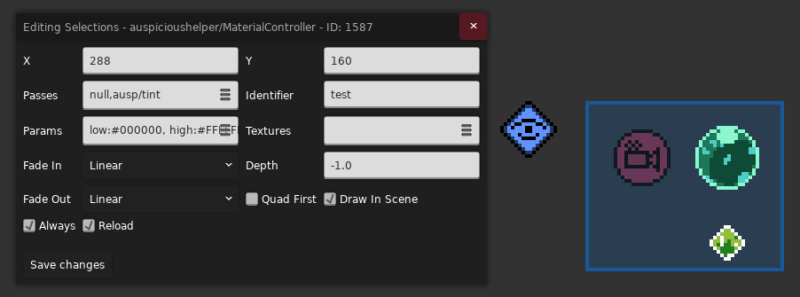

> 你是 [Eevee Helper](./eevee.md) 的兄弟呀😭

其他资料

* [Auspicious Helper 香蕉网](https://gamebanana.com/mods/578559)
* [Auspicious Helper Github 文档](https://github.com/cloudsbelow/auspicioushelper/wiki)

## [Template](https://github.com/cloudsbelow/auspicioushelper/wiki/Templates)

ausp 提供了一系列模板让你非常方便的把一些对象变成另一个东西

比如我们要把 `Booster` 和 `Refill` 变成果冻, 只需要用 `Connected Container` 将需要影响的对象框住

> ausp 自己的模板砖不用框

然后在框内放一个果冻模板

然后就完事了!

> 当然你也可以顺带框住 Decal, 需要 `Connected Container` 勾选 `Get Decals`
> 
> 不过需要注意并不是所有的特性都能加在某些对象上

### 其他 Template 模板

* [`Behavior Chain`](https://www.bilibili.com/video/BV1ZVHp6EEcd/?t=418): 组装用的模板, 默认情况下框内只能放一个模板, 如果要放多个则要用 `Behavior Chain` 组装
  (别把子节点放在框内了)

#### 状态

* [`Dream Block Modifier`](https://www.bilibili.com/video/BV1ZVHp6EEcd/?t=10): 果冻模板
* [`Belt`](https://www.bilibili.com/video/BV1jVHp6EE17/?t=108): `FireBall` 循环火球模板
* [`Cloud`](https://www.bilibili.com/video/BV1ZVHp6EEcd/?t=92): 云朵模板
* [`Kevin`](https://www.bilibili.com/video/BV1ZVHp6EEcd/?t=117): Kevin 模板
* [`Rotator`](https://www.bilibili.com/video/BV1ZVHp6EEcd/?t=139): 旋转模板, 将内容复制并均匀放在圆周上[缓动](https://easings.net/zh-cn)旋转 (喜欢煤球的有福了)
* [`Holdable`](https://www.bilibili.com/video/BV1ZVHp6EEcd/?t=171): 可抓取物模板
* [`Ice Block`](https://www.bilibili.com/video/BV1ZVHp6EEcd/?t=200): 冰块模板
* [`Zip Mover`](https://www.bilibili.com/video/BV1ZVHp6EEcd/?t=217): 红绿灯模板
* [`Block`](https://www.bilibili.com/video/BV1ZVHp6EEcd/?t=238): 易碎块模板
* [`Fake Wall`](https://www.bilibili.com/video/BV1ZVHp6EEcd/?t=254): 假墙模板
* [`Moon Block`](https://www.bilibili.com/video/BV1ZVHp6EEcd/?t=280): 月亮块模板
* [`Move Block`](https://www.bilibili.com/video/BV1ZVHp6EEcd/?t=302): 移动块模板
* [`Swap Block`](https://www.bilibili.com/video/BV1ZVHp6EEcd/?t=320): `Swap Block` 模板
* [`Push Block`](https://www.bilibili.com/video/BV1ZVHp6EEcd/?t=345): `Push Block` 模板 (类似草莓酱里的[霜冻碎片里的实体](https://www.bilibili.com/video/BV1sL411y7gY/?p=2&t=5))
* [`Falling Block`](https://www.bilibili.com/video/BV1ZVHp6EEcd/?t=396): 掉落块模板
* [`Entity Modifier`](https://www.bilibili.com/video/BV1twpc6gE3v/?t=128): 实体状态修改模板, 修改可见性/激活性/碰撞/抖动
  类似 [Eevee Helper 的 Flag Toggle Modifier](./eevee.md#flag-toggle-modifier)
* [`Collision Modifier`](https://www.bilibili.com/video/BV1twpc6gE3v/?t=1204): 精细调整实体和模板是否可碰撞, 比如水母可以穿过但是玩家不行
* [`Cassette Block`](https://www.bilibili.com/video/BV1twpc6gE3v/?t=1267): 节奏块模板, 相关的有节奏块改色 `Cassette Color` 模板, 和 `Cassette Manager Simple` 节奏模板管理器

#### 运动

* [`Static Mover`](https://www.bilibili.com/video/BV1ZVHp6EEcd/?t=494): 附着模板, 类似 [Eevee Helper 的 Attached Container](./eevee.md#attached-container)
* [`Gluable`](https://www.bilibili.com/video/BV1twpc6gE3v/?t=1016): 附着/跟随模板, 类似 [Eevee Helper 的 Attached Container](./eevee.md#attached-container), 可以做[接触单向板后触发机关](https://www.bilibili.com/video/BV1YNpu6gEmj/)的效果
* [`Gate Mover`](https://www.bilibili.com/video/BV1twpc6gE3v/?t=4): 步进模板, 主节点和子节点定义了移动的方向和距离, 每次对应 Channel 不为 0 时, 使房间内最近的 Template 向前面定义的方向移动一次
* [`Displacer`](https://www.bilibili.com/video/BV1twpc6gE3v/?t=95): 置换模板, 将模板整体移动到对应节点位置
* [`Channel Mover`](https://www.bilibili.com/video/BV1twpc6gE3v/?t=865): 移动模板, 根据 Channel 的数值在节点之间移动

#### 交互

* [`Dashhit`](https://www.bilibili.com/video/BV1twpc6gE3v/?t=270): 冲刺碰撞交互模板
* [`Resetter`](https://www.bilibili.com/video/BV1twpc6gE3v/?t=921): 重置模板, 可以销毁和生成 Template
* [`Trigger Modifier`](https://www.bilibili.com/video/BV1twpc6gE3v/?t=972): 触发模板, 接收到非零 Channel 后会触发可触发的模板, 比如掉落块, 易碎块之类的 (有的模板需要勾选
  `Triggerable`)

#### 复制

> 说到模板怎么能少得了复制模板呢

创建名为 `zztemplates-{roomName}` 格式的房间后, 该房间会被作为一个模板房间被 ausp 使用, 比如 `zztemplates-test`,
在该房间内放置一个 `Template Filler` 实体, 被框住的所有东西都会成为这个复制模板的一部分, 你需要给这个复制模板起一个名字, 比如 `refill`

> 你可以为 `Template Filler` 添加节点, 表示该复制模版的中心位置在哪

之后你就可以在任意模板中的 `Template` 属性里填入 `{roomName}/{templateName}`, 比如用 `test/refill` 来引用复制模板的同时为其添加对应的模板特性了

* [`Template`](https://www.bilibili.com/video/BV1XnpK6aEsu/?t=1): 无额外特性的模板, 所以它的主要作用就是引用一个复制模板, 但它可以接着被 `Template Filler` 框起来成为新复制模板的一部分, 所以可以不断套娃
* [`Template Filler Switcher`](https://www.bilibili.com/video/BV1XnpK6aEsu/?t=225): 与 `Template Filler` 类似, 但是可以随机使用一个复制模板
* [`Evil Packed Template Room`](https://www.bilibili.com/video/BV1XnpK6aEsu/?t=308): 可以把模板数据打包到一串 Base64 编码的字符串里, 后续使用该实体就可以不需要创建模板房间了, 又由于本质上是数据, 所以你也可以粘给别的图用

> 你可能需要知道怎么打开[控制台](../cmd.md) 或是找到 [`Log.txt`](../../mods/game_crashes.md)

## [Channel](https://github.com/cloudsbelow/auspicioushelper/wiki/Channels)

[Flag](../flag/flag.md) 只能表示有和无两种状态, 而 Channel 引入了数字, 这样我们就可以把数值绑定到对应名字的 Channel 上, 像下面这样

我们把数字 `10` 绑定到一个名为 `awa` 的 Channel 上

> 要开启调试面板请见 [Mapping Utils](./mapping_utils.md#channels)

后续对于一些 [Template](#template), 它们的属性可能会带有 `Channelable` 字样, 表示该属性既可以是一个固定的值, 也可以是你填入的 Channel 对应的动态的值, 比如这里的 `Speed` 属性就可以接收一个
Channel, 所以我们将 awa 绑定上去, 这样该移动块后续的移动速度就会变成 `10px/s` 了

    
注意

    
Channel 对应的数值会在玩家死亡后重置, 切板不会

知道 Channel 的含义后我们就可以使用 Trigger 或者实体变着法子改变 Channel 的数值了

### Entity

#### Channel Approach Controller

你可以让 `Out Channel` 的值以 `Amount` (可写[表达式](#advanced-expression))的速率接近 `Towards Channel` (可写[表达式](#advanced-expression)), 
比如上述写法就对应 `awa` Channel 数值不断增大, 每秒增加 1

#### Channel Clear Controller

该 Controller 可以在进入房间时重置以 `Clear Prefix` 为前缀的所有 Channel, 也可以勾选 `Clear All` 以重置所有的 Channel

你可以设置 `Channel` 的值为 `Value`, 也可以使用 [Advanced 高级表达式](#advanced-expression) 去设置房间里某些 Channel 的默认值

### Trigger

#### Channel Player Trigger

类似于 `Flag Trigger`, 但是用来设置 Channel

* `Channel`: 你要设置的 Channel 名字, 比如这里是 `a`
* `Value`: 你要设置的 Channel 对应的数值
* `Advanced`: 该 Trigger 触发后会额外设置一些 Channel 的数值, 语法请参考[高级表达式](#advanced-expression)
* `Action`: Trigger 触发方式
* `Op`: 用于决定 `Value` 的计算方式
    * `set`: 表示直接将对应 Channel 设置为 `Value`, 即 `channel = Value`
    * `add`: 表示直接在原来 Channel 数值的基础上加上 `Value`, 即 `channel = old Value + new Value`
    * `and`: `channel = old Value & new Value`
    * `or`: `channel = old Value | new Value`
    * `xor`: `channel = old Value ^ new Value`
    * `min`: `channel = min(old Value, new Value)`
    * `max`: `channel = max(old Value, new Value)`
* `Everywhere`: 相当于将该 Trigger 撑满房间
* `Only Once`: 是否触发一次就销毁
* `Only When Channel`: 当该 Channel 对应的数值大于 `0` 时, 此 Trigger 才能生效, 留空表示此项不起作用, 即该 Trigger 是否触发与该选项无关

#### Channel Fade Trigger

根据玩家位置和 `Position Mode` 使某个 Channel 在 From Channel 和 To Channel 之间插值

比如上方这个例子如果移动块速度绑定到 `awa` Channel 上, 那么我们在该 Trigger 内就可以调整位置使 `awa` 在 `0 ~ 100` 之间变化

#### Channel Position Trigger

根据玩家在 Trigger 内的相对位置, 在 X/Y 两个维度上分别返回 `0 ~ 1` 之间的值并分别存入 `X Channel` 和 `Y Channel`

`Path` 表示要跟踪的对象, 默认为玩家 `player`, 如果你要跟踪其他对象, 比如这里的水母, 你需要在场上放置一个 `Entity Marker` 实体, 并在 `Path`
属性处填入对应[实体的 ID](../loenn/faq.md#entity-id), 并在 `Identifier` 随意填入一个特殊的名字即可, 之后在 `Channel Position Trigger` 的 `Path` 属性中填入 `Entity Marker` 的 `Path`
就可以跟踪对应实体了

#### Channel Math Controller Trigger

> 也有对应实体版的 `Channel Math Controller`

你可以在酣畅淋漓的[少儿编程](https://cloudsbelow.neocities.org/celestestuff/visualmathcompiler)后点击黄色方块编译拿到编码后的 Base64, 最后把它粘贴到 `Compiled Operations` 中即可

比如这里的 Base64 编码是 `AgAAAAIADABDAAAAQgAHZ2V0RmxhZwVmbGFnQToAQgAAAAMAZAAAAAUADGFjY2VsZXJhdGlvbgMAAQAAAEMBB3NldEZsYWcFZmxhZ0IASA==`, 对应的逻辑为: 当场景内有 `flagA` 的时候, 将
`acceleration` Channel 的数值设置为 `100` 并启用 `flagB`

又比如上方节奏块部分的音频切换一开始不用 `Cassette Manager Simple` 用 `Channel Math Controller Trigger` 的时候是这么写的, 表示名为 `note` 的 Channel 每过一秒会在 `0, 1, 2, 3`
之间循环一步

### [高级表达式](https://github.com/cloudsbelow/auspicioushelper/wiki/Channels#channel-expressions)

你可以像写代码一样写这些数学表达式来设置一些 Channel 的数值, 然后用小括号 `()` 将它们包裹起来, 并且你可以在名字前加上不同的符号以表示访问不同的数值

* `@`: 表示访问一个 Channel 的数值, 比如 `@channelA` (虽然新的表达式似乎不需要加 `@`)
* `$`: 表示访问一个 Flag 对应的数值, 比如 `$flagB`, Flag 启用时对应 `1`, 反之对应 `0`
* `?`: 表示访问一个 [Slider](./mapping_utils.md#counters) 对应的数值, 比如 `?sliderC`
* `#`: 表示访问一个 [Counter](./mapping_utils.md#counters) 对应的数值, 比如 `#counterD`

比如对于 `a:2, b:($a * 2), c:(b * pow(2, 3))` (场景里有名为 `a` 的 Flag)这样的设置, `a, b, c` 对应的结果为 `2, 2, 16`

#### 基本运算符

<table>
    <thead>
        <tr>
            <th>写法</th>
            <th>实际功能</th>
        </tr>
    </thead>
    <tbody>
        <tr>
            <td><code>~x</code></td>
            <td>按位取反</td>
        </tr>
        <tr>
            <td><code>!x</code></td>
            <td>逻辑非，<code>x != 0 ? 0 : 1</code></td>
        </tr>
        <tr>
            <td><code>x ^ y</code></td>
            <td>按位异或</td>
        </tr>
        <tr>
            <td><code>x &amp; y</code></td>
            <td>按位与</td>
        </tr>
        <tr>
            <td><code>x | y</code></td>
            <td>按位或</td>
        </tr>
        <tr>
            <td><code>x + y</code></td>
            <td>加法</td>
        </tr>
        <tr>
            <td><code>x - y</code></td>
            <td>减法</td>
        </tr>
        <tr>
            <td><code>x * y</code></td>
            <td>乘法</td>
        </tr>
        <tr>
            <td><code>x / y</code></td>
            <td>除法</td>
        </tr>
        <tr>
            <td><code>x // y</code></td>
            <td>整数除法</td>
        </tr>
        <tr>
            <td><code>x % y</code></td>
            <td>取模</td>
        </tr>
        <tr>
            <td><code>x &gt; y</code></td>
            <td>大于</td>
        </tr>
        <tr>
            <td><code>x &lt; y</code></td>
            <td>小于</td>
        </tr>
        <tr>
            <td><code>x &gt;= y</code></td>
            <td>大于等于</td>
        </tr>
        <tr>
            <td><code>x &lt;= y</code></td>
            <td>小于等于</td>
        </tr>
        <tr>
            <td><code>x == y</code></td>
            <td>等于</td>
        </tr>
        <tr>
            <td><code>x != y</code></td>
            <td>不等于</td>
        </tr>
        <tr>
            <td><code>x &lt;&lt; y</code></td>
            <td>左移</td>
        </tr>
        <tr>
            <td><code>x &gt;&gt; y</code></td>
            <td>右移</td>
        </tr>
    </tbody>
</table>

#### 函数

| 写法                  | 参数 | 实际功能                                       |
|-----------------------|-----:|------------------------------------------------|
| `pi()`                |    0 | π                                              |
| `abs(x)`              |    1 | 绝对值                                         |
| `ceil(x)`             |    1 | 向上取整                                       |
| `floor(x)`            |    1 | 向下取整                                       |
| `round(x)`            |    1 | 四舍五入                                       |
| `exp(x)`              |    1 | `e^x`                                          |
| `ln(x)`               |    1 | 自然对数 `ln(x)`                               |
| `log(x)`              |    1 | `log₂(x)`                                      |
| `sqrt(x)`             |    1 | 平方根                                         |
| `saturate(x)`         |    1 | 限制到 `[0,1]`                                 |
| `max(x,y)`            |    2 | 最大值                                         |
| `min(x,y)`            |    2 | 最小值                                         |
| `pow(x,y)`            |    2 | `x^y`                                          |
| `clamp(x,a,b)`        |    3 | 限制到 `[a,b]`                                 |
| `mix(f,a,b)`          |    3 | `f*a + (1-f)*b`                                |
| `when(f,a,b)`         |    3 | `f != 0 ? a : b`                               |
| `take(f,a,b)`         |    3 | `f < 1 ? a : b` (`0 ~ 2` 平均分 2 份)          |
| `take(f,a,b,c)`       |    4 | 根据 `f` 选择 3 个值之一 (`0 ~ 3` 平均分 3 份) |
| `take(f,a,b,c,d)`     |    5 | 根据 `f` 选择 4 个值之一 (`0 ~ 4` 平均分 4 份) |
| `take(f,a,b,c,d,e)`   |    6 | 根据 `f` 选择 5 个值之一 (`0 ~ 5` 平均分 5 份) |
| `take(f,a,b,c,d,e,g)` |    7 | 根据 `f` 选择 6 个值之一 (`0 ~ 6` 平均分 6 份) |

#### [旧版表达式](https://github.com/cloudsbelow/auspicioushelper/wiki/Channels#legacy-note)

你可以定义数学表达式的运算顺序, 然后用中括号 `[]` 将它们包裹起来, 比如

1. `[+1, *2, +3, /2, floor, -1, << 3, -10, abs]`
2. `[+2, +3, /2, floor, -1, << 3, -10, abs]`
3. `[+5, /2, floor, -1, << 3, -10, abs]`
4. `[+2.5, floor, -1, << 3, -10, abs]`
5. `[+2, -1, << 3, -10, abs]`
6. `[+1, << 3, -10, abs]`
7. `[+8, -10, abs]`
8. `[-2, abs]`
9. `[+2]`

## [Material](https://github.com/cloudsbelow/auspicioushelper/wiki/Materials-(shaders))

ausp 还可以为实体和背景添加额外的视觉效果

简单来说, 你需要使用 `Material Template` 来决定你要为哪些对象添加视效, 并且在 `Layer identifier` 属性处填上一个图层名字, 比如这里的 `test`
表示将内部实体加入到对应图层的管理当中, 这样后续就可以为这些图层统一加效果了

接下来我们先讲讲怎么为实体添加视觉效果

### 实体

首先在场景内放置一个 `Material` Controller 实体, 并在 `Identifier` 处填入你要影响的图层名, 比如这里的 `test`,

然后加效果方式就是这里的 `Passes` 了, `Passes` 由多个 `Pass` 组成, 用逗号分隔, 这样你就可以对对象连续做各种效果, 比如先变亮, 再拉伸, 再旋转, 再加个滤镜等等

你可以把 `Pass` 简单理解为一个预制的效果, 
比如**变亮效果**可以是一个 `Pass`, 你要处理的对象经过变亮这一 `Pass` 的处理后就真的变亮了, 同时一个 `Pass` 可能也会需要一些参数, 
比如变亮效果可能需要知道**具体要变亮多少**, 这可能需要填入一些参数

然后我们可以先做一个简单的调色效果, 也就是名为 `ausp/tint` 的 `Pass`, 它有三个参数

> 一开始的效果是 null 表示什么都不做, 虽然你可能觉得没什么用, 但是作者表示尽量不要动, 让它作为第一个 `Pass` 就行

* `low`, `high`: 分别表示颜色映射区间的下界和上界, 原始颜色会被映射到这两个颜色之间
* `sat`: 即 saturation, 表示你这个颜色映射之后需要保留多少的色彩信息, 数字越小颜色越偏黑白灰 

所以最简单的例子就是 `low` 保持黑色, `high` 保持白色, `sat` 设置成零, 这样就能做灰度效果了

> 如果你好奇背后的具体计算公式, 可以直接查看对应的[源码](https://github.com/cloudsbelow/auspicioushelper/tree/main/Effects/ausp/src), 
> 比如这里的 [`ausp/tint`](https://github.com/cloudsbelow/auspicioushelper/blob/main/Effects/ausp/src/tint.fx),
> 顺带还可以看看有几个参数, 如果[文档](https://github.com/cloudsbelow/auspicioushelper/wiki/Materials-(shaders)#specifying-passes)没提及的话

### 其他 `Pass`

> 你可能需要[打开控制台](../cmd.md#ausp)方便的 Debug

#### `ausp/maskBy`

将当前贴图作为蒙版去蒙 `槽位 1` 里的贴图 (`槽位 0` 往往对应当前贴图, 比如上方的水晶和泡泡)

比如我们先随便准备一张图, 比如这里的噪声贴图 (路径为 `Atlases/Gameplay/Wiki/noise.png`)

然后在 Controller 里将贴图绑定到对应槽位上, 比如这里的 `1:/Gameplay/Wiki/noise`

然后填上效果后就 ok 了!

#### `ausp/maskedFrom`

将 `槽位 1` 里的贴图作为蒙版去蒙当前贴图, 适合用不动的画面去蒙动的画面, 所以这里讲讲背景蒙版技巧

我们可以在背景的 `Only` 处填上 `%{texture_name}`, 比如这里的 `%mask_bg` 这样这个背景就会被 ausp 当作是一张贴图且可以在后续被对应贴图槽位引用

然后我们配置好对应的 `Pass` 和贴图槽位即可

这样我们的对象就只会显示在背景内部了!

#### `ausp/invertAlpha`

反转透明度, 适合用在蒙版相关的 `Pass` 链上来反转蒙版区域

#### `ausp/invertColor`

反色

#### `ausp/tint`

调色

#### `ausp/static`

生成随时间变化的噪声, 有 `low`, `high` 两个颜色参数, 表示暗的地方有多暗, 亮的地方有多亮 (说白了就是噪声亮度的取值范围)

#### `ausp/innerBorder` / ` ausp/outerBorder`

你可以选择给对象添加内描边或是外描边, 你可以设置 `color` 参数来调整描边的颜色

你还可以设置参数 `corners:true` 让斜对角也参与描边

#### `ausp/blurH` / ` ausp/blurV`

在水平/垂直方向上给予对象高斯模糊的效果, 可以设置 `sigma` 参数调整模糊强度 (大于 `0` 的小数)

~~但是 `sigma` 调大了可能就只剩光源和粒子效果了~~

#### `ausp/opacity`

改变对象的不透明度, 参数为 `opacity` (`0 ~ 1`)

#### `ausp/colorgrade`

为对象添加[滤镜](../graphics/color_grading.md)效果, 需要在 `槽位 1` 上绑定对应滤镜贴图, 比如我们用冷滤镜为例

<figure markdown>
  {style="width: 900px; image-rendering: pixelated; title=123"}
  <figcaption>路径: Graphics/ColorGrading/Wiki/cold.png</figcaption>
</figure>

#### `ausp/colorgradefade`

为对象添加滤镜效果, 但是在两个滤镜之间插值, 需要在 `槽位 1` 和 `槽位 2` 上绑定对应滤镜贴图, 并用 `fade` 参数 (`0 ~ 1`)调整效果最终偏向哪个滤镜

#### `ausp/compose`

组合最多四张贴图 (不包含源图), 我们可以设置 `num` 参数调整组合程度

* 当 `num <= 0`, 只显示源图
* 当 `num <= 1`, 只显示源图, 非源图区域如果有 `槽位 1` 对应贴图, 则显示并设置其透明度为 `num`
* 当 `num <= 2`, 只显示源图, 非源图区域显示 `槽位 1` 对应贴图, 其他区域, 如果有 `槽位 2` 对应贴图, 则显示并设置其透明度为 `num - 1`
* 以此类推最后的效果就是一层叠一层

比如我们再借用一下之前的 `noise.png` 贴图, 并将 `num` 设置为 `0.1` 能做个简单的带破碎感的光照效果 (虽然感觉正常用法可能是用来将某些东西按顺序 fade 出来的, 用 [Channel](#params) 控制)

#### `ausp/flip`

根据玩家位置翻转图像

#### `ausp/rainbowify`

为对象施加彩虹效果 (类似彩虹刺)

#### `ausp/selectColor`

类似于颜色二值化, 参数如下

* `color`: 表示一个基准值, 比这个颜色亮的颜色会变成 `falseColor`, 反之变成 `trueColor`
* `range`: 数值越小颜色越容易变成 `falseColor`, 反之越容易变成 `trueColor`, 可用 [Channel](#params) 控制

### 参数控制

### 贴图设置

### [自定义 Shader](https://github.com/cloudsbelow/auspicioushelper/wiki/Materials-(shaders)#brief-note-for-shader-writers)