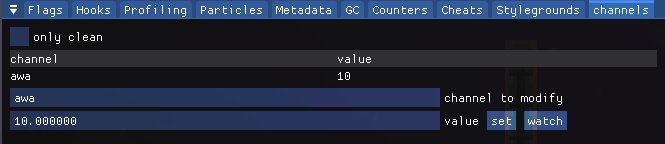
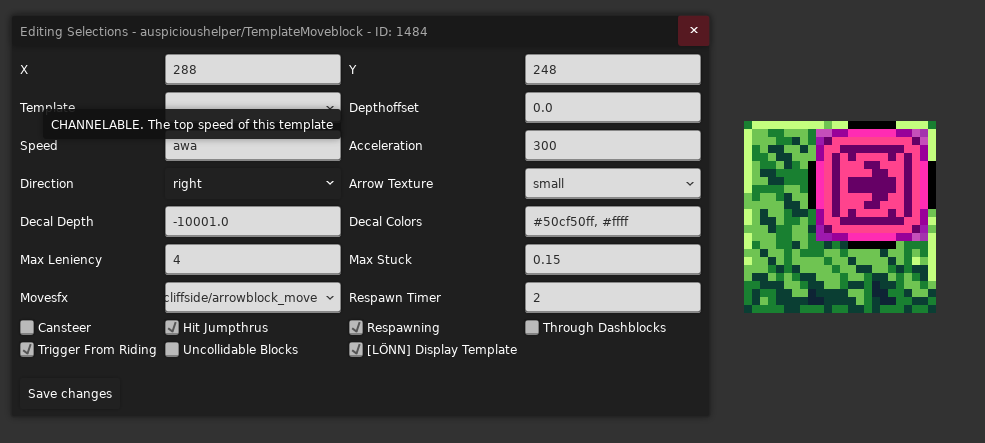
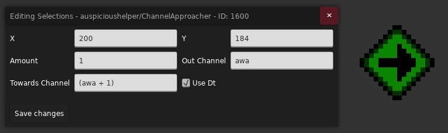
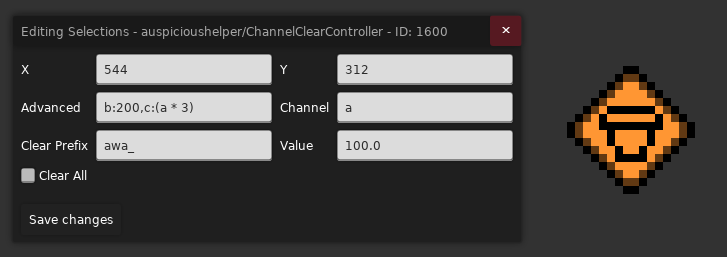
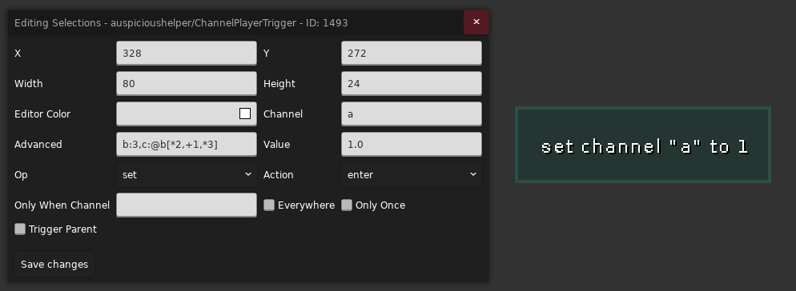
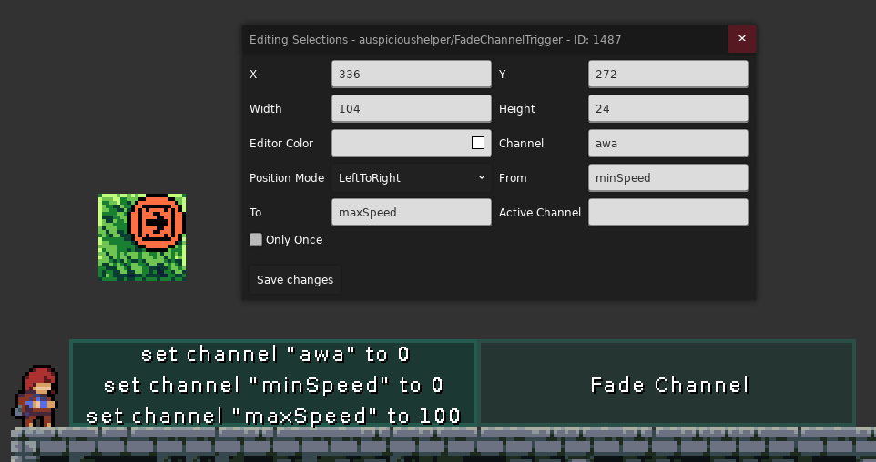
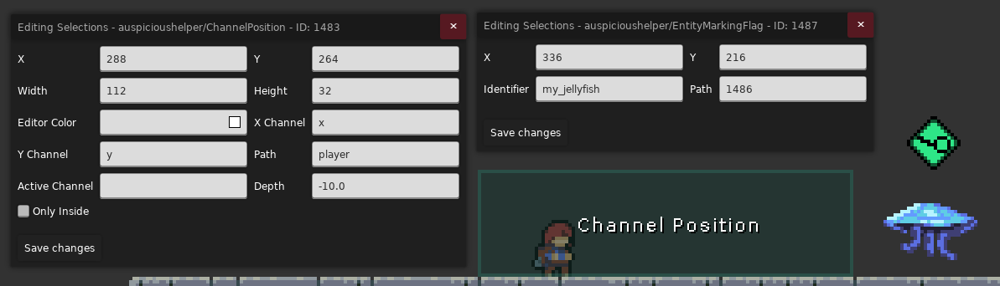
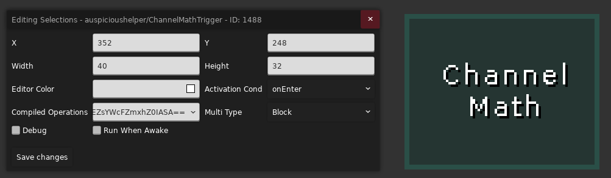
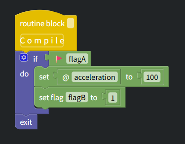
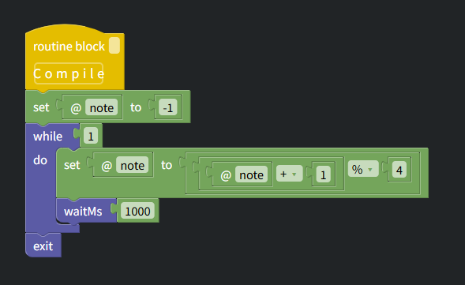

# [Channel](https://github.com/cloudsbelow/auspicioushelper/wiki/Channels)

[Flag](../../flag/flag.md) 只能表示有和无两种状态, 而 Channel 引入了数字, 这样我们就可以把数值绑定到对应名字的 Channel 上, 像下面这样

我们把数字 `10` 绑定到一个名为 `awa` 的 Channel 上

> 要开启调试面板请见 [Mapping Utils](../mapping_utils.md#channels)

后续对于一些 [Template](./template.md), 它们的属性可能会带有 `Channelable` 字样, 表示该属性既可以是一个固定的值, 也可以是你填入的 Channel 对应的动态的值, 比如这里的 `Speed` 属性就可以接收一个
Channel, 所以我们将 `awa` 绑定上去, 这样该移动块后续的移动速度就会变成 `10px/s` 了

    
注意

    
Channel 对应的数值会在玩家死亡后重置, 切板不会

知道 Channel 的含义后我们就可以使用 Trigger 或者实体变着法子改变 Channel 的数值了

## Entity

### Channel Approach Controller

你可以让 `Out Channel` 的值以 `Amount` (可写[表达式](#advanced-expression))的速率接近 `Towards Channel` (可写[表达式](#advanced-expression)), 比如上述写法就对应 `awa` Channel
数值不断增大, 每秒增加 1

### Channel Clear Controller

该 Controller 可以在进入房间时重置以 `Clear Prefix` 为前缀的所有 Channel, 也可以勾选 `Clear All` 以重置所有的 Channel

你可以设置 `Channel` 的值为 `Value`, 也可以使用 [Advanced 高级表达式](#advanced-expression) 去设置房间里某些 Channel 的默认值

## Trigger

### Channel Player Trigger

类似于 `Flag Trigger`, 但是用来设置 Channel

* `Channel`: 你要设置的 Channel 名字, 比如这里是 `a`
* `Value`: 你要设置的 Channel 对应的数值
* `Advanced`: 该 Trigger 触发后会额外设置一些 Channel 的数值, 语法请参考[高级表达式](#advanced-expression)
* `Action`: Trigger 触发方式
* `Op`: 用于决定 `Value` 的计算方式
    * `set`: 表示直接将对应 Channel 设置为 `Value`, 即 `channel = Value`
    * `add`: 表示直接在原来 Channel 数值的基础上加上 `Value`, 即 `channel = old Value + new Value`
    * `and`: `channel = old Value & new Value`
    * `or`: `channel = old Value | new Value`
    * `xor`: `channel = old Value ^ new Value`
    * `min`: `channel = min(old Value, new Value)`
    * `max`: `channel = max(old Value, new Value)`
* `Everywhere`: 相当于将该 Trigger 撑满房间
* `Only Once`: 是否触发一次就销毁
* `Only When Channel`: 当该 Channel 对应的数值大于 `0` 时, 此 Trigger 才能生效, 留空表示此项不起作用, 即该 Trigger 是否触发与该选项无关

### Channel Fade Trigger

根据玩家位置和 `Position Mode` 使某个 Channel 在 From Channel 和 To Channel 之间插值

比如上方这个例子如果移动块速度绑定到 `awa` Channel 上, 那么我们在该 Trigger 内就可以调整位置使 `awa` 在 `0 ~ 100` 之间变化

### Channel Position Trigger

根据玩家在 Trigger 内的相对位置, 在 X/Y 两个维度上分别返回 `0 ~ 1` 之间的值并分别存入 `X Channel` 和 `Y Channel`

`Path` 表示要跟踪的对象, 默认为玩家 `player`, 如果你要跟踪其它对象, 比如这里的水母, 你需要在场上放置一个 `Entity Marker` 实体, 并在 `Path`
属性处填入对应[实体的 ID](../../loenn/faq.md#entity-id), 并在 `Identifier` 随意填入一个特殊的名字即可, 之后在 `Channel Position Trigger` 的 `Path` 属性中填入 `Entity Marker` 的 `Path`
就可以跟踪对应实体了

### Channel Math Controller Trigger

> 也有对应实体版的 `Channel Math Controller`

你可以在酣畅淋漓的[少儿编程](https://cloudsbelow.neocities.org/celestestuff/visualmathcompiler)后点击黄色方块编译拿到编码后的 Base64, 最后把它粘贴到 `Compiled Operations` 中即可

比如这里的 Base64 编码是 `AgAAAAIADABDAAAAQgAHZ2V0RmxhZwVmbGFnQToAQgAAAAMAZAAAAAUADGFjY2VsZXJhdGlvbgMAAQAAAEMBB3NldEZsYWcFZmxhZ0IASA==`, 对应的逻辑为: 当场景内有 `flagA` 的时候, 将
`acceleration` Channel 的数值设置为 `100` 并启用 `flagB`

又比如上方节奏块部分的音频切换一开始不用 `Cassette Manager Simple` 用 `Channel Math Controller Trigger` 的时候是这么写的, 表示名为 `note` 的 Channel 每过一秒会在 `0, 1, 2, 3`
之间循环一步

## [高级表达式](https://github.com/cloudsbelow/auspicioushelper/wiki/Channels#channel-expressions)

你可以像写代码一样写这些数学表达式来设置一些 Channel 的数值, 然后用小括号 `()` 将它们包裹起来, 并且你可以在名字前加上不同的符号以表示访问不同的数值

* `@`: 表示访问一个 Channel 的数值, 比如 `@channelA` (虽然新的表达式似乎不需要加 `@`)
* `$`: 表示访问一个 Flag 对应的数值, 比如 `$flagB`, Flag 启用时对应 `1`, 反之对应 `0`
* `?`: 表示访问一个 [Slider](../mapping_utils.md#counters) 对应的数值, 比如 `?sliderC`
* `#`: 表示访问一个 [Counter](../mapping_utils.md#counters) 对应的数值, 比如 `#counterD`

比如对于 `a:2, b:($a * 2), c:(b * pow(2, 3))` (场景里有名为 `a` 的 Flag)这样的设置, `a, b, c` 对应的结果为 `2, 2, 16`

### 基本运算符

<table>
    <thead>
        <tr>
            <th>写法</th>
            <th>实际功能</th>
        </tr>
    </thead>
    <tbody>
        <tr>
            <td><code>~x</code></td>
            <td>按位取反</td>
        </tr>
        <tr>
            <td><code>!x</code></td>
            <td>逻辑非，<code>x != 0 ? 0 : 1</code></td>
        </tr>
        <tr>
            <td><code>x ^ y</code></td>
            <td>按位异或</td>
        </tr>
        <tr>
            <td><code>x &amp; y</code></td>
            <td>按位与</td>
        </tr>
        <tr>
            <td><code>x | y</code></td>
            <td>按位或</td>
        </tr>
        <tr>
            <td><code>x + y</code></td>
            <td>加法</td>
        </tr>
        <tr>
            <td><code>x - y</code></td>
            <td>减法</td>
        </tr>
        <tr>
            <td><code>x * y</code></td>
            <td>乘法</td>
        </tr>
        <tr>
            <td><code>x / y</code></td>
            <td>除法</td>
        </tr>
        <tr>
            <td><code>x // y</code></td>
            <td>整数除法</td>
        </tr>
        <tr>
            <td><code>x % y</code></td>
            <td>取模</td>
        </tr>
        <tr>
            <td><code>x &gt; y</code></td>
            <td>大于</td>
        </tr>
        <tr>
            <td><code>x &lt; y</code></td>
            <td>小于</td>
        </tr>
        <tr>
            <td><code>x &gt;= y</code></td>
            <td>大于等于</td>
        </tr>
        <tr>
            <td><code>x &lt;= y</code></td>
            <td>小于等于</td>
        </tr>
        <tr>
            <td><code>x == y</code></td>
            <td>等于</td>
        </tr>
        <tr>
            <td><code>x != y</code></td>
            <td>不等于</td>
        </tr>
        <tr>
            <td><code>x &lt;&lt; y</code></td>
            <td>左移</td>
        </tr>
        <tr>
            <td><code>x &gt;&gt; y</code></td>
            <td>右移</td>
        </tr>
    </tbody>
</table>

### 函数

| 写法                  | 参数 | 实际功能                                       |
|-----------------------|-----:|------------------------------------------------|
| `pi()`                |    0 | π                                              |
| `abs(x)`              |    1 | 绝对值                                         |
| `ceil(x)`             |    1 | 向上取整                                       |
| `floor(x)`            |    1 | 向下取整                                       |
| `round(x)`            |    1 | 四舍五入                                       |
| `exp(x)`              |    1 | `e^x`                                          |
| `sin(x)`              |    1 | `正弦函数`                                     |
| `cos(x)`              |    1 | `余弦函数`                                     |
| `ln(x)`               |    1 | 自然对数 `ln(x)`                               |
| `log(x)`              |    1 | `log₂(x)`                                      |
| `sqrt(x)`             |    1 | 平方根                                         |
| `saturate(x)`         |    1 | 限制到 `[0,1]`                                 |
| `max(x,y)`            |    2 | 最大值                                         |
| `min(x,y)`            |    2 | 最小值                                         |
| `pow(x,y)`            |    2 | `x^y`                                          |
| `clamp(x,a,b)`        |    3 | 限制到 `[a,b]`                                 |
| `mix(f,a,b)`          |    3 | `f*a + (1-f)*b`                                |
| `when(f,a,b)`         |    3 | `f != 0 ? a : b`                               |
| `take(f,a,b)`         |    3 | `f < 1 ? a : b` (`0 ~ 2` 平均分 2 份)          |
| `take(f,a,b,c)`       |    4 | 根据 `f` 选择 3 个值之一 (`0 ~ 3` 平均分 3 份) |
| `take(f,a,b,c,d)`     |    5 | 根据 `f` 选择 4 个值之一 (`0 ~ 4` 平均分 4 份) |
| `take(f,a,b,c,d,e)`   |    6 | 根据 `f` 选择 5 个值之一 (`0 ~ 5` 平均分 5 份) |
| `take(f,a,b,c,d,e,g)` |    7 | 根据 `f` 选择 6 个值之一 (`0 ~ 6` 平均分 6 份) |

### [旧版表达式](https://github.com/cloudsbelow/auspicioushelper/wiki/Channels#legacy-note)

你可以定义数学表达式的运算顺序, 然后用中括号 `[]` 将它们包裹起来, 比如

1. `[+1, *2, +3, /2, floor, -1, << 3, -10, abs]`
2. `[+2, +3, /2, floor, -1, << 3, -10, abs]`
3. `[+5, /2, floor, -1, << 3, -10, abs]`
4. `[+2.5, floor, -1, << 3, -10, abs]`
5. `[+2, -1, << 3, -10, abs]`
6. `[+1, << 3, -10, abs]`
7. `[+8, -10, abs]`
8. `[-2, abs]`
9. `[+2]`
