# [Material](https://github.com/cloudsbelow/auspicioushelper/wiki/Materials-(shaders))

ausp 还可以为实体和背景添加额外的视觉效果

## 选择对象

我们可以使用 `Material Template` 或是使用 `Material Applier` 来选择对象, 被选择的对象会被纳入 `Identifier` 图层, 后续 ausp 就可以对图层内的对象统一施加效果了

### 使用 Material Template

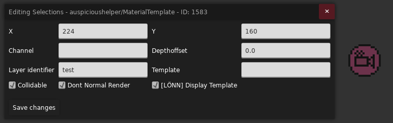

与其他[模板](./template.md)类似, 只需要用 `Connected Container` 框选需要影响的对象, 然后在框里放一个 `Material Template` 并做好 `Layer identifier` 图层配置即可, 比如这里的 `test`

### 使用 Material Applier

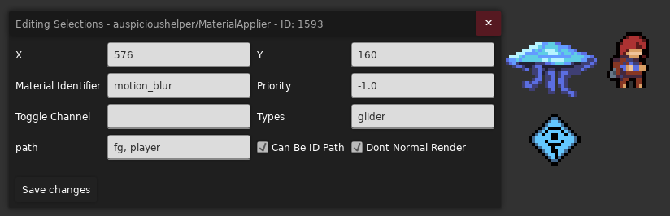

* `Material Identifier`: 表示你要将对象归到哪一个效果层去管理, 比如这里的 `motion_blur`
* `Types`: 填入你要影响的[对象的名字](../../loenn/faq.md#entity-name), 用逗号分隔, 这会直接影响同一类对象
* `path`: 填入一些 ausp 为你预制好的对象名, 用逗号分隔, 比如玩家 `player`, 前景砖 `fg`, 背景砖 `bg` 等 (你也可以直接填入[对象 ID](../../loenn/faq.md#entity-id))

选择好对象后, 接下来我们就先来讲讲怎么为实体图层添加视觉效果

## 实体

首先在场景内放置一个 `Material Controller` 实体, 并在 `Identifier` 处填入你要影响的图层名, 比如这里的 `test`,

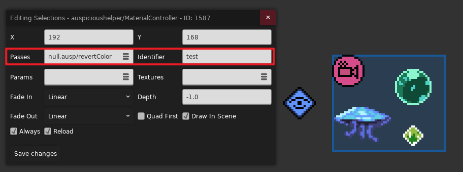

我们可以在 `Passes` 连续添加多个 `Pass` 效果, 用逗号分隔, 这样你就可以对对象连续做各种效果, 比如先变亮, 再拉伸, 再旋转, 再加个滤镜等等

> 你可以把 `Pass` 简单理解为一个预制的效果函数, 它可以很方便的将我们的像素输入转化为另一个像素输出,
>
> 它可能需要一些[**参数**](#params), 比如对于 **变亮效果**来说它可能想知道你要具体变亮多少, 这需要配置参数
>
> 它也可能需要一些[**贴图**](#texture), 比如对于一些 **蒙版效果**, 它需要从一些贴图中采样形状区域, 这样才能知道该显示在哪里

比如上述例子中我们添加了一个 `ausp/invertColor` 反色 `Pass`, 效果如下

> 一开始的效果是 null 表示什么都不做, 虽然你可能觉得没什么用, 但是作者表示尽量不要动, 让它作为第一个 `Pass` 就行

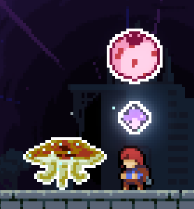

> 如果你好奇背后的具体计算公式, 可以直接查看对应的[源码](https://github.com/cloudsbelow/auspicioushelper/tree/main/Effects/ausp/src),
> 比如这里的 [`ausp/invertColor`](https://github.com/cloudsbelow/auspicioushelper/blob/main/Effects/ausp/src/invertColor.fx),
> 顺带还可以看看有几个参数, 如果[文档](https://github.com/cloudsbelow/auspicioushelper/wiki/Materials-(shaders)#specifying-passes)没提及的话

## 其它 `Pass`

> 你可能需要[打开控制台](../../cmd.md#ausp)方便的 Debug

<a id="maskBy"></a>

### `ausp/maskBy`

将当前贴图作为蒙版去蒙 `槽位 1` 里的贴图 (`槽位 0` 往往对应当前贴图, 比如上方的水晶和泡泡)

比如我们先随便准备一张图, 比如这里的噪声贴图 (路径为 `Atlases/Gameplay/Wiki/noise.png`)

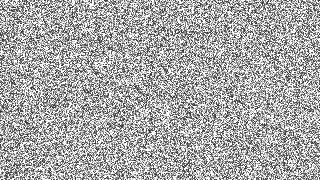

然后在 Controller 里将贴图绑定到对应槽位上, 比如这里的 `1:/Atlases/Gameplay/Wiki/noise`

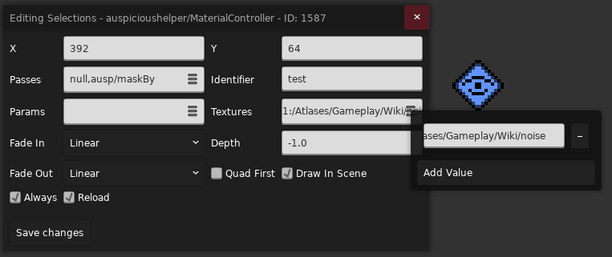

然后填上效果后就 ok 了!

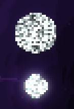

---

<a id="maskedFrom"></a>

### `ausp/maskedFrom`

将 `槽位 1` 里的贴图作为蒙版去蒙当前贴图, 适合用不动的画面去蒙动的画面, 所以这里讲讲背景蒙版技巧

我们可以在背景的 `Only` 处填上 `%{texture_name}`, 比如这里的 `%mask_bg` 这样这个背景就会被 ausp 当作是一张贴图且可以在后续被对应贴图槽位引用

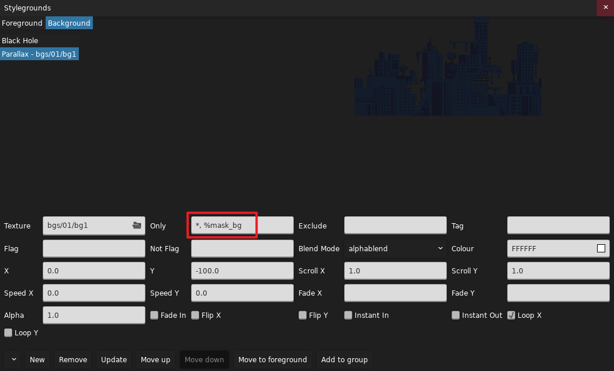

然后我们配置好对应的 `Pass` 和贴图槽位即可

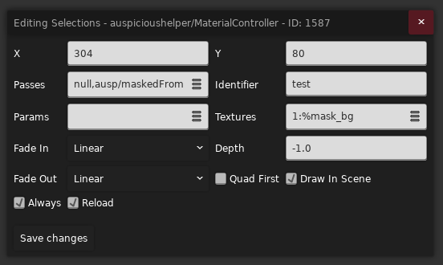

这样我们的对象就只会显示在背景内部了!

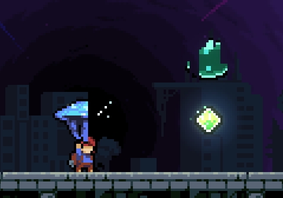

---

### `ausp/invertAlpha`

反转透明度, 适合用在蒙版相关的 `Pass` 链上来反转蒙版区域

---

### `ausp/tint`

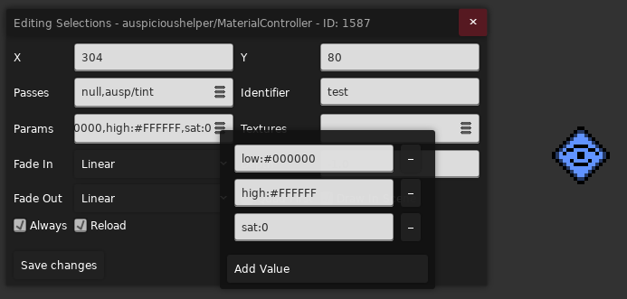

调色效果, 它有三个参数

* `low`, `high`: 分别表示颜色映射区间的下界和上界, 原始颜色会被映射到这两个颜色之间
* `sat`: 即 saturation, 表示你这个颜色映射之后需要保留多少的色彩信息, 数字越小颜色越偏黑白灰

所以最简单的例子就是 `low` 保持黑色, `high` 保持白色, `sat` 设置成零, 这样就能做灰度效果了

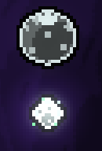

---

### `ausp/static`

生成随时间变化的噪声, 有 `low`, `high` 两个颜色参数, 表示暗的地方有多暗, 亮的地方有多亮 (说白了就是噪声亮度的取值范围)

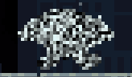

<a id="border"></a>

---

### `ausp/innerBorder` / ` ausp/outerBorder`

你可以选择给对象添加内描边或是外描边, 你可以设置 `color` 参数来调整描边的颜色

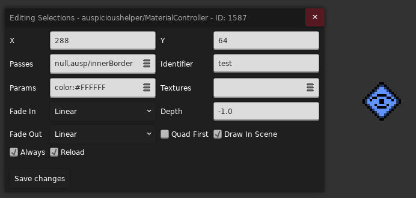

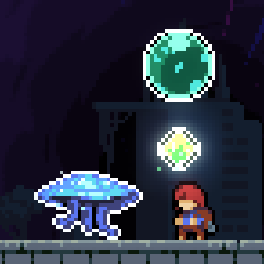

你还可以设置参数 `corners:true` 让斜对角也参与描边

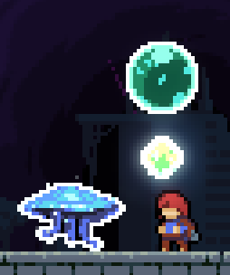

---

### `ausp/blurH` / ` ausp/blurV`

在水平/垂直方向上给予对象高斯模糊的效果, 可以设置 `sigma` 参数调整模糊强度 (大于 `0` 的小数)

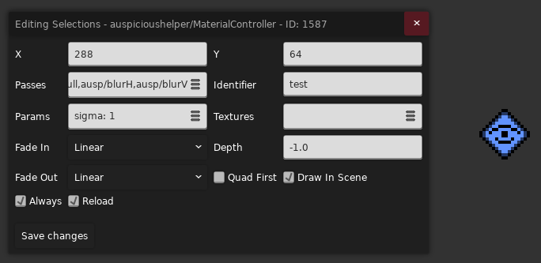

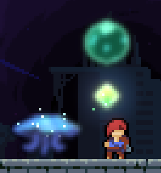

~~但是 `sigma` 调大了可能就只剩光源和粒子效果了~~

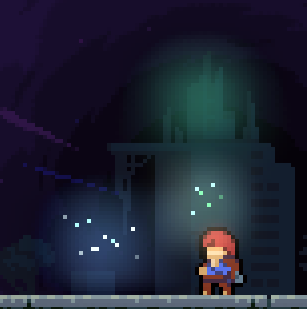

---

### [`ausp/opacity`](https://www.bilibili.com/video/BV1mApv6qE3g)

改变对象的不透明度, 参数为 `opacity` (`0 ~ 1`)

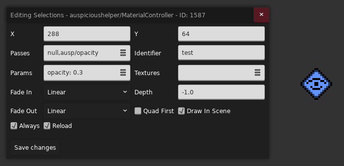

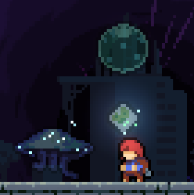

---

### `ausp/colorgrade`

为对象添加[滤镜](../../graphics/color_grading.md)效果, 需要在 `槽位 1` 上绑定对应滤镜贴图, 比如我们用冷滤镜为例

<figure markdown>
  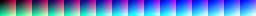{style="width: 900px; image-rendering: pixelated; title=123"}
  <figcaption>路径: Graphics/ColorGrading/Wiki/cold.png</figcaption>
</figure>

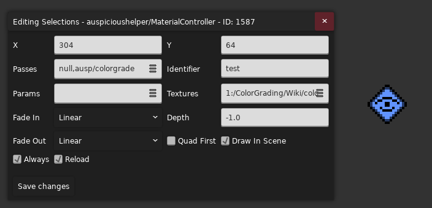

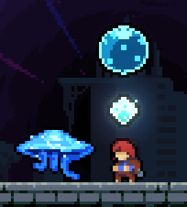

---

### `ausp/colorgradefade`

为对象添加滤镜效果, 但是在两个滤镜之间插值, 需要在 `槽位 1` 和 `槽位 2` 上绑定对应滤镜贴图, 并用 `fade` 参数 (`0 ~ 1`)调整效果最终偏向哪个滤镜

---

### `ausp/compose`

组合最多四张贴图 (不包含源图), 我们可以设置 `num` 参数调整组合程度

* 当 `num <= 0`, 只显示源图
* 当 `num <= 1`, 只显示源图, 非源图区域如果有 `槽位 1` 对应贴图, 则显示并设置其透明度为 `num`
* 当 `num <= 2`, 只显示源图, 非源图区域显示 `槽位 1` 对应贴图, 其它区域, 如果有 `槽位 2` 对应贴图, 则显示并设置其透明度为 `num - 1`
* 以此类推最后的效果就是一层叠一层

比如我们再借用一下之前的 `noise.png` 贴图, 并将 `num` 设置为 `0.1` 能做个简单的带破碎感的光照效果 (虽然感觉正常用法可能是用来将某些东西按顺序 fade 出来的, 可用 [Channel](#params)
控制)

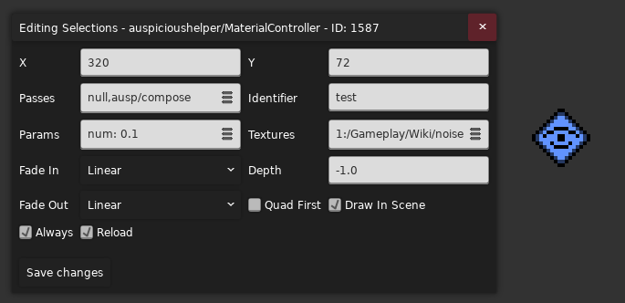

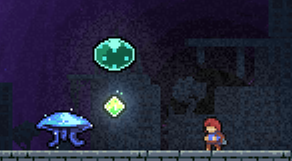

---

### `ausp/flip`

根据玩家位置翻转图像

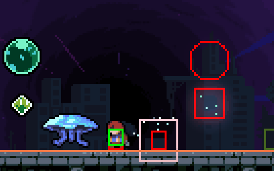

---

### `ausp/rainbowify`

为对象施加彩虹效果 (类似彩虹刺)

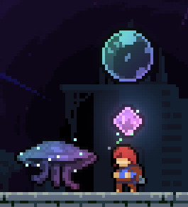

---

### `ausp/selectColor`

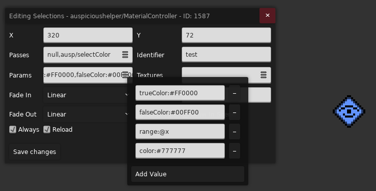

离 `color` 越近/越像 (距离小于 `range`) 的颜色会被设置为 `trueColor`, 反之则为 `falseColor`

> `range` 可用 [Channel](#params) 控制

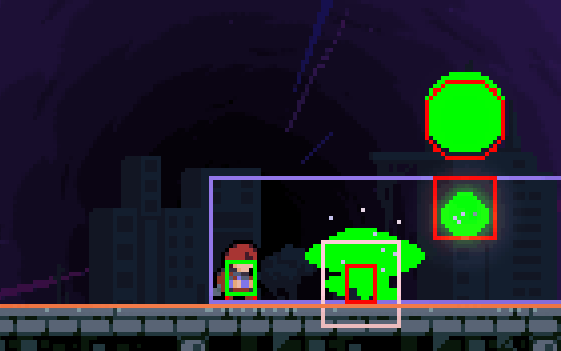

<a id="params"></a>

## [参数控制](https://github.com/cloudsbelow/auspicioushelper/wiki/Materials-(shaders)#specifying-parameters)

前面我们或多或少提到了 `Params` 参数属性的设置, 这里做个正经介绍

### Numbers

对于数值类型的参数, 你可以

* 直接设置对应参数的数值: 比如 `opacity:1`
* 也可以用 [Channel](./channel.md) 控制:, 比如 `opacity:@alpha_channel` (需要在 Channel 名前加 `@`)
* 也可以写表达式, 比如 `opacity:@(alpha * 2)`

> 对于一些 Bool 类型比如[描边效果](#border)中的 `corners` 参数, 虽然我们也可以用 `true` 或是 `false`,
> 但实际上只要是个非零数字都能表示 `true`, 反之 `false` 也对应于 `0`

### Colors

对于颜色类型的参数, 你可以

* 直接设置对应参数的数值: 比如 `color:#FFFFFF` (颜色的十六进制表示法)
* 或者用一个长度为四的数组表示颜色的 RGBA, 可用 [Channel](./channel.md) 控制: 例如 `color:[1, @yellow, 0, 1]` 表示 `#FFXX00FF`,
  `XX` 对应名为 `yellow` 的 Channel 对应的数值 (`@yellow` 越小颜色越偏红, 反之偏黄)

### Other numerical lists

数组类型, 如果你的 Shader 需要 `8` 个 `float2` 又或是一个 `4 x 4` matrix, 你可以传入一个长为 `16` 的数组 (像颜色那样设置)

<a id="texture"></a>

## [贴图设置](https://github.com/cloudsbelow/auspicioushelper/wiki/Materials-(shaders)#specifying-textures)

每个效果可以最多使用 16 张贴图, 这些贴图会被分别放在 `槽位 0 ~ 槽位 15`, `槽位 0` 是特殊的, 它往往引用着当前的像素输入, 不同的 Pass 会使用不同的贴图槽位, 所以请注意自己的贴图具体分配到了哪个槽位
(但往往是 `槽位 1`)

> 你可以把 `槽位 0` 理解为源图, 比如对于初始 null `Pass` 来说, 上方的泡泡, 水晶和水母他们作为输入就是源图, 如果后续紧跟着另一个 `Pass`,
> 那么 null 的输出就成为了那个 `Pass` 的源图, 如果那个 `Pass` 后面还有 Pass, 那么老的 `Pass` 输出就会成为新的 `Pass` 的输入, 这在新 `Pass` 眼里仍是源图,
> 可以简单理解为不断使用 `槽位 1 ~ 槽位 15` 的贴图处理 `槽位 0` 处的贴图

* [`Images`](#maskBy): 我们可以直接引用现有的贴图并将其分配到对应槽位上如 `1:/Atlases/Gameplay/Wiki/noise` 从 `Graphics` 文件夹开始填
* [`Stylegrounds`](#maskedFrom): 我们可以在背景的 `Rooms` / `Only` 属性处填上 `%{texture_name}`, 比如 `%mask_bg` 这样这个背景就会被 ausp 当作是一张贴图且可以在后续被对应贴图槽位引用,
  比如 `1:%mask_bg`
* [`Other materials`](https://www.bilibili.com/video/BV1tiHm6zEYm): 我们可以使用其他效果的输出作为输入, 用 `$` 引用对应效果层, 比如上方我们一直在对 `test` 层做效果,
  如果想把这个效果当作贴图传给别的效果用, 可以写 `1:$test`

> 所以此时你就知道 null `Pass` 的作用了, 在这种情况下我们可以用 `Material Controller` 将对象打包到某一个图层里而不添加任何效果, 以供其他 `Material Controller` 使用,
> `Material Template` 的作用是标记对象, 所以如果你只使用了它, 这并不会将标记后的实体加入到某层中

ausp 还提供了一些预设名方便你访问一些特定的贴图

* [`last`](https://www.bilibili.com/video/BV1GGHD6XEnW/): 访问上一帧贴图, 搭配 `ausp/compose` 可以做简单的运动模糊效果, 贴图设置 `1:last`
* [`gp`](https://www.bilibili.com/video/BV1BcHD6cEaS/): 访问其他更早绘制的 gp 层实体贴图 (晚绘制的拿不到), 用来做 mask 还挺方便的
* `bg`: 访问所有现有背景 (不过似乎背景空洞的部分颜色是 `(0, 0, 0, 1)`, 所以可能适用范围也不是很广, 可能还是用 `%` 访问单个背景比较好)
* `lv`: 只能用在背景效果上, 能访问更早绘制的 gp 层和 stylegrounds 层

## 效果链

如果一些 `Pass` 用到了同名参数或是同槽位贴图, 但他们需要的又完全不一样, 这个时候就只能像[`这个例子`](https://www.bilibili.com/video/BV1tiHm6zEYm)一样一个 `Pass` 对应一个
`Controller`, 使用别人的输出作为贴图, 然后不断传递下去

## 背景

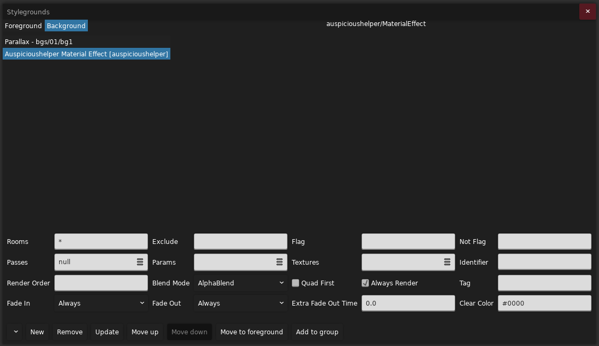

添加一个 `Auspicioushelper Material Effect [auspicioushelper]` 背景, 之后 `Pass` 的设置就与实体大差不差了, 这里就放个[视频例子](https://www.bilibili.com/video/BV1SRHU6LEfM)让大家感受一下吧

> 这里顺便用到了 `0:%mask_bg` 替换源贴图的技巧, 因为有的时候一个背景对应的层里可能本身没有任何东西,
> 这个时候输入也是空的, 所以我们可以用别人的贴图当输入

## [自定义 Shader](https://github.com/cloudsbelow/auspicioushelper/wiki/Materials-(shaders)#brief-note-for-shader-writers)

### 编写 Shader

我们可以仿照[源码](https://github.com/cloudsbelow/auspicioushelper/tree/main/Effects/ausp/src)编写我们自己的 Fragment Shader, 比如这里我们编写了一个纯色 Shader, 会将源像素直接修改为固定颜色

```hlsl hl_lines="7"
sampler2D TextureSampler : register(s0);
uniform float4 pureColor = float4(1, 1, 1, 1);  // 表示你想要设置什么样的纯色, 可在 Params 属性里配置

float4 main(float4 inColor : COLOR0, float2 pos : TEXCOORD0) : COLOR0{
    float4 orig = tex2D(TextureSampler, pos);
    // 注意蔚蓝用的是预乘所以要将纯色结果再乘以原像素透明度
    return float4(pureColor.r, pureColor.g, pureColor.b, 1) * orig.a;  
}


technique BasicTech {
    pass Pass0 {
        PixelShader = compile ps_3_0 main();
    }
}
```

### 编译 Shader

使用 Windows 自带的 fxc 工具编译, `fxc.exe /T fx_2_0 /E main /Fo {output}.cso {input}.fx`, 例如 `fxc.exe /T fx_2_0 /E main /Fo pureColor.cso pureColor.fx`

随后将 `.cso` 文件放在 `你的 Mod/Effects/` 下, 例如 `/Effects/Wiki/pureColor.cso`

之后你就可以在 `Passes` 里使用了!

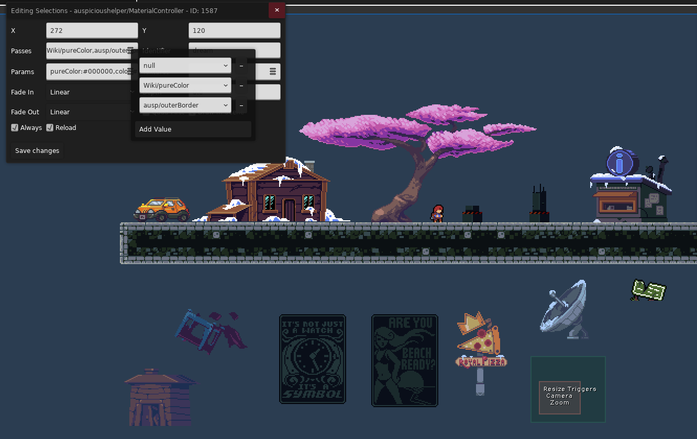

我们用 `Wiki/pureColor` 将对象染黑, 加上一个简单的外描边, 并简单加点 `Bloom` 相关的视觉效果就已经能做到比较有意思的风格化了

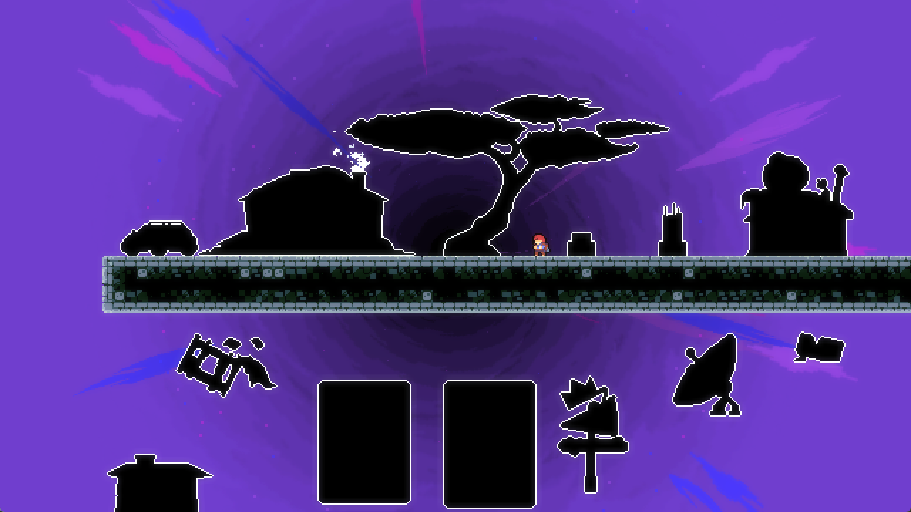

<figure>
  <a href="https://www.bilibili.com/video/BV1AMHi6FE1b/">
    
  </a>
  <figcaption>我的天哪这简直太美了</figcaption>
</figure>

### [其他参数](https://github.com/cloudsbelow/auspicioushelper/wiki/Materials-(shaders)#brief-note-for-shader-writers)

ausp 为我们定义了一些参数方便我们访问一些游戏里的数据
