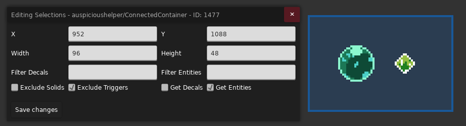
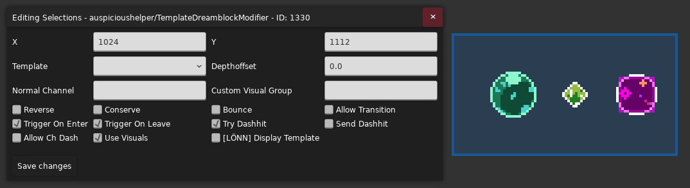
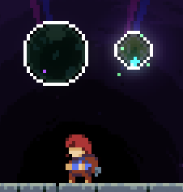
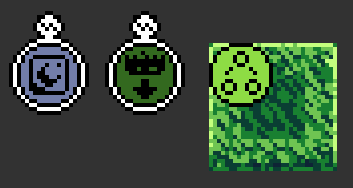
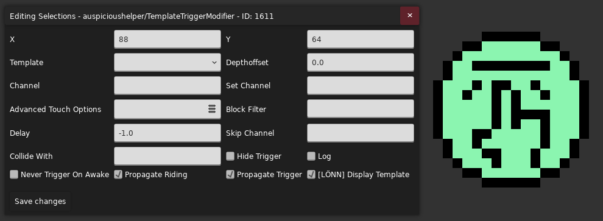
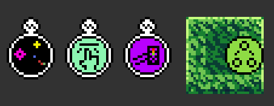
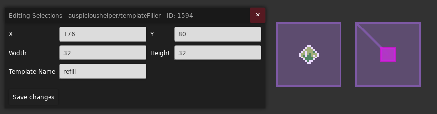
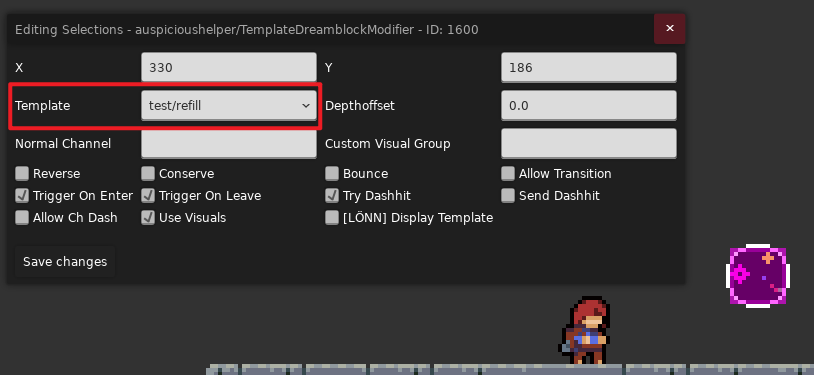
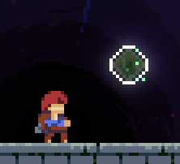

# [Template](https://github.com/cloudsbelow/auspicioushelper/wiki/Templates)

ausp 提供了一系列模板让你非常方便的把一些对象变成另一个东西

比如我们要把 `Booster` 和 `Refill` 变成果冻, 只需要用 `Connected Container` 将需要影响的对象框住

然后在框内放一个果冻模板

然后就完事了!

> 当然你也可以顺带框住 Decal, 需要 `Connected Container` 勾选 `Get Decals`
>
> 不过需要注意的是并不是所有的特性都能加在某些对象上

## 其它 Template 模板

在了解其他模板前我们先讲讲最重要的组装模板 [`Behavior Chain`](https://www.bilibili.com/video/BV1ZVHp6EEcd/?t=418), 
因为默认情况下一个框内只能放一个模板, 所以如果你要同时将多个模板特性添加给对应实体, 则需要将 `Behavior Chain` 放置在框内并把其他模板按顺序放置在它的子节点中 (别把子节点放在框内了)

> ausp 自己的模板砖不需要用 `Connected Container` 框起来

模板放置的顺序也非常重要, 作者表示

> [cloudsbelow](https://github.com/cloudsbelow/auspicioushelper/issues/27#issuecomment-6075250110): 在行为链中, 
> 后续的节点最终会“位于”前面的节点的内部. 因此对于 `chain > fall > moon` 与 `chain > moon > fall` 这两种不同的连接顺序, 它们的表现也是不同的. 
> 后者会在落地后停止摆动, 因为掉落模板会从其父模板中脱离, 而前者则不会停止, 因为月亮模板仍然是掉落模板中的一个内部成员

### 状态

* [`Dream Block Modifier`](https://www.bilibili.com/video/BV1ZVHp6EEcd/?t=10): 果冻模板
* [`Belt`](https://www.bilibili.com/video/BV1jVHp6EE17/?t=108): `FireBall` 循环火球模板
* [`Cloud`](https://www.bilibili.com/video/BV1ZVHp6EEcd/?t=92): 云朵模板
* [`Kevin`](https://www.bilibili.com/video/BV1ZVHp6EEcd/?t=117): Kevin 模板
* [`Rotator`](https://www.bilibili.com/video/BV1ZVHp6EEcd/?t=139): 旋转模板, 将内容复制并均匀放在圆周上[缓动](https://easings.net/zh-cn)旋转 (喜欢煤球的有福了)
* [`Holdable`](https://www.bilibili.com/video/BV1ZVHp6EEcd/?t=171): 可抓取物模板
* [`Ice Block`](https://www.bilibili.com/video/BV1ZVHp6EEcd/?t=200): 冰块模板
* [`Zip Mover`](https://www.bilibili.com/video/BV1ZVHp6EEcd/?t=217): 红绿灯模板
* [`Block`](https://www.bilibili.com/video/BV1ZVHp6EEcd/?t=238): 易碎块模板
* [`Fake Wall`](https://www.bilibili.com/video/BV1ZVHp6EEcd/?t=254): 假墙模板
* [`Moon Block`](https://www.bilibili.com/video/BV1ZVHp6EEcd/?t=280): 月亮块模板
* [`Move Block`](https://www.bilibili.com/video/BV1ZVHp6EEcd/?t=302): 移动块模板
* [`Swap Block`](https://www.bilibili.com/video/BV1ZVHp6EEcd/?t=320): `Swap Block` 模板
* [`Push Block`](https://www.bilibili.com/video/BV1ZVHp6EEcd/?t=345): `Push Block` 模板 (类似草莓酱里的[霜冻碎片里的实体](https://www.bilibili.com/video/BV1sL411y7gY/?p=2&t=5))
* [`Falling Block`](https://www.bilibili.com/video/BV1ZVHp6EEcd/?t=396): 掉落块模板
* [`Entity Modifier`](https://www.bilibili.com/video/BV1twpc6gE3v/?t=128): 实体状态修改模板, 修改可见性/激活性/碰撞/抖动
  类似 [Eevee Helper 的 Flag Toggle Modifier](../eevee.md#flag-toggle-modifier)
* [`Collision Modifier`](https://www.bilibili.com/video/BV1twpc6gE3v/?t=1204): 精细调整实体和模板是否可碰撞, 比如水母可以穿过但是玩家不行
* [`Cassette Block`](https://www.bilibili.com/video/BV1twpc6gE3v/?t=1267): 节奏块模板, 相关的有节奏块改色 `Cassette Color` 模板, 和 `Cassette Manager Simple` 节奏模板管理器

### 运动

* [`Static Mover`](https://www.bilibili.com/video/BV1ZVHp6EEcd/?t=494): 附着模板, 类似 [Eevee Helper 的 Attached Container](../eevee.md#attached-container)
* [`Gluable`](https://www.bilibili.com/video/BV1twpc6gE3v/?t=1016): 附着/跟随模板, 类似 [Eevee Helper 的 Attached Container](../eevee.md#attached-container),
  在默认配置下该模板会以主节点为锚点粘在玩家身上, 适合做一些需要把某些特定东西以相对距离粘在玩家身上的场景 (当然粘别的东西上也行)
  可以做[接触单向板后触发机关](https://www.bilibili.com/video/BV1YNpu6gEmj/)的效果
* [`Gate Mover`](https://www.bilibili.com/video/BV1twpc6gE3v/?t=4): 步进模板, 主节点和子节点定义了移动的方向和距离, 每次对应 Channel 不为 0 时, 使房间内最近的 Template 向前面定义的方向移动一次
* [`Displacer`](https://www.bilibili.com/video/BV1twpc6gE3v/?t=95): 置换模板, 将模板整体移动到对应节点位置
* [`Channel Mover`](https://www.bilibili.com/video/BV1twpc6gE3v/?t=865): 移动模板, 根据 Channel 的数值在节点之间移动

### 交互

* [`Dashhit`](https://www.bilibili.com/video/BV1twpc6gE3v/?t=270): 冲刺碰撞交互模板
* [`Resetter`](https://www.bilibili.com/video/BV1twpc6gE3v/?t=921): 重置模板, 可以销毁和生成 Template

#### [`Trigger Modifier`](https://www.bilibili.com/video/BV1twpc6gE3v/?t=972)

触发模板, 可以触发其他可触发的模板, 或是调整它们的触发设置 

> 可触发模板一般就是你想的那样, 比如掉落块模板, 易碎块模板之类的 (有的模板需要勾选 `Triggerable`)

**触发相关**

* `Channel`: 接收到非零 `Channel` 后会触发可触发的模板, 一般跟其它模板搭配使用, 而且注意该模板一般顺序放更后面, 这样它才能将触发事件信息传递到父级 (因为事件的触发往往是自下而上的)
* `Delay`: 表示延迟多少秒后触发事件
* `Never Trigger On Awake`: 如果开启此项, 那么如果在房间刚加载的时候 Channel 条件已经满足, 也不会触发事件, 等到 Channel 数值改变之后再触发 
* `Set Channel`: 该 Trigger 触发后会额外设置一些 Channel 的数值, 语法请参考[高级表达式](./channel.md#advanced-expression)
* `Log`: 开启此选项后, ausp 会在你做出触发事件的时候输出对应的事件名 (需要在 Mod 设置中开启 `Debug Console Mode: LogTxtPollute`)

<pre class="celeste-log"><code>(10/09/2026 21:33:40) [Everest] [Info] [AuspiciousDebug] From trigger modifier: touch/HoldableHit
(10/09/2026 21:33:43) [Everest] [Info] [AuspiciousDebug] From trigger modifier: touch/dashV/Dash
(10/09/2026 21:33:43) [Everest] [Info] [AuspiciousDebug] From trigger modifier: touch/collideV/Dash
(10/09/2026 21:33:43) [Everest] [Info] [AuspiciousDebug] From trigger modifier: touch/collideV/Normal
(10/09/2026 21:33:45) [Everest] [Info] [AuspiciousDebug] From trigger modifier: touch/dashH/Dash
(10/09/2026 21:33:45) [Everest] [Info] [AuspiciousDebug] From trigger modifier: touch/collideH/Dash
(10/09/2026 21:33:45) [Everest] [Info] [AuspiciousDebug] From trigger modifier: touch/collideH/Normal</code></pre>

* `Propagate Trigger`: 表示是否将事件继续向上传递, 如下图结构, 如果取消勾选, 那么进入果冻时就不会触发红绿灯模板, 因为事件被**挡住了** (需要禁用 `Propagate Riding`) 
* `Block Filter`: 是否阻塞对应的触发事件, 用逗号分隔 (名字从 `Log` 输出里参考, 可以加 `*` 通配, 比如 `touch/*`), 适合在勾选 `Propagate Trigger` 后传递事件, 但是不想要传递**某些**事件的场景, 比如只填 `*` 就是全阻塞, 跟禁用 `Propagate Trigger` 同等效果
* `Hide Trigger`: 与 `Propagate Trigger` 类似, 但是你的 hide 只会持续到下一个 `Trigger Modifier`, 然后就会继续传递触发事件了, `Propagate Trigger` 则是直接截断
* `Skip Channel`: 当此 Channel 不为 `0`, 则事件会直接向上传递而不做其他任何操作, 相当于当前 `Trigger Modifier` 直接不存在

**触发设置相关**

* `Propagate Riding`: 玩家的攀爬和站立是否会触发模板
* `Advanced Touch Options`: 你可以添加一些玩家状态限制, 表示只有当玩家在对应状态时才能触发对应可触发模板 (你可以在下拉列表里选择对应的玩家状态, 比如只有当玩家在攀爬状态时才能触发掉落块模板)
* `Collide With`: 填入[对象 ID](../../loenn/faq.md#entity-id), 用逗号分隔, 表示当对应对象和模板内的砖有交集时, 发送触发事件 (比如玩家抓着水母贴砖而过)

### 复制

> 说到模板怎么能少得了复制模板呢

创建名为 `zztemplates-{roomName}` 格式的房间后, 该房间会被作为一个模板房间被 ausp 使用, 比如 `zztemplates-test`, 在该房间内放置一个 `Template Filler` 实体, 被框住的所有东西都会成为这个复制模板的一部分,
你需要给这个复制模板起一个名字, 比如 `refill`

> 你可以为 `Template Filler` 添加节点, 表示该复制模版的中心位置在哪

之后你就可以在任意模板中的 `Template` 属性里填入 `{roomName}/{templateName}`, 比如用 `test/refill` 来引用复制模板的同时为其添加对应的模板特性了

* [`Template`](https://www.bilibili.com/video/BV1XnpK6aEsu/?t=1): 无额外特性的模板, 所以它的主要作用就是引用一个复制模板, 但它可以接着被 `Template Filler` 框起来成为新复制模板的一部分,
  所以可以不断套娃
* [`Template Filler Switcher`](https://www.bilibili.com/video/BV1XnpK6aEsu/?t=225): 与 `Template Filler` 类似, 但是可以随机使用一个复制模板
* [`Evil Packed Template Room`](https://www.bilibili.com/video/BV1XnpK6aEsu/?t=308): 可以把模板数据打包到一串 Base64 编码的字符串里, 后续使用该实体就可以不需要创建模板房间了,
  又由于本质上是数据, 所以你也可以粘给别的图用 (你可能需要知道怎么打开[控制台](../../cmd.md)或是找到 [`Log.txt`](../../../mods/game_crashes.md))
