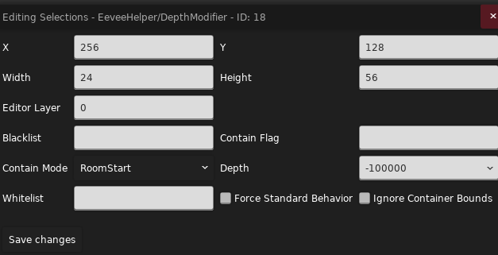

> Myn:
>
> 宇宙是如何诞生的？是 tt 触发了那个奇点。
>
> 万物是如何运动的？是 eevee 框动着世界变化。

## 参考

* <a href="https://gamebanana.com/mods/53765" target="_blank">Eevee Helper 文档</a>
* <a href="https://github.com/CommunalHelper/EeveeHelper" target="_blank">Eevee Helper Github</a>
* [AfterDawn 的 eevee 教程](../../assets/mappings/useful_helpers/eevee/AfterDawn的eevee教程.docx)(群文件里有更新版本)
* <a href="https://uddrg.notion.site/UnderDragon-s-Partial-Wiki-2737f4f27e63808582b3f0689163d8f9?p=2737f4f27e6380f4bcd1c7002f2e692e&pm=s" target="_blank">底龙 的 eevee 教程</a>

> 感谢 AD 的大力支持😘

## 介绍

MC 之于红石, 正如蔚蓝之于 Eevee

Eevee Helper 为我们提供了一系列实体, 我们可以用它们方便地修改实体的基础属性, 如位置, 深度大小, 是否可抛接, 是否可见, 是否激活等, 哪怕玩家不会写代码, 使用 Eevee Helper 搭配 flag 就能对一些实体做到简单的功能拓展, 正是因为它简单实用, 但又需要点代码思维, 有的人为之着迷，有的人谈之色变, 所以我将在这里跟大家共同面对这个久仰大名的 Helper -- EEVEE

## 基本概念

首先要提出**容器**的概念: Eevee 实体会框选一部分区域(像 Trigger 一样), 这被称为容器, Eevee 实体会对容器内的对象进行操作, 知道了容器是如何挑选对象, 装载/卸载对象的, 我们就能举一反三, 快速上手各种不同实体(你可以把容器想象成一张清单, Eevee 把要处理的对象记在这张清单上, 不处理了就把名字划掉)

而接下来要讲的则是 Eevee 实体都有的, 容器的属性, 这是 Eevee 实体的**底**~层逻辑(大声

{style="width: 800px; title="123"}

这里以 Depth Modifier 实体为例(除了 Depth 其他全是容器属性), 简单来说, Eevee 实体会在 Contain Mode 条件成立的时候, 将自己框选区域内的, 且在白名单不在黑名单中的实体加入到容器里

接下来讲具体细节

### 容器选择对象的条件

* Blacklist: 黑名单(由一系列以逗号分隔的[实体 Type](../loenn/faq.md#type) 组成, 逗号后面不能有空格), 在黑名单中的实体不允许被添加到容器中, 如果留空则会拉黑一些默认实体, 比如前景砖和玩家(我强烈建议不要理会这些默认值, 老老实实手动填 type 就好了, 不仅清晰, 而且不用特意去记默认值都是什么)
* Whitelist: 白名单(由一系列以逗号分隔的[实体 Type](../loenn/faq.md#type) 组成), 在白名单中的实体允许被添加到容器中, 如果留空则会在白名单中加入一些默认实体, 比如和绿泡泡和圆刺(当然你可以粗暴的填入 all 来将所有实体添加到白名单中)

#### <a href="https://www.bilibili.com/video/BV1bw8EzfErU/" target="_blank">筛选同类实体中的特定对象</a>

如果你在实体 Type 后加上冒号和数字形如 `Strawberry:1`, 那么在这里白名单将作用于 Eevee 遍历到的第一个草莓, 其他数字同理

### 容器选择对象的范围

* Ignore Container Bounds: 你可以简单理解为容器范围变成了房间大小/撑满了房间(只有在容器范围内且在白名单中的实体才会被加入容器)

### 容器选择对象的时机

* Contain Mode(<a href="https://www.bilibili.com/video/BV1kR8jzyExm" target="_blank">可以搭配视频感受下</a>): 
    * 一次更新:
        * RoomStart: 在你进房间(切板瞬间)的时候将容器范围内的实体添加到容器中 
        * DelayedRoomStart: 在你进房间晚一点(切板结束瞬间)的时候将容器范围内的实体添加到容器中(因为哪怕 Eevee 已经尽量让自己的实体在最后更新了, 依然会有更晚更新的实体, 所以 delay 就是用来预防这种情况的)
    * 多次更新:
        * FlagChanged: 在 ContainFlag 从无到有的时候将容器范围内的实体添加到容器中, 反之在 ContainFlag 从有到无的时候会清空容器
        * Always: 只记录容器范围内的实体(RoomStart 是一开始加到容器里就没然后了, 哪怕实体离开了容器范围也依然被容器记录着, 而 Always 是每帧都不断判断更新的, 离开了容器范围就会被剔除)

* ContainFlag: 不管是一次更新还是多次更新, ContainFlag 永远都是添加实体/更新的必要条件, 也就是这个 Flag 必须存在才会更新(除非你这一栏留空, 此时容器不受 Flag 影响)
    * 当 ContainFlag 不为空, 且 Contain Mode 为一次更新类型时, ContainFlag 将表示为一个`使用开关`, 也就是表示容器是否生效, 但它仍然会影响容器添加实体的操作, 也就是上述的更新操作(你可以观看<a href="https://www.bilibili.com/video/BV1kR8jzyEhv" target="_blank">视频</a>来理解这个过程)
    * 当 ContainFlag 不为空, 且 Contain Mode 为多次更新类型时, ContainFlag 将表示为一个`更新开关`, 也就是表示容器是否会保持更新, 比如 FlagChanged 在有 flag 的时候会更新一次容器, Always 则是在有 flag 时一直更新容器

### 容器的兼容性

* Force Standard Behavior: 是否适配容器内的一些特殊实体, 如果勾选则会在某些操作时统一使用一个行为, 即不适配, 如果不勾选则会适配, 比如在<a href="https://www.bilibili.com/video/BV1kR8jzyEwV" target="_blank">视频</a>中我们把水搬走的时候如果不做适配就会出问题, 但有时候不做适配产生的奇异搞笑的效果也可能是我们想要的(

讲完了容器, 我们就可以讲讲具体的 Eevee 实体了, Eevee 实体主要分成两个大派, Modifier 和 Container, Modifier 主要是用来更改容器内实体的属性, 比如深度, 可见性, 可更新性, 全局性之类的, 
而 Container 主要是用来带着容器内的实体做各种不同的运动, 比如一起被抛接, 一起浮动, 一起粘在某个实体上之类的

如果你已经对容器的操作明白个八九十了, 那么相信对于 Modifier 和 Container 的学习你几乎是看到实体名字就知道怎么用了!

## Modifier

### Depth Modifier

{style="width: 800px; title="123"}

改实体深度的, 这会更改实体间的更新顺序和渲染顺序, 更新顺序的变化一般来说不会出现肉眼可见的 bug,
但渲染顺序决定了谁在上谁在下, 谁会被挡住, 如果遇到不能改深度的实体而你又想改, 那用这个实体就再好不过了

你还可以用这个实体做出

* <a href="https://www.bilibili.com/video/BV1rR8jzyEQa" target="_blank">尘埃绕着行星转的效果</a>: 搭配后续提到的 `Attached Container` 食用

(你会发现 Eevee 实体除去实体最基本的属性和容器的属性后, 几乎就没剩多少属性了, ~~所以后续使用其他实体时请不要害怕~~)

### Flag Toggle Modifier

{style="width: 800px; title="123"}

基本上就是根据 Flag 改

* 实体是否更新逻辑
* 实体是否可碰撞
* 实体是否可见

### Global Modifier

{style="width: 800px; title="123"}

全局化对应实体, 使其能在各个房间内被加载而不被销毁

你可以观看<a href="https://www.bilibili.com/video/BV1Jk8Qz6EWC/" target="_blank">视频</a>来感受该实体和各选项的作用

* Whitelist: 与前面的白名单不同, 这里填的是对象的 ID, 也就是属性栏上面那串数字(因为 Global Modifier 是作用于对特定实体的, 所以填 Entity Type 没用)
* Frozen Update: 全局化实体是否能在 Frozen 状态下更新, 这个 Frozen 指的并不是冻结帧, 而是游戏定义的 Frozen 场景, 比如吃心的时候
* Pause Update: 全局化实体是否能在 Pause 状态下更新, 一般指暂停界面
* Transition Update: 全局化实体是否能在切板状态下更新

## Container

### Attached Container

{style="width: 800px; title="123"}

让容器内实体依附/绑定于某一个实体, 随其移动, 仿佛粘在它身上一样(可以不贴着), 这个实体后续我将称其为父节点

* Attached To: 填 Entity Type, 表示可以作为父节点的实体
* Reletive Attach X/Y: 子节点离父节点的相对位置, 如果留空则使用一开始加入容器时的相对位置
* <a href="https://www.bilibili.com/video/BV11U8jzUEAZ/" target="_blank">Destroyable</a>: 如果父节点被销毁, 那么容器内对象是否跟着被销毁
* Fit Contained: 当容器内对象主动移动时, 容器是否要自动调整大小
* Ignore Anchors: 是否忽略锚点, 有的实体的运动会基于空间中的一个锚点, 比如弹球, 所以容器会在移动对象的同时移动锚点, 如果你不想对锚点进行操作可开启此项, 虽然也能用来做些<a href="https://www.bilibili.com/video/BV1XJ8JzKEsk/" target="_blank">有趣的效果</a>
* Restrict To Node: 在你添加节点时生效, 勾选时你必须将节点放在你要依附的实体上才能生效, 反之它会在房间内找个离节点(没有节点就是离容器中心)最近的符合 Attach To 白名单条件的实体当父节点
* Match Collidable/Visible: 容器内的对象的可碰撞性和可见性是否随着父节点变化而变化
* Only X/Y: 如果父节点是斜着动的, 那么此选项会限制容器在某个方向上的运动

### Flag Gate Container(Flag Mover)

{style="width: 800px; title="123"}

你可以简单把它理解成 Attached Container 和 Flag Switch Gate 的组合, ~~那好像没什么好介绍的欸~~

* Static Fit: 简单来说如果你开起了 Fit Contained, 那么如果容器内的实体位置发生变化, 硬币门在移动时会补偿这些变化, 所以你会看到容器歪歪扭扭的过去了, 此时如果开启 Static Fit, 则容器会强制沿着路线移动, 你可以观看<a href="https://www.bilibili.com/video/BV1wj8DzzE5k/" target="_blank">视频</a>来感受区别
* <a href="https://easings.net/" target="_blank">Easing</a>: 将均匀变化的时间映射到不均匀变化的运动上, 以实现各种先快后慢, 先慢后快的运动 
* 其他基本上都是讲过的或者看名字就知道功能的这里就不讲了(

这个实体可以用来做(看你想象力)

* <a href="https://www.bilibili.com/video/BV1YB8XzAEbn/" target="_blank">压扁机关</a>
* 实体突然出现, 改变位置之类的

### Floaty Container

{style="width: 800px; title="123"}

~~蔚蓝, 但是所有实体都替换成月亮块~~

为容器内实体添加月亮块的特性

### Holdable Container

{style="width: 800px; title="123"}

~~蔚蓝, 但是所有实体都可以抛接~~

为容器内实体添加抛接物的特性, 先来看看<a href="https://www.bilibili.com/video/BV13iLGz3ELu" target="_blank">西西弗斯</a>(

* Gravity: 容器是否有重力且容器是否能被推动
* Holdable: 容器是否能被抓取
* No Duplicated: 当你搬着容器切板两次回来的时候是否允许重新生成一个容器对象
* Respawn: 当容器掉到房间下面或者碰到 Seeker Barrier 被销毁时是否可以重生
* Slow Fall: 你是想要水母的质感还是 Theo 水晶的质感
* Slow Run: 当玩家搬着容器时移动速度是否会变慢
* Tutorial: 是否显示如何搬运的按键教程
* Wait For Grab: 是否在抓取后才产生重力(类似原版带环水母)

### SMW Track Container(Super Mario World) 和 SMW Track

{style="width: 800px; title="123"}

简单来说, SMW Track 就是图中的一条条轨道, SMW Track Container 是一个可以吸附在轨道上运动的实体, 并且该容器也可以像 Holdable Container 那样包含实体, 所以你可以简单把它视作可以在轨道上运动的不能抓的 Holdable Container

你可以观看<a href="https://www.bilibili.com/video/BV1SchwzEEYJ/" target="_blank">视频</a>来简单感受下他们是如何运作的

那么现在来简单介绍一下这俩的属性, ~~但是好像也没什么好介绍的?~~, 因为对于轨道 Track 来说, 无非就是哪端开哪端关, 能否被 flag 控制之类的(当然还可以按 `n` 加节点), 对于轨道 Container 来说, 无非就是在轨道上移速多少, 初始运动方向向哪儿, 是否在特定时机停止之类的, 
所以如果你感兴趣的话可以自己研究下, 都挺符合直觉的(~~绝对不是因为我懒~~

