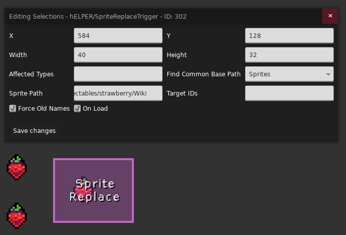
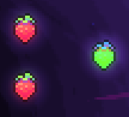

# [Long Name Helper by Helen, Helen's Helper, hELPER](https://gamebanana.com/mods/314246)

## Sprite Replace Trigger

### Find Common Base Path

如果你要换普通图片, 那就选 `Images`, 如果你要换动画图片, 那就选 `Sprites`(搞不明白的话都选选试试)

### Sprite Path

填入你新皮肤素材放的位置(从 `Gameplay/` 文件夹开始算起), 例如 `collectables/strawberry/Wiki`

hELPER 会找到你要替换对象使用的所有图片的公共路径, 并把这个路径替换成你填入的, 比如你要替换草莓, 草莓对应的图片路径为

* collectables/strawberry/normal00.png
* collectables/strawberry/normal01.png`
* ...
* collectables/strawberry/wow/normal52.png`

他们的公共路径为 `collectables/strawberry/`, 替换后游戏就会读取你自定义路径下的贴图(虽然你自定义路径定到哪里都可以啦)

* collectables/strawberry/Wiki/normal00.png
* collectables/strawberry/Wiki/normal01.png`
* ...
* collectables/strawberry/Wiki/wow/normal52.png`

### Target IDs

事实上哪怕我们不填额外的东西, 把素材路径配置好, 把要改的实体用 Trigger 框上就已经可以改了

{style="width: 600px; title="123"}
{style="width: 300px; title="123"}

如果你想直接替换特定的的实体(而不是非得用 Trigger 覆盖), 你可以在**Target IDs** 里填入[实体 ID](../loenn/faq.md#id), 多个 ID 用逗号隔开即可

### Affected Types

* 如果要使你的设置只能作用于特定的实体, 可以在这里填入对应实体的[完全限定名](../loenn/faq.md#type)(这里不支持简写)来限制, 如果有多个名字则用逗号隔开
* 如果要使你的设置直接对某一类实体生效而无需 trigger 覆盖或者一个个填 ID, 可以在这里填入对应的[实体名字](../loenn/faq.md#enity-name), 如果有多个名字则用逗号隔开(后续搭配[全局房间](bits%20&%20bolts.md)可以比较方便的做到换肤效果)

### On Load

表示房间加载的时候就替换贴图, 还是 player 进入的时候才替换

### Force Old Names

表示是否用原来的路径找对应的贴图, 比如上方 **Sprite Path** 部分绿色右边部分的路径

取消勾选则是会使用动画 id 还是什么的(有点没研究明白, 但是我感觉勾上会好一点, 这样就跟平常换贴图的逻辑一样了)