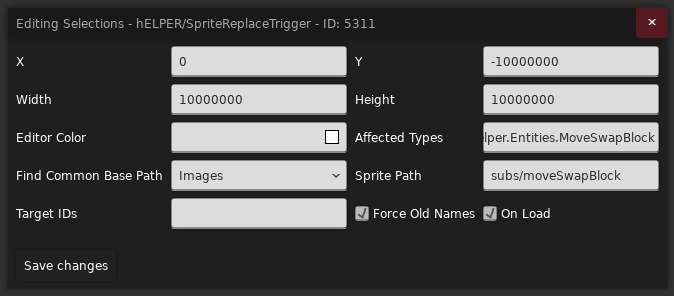
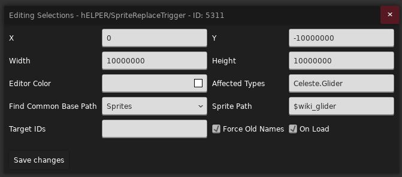

# [Long Name Helper by Helen, Helen's Helper, hELPER](https://gamebanana.com/mods/314246)

## Sprite Replace Trigger

> 由于这个 Trigger 的使用稍微有点混乱, 加上平时基本上都是针对某个特定实体换肤, 所以这里将极度简化这个 Trigger 的介绍

首先找到你想要换肤的实体, 比如 `CommunalHelper/MoveSwapBlock`,
在 `Affected Types` 中填入该对象的[完全限定名](../loenn/faq.md#type), 这里是 `Celeste.Mod.CommunalHelper.Entities.MoveSwapBlock`,
之后把这个 Trigger 框住你想要换肤的实体并配置好[新的素材路径](#sprite-path)即可

如果你觉得把整个房间框起来很碍眼, 或是每个房间都要放很麻烦, 可以使用[全局房间](../useful_helpers/bits%20&%20bolts.md), 并把 Trigger 宽高设置为 `10000000` 放在右上角即可



### Find Common Base Path

* `Images`: 替换贴图, 我们后续通过[`Sprite Path`](#sprite-path) 偷梁换柱将原来对象的贴图位置导向我们新的素材位置
* `Sprites`: 用 [`Sprite.xml`](../xml/sprites_xml.md) 中的动画对象配置来替换该对象的动画配置, 其实跟那种换肤实体让你填 `Sprites.xml` ID 一样, 只不过这个可以用在没有提供这个功能的对象上

### Sprite Path

填入你新皮肤素材放的位置(从 `Gameplay/` 文件夹开始算起), 例如 `collectables/strawberry/Wiki`

hELPER 会找到你要替换对象使用的所有图片的公共路径, 并把这个路径替换成你填入的, 比如你要替换草莓, 草莓对应的图片路径为

* <font color=#00dd00>collectables/strawberry/</font>normal00.png
* <font color==#00dd00>collectables/strawberry/</font>normal01.png
* ...
* <font color==#00dd00>collectables/strawberry/</font>wow/normal52.png

他们的公共路径为 `collectables/strawberry/`, 替换后游戏就会读取你自定义路径下的贴图(虽然你自定义路径定到哪里都可以啦)

* <font color==#00dd00>collectables/strawberry/Wiki/</font>normal00.png
* <font color==#00dd00>collectables/strawberry/Wiki/</font>normal01.png
* ...
* <font color==#00dd00>collectables/strawberry/Wiki/</font>wow/normal52.png

**注意**

如果路径前面加个 `$` 符号, 则表示这是个 `Sprites.xml` 里对应动画组的 ID, 
比如 `$wiki_glider` 表示用自定义的 ID `wiki_glider` 生成新的动画来替代原来的, 这样我们就只用专注于 XML 怎么写, 而不用特别捣鼓路径了, 像下面这样



```xml title="自定义的 Sprites.xml" hl_lines="2 11"

<Sprites>
    <glider path="objects/glider/" start="idle">
        <Justify x="0.5" y="0.58"/>
        <Loop id="idle" path="idle" delay="0.1"/>
        <Loop id="held" path="held" delay="0.1"/>
        <Anim id="fall" path="fall" delay="0.06" goto="fallLoop"/>
        <Loop id="fallLoop" path="fallLoop" delay="0.06"/>
        <Anim id="death" path="death" delay="0.06"/>
    </glider>
    
    <wiki_glider path="objects/Wiki/glider/" start="idle">
        <Justify x="0.5" y="0.58"/>
        <Loop id="idle" path="idle" delay="0.1"/>
        <Loop id="held" path="held" delay="0.1"/>
        <Anim id="fall" path="fall" delay="0.06" goto="fallLoop"/>
        <Loop id="fallLoop" path="fallLoop" delay="0.06"/>
        <Anim id="death" path="death" delay="0.06"/>
    </wiki_glider>
</Sprites>
```

### Target IDs

> 虽然我很想把这些 bug 讲清楚, 但似乎这只会增加混乱, 我说框选模式是对的, 慢就是快

有 bug

### Affected Types

有部分 bug

### On Load

表示房间加载的时候就替换贴图, 还是 player 进入的时候才替换

### Force Old Names

表示是否用原来的路径找对应的贴图, 比如上方 **Sprite Path** 部分绿色右边部分的路径

取消勾选则是会使用动画 id 还是什么的(有点没研究明白, 但是我感觉勾上会好一点, 这样就跟平常换贴图的逻辑一样了)