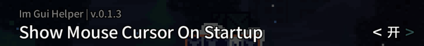
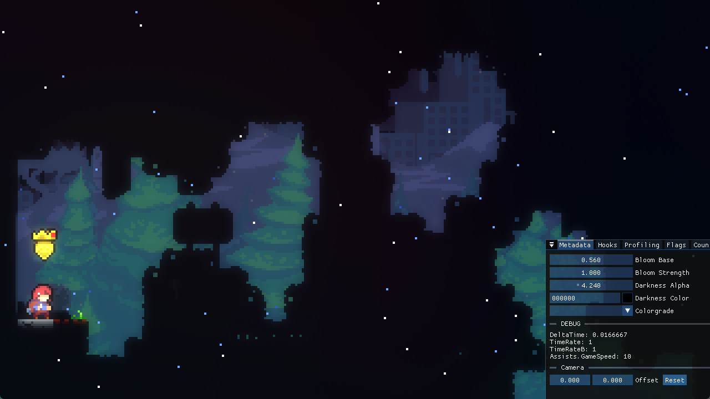
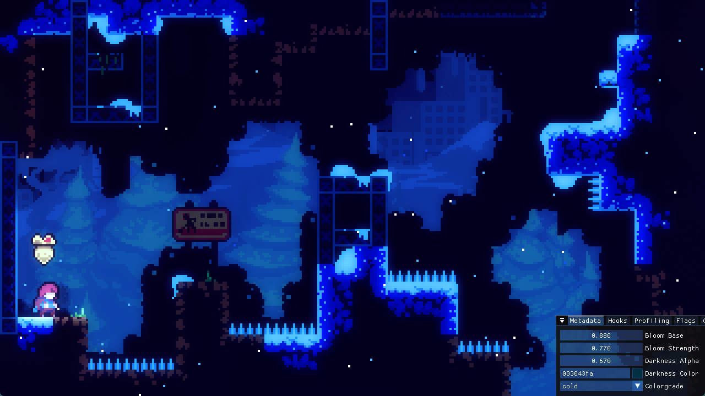
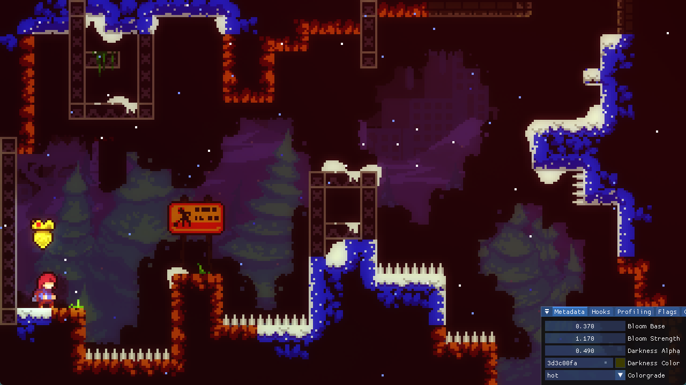
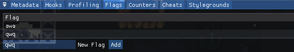
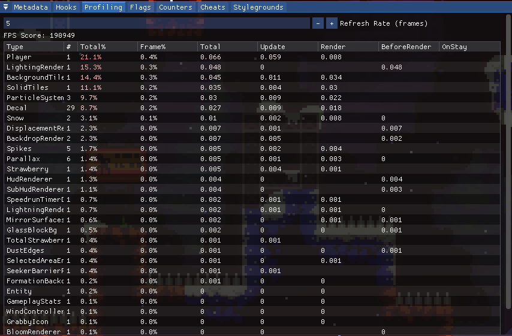

> 调试神器

开启 Mod 后在游戏内按 `小键盘数字 3`(可在设置内更改) 打开面板, 点击/左右拖动可修改数值, 按 `TAB 键` 可以修改具体数值

同时记得打开显示光标的设置, 按住左上角小箭头可拖动面板 

{style="width: 800px; title="123"}

## 主要功能

### Metadata

在游戏内调整元数据

* Bloom Base: 你可以理解为泛光的模糊范围/强度, 范围 `[0, 1]`
* Bloom Strength: 你可以理解为泛光的亮度, 范围 `[0, +∞)`
* Darkness Alpha: 你可以理解为暗的地方有多暗, 范围 `[0, 1]`
* Darkness Color: 你可以理解为暗的地方偏什么颜色
* ColorGrade: [滤镜](../graphics/color_grading.md)
* Camera Offset: [镜头偏移](../camera.md)

然后你就可以做各种黑黑的, 蓝蓝的, 红红的, 绿绿的效果了😋

{style="width: 1000px; title="123"}
{style="width: 1000px; title="123"}
{style="width: 1000px; title="123"}

### [Stylegrounds](../loenn/stylegrounds.md)

实时调整背景参数, 与 Metadata 操作类似

### Flags

{style="width: 800px; title="123"}

可以实时监控游戏内的 flag, 还可以随意添加 flag(点击 Add) 和删除 flag(点击对应 flag 即可), 方便调试跟 flag 相关实体的功能

### Counters

跟 flag 类似, 但是相对不常用, 主要是计数用的, 官图里最多也就是用来记记死亡数啥的, 比如 9a 最后一面死多了 badeline 会出来安慰你这种

### Profiling

性能监视面板, 看看哪个实体让你的蔚蓝卡了👀

{style="width: 800px; title="123"}

### Cheats

飞天遁地

### Hooks

如果你写了 [Code Mod](../code.md), 并且用了 il 钩子, 那么你可以用 Mapping Utils 这个功能来查看实际钩完后 il 指令长什么样, 不过还是推荐通过<a href="https://github.com/LozenChen/TAS-Helper/blob/ec8ec86bc110d1c5cd89dec7b01676514542c4e2/Source/Utils/HookHelper.cs#L447" target="_blank">打印</a>来查看, 我已经碰到好几次神秘 bug 了(