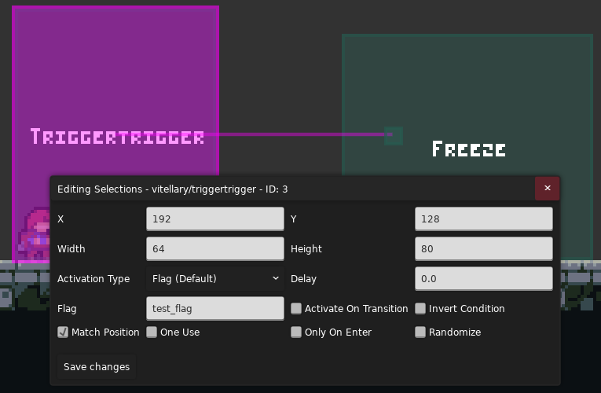

> Myn: 
> 
> 宇宙是如何诞生的？是 tt 触发了那个奇点。
>
> 万物是如何运动的？是 eevee 框动着世界变化。

## 参考
* [Crystaline Helper 文档](https://gamebanana.com/mods/53765)
* [Crystaline Helper Github](https://github.com/CommunalHelper/CrystallineHelper)
* [Trigger Trigger 简单教程 by Shynnie]()(群文件)

## Trigger Trigger

虽然标题是 Crystaline Helper, 但讲的是 Trigger Trigger(什

顾名思义, Trigger Trigger(简称 tt) 就是触发 Trigger 的 Trigger

你可以用它来做这些事情

* 当你要在一个地方叠多层 Trigger 时, tt 能够让你更方便地管理这些 Trigger, 所以你经常能看到有的图只放了一个 tt, 然后连了 很多其他 Trigger 在房间外头(像蜘蛛网一样)
* 你可以用 tt 组成一条 tt 链, 搭配 delay 能实现各种效果
* 因为 tt 可以在玩家做出某种行为时触发, 所以可以做神经 gp, 比如每次跳跃在房间里生成一个新浪
* ...

### 使用

{style="width: 800px; title="123"}

当你满足 ActivationType 时, tt 会在 Delay 秒后按顺序触发节点位置的 Trigger

ActivationType 在选择某些特殊值时会多出几项, 比如当你选择 Activation.CoreMod, 则属性栏会多出 CoreMod 这一项(你需要在保存后叉掉面板再打开, 因为 Loenn 不支持实时更新)

然后讲剩下相对不是很重要的属性

* Activate On Transition: 相当于把当前 tt 撑满房间, 进入房间时就已经在 tt 里了
* Invert Condition: 相当于触发条件变成了 not ActivationType, 原来触发的不触发了, 原来不触发的触发了
* Match Position: 相当于把节点处的 Trigger 移到 tt 位置并对齐大小, 就好像这里原来就放着个 Trigger 一样, 因为有些 Trigger 需要用到 Player 的位置, 比如 BloomFadeTrigger, 所以还是得移回到原位
* One Use: 字面意思, 触发一次就失效
* Only On Enter: 在进入 tt 瞬间判断 ActivationType, 而不是呆在 tt 里时判断
* Randomize: 随机触发一个节点处的 Trigger, 而不是按顺序触发节点处的 Trigger
         

### 原理 

Trigger Trigger 会在你进入房间时将节点所在位置的一个 Trigger 纳入它的管理范围, 同时关闭其碰撞, 如果节点盖到两个 Trigger, 先放的先被处理, 如果节点没盖到 Trigger, 则遍历房间找个最近的 Trigger(距离 Trigger 左上角)

同时 Trigger Trigger 并不会记录哪个 Trigger 在管理范围内, 所以哪怕你弄两个节点放一个 Trigger 上 或者一个在外面, 一个离得近, 也会触发两次, 所以保险起见都是一个 Trigger 一个节点

### Trigger

所谓 Trigger, 就是游戏中的一个隐藏矩形区域, 当玩家进入这个区域时会触发一些事件, 比如播放钢管落地音效, 触发一段对话, 或者让你的游戏暂停 10 秒, 这被称为 `OnEnter(这里的 On 相当于 when))`, 当玩家呆在这块区域时, Trigger 也会做些事, 
比如根据玩家在水平从左到右方向位置比例来设置光效强度, 声音响度等, 这被称为 `OnStay`, 当玩家离开这个区域时, Trigger 做的事主要是些清理工作, 大家平时并不会太注意到, 比如你 `只有在 Trigger 范围内才能跳` 这个 gp, 就需要玩家在离开 Trigger 后禁用跳跃, 
这被称为 `OnExit` 或者 `OnLeave`

所以在你使用 tt 时要注意节点处 Trigger 主要的触发方式是什么, 是 `OnEnter`, `OnStay`, 还是 `OnLeave`? 以防出现 tt 失效的情况, 即使如此, 大部分时候你完全可以把 tt 想象成节点处的 trigger, 因为 tt 就是这么符合直觉!

### 坑

当你的 ActivationType 为下面三个时, Activate On Transition 会自动打开(一开始科研的时候被坑了, 我还纳闷 Bloom Trigger 怎么生效不了, 结果是生效了但是由于房间太大看着不明显, 虽然当时如果看 Mapping Utils 肯定一眼看出来了())

* ActivationTypes.OnHoldableEnter
* ActivationTypes.OnInteraction
* ActivationTypes.OnEntityEnter
